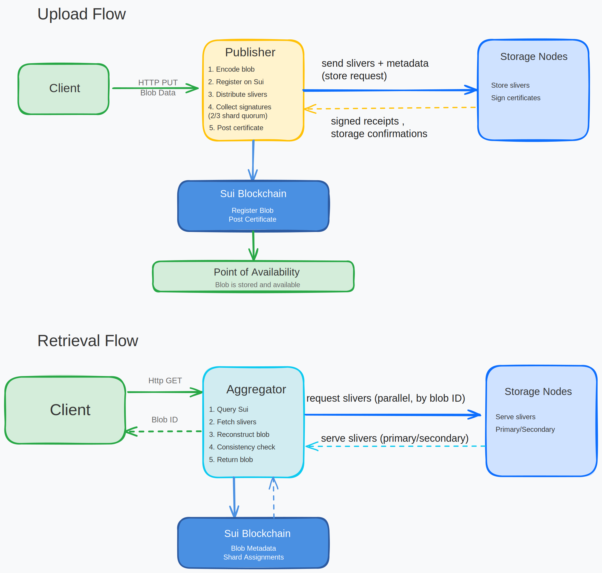
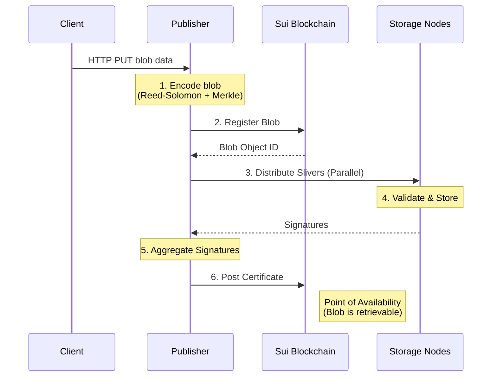
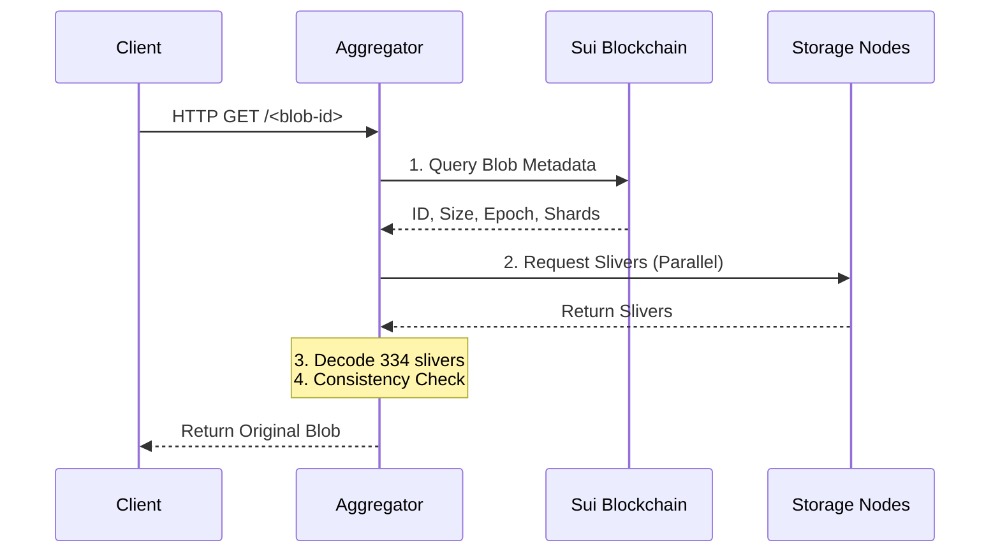

# Data Flow

This section explains how data moves through the Walrus system from upload to permanent storage, and how retrieval works. Understanding the data flow is essential for building applications on Walrus.



*[Excalidraw source file](../assets/data-flow-diagram.excalidraw.json) - Import into [Excalidraw.com](https://excalidraw.com) to view or edit*

The diagram illustrates both flows:
- **Upload Flow**: Client → Publisher → Encoding → Sui → Storage Nodes → Certificates → Point of Availability
- **Retrieval Flow**: Client → Aggregator → Sui → Storage Nodes → Aggregator (reconstruct) → Client

## Upload Flow: Client to Permanent Storage


*[Excalidraw source file](../assets/upload-flow-diagram.excalidraw.json) - Import into [Excalidraw.com](https://excalidraw.com) to view or edit*

The complete upload flow involves multiple steps and components working together. Let's trace a blob from initial upload to permanent storage.

### Step 1: Client Initiates Upload

A client wants to store a blob. The client can either:
- **Direct upload**: Interact directly with Sui and storage nodes (requires running Walrus client)
- **Via Publisher**: Send blob to a publisher via HTTP PUT request (simpler, web2-friendly)

For this walkthrough, we'll follow the publisher path as it's more common.

> ℹ️ **Blob Size Limits:** Walrus currently supports blobs up to a maximum size. Check `walrus info` for the current limit. Larger blobs can be split into smaller chunks before storage.

### Step 2: Publisher Receives Blob

```
Client → HTTP PUT → Publisher
```

The publisher receives:
- The blob data (binary)
- Optional parameters:
  - Number of epochs to store for
  - Encoding type
  - Blob persistence type (permanent or deletable)

### Step 3: Publisher Encodes the Blob

```
Publisher: Blob → Encoding → Sliver Pairs + Metadata
```

The publisher uses the Walrus encoding system to:

1. **Split blob into symbols**: The blob is divided into `k` source symbols of a fixed size
2. **Apply erasure coding**: Reed-Solomon encoding creates `n` total symbols (where `n > k`)
3. **Create slivers**: Symbols are grouped into slivers
   - Each blob produces many sliver pairs (primary and secondary)
   - Each sliver pair is assigned to a specific shard
4. **Compute metadata**: 
   - Hash each sliver
   - Build Merkle tree from sliver hashes
   - Compute blob ID from Merkle root + blob metadata (size, encoding type, etc.)

**Result**: The publisher now has:
- Multiple sliver pairs (one per shard)
- Blob metadata including blob ID
- Sliver hashes for verification

### Step 4: Publisher Registers Blob on Sui

```
Publisher → Sui Blockchain: Register Blob Object
```

The publisher creates a transaction on Sui to:
- Create a blob resource object
- Reserve storage space (if needed)
- Record blob metadata (blob ID, size, encoding, etc.)

This creates an on-chain record that the blob exists and is being stored.

### Step 5: Publisher Distributes Slivers to Storage Nodes

```
Publisher → Storage Node 1: Sliver for Shard 1
Publisher → Storage Node 2: Sliver for Shard 2
Publisher → Storage Node 3: Sliver for Shard 3
...
Publisher → Storage Node N: Sliver for Shard N
```

For each shard:
1. Publisher identifies which storage node manages that shard (from Sui system object)
2. Publisher sends the appropriate sliver to that storage node
3. Storage node validates:
   - Sliver hash matches metadata
   - Blob ID is correct
   - Storage node has capacity

#### Code: Distributing Slivers

The client sends slivers to storage nodes using the storage node client. See the implementation:
[`store_sliver` and `store_sliver_by_type` functions](https://github.com/MystenLabs/walrus/blob/main/crates/walrus-storage-node-client/src/client.rs) (search for `store_sliver`)

The distribution happens in parallel across all storage nodes, with the client coordinating the upload. See the coordination function:
[`send_blob_data_and_get_certificate` function](https://github.com/MystenLabs/walrus/blob/main/crates/walrus-sdk/src/client.rs) (search for `send_blob_data_and_get_certificate`)

This function:
1. Gets the current committee of storage nodes
2. Creates a distributed upload task that sends slivers in parallel
3. Tracks progress and handles errors
4. Collects confirmations from storage nodes

### Step 6: Storage Nodes Sign Certificates

```
Storage Node → Publisher: Signature confirming receipt
```

Each storage node that successfully receives and validates a sliver:
1. Stores the sliver locally
2. Signs a certificate confirming:
   - They received the sliver
   - The sliver hash is correct
   - They will store it for the requested duration

### Step 7: Publisher Aggregates Certificates

```
Publisher: Collect Signatures → Aggregate → Certificate
```

The publisher:
1. Collects signatures from storage nodes (needs 2/3 of shard signatures for quorum)
2. Aggregates them into a confirmation certificate
3. Posts the certificate on Sui blockchain

### Step 8: Point of Availability

```
Sui Blockchain: Certificate Posted → Blob Available Event
```

Once the certificate is posted:
- The blob reaches its **point of availability**
- An event is emitted on Sui indicating the blob is stored
- The blob can now be retrieved by anyone with the blob ID

### Complete Upload Flow Diagram



## Retrieval Flow: How Data is Retrieved


*[Excalidraw source file](../assets/download-flow-diagram.excalidraw.json) - Import into [Excalidraw.com](https://excalidraw.com) to view or edit*

The retrieval process reconstructs the blob from distributed slivers.

### Step 1: Client Requests Blob

A client wants to retrieve a blob. They can:
- **Direct retrieval**: Use Walrus client directly
- **Via Aggregator**: Send HTTP GET request to aggregator

We'll follow the aggregator path.

### Step 2: Aggregator Queries Sui

```
Aggregator → Sui Blockchain: Query blob status
```

The aggregator:
1. Looks up the blob ID on Sui
2. Retrieves blob metadata:
   - Blob size
   - Encoding type
   - Storage epoch when blob was certified
   - Blob status (valid/invalid)
3. Determines which storage epoch to read from

### Step 3: Aggregator Fetches Metadata and Slivers

```
Aggregator → Storage Nodes: Request slivers
```

The aggregator needs 334 primary slivers to reconstruct the blob. It:

1. **Identifies storage nodes**: Determines which nodes manage which shards (from Sui system object)
2. **Fetches slivers in parallel**:
   - Requests primary slivers from multiple storage nodes
   - Can request from any storage node managing the relevant shards
   - Only needs 334 primary slivers (out of many available)
3. **Validates slivers**: Checks that sliver hashes match the metadata

#### Code: Fetching Slivers

The aggregator fetches slivers from storage nodes. See the implementation:
[`get_sliver` and `get_sliver_status` functions](https://github.com/MystenLabs/walrus/blob/main/crates/walrus-storage-node-client/src/client.rs) (search for `get_sliver`)

The client fetches slivers in parallel with concurrency limits. See the parallel fetching logic:
[Parallel sliver fetching with concurrency limits](https://github.com/MystenLabs/walrus/blob/main/crates/walrus-sdk/src/client.rs) (search for sliver fetching logic in `read_blob_internal`)

### Step 4: Aggregator Reconstructs Blob

```
Aggregator: 334 Slivers → Decode → Original Blob
```

The aggregator:
1. **Decodes slivers**: Uses erasure decoding to reconstruct the original blob
2. **Performs consistency check**:
   - **Default check**: Verifies first 334 primary slivers match metadata
   - **Strict check** (optional): Re-encodes and verifies blob ID matches
3. **Returns blob**: Serves the reconstructed blob to the client

> 📝 **Default Changed in v1.37:** Starting with v1.37, the CLI and aggregator use the default (performant) consistency check. Use `--strict-consistency-check` for the strict check when needed.

#### Code: Blob Reconstruction

The reconstruction happens in the read client's internal method. See the implementation:
[`read_blob_internal` function](https://github.com/MystenLabs/walrus/blob/main/crates/walrus-sdk/src/client.rs) (search for `read_blob_internal`)

This method:
1. Checks the blob ID format
2. Gets blob status and certified epoch from Sui
3. Fetches metadata and slivers in parallel
4. Reconstructs the blob using erasure decoding
5. Performs consistency checks
6. Returns the reconstructed blob data

### Step 5: Client Receives Blob

```
Aggregator → Client: HTTP Response (blob data)
```

The client receives the original blob data, which they can verify is correct.

### Complete Retrieval Flow Diagram



## Key Properties of the Data Flow

### Redundancy

- Each blob is split into many slivers distributed across many storage nodes
- Only 1/3 of slivers are needed for reconstruction
- System tolerates up to 1/3 of storage nodes being Byzantine

### Verifiability

- Clients can verify publishers did their job correctly
- Clients can verify aggregators returned correct data
- Storage nodes verify slivers match metadata before storing

### Efficiency

- Systematic encoding allows fast random-access reads
- Aggregators can cache reconstructed blobs
- Parallel fetching of slivers reduces latency

### Decentralization

- No single point of failure
- Storage nodes are assigned via Sui smart contracts
- Anyone can run a publisher or aggregator

For detailed information about Walrus operations (store, read, certify availability), see the [Developer Operations guide](https://docs.wal.app/docs/dev-guide/dev-operations.md). For formal security properties and guarantees, see the [Properties documentation](https://docs.wal.app/docs/design/properties.md).

## Related Sections

- **[System Components](./01-components.md)** - Learn about the individual components (Storage Nodes, Publishers, Aggregators)
- **[Chunk Creation and Encoding](./02-chunk-creation.md)** - Understand how blobs are encoded into slivers
- **[Hands-On Walkthrough](./04-hands-on.md)** - See the data flow in action with a practical example

## Next Steps

Now that you understand the data flow, proceed to the [Hands-On Walkthrough](./04-hands-on.md) to see this in action with a practical example.

## Key Takeaways

- **Upload Flow**: Client → Publisher (encodes) → Sui (registers) → Storage Nodes (store slivers) → Certificates → Point of Availability
- **Retrieval Flow**: Client → Aggregator → Sui (queries metadata) → Storage Nodes (fetch slivers) → Aggregator (reconstructs) → Client
- **Redundancy** - Only 1/3 of slivers needed for reconstruction, tolerates up to 1/3 Byzantine nodes
- **Verifiability** - Clients can verify publishers and aggregators performed correctly
- **Parallel Operations** - Slivers are distributed and fetched in parallel for efficiency
- **Point of Availability** - Blob becomes retrievable once certificate is posted on Sui
- **No Single Point of Failure** - Decentralized architecture with storage nodes assigned via Sui smart contracts
