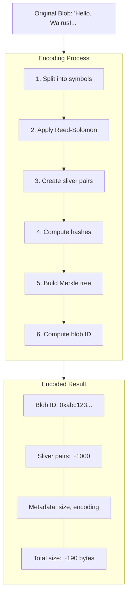
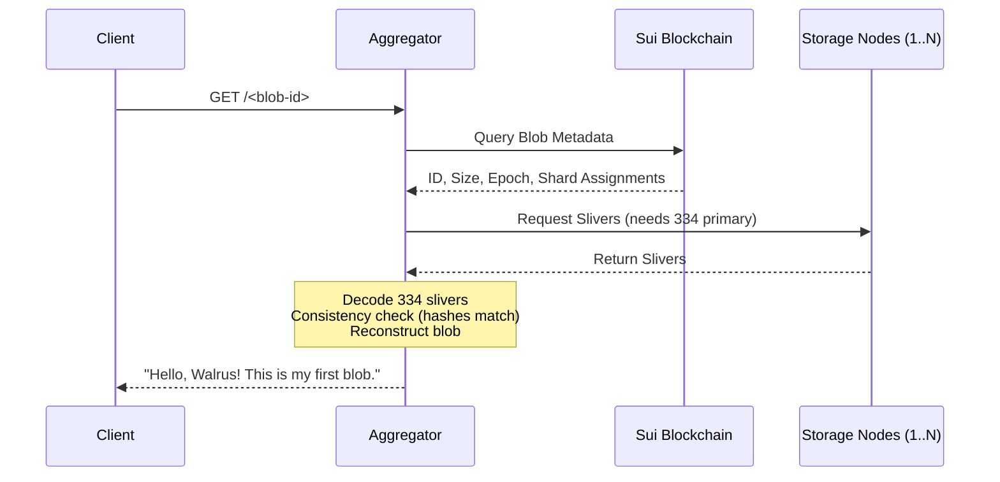

# Hands-On Walkthrough: Upload Flow

This hands-on section walks you through an actual upload flow with a visual sequence. You'll see each step of the process in detail.

## Prerequisites

Before starting, ensure you have:

- Completed the [System Components](./01-components.md) section to understand the architecture
- Reviewed the [Data Flow](./03-data-flow.md) section to understand how data moves through the system
- Understood [Chunk Creation and Encoding](./02-chunk-creation.md) to know how blobs are encoded
- Walrus CLI installed (see [Getting Started](https://docs.wal.app/docs/usage/started.md))
- Access to a Walrus network (testnet or mainnet)
- A wallet with sufficient SUI and WAL tokens (for direct uploads)
- Or access to a publisher endpoint (for HTTP uploads)

## Running in Docker (Recommended for Consistent Results)

For a consistent environment across all operating systems, use the Docker setup in the `docker/` directory:

```sh
# From the walrus_architecture module directory
cd docker
make build
SUI_WALLET_PATH=~/.sui/sui_config make run

# Or run the trace upload exercise with debug logging
make trace-upload
```

> 💡 **Docker Benefits:**
> - Identical environment across all operating systems
> - Pre-installed Walrus CLI with correct configuration
> - All required Unix tools (curl, jq, etc.)

## Scenario: Uploading a File

Let's upload a simple text file to Walrus and trace its journey through the system.

### Step 1: Prepare Your Blob

First, create a simple file to upload:

**Mac/Linux:**

```bash
echo "Hello, Walrus! " > my-blob.txt
```

**Windows (Command Prompt):**

```cmd
echo Hello, Walrus!  > my-blob.txt
```

**Windows (PowerShell):**

```powershell
"Hello, Walrus! " | Out-File -Encoding utf8 my-blob.txt
```

This creates a small text file that we'll store in Walrus.

### Step 2: Choose Your Upload Method

You have two options:

#### Option A: Direct Upload (Using CLI)

```bash
walrus store my-blob.txt
```

This command:
1. Reads the file
2. Encodes it into slivers
3. Distributes to storage nodes
4. Registers on Sui
5. Returns the blob ID

> ℹ️ **Blob Size Limits:** Walrus currently supports blobs up to a maximum size. Check `walrus info` for the current limit. Larger blobs can be split into smaller chunks before storage.

For detailed CLI command reference, see the [Client CLI documentation](https://github.com/MystenLabs/walrus/blob/main/docs/usage/client-cli.md).

#### Option B: Upload via Publisher (Using HTTP)

**Mac/Linux:**

```bash
curl -X PUT http://publisher.example.com:31416/ \
  -H "Content-Type: application/octet-stream" \
  --data-binary @my-blob.txt
```

**Windows (PowerShell):**

```powershell
$content = Get-Content -Raw -Path my-blob.txt
Invoke-RestMethod -Uri "http://publisher.example.com:31416/" `
  -Method Put `
  -ContentType "application/octet-stream" `
  -Body $content
```

**Windows (Command Prompt - requires curl):**

```cmd
curl -X PUT http://publisher.example.com:31416/ ^
  -H "Content-Type: application/octet-stream" ^
  --data-binary @my-blob.txt
```

This sends the blob to a publisher, which handles all the encoding and distribution.

For HTTP API details, see the [Web API documentation](https://docs.wal.app/docs/usage/web-api.md).

### Step 3: Visual Sequence of Upload Flow

Let's trace what happens behind the scenes:


*[Excalidraw source file](../assets/upload-flow-diagram.excalidraw.json) - Import into [Excalidraw.com](https://excalidraw.com) to view or edit*

#### Phase 1: Encoding (Publisher/Client)



#### Phase 2: On-Chain Registration

```mermaid
sequenceDiagram
    participant PC as Publisher/Client
    participant Sui as Sui Blockchain

    Note over PC: Create transaction:<br/>• Register blob object<br/>• Reserve storage space<br/>• Post metadata

    PC->>Sui: Transaction
    Note over Sui: • Blob Object ID: 0xdef456...<br/>• Blob ID: 0xabc123...<br/>• Size: 38 bytes<br/>• Encoding: RS2<br/>• Status: Registering
```



#### Phase 3: Sliver Distribution

```mermaid
sequenceDiagram
    participant PC as Publisher/Client
    participant SN as Storage Nodes (1..N)
    participant Sui as Sui Blockchain

    Note over PC: Has: 1000 sliver pairs

    PC->>SN: Distribute slivers (parallel)
    Note over SN: Each node validates hash & blob ID<br/>Stores assigned sliver
    SN-->>PC: Return signed certificates

    Note over PC: Collect signatures (need 2/3 quorum)<br/>Aggregate into confirmation certificate

    PC->>Sui: Post Certificate
    Note over Sui: • Blob ID: 0xabc123...<br/>• Signatures: [sig1, sig2...]<br/>• Status: Certified<br/><br/>Event Emitted:<br/>• Point of Availability
```



### Step 4: Verify Upload Success

After the upload completes, you'll receive a blob ID. Verify it was stored:

**All Platforms (CLI):**

```bash
walrus read <blob-id>
```

**Mac/Linux (HTTP via curl):**

```bash
curl http://aggregator.example.com:31415/<blob-id>
```

**Windows (PowerShell HTTP):**

```powershell
Invoke-RestMethod -Uri "http://aggregator.example.com:31415/<blob-id>"
```

**Windows (Command Prompt - requires curl):**

```cmd
curl http://aggregator.example.com:31415/<blob-id>
```

You should receive back: `"Hello, Walrus! This is my first blob."`

For more information about reading blobs and consistency checks, see the [Developer Operations guide](https://docs.wal.app/docs/dev-guide/dev-operations.md).

### Step 5: Inspect On-Chain State

Check the blob on Sui:

```bash
# Get blob object ID from the store result, then:
sui client object <blob-object-id>
```

You'll see:
- Blob metadata
- Storage epoch
- Certificate information
- Point of availability event

### Step 6: Trace the Retrieval Flow

Now let's see how retrieval works:


*[Excalidraw source file](../assets/download-flow-diagram.excalidraw.json) - Import into [Excalidraw.com](https://excalidraw.com) to view or edit*

#### Retrieval Sequence



## Key Observations

### During Upload

1. **Encoding overhead**: Small blob (38 bytes) becomes ~190 bytes encoded (5x expansion)
2. **Parallel distribution**: Slivers sent to many storage nodes simultaneously
3. **Verification at each step**: Storage nodes validate before storing
4. **On-chain coordination**: Sui tracks the entire process

### During Retrieval

1. **Partial reconstruction**: Only needs 334 slivers (1/3 of total)
2. **Parallel fetching**: Requests multiple storage nodes in parallel
3. **Verification**: Consistency check ensures data integrity
4. **Caching opportunity**: Aggregator can cache reconstructed blob

## Advanced: Monitoring the Flow

You can monitor the upload process:

**Mac/Linux:**

```bash
# Enable verbose logging
RUST_LOG=debug walrus store my-blob.txt

# Or check metrics (if publisher/aggregator exposes them)
curl http://publisher.example.com:9090/metrics
```

**Windows (Command Prompt):**

```cmd
:: Enable verbose logging
set RUST_LOG=debug
walrus store my-blob.txt

:: Check metrics (requires curl)
curl http://publisher.example.com:9090/metrics
```

**Windows (PowerShell):**

```powershell
# Enable verbose logging
$env:RUST_LOG = "debug"
walrus store my-blob.txt

# Or check metrics
Invoke-RestMethod -Uri "http://publisher.example.com:9090/metrics"
```

Look for:
- Encoding duration
- Sliver distribution progress
- Storage node response times
- Certificate aggregation time

## Troubleshooting

### Upload Fails

- Check wallet has sufficient SUI/WAL
- Verify network connectivity to storage nodes
- Check blob size limits
- Review error messages for specific failures

### Retrieval Fails

- Verify blob ID is correct
- Check blob status on Sui (might be invalid)
- Ensure sufficient storage nodes are online
- Try different aggregator if one fails

## Related Sections

- **[System Components](./01-components.md)** - Review the components you've interacted with
- **[Chunk Creation and Encoding](./02-chunk-creation.md)** - Deep dive into the encoding process you've seen
- **[Data Flow](./03-data-flow.md)** - Review the complete flow you've just executed

## Summary

You've now seen:
- ✅ How blobs are encoded into slivers
- ✅ How slivers are distributed to storage nodes
- ✅ How certificates are created and posted
- ✅ How blobs are retrieved and reconstructed
- ✅ The complete end-to-end flow

Congratulations! You now understand the Walrus architecture and data flow.

## Key Takeaways

- **Two Upload Methods**: Direct CLI upload (`walrus store`) or HTTP upload via Publisher (`curl PUT`)
- **Encoding Overhead**: Small blobs expand ~5x during encoding (e.g., 38 bytes → ~190 bytes)
- **Parallel Distribution**: Slivers are sent to multiple storage nodes simultaneously
- **Verification Steps**: Storage nodes validate slivers before storing; consistency checks verify integrity
- **On-Chain Tracking**: Sui blockchain records blob metadata, certificates, and point of availability events
- **Retrieval Requirements**: Only 334 primary slivers needed to reconstruct the blob
- **Monitoring**: Use `RUST_LOG=debug` for verbose logging or check metrics endpoints

## Next Steps

Congratulations on completing the Walrus Architecture module! You now have hands-on experience with:

- ✅ Understanding system components (Storage Nodes, Publishers, Aggregators)
- ✅ How erasure coding transforms blobs into slivers
- ✅ The complete upload and retrieval data flows
- ✅ Practical blob storage and retrieval operations

Continue your learning with:

- **[CLI Deep Dive](../../06-Walrus-CLI/contents/index.md)** - Master advanced CLI commands and configuration
- **[Storage Costs](../../05-Storage-costs/contents/index.md)** - Understand pricing and cost optimization
- **[Epochs and Continuity](../../04-Epochs/contents/index.md)** - Learn about storage duration and extensions
