# Component Duties in Real Operation

🟢 **Beginner**

This section explains what Publishers, Aggregators, and Clients actually do when operating in production. Understanding these responsibilities is critical for building reliable applications and troubleshooting issues.

## System Architecture Overview

> **About the diagrams**: This module uses **C4 architecture diagrams** (Context, Container, Component), which are the industry standard for documenting software architecture. They clearly show boundaries, relationships, and component responsibilities.

The diagram below shows how all components interact in the Walrus system using C4 Context diagram:

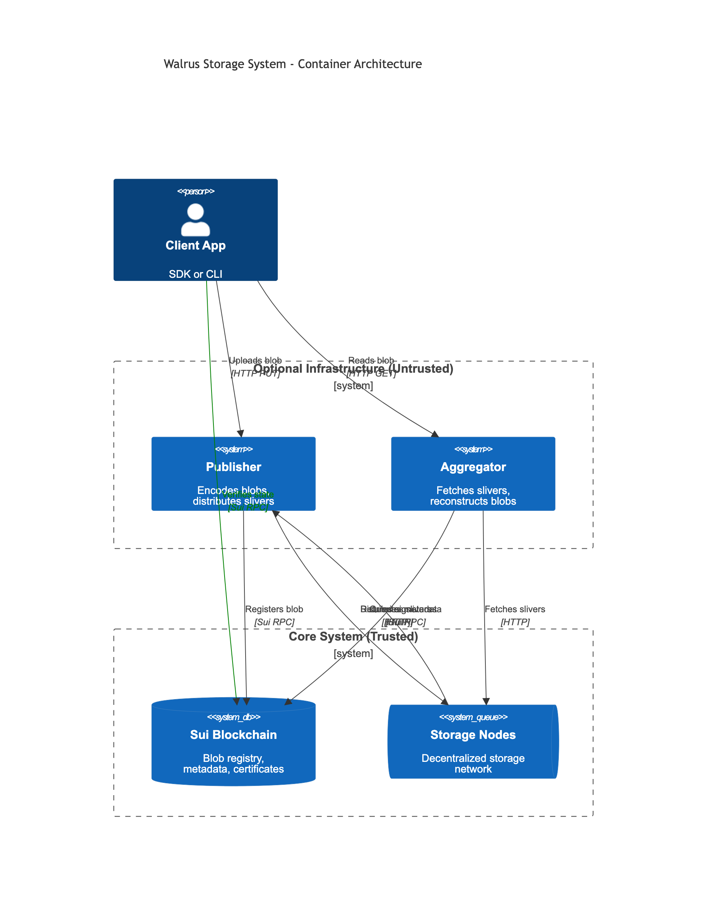

<details>
<summary>Mermaid source (click to expand)</summary>

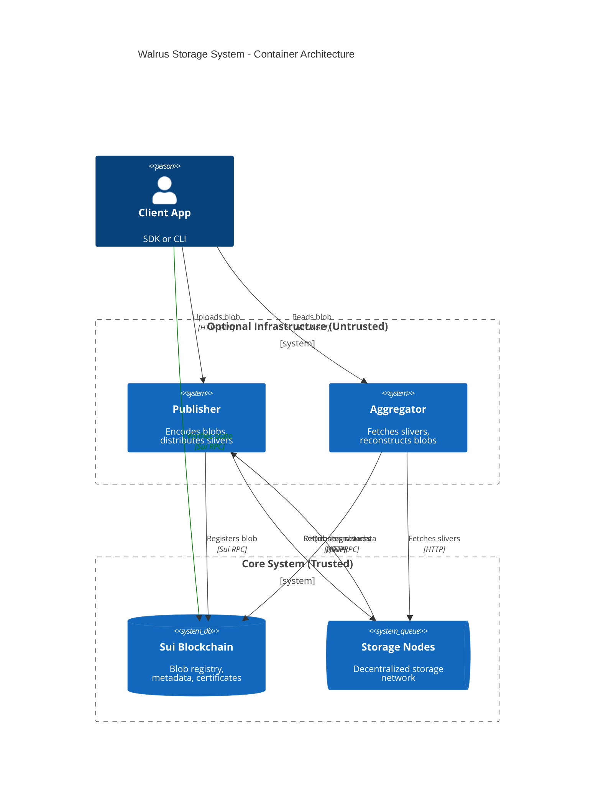

</details>

**Key Architecture Points:**
- **Client** (your application): Uses TypeScript SDK or CLI to interact with the system
- **Publisher** (optional, untrusted): Handles blob encoding and distribution to storage nodes
- **Aggregator** (optional, untrusted): Reconstructs blobs by fetching slivers from storage nodes
- **Sui Blockchain** (trusted): Stores blob metadata, certificates, and acts as source of truth
- **Storage Nodes** (decentralized): Store erasure-coded slivers of blobs

**Trust Model:**
- ✅ **Trusted**: Sui blockchain, cryptographic verification (blob IDs, signatures)
- ⚠️ **Untrusted**: Publishers and Aggregators (clients must verify their work)
- 🔒 **Client's Job**: Verify blob IDs, check on-chain state, implement retry logic

---

## Publisher Duties

Publishers are **optional infrastructure** that make it easier for clients to store blobs. Remember: they're untrusted, so clients should verify their work.

### What Publishers Do

#### 1. Receive Blob Uploads

```
Client → HTTP PUT → Publisher
```

**Publisher's responsibility:**
- Accept HTTP PUT requests with blob data
- Validate request authentication (if configured with JWT)
- Parse query parameters (storage epochs, encoding type, persistence)
- Handle content-type headers and binary data

**What can go wrong:**
- Invalid authentication token
- Blob exceeds size limits
- Malformed request headers
- Network timeout during upload

#### 2. Encode the Blob

```
Publisher: Blob → Erasure Coding → Slivers + Metadata
```

**Publisher's responsibility:**
- Apply Reed-Solomon erasure coding
- Create sliver pairs (primary and secondary)
- Compute sliver hashes
- Build Merkle tree
- Derive blob ID from Merkle root

**What can go wrong:**
- Blob size not aligned to encoding boundaries (padding needed)
- Out of memory for large blobs
- Encoding library errors
- Hash computation failures

**Important:** The encoding is deterministic. Same blob → same blob ID. Clients can verify by re-encoding.

#### 3. Manage Gas and Wallets

```
Publisher: Check wallet → Estimate gas → Sign transaction
```

**Publisher's responsibility:**
- Maintain a wallet with sufficient SUI (for gas) and WAL (for storage fees)
- Estimate transaction costs
- Sign Sui transactions
- Handle gas price fluctuations
- Retry failed transactions
- Use sub-wallets for parallel request handling (since v1.4.0)

**Sub-wallets (v1.4.0+):**
- Publishers use multiple sub-wallets derived from the main wallet
- Each sub-wallet handles a subset of concurrent upload requests
- Prevents transaction conflicts and nonce issues when processing parallel requests
- Significantly improves throughput for busy Publishers
- Sub-wallets are automatically managed by the Publisher

**What can go wrong:**
- Insufficient SUI for gas (in main wallet or sub-wallets)
- Insufficient WAL for storage fees
- Gas price spike causes transaction failure
- Wallet key management issues
- Transaction conflicts (nonce issues) - mitigated by sub-wallets in v1.4.0+

**Client consideration:** When using a publisher, you're relying on their wallet. For sensitive applications, use CLI/SDK directly with your own wallet.

#### 4. Register Blob on Sui

```
Publisher → Sui: Create blob object + Reserve storage
```

**Publisher's responsibility:**
- Create a transaction to register the blob
- Include blob metadata (blob ID, size, encoding type, epochs)
- Reserve storage capacity on-chain
- Submit transaction and wait for confirmation

**What can go wrong:**
- Transaction rejected (insufficient funds, invalid blob ID)
- Network issues connecting to Sui RPC
- Transaction timeout
- Congestion delays confirmation

**Verification:** Clients can check for the blob object on-chain using the blob ID.

#### 5. Distribute Slivers to Storage Nodes

```
Publisher → Storage Node 1, 2, 3, ..., N (parallel)
```

**Publisher's responsibility:**
- Identify which storage nodes manage which shards (query Sui system object)
- Send the appropriate sliver to each storage node (parallel distribution)
- Include blob metadata with each sliver
- Track progress across all storage nodes
- Handle partial failures (some nodes may not respond)
- Implement timeout and retry logic

**What can go wrong:**
- Storage node unreachable (network failure)
- Storage node rejects sliver (validation failure, out of space)
- Timeout waiting for storage node response
- Partial success (some nodes confirm, others don't)

**System guarantee:** Only need 2/3 of shards to confirm for the blob to be available.

#### 6. Collect Signatures from Storage Nodes

```
Storage Nodes → Publisher: Signed certificates
```

**Publisher's responsibility:**
- Wait for storage nodes to validate and store slivers
- Collect signatures confirming receipt
- Track which nodes have responded
- Determine when quorum is reached (2/3 of shards)
- Handle slow or non-responsive nodes

**What can go wrong:**
- Not enough signatures (< 2/3 quorum)
- Timeout waiting for slow nodes
- Invalid signatures from Byzantine nodes
- Network issues during signature collection

**System guarantee:** With 2/3 quorum, the blob is guaranteed to be retrievable even if 1/3 of nodes are Byzantine.

#### 7. Aggregate Certificates and Post to Sui

```
Publisher: Collect signatures → Aggregate → Post certificate to Sui
```

**Publisher's responsibility:**
- Aggregate signatures into a single certificate
- Create transaction to post certificate on-chain
- Submit transaction and confirm
- Emit "point of availability" event

**What can go wrong:**
- Certificate aggregation fails (crypto error)
- Transaction fails to post
- Gas estimation error
- Certificate already exists (idempotent operation)

**Verification:** Clients can check for the point of availability event on Sui.

#### 8. Return Result to Client

```
Publisher → Client: HTTP 200 + blob ID
```

**Publisher's responsibility:**
- Return blob ID to client
- Include metadata (blob object ID, storage epochs, cost)
- Return error details if upload failed

**What can go wrong:**
- Connection lost before response sent
- Client timeout (upload succeeded but client didn't get response)

**Client responsibility:** If the client times out, they should check on-chain whether the blob was registered.

### Publisher Summary

| Duty | What Can Fail | Client Verification |
|------|---------------|---------------------|
| Receive upload | Auth, size limits, network | N/A |
| Encode blob | Memory, encoding errors | Re-encode and compare blob ID |
| Manage gas/wallets | Insufficient funds, tx failures, nonce conflicts (mitigated by sub-wallets v1.4.0+) | Check on-chain blob object |
| Register on Sui | Transaction failures | Query blob object by ID |
| Distribute slivers | Node unavailability | Perform read to verify availability |
| Collect signatures | Quorum not reached | Check point of availability event |
| Post certificate | Transaction failures | Check certificate on-chain |
| Return result | Network timeout | Check on-chain state |

### Publisher Internal Architecture

The diagram below shows the internal components and data flow within a Publisher using C4 Component architecture:

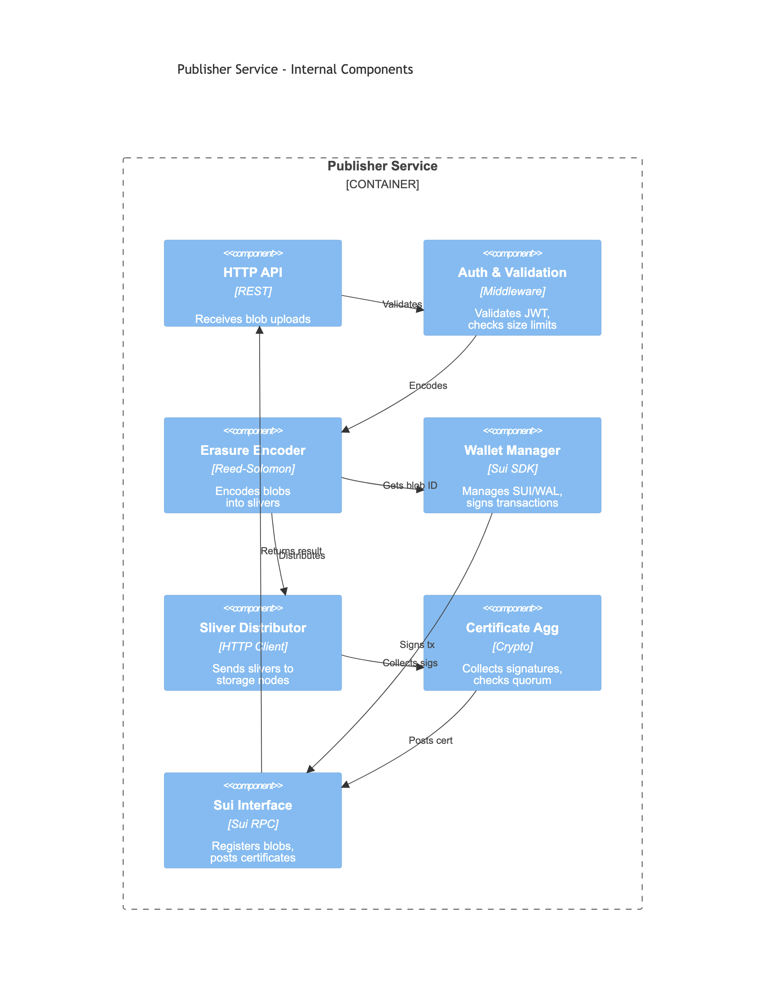

<details>
<summary>Mermaid source (click to expand)</summary>

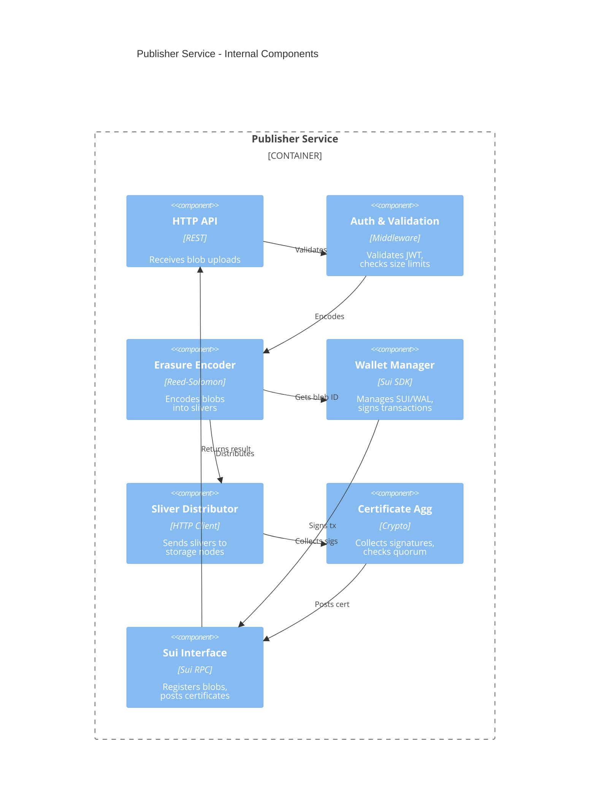

</details>

**Publisher Components:**
- **HTTP API Handler**: Receives blob upload requests from clients
- **Authentication & Validation**: Validates JWT tokens, checks blob size limits
- **Erasure Encoder**: Applies Reed-Solomon encoding to create slivers
- **Wallet Manager**: Manages SUI/WAL funds, signs transactions (v1.4.0+ uses sub-wallets)
- **Sliver Distributor**: Sends slivers to storage nodes in parallel
- **Certificate Aggregator**: Collects signatures, checks quorum, aggregates certificates
- **Sui Chain Interface**: Interacts with Sui blockchain (register blobs, post certificates)

### Publisher Lifecycle Flow

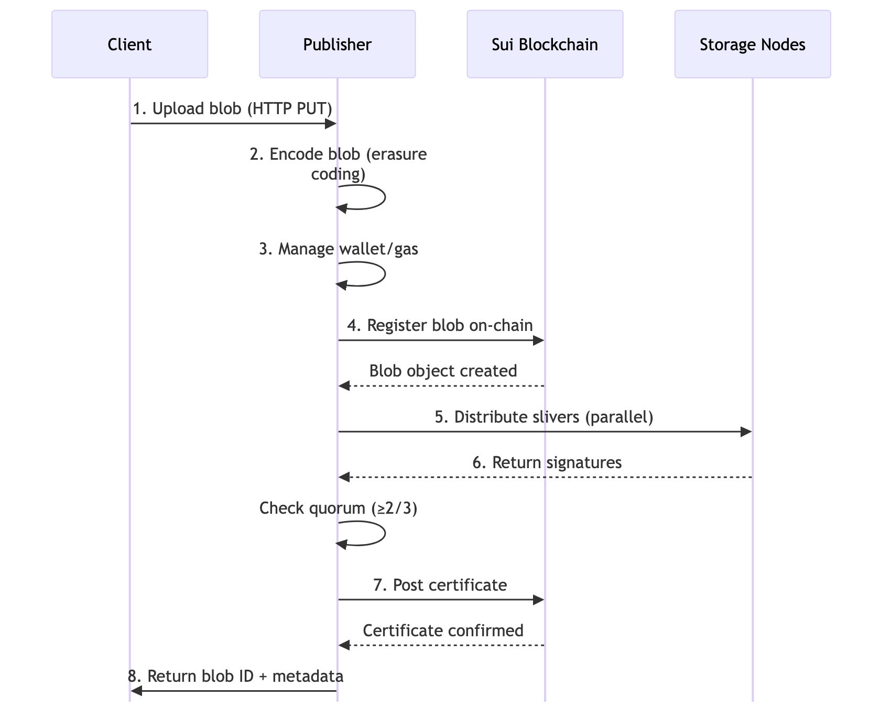

<details>
<summary>Mermaid source (click to expand)</summary>

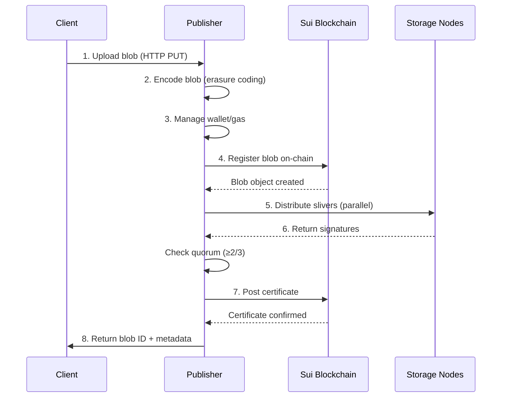

</details>

---

## Aggregator Duties

Aggregators are **optional infrastructure** that reconstruct blobs and serve them over HTTP. They're also untrusted - clients can verify the returned data.

### What Aggregators Do

#### 1. Receive Read Requests

```
Client → HTTP GET /<blob-id> → Aggregator
```

**Aggregator's responsibility:**
- Accept HTTP GET requests
- Parse blob ID from URL path
- Validate blob ID format
- Parse query parameters (consistency check level)

**What can go wrong:**
- Invalid blob ID format
- Malformed request
- Rate limiting (too many requests)

#### 2. Query Sui for Blob Metadata

```
Aggregator → Sui: Get blob status and metadata
```

**Aggregator's responsibility:**
- Look up blob object on Sui
- Retrieve blob metadata (size, encoding, storage epoch)
- Determine blob status (certified, invalid, not found)
- Identify which storage epoch to read from

**What can go wrong:**
- Blob not found on Sui
- Blob marked as invalid
- Sui RPC unavailable or slow
- Network timeout

**Client verification:** Clients can independently query Sui to verify blob status.

#### 3. Fetch Slivers from Storage Nodes

```
Aggregator → Storage Nodes (parallel): Request slivers
```

**Aggregator's responsibility:**
- Identify which storage nodes manage which shards
- Request primary slivers from storage nodes (need 334)
- Fetch in parallel with concurrency limits
- Handle slow or non-responsive nodes
- Implement timeout and retry logic
- Validate sliver hashes against metadata

**What can go wrong:**
- Storage node unreachable
- Sliver not found (node lost data)
- Sliver hash mismatch (corruption or Byzantine behavior)
- Timeout waiting for slivers
- Not enough slivers to reconstruct (< 334 available)

**System guarantee:** Only need 334 primary slivers (1/3 of total). System tolerates up to 1/3 Byzantine nodes.

#### 4. Reconstruct the Blob

```
Aggregator: 334 Slivers → Erasure Decoding → Original Blob
```

**Aggregator's responsibility:**
- Decode slivers using erasure decoding
- Reconstruct the original blob
- Perform consistency check (default or strict)
  - **Default check**: Verify first 334 primary slivers match metadata
  - **Strict check**: Re-encode blob and verify blob ID matches
- Handle decoding errors

**What can go wrong:**
- Decoding fails (corrupt slivers)
- Consistency check fails (data integrity issue)
- Out of memory (large blob)
- Encoding library errors

**Client verification:** Clients can re-encode the returned blob and compare blob IDs (strict verification).

#### 5. Cache Reconstructed Blobs (Optional)

```
Aggregator: Store reconstructed blob in cache
```

**Aggregator's responsibility (if caching enabled):**
- Cache reconstructed blobs to reduce latency
- Manage cache eviction policy (LRU, TTL)
- Serve from cache on subsequent requests
- Invalidate cache if blob status changes

**What can go wrong:**
- Cache inconsistency (blob changed but cache not invalidated)
- Out of disk space
- Cache corruption

**Client consideration:** Cached responses are faster but clients should still verify blob IDs if data integrity is critical.

#### 6. Return Blob to Client

```
Aggregator → Client: HTTP 200 + blob data
```

**Aggregator's responsibility:**
- Serve the reconstructed blob data
- Set appropriate HTTP headers (Content-Type, Content-Length)
- Handle streaming for large blobs

**What can go wrong:**
- Connection lost during transmission
- Client timeout
- Partial data sent

**Client responsibility:** Verify the blob ID matches expectations.

### Aggregator Summary

| Duty | What Can Fail | Client Verification |
|------|---------------|---------------------|
| Receive request | Invalid blob ID | N/A |
| Query Sui | RPC unavailable, blob not found | Query Sui independently |
| Fetch slivers | Node unavailability, corruption | Check sliver hashes |
| Reconstruct blob | Decoding errors, consistency check fails | Re-encode and compare blob ID |
| Cache (optional) | Cache inconsistency | Always verify blob ID |
| Return blob | Network timeout | Verify blob ID matches |

### Aggregator Internal Architecture

The diagram below shows the internal components and data flow within an Aggregator using C4 Component architecture:

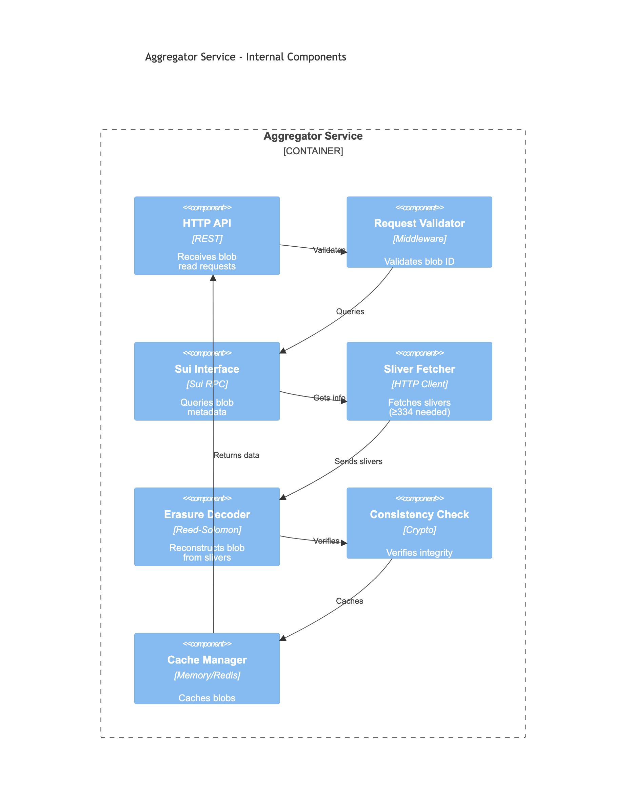

<details>
<summary>Mermaid source (click to expand)</summary>

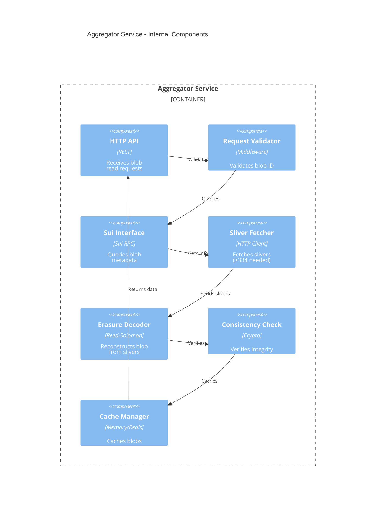

</details>

**Aggregator Components:**
- **HTTP API Handler**: Receives blob read requests from clients
- **Request Validator**: Validates blob ID format and request parameters
- **Sui Chain Interface**: Queries Sui for blob metadata and status
- **Sliver Fetcher**: Fetches slivers from storage nodes in parallel (need 334 minimum)
- **Erasure Decoder**: Reconstructs original blob from slivers using erasure decoding
- **Consistency Checker**: Verifies blob integrity (default or strict mode)
- **Cache Manager**: Optionally caches reconstructed blobs for faster serving

### Aggregator Lifecycle Flow


<details>
<summary>Mermaid source (click to expand)</summary>

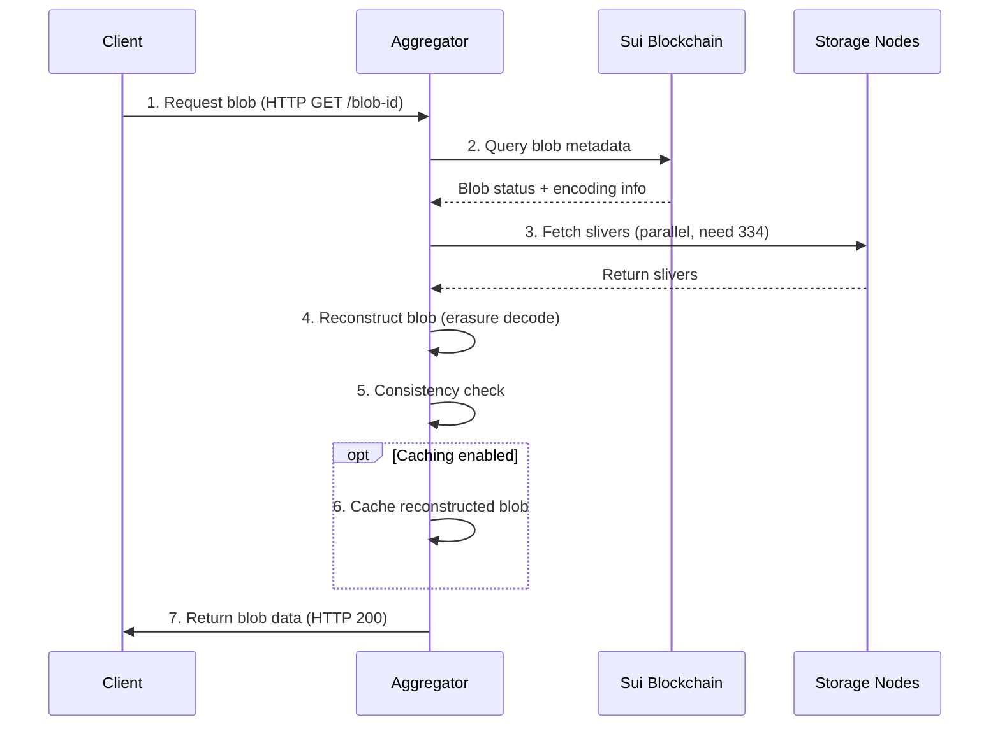

</details>

---

## Client Responsibilities

Clients (your application code) have important responsibilities, whether using Publishers/Aggregators or interacting directly with the system.

### What Clients Must Do

#### 1. Verify Blob IDs

**Client responsibility:**
- After upload, verify the returned blob ID matches your expectation
- After retrieval, re-encode the blob and verify blob ID matches
- This is the ultimate verification that data is correct

**Why it matters:** Publishers and Aggregators are untrusted. Blob ID verification ensures data integrity.

**How to verify:**
```typescript
import { SuiClient } from '@mysten/sui/client';
import { walrus } from '@mysten/walrus';
import type { Keypair } from '@mysten/sui/cryptography';

async function verifyBlobId(client: SuiClient, signer: Keypair) {
  const data = new TextEncoder().encode('my file content');

  // Upload and get blob ID
  const { blobId } = await client.walrus.writeBlob({
    blob: data,
    epochs: 5,
    signer
  });

  // Retrieve the blob
  const retrieved = await client.walrus.readBlob({ blobId });

  // Re-upload to verify blob ID matches
  const { blobId: verifyId } = await client.walrus.writeBlob({
    blob: retrieved,
    epochs: 5,
    signer
  });

  if (blobId === verifyId) {
    console.log('✓ Blob ID verified - data integrity confirmed');
    return true;
  }

  return false;
}
```

#### 2. Implement Retry Logic

**Client responsibility:**
- Handle transient network failures
- Retry failed uploads with exponential backoff
- Retry failed reads from different aggregators
- Set reasonable timeouts

**Why it matters:** Network failures are normal. Your application should be resilient.

**Retry scenarios:**
- Upload fails → Retry with same data (encoding is deterministic)
- Read fails → Try a different aggregator or retry later
- Transaction fails → Check if it succeeded on-chain before retrying

#### 3. Check On-Chain State

**Client responsibility:**
- Verify blob was registered on Sui
- Check for point of availability event
- Monitor blob status (valid/invalid)
- Verify storage epochs

**Why it matters:** The blockchain is the source of truth. Use it to verify publisher actions.

**What to check:**
```bash
# Check blob object exists
sui client object <blob-object-id>

# Check for point of availability event
# (Query Sui events for your blob ID)
```

#### 4. Handle Errors Gracefully

**Client responsibility:**
- Parse error responses from Publishers/Aggregators
- Distinguish between retryable and non-retryable errors
- Provide meaningful error messages to users
- Log errors for debugging

**Common error types:**
- **Insufficient funds**: Not retryable, user must add funds
- **Blob too large**: Not retryable, must split blob
- **Network timeout**: Retryable, check on-chain state first
- **Blob not found**: Not retryable if blob doesn't exist, retryable if nodes are temporarily offline

#### 5. Manage Wallets and Gas (Direct CLI/SDK Use)

**Client responsibility (when not using publisher):**
- Maintain wallet with sufficient SUI and WAL
- Monitor wallet balance
- Estimate transaction costs
- Handle gas price fluctuations

**Why it matters:** You control your own wallet = you control your own funds = you're responsible for management.

#### 6. Choose Appropriate Consistency Checks

**Client responsibility:**
- Understand default vs. strict consistency checks
- Use strict checks for critical data
- Accept default checks for performance-sensitive reads

**Consistency levels:**
- **Default check**: Verifies first 334 primary slivers (fast, usually sufficient)
- **Strict check**: Re-encodes blob and verifies blob ID (slower, maximum verification)

### Client Summary

| Responsibility | Why It Matters | How to Do It |
|----------------|----------------|--------------|
| Verify blob IDs | Data integrity | Re-encode and compare |
| Implement retries | Resilience | Exponential backoff, check on-chain |
| Check on-chain state | Verify publisher work | Query Sui for blob objects and events |
| Handle errors | User experience | Parse errors, retry appropriately |
| Manage wallet (direct use) | Control funds | Monitor balance, estimate gas |
| Choose consistency level | Security vs. performance | Strict for critical, default otherwise |

### Client Application Architecture

The diagram below shows what a well-designed client application should implement using C4 Component architecture:

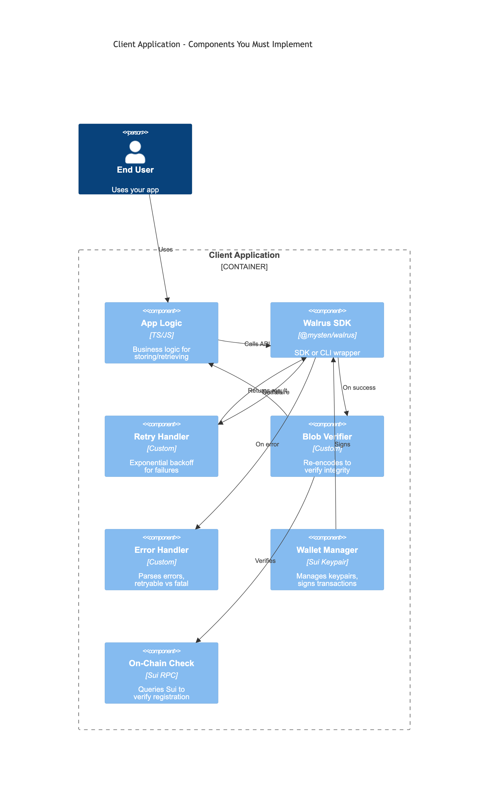

<details>
<summary>Mermaid source (click to expand)</summary>

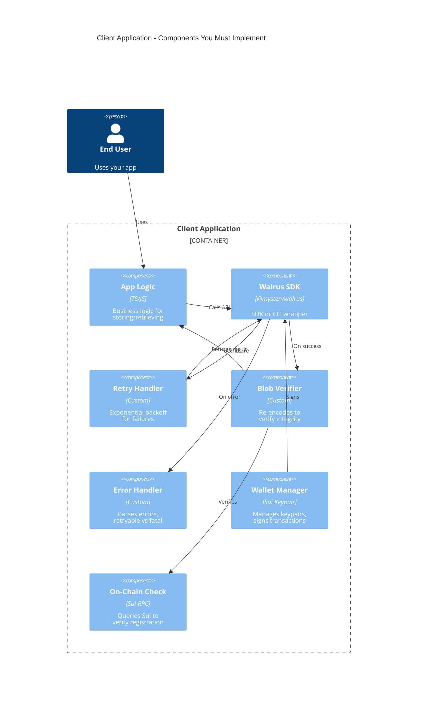

</details>

**Client Application Components:**
- **Application Logic**: Your business logic that needs to store/retrieve blobs
- **Walrus SDK**: TypeScript SDK or CLI for interacting with Walrus
- **Retry Handler**: Implements exponential backoff for transient failures
- **Blob ID Verifier**: Re-encodes blobs to verify data integrity
- **Error Handler**: Parses errors, distinguishes retryable vs non-retryable
- **Wallet Manager**: Manages keypairs, signs transactions (when not using Publisher)
- **On-Chain Validator**: Queries Sui to verify blob registration and certificates

**Key Client Responsibilities:**
1. ✅ **Verify**: Always verify blob IDs match expectations
2. 🔄 **Retry**: Implement retry logic with exponential backoff
3. 🔍 **Check**: Verify on-chain state after uploads
4. ⚠️ **Handle**: Parse and handle errors appropriately
5. 🔑 **Manage**: Secure wallet management (if not using Publisher)

---

## Key Points

### Publisher Duties
- Encode blobs and distribute slivers to storage nodes
- Manage gas and wallets for on-chain transactions (sub-wallets since v1.4.0 for parallel request handling)
- Collect signatures and post certificates
- Handle retries and timeouts
- **Untrusted**: Clients should verify their work

### Aggregator Duties
- Query Sui for blob metadata
- Fetch slivers from storage nodes in parallel
- Reconstruct blobs using erasure decoding
- Perform consistency checks
- Optional caching for performance
- **Untrusted**: Clients should verify returned data

### Client Responsibilities
- **Must verify**: Blob IDs match expectations
- **Must implement**: Retry logic for failures
- **Must check**: On-chain state to verify publishers
- **Must handle**: Errors gracefully
- **Must manage**: Wallets (when using CLI/SDK directly)
- **Should choose**: Appropriate consistency checks

### Division of Labor
- **System guarantees**: Byzantine tolerance, data integrity, availability (with 2/3 quorum)
- **Publishers/Aggregators handle**: Infrastructure operations (encoding, distribution, reconstruction)
- **Clients must verify**: Data correctness (blob IDs, consistency checks)
- **Clients must implement**: Application logic (retries, error handling)

## Next Steps

Now that you understand operational duties, proceed to [Failure Modes](./02-failure-modes.md) to learn where things can go wrong and how to handle failures.
