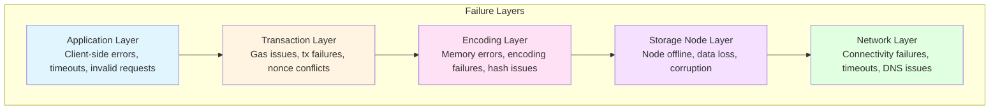

# Failure Modes: Where Things Go Wrong

🟡 **Beginner/Intermediate**

Understanding where failures occur is essential for building resilient applications on Walrus. This section covers common failure scenarios, how the system handles them, and what you need to do as a developer.

## The Reality of Distributed Systems

**Everything fails eventually.** In a distributed system like Walrus:

- Network connections drop
- Storage nodes go offline
- Transactions get rejected
- Encoding hits edge cases
- Byzantine nodes behave maliciously

**Your job as a developer:** Design for failure. Assume things will go wrong and handle it gracefully.

---

## Failure Taxonomy

We'll organize failures by **where** they occur in the system:

1. **Network Layer**: Connectivity issues
2. **Storage Node Layer**: Node failures, data corruption
3. **Encoding Layer**: Invalid encoding, hash mismatches
4. **Transaction Layer**: Blockchain transaction failures
5. **Application Layer**: Client-side errors



---

## 1. Network Layer Failures

### Failure: Client Cannot Reach Publisher/Aggregator

**Symptom:**
```
Error: Connection timeout
Error: Connection refused
Error: DNS resolution failed
```

**Causes:**
- Publisher/Aggregator is down
- Network connectivity issues
- Firewall blocking connection
- DNS misconfiguration

**System behavior:**
- No automatic recovery
- Client connection times out

**Client mitigation:**
- Implement retry with exponential backoff in your application code
- Try multiple publishers/aggregators (if available)
- Fall back to direct CLI/SDK interaction with Sui and storage nodes
- Set reasonable timeouts (e.g., 30 seconds for upload, 10 seconds for read)

**Example using TypeScript SDK with retry:**
```typescript
import { SuiClient } from '@mysten/sui/client';
import type { Keypair } from '@mysten/sui/cryptography';

// Retry logic with exponential backoff
async function uploadWithRetry(
  client: SuiClient,
  data: Uint8Array,
  signer: Keypair,
  maxRetries = 3
) {
  for (let attempt = 1; attempt <= maxRetries; attempt++) {
    try {
      const result = await client.walrus.writeBlob({
        blob: data,
        epochs: 5,
        signer
      });
      return result;
    } catch (error) {
      if (attempt < maxRetries) {
        const delay = Math.pow(2, attempt) * 1000; // 2s, 4s, 8s
        console.log(`Attempt ${attempt} failed, retrying in ${delay/1000}s...`);
        await new Promise(resolve => setTimeout(resolve, delay));
      } else {
        throw error;
      }
    }
  }
}
```

### Failure: Publisher Cannot Reach Storage Nodes

**Symptom:**
```
Error: Failed to distribute slivers
Warning: Storage node X unreachable
Error: Quorum not reached (received 500/1000 signatures)
```

**Causes:**
- Storage node is offline
- Network partition between publisher and storage nodes
- Storage node firewall blocking connections
- Storage node overloaded

**System behavior:**
- Publisher retries sliver distribution
- If 2/3 quorum reached → Upload succeeds
- If < 2/3 quorum → Upload fails

**System guarantee:** With 2/3 quorum, blob is guaranteed to be retrievable even if 1/3 of nodes are offline.

**Client mitigation:**
- Retry failed uploads (publisher may reach different nodes)
- Check on-chain state to verify if blob was registered
- Wait for storage nodes to come back online (epoch transition may help)

### Failure: Aggregator Cannot Reach Storage Nodes

**Symptom:**
```
Error: Failed to fetch slivers
Warning: Storage node Y unreachable
Error: Insufficient slivers (fetched 200/334 required)
```

**Causes:**
- Storage nodes offline
- Network partition
- Storage nodes overloaded
- Rate limiting by storage nodes

**System behavior:**
- Aggregator retries sliver fetching
- If 334 primary slivers obtained → Reconstruction succeeds
- If < 334 → Retrieval fails

**System guarantee:** Only need 334 primary slivers (1/3 of total), so can tolerate many nodes being offline.

**Client mitigation:**
- Retry read request (may reach different nodes)
- Try a different aggregator
- Wait and retry later
- Use direct CLI to fetch slivers yourself

### Failure: Client Cannot Reach Sui RPC

**Symptom:**
```
Error: RPC request timeout
Error: Sui fullnode unreachable
Error: RPC error: Too many requests
```

**Causes:**
- Sui RPC node down
- Network connectivity
- Rate limiting
- RPC node overloaded

**System behavior:**
- No automatic recovery
- Client operations timeout

**Client mitigation:**
- Configure multiple Sui RPC endpoints in CLI config
- Implement retry logic with backoff in your application
- Use paid RPC services for better reliability
- Cache blockchain state when possible

---

## 2. Storage Node Layer Failures

### Failure: Storage Node Is Offline

**Symptom:**
```
Error: Storage node X not responding
Warning: Node X unreachable during distribution
```

**Causes:**
- Node crash or restart
- Maintenance downtime
- Hardware failure
- Network issues

**System behavior:**
- **During upload**: Publisher skips this node, continues with others
  - If 2/3 quorum reached → Success
- **During retrieval**: Aggregator requests from other nodes
  - If 334 slivers fetched → Success

**System guarantee:** Tolerates up to 1/3 of storage nodes offline (Byzantine tolerance).

**Client mitigation:**
- Generally no action needed - system handles it
- If persistent failures, wait for epoch transition (nodes may change)

### Failure: Storage Node Lost Data (Sliver Missing)

**Symptom:**
```
Error: Sliver not found on storage node
HTTP 404: Sliver ID not in database
```

**Causes:**
- Storage node database corruption
- Disk failure
- Manual deletion (malicious or error)
- Migration issue during epoch transition

**System behavior:**
- **If < 1/3 nodes lost data**: Other nodes have the slivers, retrieval succeeds
- **If > 1/3 nodes lost data**: Retrieval may fail (system guarantee violated)

**System guarantee:** With proper replication and honest majority (> 2/3), this shouldn't happen under normal operation.

**Client mitigation:**
- Retry retrieval (may hit different nodes)
- If persistent, blob may be invalid - check on-chain status
- Re-upload blob if necessary

### Failure: Sliver Corrupted (Hash Mismatch)

**Symptom:**
```
Error: Sliver hash mismatch
Error: Consistency check failed
Warning: Sliver from node X invalid, fetching from node Y
```

**Causes:**
- Disk corruption
- Memory corruption
- Byzantine node (malicious behavior)
- Network transmission error

**System behavior:**
- Aggregator detects hash mismatch during consistency check
- Aggregator fetches replacement sliver from different node
- If enough valid slivers available → Reconstruction succeeds

**System guarantee:** Consistency checks catch corrupted data. Merkle tree ensures any sliver can be validated.

**Client mitigation:**
- Use strict consistency checks for critical data
- System automatically handles by fetching from other nodes
- Report persistent corruption issues to node operators

### Failure: Byzantine Node Behavior

**Symptom:**
```
Warning: Node X returned invalid signature
Error: Certificate verification failed
Warning: Node Y returned corrupt sliver
```

**Causes:**
- Malicious storage node
- Compromised node
- Software bug in node implementation

**System behavior:**
- Publisher validates signatures, rejects invalid ones
- Aggregator validates sliver hashes, fetches from other nodes
- System only needs 2/3 honest nodes to function

**System guarantee:** Byzantine Fault Tolerance - system works correctly with up to 1/3 Byzantine nodes.

**Client mitigation:**
- System handles automatically
- Verify blob IDs to ensure data integrity
- If > 1/3 nodes Byzantine, system guarantees break - check governance

---

## 3. Encoding Layer Failures

### Failure: Blob Size Not Aligned to Encoding Boundaries

**Symptom:**
```
Warning: Blob padded to align with encoding boundaries
Info: Original size: 1000 bytes, Encoded size: 1024 bytes (padded)
```

**Causes:**
- Blob size not multiple of encoding block size
- Encoding requires specific alignment

**System behavior:**
- Encoder automatically pads blob
- Padding is included in blob ID computation
- Reconstruction returns padded blob

**Client mitigation:**
- Be aware that retrieved blob may be padded
- Trim padding if you know original size
- Not usually an issue (padding is minimal)

### Failure: Invalid Encoding Parameters

**Symptom:**
```
Error: Invalid encoding type
Error: Encoding parameters not supported
```

**Causes:**
- Requested encoding type not available
- Parameters incompatible with system configuration

**System behavior:**
- Encoding fails early
- Error returned to client

**Client mitigation:**
- Use default encoding parameters (recommended)
- Check supported encoding types: `walrus info`

### Failure: Out of Memory During Encoding

**Symptom:**
```
Error: Out of memory
Error: Failed to allocate encoding buffer
```

**Causes:**
- Blob too large for available memory
- Publisher/CLI running on resource-constrained system

**System behavior:**
- Encoding fails
- Upload aborted

**Client mitigation:**
- Split large blobs into chunks in your application
- Use a publisher with more memory
- Run CLI on machine with sufficient RAM (estimate: 2-3x blob size)

### Failure: Hash Computation Error

**Symptom:**
```
Error: Failed to compute sliver hash
Error: Merkle tree construction failed
```

**Causes:**
- Library bug
- Memory corruption
- Hardware error

**System behavior:**
- Encoding fails
- Upload aborted

**Client mitigation:**
- Retry (likely transient error)
- Update CLI to latest version
- Check system memory and disk

---

## 4. Transaction Layer Failures

### Failure: Insufficient Funds (Gas or WAL)

**Symptom:**
```
Error: Insufficient SUI for gas
Error: Insufficient WAL for storage fees
Transaction rejected: Insufficient funds
```

**Causes:**
- Wallet doesn't have enough SUI (for gas)
- Wallet doesn't have enough WAL (for storage fees)
- Gas price increased since estimate

**System behavior:**
- Transaction rejected by Sui blockchain
- Blob not registered on-chain
- Upload fails

**Client mitigation:**
- Check wallet balance before upload: `sui client gas`
- Add funds to wallet
- Estimate costs: `walrus info` shows storage costs per epoch
- When using publisher, publisher's wallet must have funds

### Failure: Transaction Timeout

**Symptom:**
```
Error: Transaction not confirmed within timeout
Warning: Transaction pending...
Error: RPC timeout waiting for transaction
```

**Causes:**
- Network congestion on Sui
- RPC node issues
- Transaction stuck in mempool

**System behavior:**
- Transaction may still succeed but client times out
- Client doesn't know transaction status

**Client mitigation:**
- **Critical**: Check on-chain state to see if transaction succeeded
```bash
sui client tx-block <transaction-id>
```
- If transaction succeeded, proceed
- If transaction failed, retry
- If transaction not found, it may have been dropped - retry

### Failure: Transaction Conflicts (Nonce Issues)

**Symptom:**
```
Error: Transaction rejected: Invalid nonce
Error: Conflicting transaction
```

**Causes:**
- Multiple transactions from same wallet submitted simultaneously
- Publisher submitting transactions too quickly
- Wallet state out of sync

**System behavior:**
- Transaction rejected by Sui
- Upload fails

**Client mitigation:**
- Serialize transactions from same wallet
- Wait for previous transaction to confirm before submitting next
- When using publisher, publisher should handle this (queue transactions)

### Failure: Gas Price Spike

**Symptom:**
```
Error: Transaction failed: Insufficient gas
Warning: Gas estimate lower than actual cost
```

**Causes:**
- Network congestion increased gas price
- Estimated gas insufficient

**System behavior:**
- Transaction rejected
- Upload fails

**Client mitigation:**
- Retry with higher gas estimate
- Monitor Sui network conditions
- Publishers should build in gas buffer

---

## 5. Application Layer Failures

### Failure: Client Timeout

**Symptom:**
```
Error: Request timeout
Connection closed by client
```

**Causes:**
- Client-side timeout too short
- Slow network
- Large blob taking long time to upload/download

**System behavior:**
- Operation may still succeed server-side
- Client doesn't know status

**Client mitigation:**
- Set appropriate timeouts (longer for large blobs)
- Check on-chain state to verify if upload succeeded
- Implement progress tracking for long operations

### Failure: Invalid Blob ID Format

**Symptom:**
```
Error: Invalid blob ID format
Error: Blob ID not found
```

**Causes:**
- Typo in blob ID
- Wrong encoding (hex vs. base64)
- Blob ID from different network (testnet vs. mainnet)

**System behavior:**
- Request rejected early
- No blockchain or storage node queries

**Client mitigation:**
- Validate blob ID format before sending request
- Store blob IDs carefully (copy-paste errors common)
- Check you're using correct network

### Failure: Blob Not Found

**Symptom:**
```
Error: Blob not found on Sui
HTTP 404: Blob ID not registered
```

**Causes:**
- Blob never uploaded
- Blob expired (past storage epochs)
- Wrong network (testnet blob ID on mainnet)
- Blob marked invalid on-chain

**System behavior:**
- Aggregator returns 404
- No reconstruction attempted

**Client mitigation:**
- Verify blob ID is correct
- Check blob status on Sui: `sui client object <blob-object-id>`
- Check storage epochs - blob may have expired
- Re-upload if necessary

---

## Upload Flow with Potential Failure Points

The diagram below shows where failures can occur during a typical upload operation:

```mermaid
flowchart TD
    Start([Client initiates upload]) --> Network1{Network<br/>reachable?}
    Network1 -->|No| Fail1[❌ Network failure]
    Network1 -->|Yes| Encode{Encoding<br/>successful?}

    Encode -->|No| Fail2[❌ Encoding failure<br/>Memory/size issues]
    Encode -->|Yes| Wallet{Sufficient<br/>gas/WAL?}

    Wallet -->|No| Fail3[❌ Transaction failure<br/>Insufficient funds]
    Wallet -->|Yes| RegisterTx{Register tx<br/>confirmed?}

    RegisterTx -->|No| Fail4[❌ Transaction timeout/failure]
    RegisterTx -->|Yes| Distribute{Distribute<br/>slivers}

    Distribute --> Nodes{≥2/3 nodes<br/>respond?}
    Nodes -->|No| Fail5[❌ Quorum not reached<br/>Too many nodes offline]
    Nodes -->|Yes| Certificate{Post<br/>certificate?}

    Certificate -->|No| Fail6[❌ Certificate tx failure]
    Certificate -->|Yes| Success([✓ Upload successful<br/>Blob available])

    style Success fill:#90EE90
    style Fail1 fill:#FFB6C1
    style Fail2 fill:#FFB6C1
    style Fail3 fill:#FFB6C1
    style Fail4 fill:#FFB6C1
    style Fail5 fill:#FFB6C1
    style Fail6 fill:#FFB6C1
```



---

## Failure Response Cheatsheet

| Failure Type | Retryable? | Check On-Chain? | Mitigation |
|--------------|------------|-----------------|------------|
| Network timeout | ✅ Yes | ✅ Yes | Retry with backoff |
| Publisher down | ✅ Yes | ❌ No | Try different publisher or use CLI |
| Storage node offline | ✅ Yes | ❌ No | System handles (2/3 tolerance) |
| Sliver corrupted | ✅ Yes | ❌ No | System handles (fetches from others) |
| Insufficient funds | ❌ No | ❌ No | Add funds to wallet |
| Blob too large | ❌ No | ❌ No | Split into chunks |
| Transaction timeout | ⚠️ Maybe | ✅ Yes (critical) | Check if tx succeeded before retry |
| Invalid blob ID | ❌ No | ❌ No | Fix blob ID format |
| Blob not found | ❌ No | ✅ Yes | Verify blob exists, check epochs |

---

## Best Practices for Failure Handling

### 1. Always Verify Critical Operations

```typescript
import { SuiClient } from '@mysten/sui/client';
import { walrus } from '@mysten/walrus';
import type { Keypair } from '@mysten/sui/cryptography';

async function verifyBlobIntegrity(client: SuiClient, signer: Keypair) {
  // After upload, verify blob ID by re-encoding
  const data = new TextEncoder().encode('my content');

  // Upload and get blob ID
  const { blobId } = await client.walrus.writeBlob({
    blob: data,
    epochs: 5,
    signer
  });

  // Retrieve the blob
  const retrieved = await client.walrus.readBlob({ blobId });

  // Verify blob ID matches (re-encode)
  const { blobId: verifyId } = await client.walrus.writeBlob({
    blob: retrieved,
    epochs: 5,
    signer
  });

  if (blobId !== verifyId) {
    throw new Error('Blob ID mismatch! Data integrity issue.');
  }

  console.log('✓ Blob integrity verified');
  return blobId;
}
```

### 2. Implement Exponential Backoff

```typescript
// Generic retry function with exponential backoff
async function retryWithBackoff<T>(
  operation: () => Promise<T>,
  maxRetries: number = 5
): Promise<T> {
  for (let attempt = 1; attempt <= maxRetries; attempt++) {
    try {
      return await operation();
    } catch (error) {
      const errorMessage = error instanceof Error ? error.message : String(error);
      const isRetryable = errorMessage.includes('timeout') ||
                          errorMessage.includes('network');

      if (isRetryable && attempt < maxRetries) {
        const delay = Math.pow(2, attempt) * 1000; // 2s, 4s, 8s, 16s, 32s
        console.log(`Retry attempt ${attempt}/${maxRetries} after ${delay}ms`);
        await new Promise(resolve => setTimeout(resolve, delay));
      } else {
        throw error;
      }
    }
  }
  throw new Error('Max retries exceeded');
}

// Usage example:
// const result = await retryWithBackoff(() =>
//   client.walrus.writeBlob({ blob: data, epochs: 5, signer })
// );
```

### 3. Check On-Chain State After Timeouts

```bash
# If upload times out, check if blob was registered
sui client objects --address <your-address> | grep -A 5 "Blob"

# Or check specific blob object
sui client object <blob-object-id>
```

### 4. Use Strict Consistency Checks for Critical Data

```bash
# For critical data (financial, credentials, etc.)
curl "http://aggregator.example.com:31415/<blob-id>?consistency=strict"

# For non-critical data (images, videos)
curl "http://aggregator.example.com:31415/<blob-id>"
```

### 5. Monitor and Log Errors

```bash
# Enable verbose logging for troubleshooting
RUST_LOG=debug walrus store file.txt 2>&1 | tee upload.log

# Check logs for patterns
grep "Error" upload.log | sort | uniq -c
```

---

## Key Points

### Failure Is Normal
- Distributed systems have many failure modes
- Design your application to expect and handle failures
- Don't rely on "happy path" always working

### System Has Strong Guarantees
- **Byzantine Fault Tolerance**: Works with up to 1/3 Byzantine nodes
- **2/3 Quorum**: Sufficient for blob availability
- **Cryptographic Verification**: Hash checks catch corruption

### Client Must Handle
- **Network failures**: Implement retries with backoff in your application
- **Timeouts**: Check on-chain state before retrying
- **Transient errors**: Distinguish retryable from permanent
- **Verification**: Always verify blob IDs for critical data

### System Handles Automatically
- Storage node failures (up to 1/3)
- Sliver corruption (fetches from other nodes)
- Byzantine behavior (validates signatures and hashes)

### When In Doubt
- ✅ Check on-chain state (source of truth)
- ✅ Verify blob IDs (cryptographic verification)
- ✅ Retry with backoff (for transient failures)
- ✅ Parse error messages (distinguish error types)

## Next Steps

Now that you understand failure modes, proceed to [System Guarantees vs. Client Responsibilities](./03-guarantees.md) to learn what the system guarantees and what you must verify yourself.
