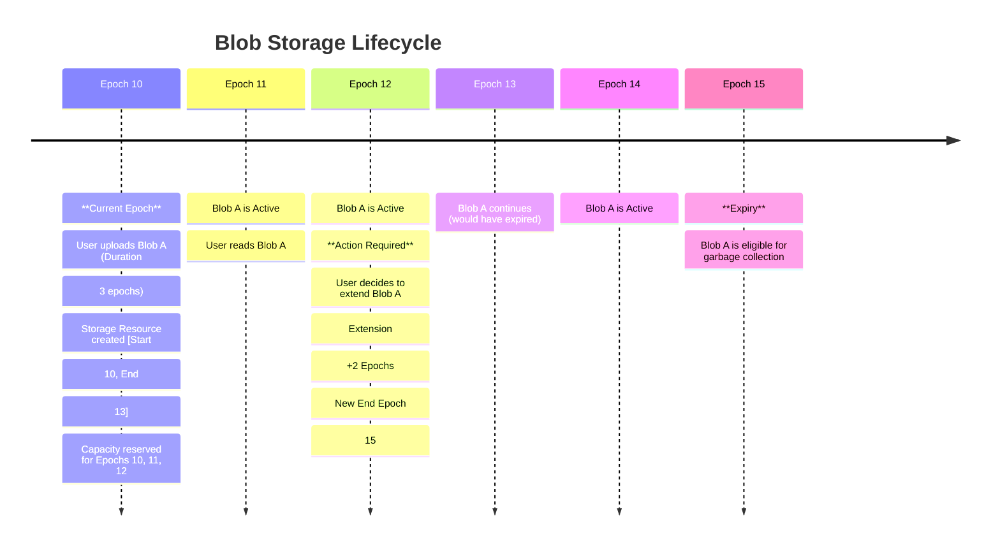

# Epochs, Continuity, and Extension

This module explores how Walrus manages time through epochs, how storage continuity is maintained,
and the mechanics of extending storage duration.

## Recap: Sui ↔ Walrus Connection

Before diving into epochs, let's connect what you've learned about Sui to how Walrus works:

| Sui Concept | Walrus Application |
|-------------|-------------------|
| **Sui Objects** | Walrus uses Sui Objects to represent storage resources, blobs, and system state |
| **Move Structs with `key`** | `Storage`, `Blob`, and system structs are on-chain Sui Objects with unique IDs |
| **Object Ownership** | Users own their `Blob` objects; the system owns shared state objects |
| **Transactions** | All Walrus operations (store, extend, delete) are Sui transactions |
| **Sui Epochs** | Walrus epochs are *different* from Sui epochs - Walrus has its own epoch system |

```mermaid
flowchart LR
    subgraph Sui["🔷 Sui Blockchain"]
        TX["Transactions"]
        Objects["Objects (UID)"]
        Move["Move Contracts"]
    end
    
    subgraph Walrus["🐘 Walrus"]
        Blob["Blob Object"]
        Storage["Storage Object"]
        System["System State"]
    end
    
    TX --> Blob
    TX --> Storage
    Objects --> Blob
    Objects --> Storage
    Move --> System
    
    style Sui fill:#4da2ff,stroke:#1971c2
    style Walrus fill:#b2f2bb,stroke:#2f9e44
```



**Key Insight**: When you store a file on Walrus, you're creating **Sui Objects** on-chain that
represent your storage reservation and blob metadata. The actual file data lives off-chain on
Walrus storage nodes, but the *proof of storage* and *ownership* live on Sui.

---

## 1. Epoch Lifecycle

Walrus time is divided into **epochs**. An epoch is a fixed period of time during which the set of
storage nodes (the committee) and system parameters (like price and capacity) remain constant.

On Walrus Mainnet, an epoch is **2 weeks** long. On Testnet, epochs are **1 day** long for faster
iteration during development.

The system defines epoch parameters in the `EpochParams` struct:

```move
// contracts/walrus/sources/system/epoch_parameters.move
public struct EpochParams has copy, drop, store {
    /// The storage capacity of the system.
    total_capacity_size: u64,
    /// The price per unit size of storage.
    storage_price_per_unit_size: u64,
    /// The write price per unit size.
    write_price_per_unit_size: u64,
}
```

The lifecycle of an epoch involves:

1. **Start**: A new committee takes over, and new system parameters come into effect.
2. **Duration**: Storage nodes perform duties; users store/read data.
3. **End**: Rewards are calculated.
4. **Transition**: The system transitions to the next epoch via `advance_epoch`.

### Epoch Lifecycle Flow

```mermaid
flowchart LR
    subgraph Lifecycle["📅 Epoch N Lifecycle"]
        direction LR
        Start["🚀 Start<br/>New Committee"]
        Params["⚙️ Params Frozen<br/>price, capacity"]
        Active["⚡ Active Period<br/>2 wks / 1 day"]
        End["📊 End<br/>Rewards Calc"]
        
        Start --> Params --> Active --> End
    end
    
    subgraph Ops["🔄 During Active Period"]
        Store["Store Blobs"]
        Read["Read Blobs"]
        Extend["Extend Storage"]
    end
    
    Active -.-> Ops
    End --> Advance["advance_epoch()"]
    Advance --> |"Epoch N+1"| Start
    
    style Start fill:#b2f2bb,stroke:#2f9e44
    style Active fill:#a5d8ff,stroke:#1971c2
    style End fill:#ffc9c9,stroke:#f03e3e
    style Advance fill:#e5dbff,stroke:#862e9c
```


<details>
<summary>Mermaid source (click to expand)</summary>



</details>

```move
// contracts/walrus/sources/system/system_state_inner.move
public(package) fun advance_epoch(
    self: &mut SystemStateInnerV1,
    new_committee: BlsCommittee,
    new_epoch_params: &EpochParams,
): VecMap<ID, Balance<WAL>> {
    // ... logic to verify committee ...
    let old_epoch = self.epoch();
    let new_epoch = old_epoch + 1;
    // ... updates committee and parameters ...
}
```

## 2. How Continuity Protects Availability

**Storage Continuity** ensures that a blob remains available and retrievable across multiple epochs
without interruption.

When you store a blob, you purchase a **Storage Resource**. This resource defines the exact range of
epochs for which space is reserved.

### Storage as a Sui Object

The `Storage` struct is a **Sui Object** (note the `key` ability and `UID` field). This means:
- It has a unique on-chain identity (`id: UID`)
- It can be owned, transferred, or wrapped inside other objects
- Its state is stored on the Sui blockchain, not on Walrus storage nodes

```move
// contracts/walrus/sources/system/storage_resource.move
/// Reservation for storage for a given period, which is inclusive start, exclusive end.
public struct Storage has key, store {
    id: UID,              // Sui Object ID - unique identifier on Sui
    start_epoch: u32,     // Inclusive start
    end_epoch: u32,       // Exclusive end
    storage_size: u64,    // Reserved capacity in bytes
}
```

> 💡 **Sui Connection**: Just like a Sui `Coin<SUI>` object represents owned currency, a `Storage`
> object represents owned storage capacity. You can query it on Sui Explorer using its Object ID.

The system maintains a **Future Accounting Ring Buffer** to track reserved capacity for future epochs.

```move
// contracts/walrus/sources/system/storage_accounting.move
/// A ring buffer holding future accounts for a continuous range of epochs.
public struct FutureAccountingRingBuffer has store {
    current_index: u32,
    length: u32,
    ring_buffer: vector<FutureAccounting>,
}
```

When reserving space, the system checks that the requested duration does not exceed the buffer's limit
and that capacity exists.

```move
// contracts/walrus/sources/system/system_state_inner.move
public(package) fun reserve_space(
    self: &mut SystemStateInnerV1,
    storage_amount: u64,
    epochs_ahead: u32,
    payment: &mut Coin<WAL>,
    ctx: &mut TxContext,
): Storage {
    // Check the period is within the allowed range.
    assert!(epochs_ahead > 0, EInvalidEpochsAhead);
    assert!(epochs_ahead <= self.future_accounting.max_epochs_ahead(), EInvalidEpochsAhead);
    
    // ... calculates start and end epochs ...
    let start_epoch = self.epoch();
    let end_epoch = start_epoch + epochs_ahead;
    
    // ... calls internal reservation logic ...
    self.reserve_space_for_epochs(storage_amount, start_epoch, end_epoch, payment, ctx)
}
```

## 3. When Storage Extensions Matter

**Storage Extension** allows you to prolong the life of a blob beyond its original expiration date.

### The Blob Object on Sui

The `Blob` is also a **Sui Object** that you own. It contains:
- A reference to the actual data (via `blob_id` - a cryptographic hash)
- An embedded `Storage` resource (the reservation)
- Certification status proving the data was successfully stored

```move
// contracts/walrus/sources/system/blob.move
public struct Blob has key, store {
    id: UID,
    registered_epoch: u32,
    blob_id: u256,
    size: u64,
    encoding_type: u8,
    // Stores the epoch first certified.
    certified_epoch: option::Option<u32>,
    storage: Storage,
    // Marks if this blob can be deleted.
    deletable: bool,
}
```

> 💡 **Sui Connection**: The `Blob` object is what you receive after a successful upload. You can
> view it on Sui Explorer, transfer ownership to another address, or wrap it in a smart contract
> for programmatic access control.

**Key Rule**: You must extend a blob *before* it expires. The `Blob` module enforces this check:

```move
// contracts/walrus/sources/system/blob.move
/// Aborts if the blob is not certified or already expired.
public(package) fun assert_certified_not_expired(self: &Blob, current_epoch: u32) {
    // Assert this is a certified blob
    assert!(self.certified_epoch.is_some(), ENotCertified);

    // Check the blob is within its availability period
    assert!(current_epoch < self.storage.end_epoch(), EResourceBounds);
}
```

The extension logic in `system_state_inner` ensures the extension connects seamlessly to the existing
storage end epoch.

```move
// contracts/walrus/sources/system/system_state_inner.move
public(package) fun extend_blob(
    self: &mut SystemStateInnerV1,
    blob: &mut Blob,
    extended_epochs: u32,
    payment: &mut Coin<WAL>,
) {
    // Check that the blob is certified and not expired.
    blob.assert_certified_not_expired(self.epoch());

    let start_offset = blob.storage().end_epoch() - self.epoch();
    let end_offset = start_offset + extended_epochs;

    // ... processes payment and accounting for the new range ...
    
    // Actually extend the storage resource
    blob.storage_mut().extend_end_epoch(extended_epochs);
}
```

## 4. How Epochs are Advanced

Epoch advancement shifts the window of active storage. The `advance_epoch` function "pops" the ring
buffer, moving the accounting window forward by one epoch.

```move
// contracts/walrus/sources/system/system_state_inner.move
// ... inside advance_epoch ...

// Pop the first element of the ring buffer (the current epoch that is ending)
// and add a new empty epoch at the end of the buffer.
let accounts_old_epoch = self.future_accounting.ring_pop_expand();

// Make sure that we have the correct epoch
assert!(accounts_old_epoch.epoch() == old_epoch, EInvalidAccountingEpoch);

// ... distribute rewards from accounts_old_epoch ...
```

This rotation ensures that the system always has a fixed window of future epochs available for
reservation. While the contract enforces an upper limit of `MAX_MAX_EPOCHS_AHEAD` (1000), both
Mainnet and Testnet are configured with a practical limit of **53 epochs** (approximately 2 years
on Mainnet, or 53 days on Testnet).

## 5. Timeline Diagram

The following diagram illustrates the lifecycle of a blob across epochs.


<details>
<summary>Mermaid source (click to expand)</summary>



</details>

### Explaining the Diagram

1. **The Setup (Epoch 10)**
   - **Event**: A user uploads a file ("Blob A") with a duration of **3 epochs**.
   - **Calculation**: Start Epoch is 10. Duration is 3. End Epoch is 13 ($10 + 3$).
   - **Concept**: The "End Epoch" is **exclusive**. A resource covering 10, 11, and 12 expires
     exactly when Epoch 13 begins.

1. **The Active Period (Epoch 11)**
   - **Status**: The blob is safe and readable.
   - **Concept**: No action is needed. The system has guaranteed capacity for this blob because it
     was paid for upfront in Epoch 10.

1. **The Critical Moment (Epoch 12)**
   - **Status**: This is the **last active epoch** of the original reservation.
   - **Action**: The user performs an extension of **+2 epochs**.
   - **Math**: Current End Epoch is 13. Extension is +2. **New End Epoch** is 15 ($13 + 2$).
   - **Why here?**: If the user waits until Epoch 13 starts, the blob is already expired and cannot
     be extended.

1. **The "Saved" Period (Epoch 13 & 14)**
   - **Status**: The blob continues to exist.
   - **Concept**: Without the extension in Epoch 12, the blob would have been deleted at the start
     of Epoch 13. Now, it is valid for Epoch 13 and Epoch 14.

1. **The End (Epoch 15)**
   - **Status**: Expiry.
   - **Concept**: The New End Epoch is 15. This means the blob is valid *up until* Epoch 15. As soon
     as the network transitions to Epoch 15, the blob becomes eligible for garbage collection
     (deletion) by storage nodes.

## 6. Real Examples

### Early Expiry

**Scenario**: A user stores a file with `--epochs 1` in Epoch 5.
- **Result**: The file is valid for Epoch 5 only.
- **Outcome**: As soon as the system transitions to Epoch 6, the file is expired.
- **Lesson**: Always add a buffer.

### Extension Race

**Scenario**: A user waits until the very last minute of Epoch 10 to extend a blob expiring in
Epoch 11.
- **Risk**: If the network transitions to Epoch 11 before the extension transaction is finalized,
  the extension will fail.

```mermaid
flowchart TD
    subgraph Race["⚠️ Extension Race Condition"]
        Scenario["📋 Scenario<br/>Current: Epoch 10<br/>Blob end_epoch: 11"]
        Submit["User submits<br/>extend_blob TX"]
        Check{"Who executes<br/>first?"}
        
        Scenario --> Submit --> Check
        
        Check -->|"TX first"| Success["✅ Extension succeeds"]
        Check -->|"advance_epoch first"| Fail["❌ EResourceBounds<br/>DATA LOST!"]
    end
    
    Recommend["💡 Always extend with<br/>2-3 epochs buffer!"]
    
    Fail --> Recommend
    
    style Success fill:#b2f2bb,stroke:#2f9e44
    style Fail fill:#ffc9c9,stroke:#f03e3e
    style Recommend fill:#a5d8ff,stroke:#1971c2
```


<details>
<summary>Mermaid source (click to expand)</summary>



</details>

**Detailed Breakdown**:

1. **Current State**:
   - `current_epoch`: 10
   - Blob `end_epoch`: 11
   - Blob is valid because `10 < 11`.

1. **Race Condition**:
   - User submits `extend_blob` transaction.
   - *Before* the transaction is executed, the system processes `advance_epoch`.
   - **New State**: `current_epoch` becomes **11**.

1. **Transaction Failure**:
   - The user's transaction is now executed.
   - It calls `blob.assert_certified_not_expired(current_epoch)`.
   - Inputs: `current_epoch` = 11, `blob.end_epoch` = 11.

```move
// contracts/walrus/sources/system/blob.move
public(package) fun assert_certified_not_expired(self: &Blob, current_epoch: u32) {
    // ...
    // Check the blob is within its availability period
    // Fails because 11 is NOT less than 11
    assert!(current_epoch < self.storage.end_epoch(), EResourceBounds);
}
```

- **Result**: The transaction aborts with `EResourceBounds`.
- **Consequence**: The blob is now expired and cannot be extended. It is eligible for deletion.

## Key Takeaways

### Sui ↔ Walrus Integration
- **Sui Objects represent storage**: `Blob` and `Storage` are Sui Objects with unique IDs you can query on-chain
- **Ownership on Sui**: You own your `Blob` objects; they can be transferred, wrapped, or used in smart contracts
- **Transactions are Sui TXs**: Every store/extend/delete is a Sui transaction that modifies on-chain state

### Epoch Rules
- **Epochs are time units**: Mainnet uses 2-week epochs; Testnet uses 1-day epochs for faster iteration
- **End epoch is exclusive**: `end_epoch: 13` means valid through Epoch 12, expires when Epoch 13 starts
- **Extensions must happen before expiry**: The `assert_certified_not_expired` check enforces `current_epoch < end_epoch`
- **Race conditions exist**: Transactions submitted near epoch boundaries may execute in the next epoch
- **Maximum storage is 53 epochs**: Approximately 2 years on Mainnet, 53 days on Testnet
- **Once expired, data is lost**: There is no way to recover or extend an expired blob

## Next Steps

Now that you understand epochs and storage continuity, proceed to the
[Hands-On Exercises](./02-hands-on.md) to practice epoch calculations and analyze extension scenarios.
