# Instructor's Guide: Epochs and Storage Continuity

## Quick Reference

**Total Time:** 45-60 minutes

**Difficulty:** Intermediate

**Hands-on Components:** Yes - Epoch timeline exercises and extension race scenarios

**Materials Needed:** Whiteboard for timeline diagrams, access to Sui Explorer (recommended)

**Key Takeaways:**

- Epochs are 2-week periods (Mainnet) / 1-day periods (Testnet) where system parameters remain constant

- Storage resources use **exclusive end epochs**: `end_epoch: 13` means valid through Epoch 12

- Extensions must happen **before** expiry - once expired, data is lost forever

- Race conditions exist at epoch boundaries - always extend with 2-3 epochs buffer

- Maximum storage duration is 53 epochs (~2 years on Mainnet)

- **Sui Integration**: `Blob` and `Storage` are Sui Objects - students should understand this connection

---

## 🔄 Previous Day Recap: Sui ↔ Walrus Connection (5-10 min)

**Purpose:** Bridge students' existing Sui knowledge to today's Walrus content.

### Suggested Recap Script

> "Before we dive into epochs, let's quickly connect what we learned about Sui to how Walrus works.
> Remember Sui Objects? Walrus uses them extensively..."

### Key Points to Recap

| If students learned... | Connect it to... |
|------------------------|------------------|
| **Sui Objects & UID** | Walrus `Blob` and `Storage` are Sui Objects with unique IDs |
| **Object ownership** | Users own their `Blob` objects on Sui |
| **Move structs with `key`** | All Walrus on-chain types have `key` ability |
| **Sui transactions** | Every Walrus operation is a Sui TX |
| **Sui epochs** | ⚠️ Walrus epochs are DIFFERENT from Sui epochs! |

### Visual: Sui ↔ Walrus Architecture

Draw or display this relationship:

```mermaid
flowchart TB
    subgraph Sui["🔷 SUI BLOCKCHAIN"]
        direction LR
        Blob["📦 Blob Object<br/>(owned)<br/>─────────<br/>• blob_id<br/>• storage<br/>• deletable"]
        Storage["💾 Storage Object<br/>─────────<br/>• start_epoch<br/>• end_epoch<br/>• storage_size"]
        System["⚙️ System State<br/>(shared)<br/>─────────<br/>• epoch<br/>• committee"]
    end
    
    subgraph Walrus["🐘 WALRUS STORAGE NODES"]
        Data["Off-chain: actual file data stored here"]
    end
    
    Sui -->|"Proof of Storage<br/>(blob_id links to data)"| Walrus
    
    style Sui fill:#e7f5ff,stroke:#1971c2,color:#0c2d48
    style Walrus fill:#ebfbee,stroke:#2f9e44,color:#0c3d14
    style Blob fill:#a5d8ff,stroke:#1971c2,color:#0c2d48
    style Storage fill:#a5d8ff,stroke:#1971c2,color:#0c2d48
    style System fill:#ffc9c9,stroke:#f03e3e,color:#5c0011
    style Data fill:#d3f9d8,stroke:#2f9e44,color:#0c3d14
```


<details>
<summary>Mermaid source (click to expand)</summary>



</details>

### Discussion Starters

- "Who can tell me what a Sui Object is?" (Has UID, can be owned/transferred)
- "What does the `key` ability mean in Move?" (Can be stored as a top-level object)
- "If I upload a file to Walrus, what shows up on Sui Explorer?" (A Blob object)

### ⚠️ Common Confusion: Sui Epochs vs. Walrus Epochs

**This is critical to clarify early!**

| | Sui Epochs | Walrus Epochs |
|---|------------|---------------|
| **Duration** | ~24 hours | 2 weeks (Mainnet) / 1 day (Testnet) |
| **Purpose** | Validator rotation, staking rewards | Storage pricing, committee rotation |
| **Relationship** | Independent | Walrus tracks its own epochs |

> "Walrus has its OWN epoch system. Don't confuse Sui epochs with Walrus epochs - they're independent!"

---

## Prerequisites

### For Students

- **Sui fundamentals**: Objects, ownership, transactions (from previous day/module)

- Basic understanding of blockchain concepts (epochs, transactions)

- Familiarity with the Walrus `Blob` structure (from previous modules)

- Ability to read basic Move code (structs and function signatures)

- Understanding of time-based storage concepts

### For Instructor

- Familiarity with the `system_state_inner.move` contract logic

- Understanding of the `advance_epoch` mechanics and ring buffer

- Prepared examples of "off-by-one" errors in epoch calculations

- Access to Sui Explorer for demonstrating epoch changes and Object lookups

- **Sui Explorer URLs ready**:
  - Testnet: `https://testnet.suivision.xyz/`
  - Mainnet: `https://suivision.xyz/`

## Classroom Setup

**Advance Prep (10 min before class):**

- [ ] Prepare whiteboard space for drawing epoch timelines

- [ ] Queue up key terms: "exclusive end epoch," "extension race," "ring buffer"

- [ ] Have the diagrams ready to display (PNG images in `../images/`):
  - `Walrus_Epoch_lifecycle_flow.png` - Epoch Lifecycle Flow (Section 1)
  - `Blob_Storage_timeline.png` - Blob Storage Timeline (Section 5)
  - `Extension_race_condition.png` - Extension Race Condition (Section 6)

- [ ] Prepare epoch calculation examples on cards or slides

- [ ] (Optional) Open Sui explorer to show real epoch data

**Materials:**

- Whiteboard markers (different colors for epochs, blobs, extensions)

- Printed copies of hands-on exercises (or projected)

- Calculator for epoch math demonstrations

## Instructor Cheat Sheet

| Time | Topic | Key Point |
|------|-------|-----------|
| 0-10 min | Epoch Lifecycle | 2 weeks Mainnet, 1 day Testnet; parameters frozen per epoch |
| 10-25 min | Storage Continuity | Ring buffer, exclusive end epoch, `start < end` |
| 25-40 min | Extension Rules | Must extend BEFORE expiry; `assert_certified_not_expired` |
| 40-50 min | Race Conditions | Epoch boundary risks; always use 2-3 epoch buffer |
| 50-60 min | Hands-On Exercises | Timeline interpretation, scenario analysis |

**Critical Numbers to Remember:**

- Mainnet epoch: **2 weeks**
- Testnet epoch: **1 day**
- Maximum storage: **53 epochs** (~2 years Mainnet, ~53 days Testnet)
- Contract upper limit: `MAX_MAX_EPOCHS_AHEAD = 1000` (not user-facing)

**Key Error Code:** `EResourceBounds` (error code 2) - indicates expired blob or out-of-bounds access

---

## Section-by-Section Guidance

### Section 1: Epoch Lifecycle (10 min)

**Student Material:** 01-epochs-continuity.md, Lines 6-46

⏱️ **Duration:** 10 minutes

🎯 **Key Points to Emphasize:**

- Epochs are the fundamental unit of time in Walrus
- **Mainnet: 2 weeks** | **Testnet: 1 day** - mention both!
- System parameters (capacity, price) are fixed *per epoch*
- The transition (`advance_epoch`) is a discrete event that updates the committee and accounting

💡 **Teaching Tips:**

- Use the analogy of a "rent contract" that renews every 2 weeks
- Walk through the `EpochParams` struct code to show exactly what is frozen during an epoch
- Draw a simple timeline: `|--Epoch 10--|--Epoch 11--|--Epoch 12--|`
- Emphasize: "If you store a file on Day 1 of an epoch, the price won't change for 2 weeks"

⚠️ **Common Misconceptions:**

- Students may think epochs are like "blocks" - clarify epochs are much longer (weeks, not seconds)
- Some may assume prices can change mid-epoch - they cannot
- May confuse Mainnet (2 weeks) and Testnet (1 day) durations

💬 **Discussion Points:**

- "If I store a file today, will the storage price change tomorrow?" (Answer: No, not until the next epoch)
- "Why do we need fixed epochs? Why not update prices every second?" (Answer: Stability, predictability for users, simpler accounting)

✅ **Quick Check:**

- "How long is one epoch on Mainnet?" (2 weeks)
- "How long is one epoch on Testnet?" (1 day)
- "Can the committee change mid-epoch?" (No)

**Transition to Next Section:**

"Now that we understand epochs, let's see how the system guarantees your data stays available across these epochs."

---

### Section 2: How Continuity Protects Availability (15 min)

**Student Material:** 01-epochs-continuity.md, Lines 48-102

⏱️ **Duration:** 15 minutes

🎯 **Key Points to Emphasize:**

- **Reservation Model**: You pay upfront; the network guarantees capacity exists
- **Storage Resource**: Defines the exact epoch range for your blob
- **Ring Buffer**: `FutureAccountingRingBuffer` is like a calendar where future slots are booked
- **Exclusive End Epoch**: "End Epoch 13" means the blob expires *when Epoch 13 starts* - valid through Epoch 12

💡 **Teaching Tips:**

- Draw a timeline on the whiteboard with clear "Start" and "End" markers
- Use hotel reservation analogy: "Check-in Day 10, Check-out Day 13 means you stay nights 10, 11, 12"
- Show the source code `reserve_space` to demonstrate the check `assert!(epochs_ahead <= max_epochs_ahead)`
- Emphasize: "The maximum you can reserve is **53 epochs** - about 2 years on Mainnet"

🔷 **Sui Object Connection:**

Pause to reinforce the Sui connection:

> "Notice the `Storage` struct has `key` and a `UID` field - this makes it a Sui Object.
> When you reserve storage, you're creating an on-chain object that proves your reservation.
> You could even look it up on Sui Explorer!"

**Live Demo (optional):** If you have a Blob Object ID from a previous upload, show it on Sui Explorer:
- Navigate to `https://testnet.suivision.xyz/object/<OBJECT_ID>`
- Show the `storage` field with `start_epoch` and `end_epoch`
- Point out: "This is proof-of-reservation living on the Sui blockchain"

**Timeline Drawing Script:**

```
Draw on whiteboard:

Epoch:  |  10  |  11  |  12  |  13  |  14  |
        |------|------|------|------|------|
Blob A: [=============]
        ^start=10     ^end=13 (exclusive!)

"Blob A is valid during epochs 10, 11, 12. It expires when epoch 13 STARTS."
```

⚠️ **Common Misconceptions:**

- 🚨 **CRITICAL**: Students often think `end_epoch: 13` means "valid through epoch 13" - it's EXCLUSIVE
- May think ring buffer limit (1000) is the user limit - actual limit is **53 epochs**
- Might assume storage is unlimited - capacity is finite and shared

💬 **Discussion Points:**

- "If `start_epoch` is 10 and `end_epoch` is 12, how many epochs does the blob last?" (Answer: 2 epochs - 10 and 11)
- "Why is end epoch exclusive?" (Answer: Simplifies math, avoids off-by-one errors in code, matches common programming conventions)
- "What happens if you try to reserve 100 epochs?" (Answer: Fails - max is 53)

✅ **Quick Check:**

- "A blob has `start_epoch: 50` and `end_epoch: 55`. During which epochs is it available?" (50, 51, 52, 53, 54)
- "How many epochs is that?" (5 epochs)
- "At what epoch does it expire?" (At the START of epoch 55)

**Transition to Next Section:**

"Great! But what if you want your blob to last longer than the original reservation? That's where extensions come in."

---

### Section 3: When Storage Extensions Matter (10 min)

**Student Material:** 01-epochs-continuity.md, Lines 104-144

⏱️ **Duration:** 10 minutes

🎯 **Key Points to Emphasize:**

- **Extensions allow longevity**: You don't need to re-upload data to keep it
- **The Golden Rule**: Extend *before* expiry. Once it's gone, it's gone forever
- **Gatekeeper Function**: `assert_certified_not_expired` enforces the rule
- **Fusion**: Internally, an extension "fuses" a new reservation to the old one

💡 **Teaching Tips:**

- Highlight the `assert_certified_not_expired` function - this is the "gatekeeper" code
- Write the check on the board: `current_epoch < end_epoch`
- Discuss the cost implication: Is it cheaper to buy 100 epochs now or extend 1 epoch 100 times? (Upload cost is paid once, but gas fees add up for extensions)
- Use the "gym membership" analogy: "You can only renew before your membership expires"

🔷 **Sui Object Connection:**

> "The `Blob` object you own has the `Storage` object embedded inside it. When you extend,
> you're mutating your Sui Object's state - specifically updating the `end_epoch` field.
> This is a Sui transaction that modifies on-chain state."

**Key Sui Concepts in Play:**
- **Object mutation**: `extend_blob` takes `&mut Blob` - it modifies the object
- **Sui transactions**: The extension is atomic - it either succeeds or fails completely
- **Gas fees**: Each extension is a Sui TX with gas costs (in SUI, not WAL)

**Code Walkthrough:**

```move
assert!(current_epoch < self.storage.end_epoch(), EResourceBounds);
//      ^^^^^^^^^^^^^^^   ^^^^^^^^^^^^^^^^^^^^^
//      "Are we now..."   "...before the expiration?"
//
// If current_epoch = 11 and end_epoch = 11:
//    11 < 11 = FALSE → Transaction ABORTS
```

⚠️ **Common Misconceptions:**

- Students may think they can extend after expiry - they absolutely cannot
- Some assume the system sends reminders - it does not; user responsibility
- May think extension is free - it costs WAL tokens for the additional epochs

💬 **Discussion Points:**

- "Can I extend a blob that expired yesterday?" (Answer: No, the transaction will abort with `EResourceBounds`)
- "Why does the system delete expired blobs?" (Answer: To reclaim space and maintain economic sustainability)
- "What happens to the data after expiration?" (Answer: Eligible for garbage collection; may be deleted immediately or eventually)

✅ **Quick Check:**

- "Current epoch is 50. Blob `end_epoch` is 50. Can you extend?" (No - 50 < 50 is false)
- "Current epoch is 50. Blob `end_epoch` is 51. Can you extend?" (Yes - 50 < 51 is true)
- "What error code indicates an expired blob?" (`EResourceBounds`)

**Transition to Next Section:**

"Okay, so we need to extend before expiry. But what if you're cutting it close? Let's talk about the race condition."

---

### Section 4: Extension Race - The Critical Timing Issue (10 min)

**Student Material:** 01-epochs-continuity.md, Lines 231-267

⏱️ **Duration:** 10 minutes

🎯 **Key Points to Emphasize:**

- **Blockchain time is discrete**: State changes happen in blocks, not continuously
- **Race Condition**: A transaction submitted in Epoch 10 might execute in Epoch 11
- **The Danger Zone**: Last active epoch before expiry
- **Safety Margins**: Always extend well before the deadline (2-3 epochs recommended)

💡 **Teaching Tips:**

- Use the "Extension Race" detailed breakdown from the curriculum
- **Roleplay the race**: Student A is the "User Transaction", Student B is the "Epoch Advance" - who gets to the validator first?
- Draw the race condition timeline on the board
- Emphasize: "Network transitions can happen at any moment - don't gamble with your data"

**Race Condition Visualization:**

```
Draw on whiteboard:

Timeline: |---- Epoch 10 ----|---- Epoch 11 ----|
                         ↑        ↑
                    User submits   Network processes
                    extension      advance_epoch FIRST!
                         
Result: Transaction executes in Epoch 11
        Blob end_epoch is 11
        Check: 11 < 11 = FALSE
        TRANSACTION FAILS! Blob is now expired forever.
```

⚠️ **Common Misconceptions:**

- Students may think "last minute" is safe if they're in the right epoch - it's NOT
- Some assume transactions execute instantly - there's always latency
- May think epoch transitions are predictable - timing can vary

💬 **Discussion Points:**

- "If my blob expires at the start of Epoch 11, and the current epoch is 10, is it safe to wait until the last second?" (Answer: No, very risky - race condition)
- "What's the recommended buffer?" (Answer: 2-3 epochs before expiry)
- "Why doesn't the system just accept transactions that were 'meant' for the previous epoch?" (Answer: Blockchain state is deterministic; can't go back in time)

✅ **Quick Check:**

- "Current epoch: 10. Blob `end_epoch`: 11. Is extending safe?" (Risky - only 1 epoch buffer)
- "Current epoch: 10. Blob `end_epoch`: 13. Is extending safe?" (Yes - 3 epochs buffer)
- "What's the MINIMUM safe buffer?" (2 epochs recommended)

**Transition to Next Section:**

"Now let's put this all together with some hands-on exercises."

---

### Section 5: Hands-On Exercises (15-20 min)

**Student Material:** 02-hands-on.md

⏱️ **Duration:** 15-20 minutes

🎯 **Key Points to Emphasize:**

- Practice epoch math with real scenarios
- Identify safe vs. risky extension windows
- Calculate extension amounts correctly
- Apply the "2-3 epoch buffer" rule

💡 **Teaching Tips:**

- Have students work in pairs for the scenarios
- Walk through Exercise 1 together as a class, then let them do the rest
- Use the whiteboard to draw out each scenario's timeline
- Encourage students to show their math, not just answers

**Exercise Walkthrough - Exercise 1:**

```
Given: Creation Epoch = 100, Duration = 5 epochs

Step 1: Calculate end_epoch
        end_epoch = start_epoch + duration
        end_epoch = 100 + 5 = 105

Step 2: Identify valid epochs
        Valid: 100, 101, 102, 103, 104 (five epochs)
        
Step 3: Identify expiration
        Expires at START of Epoch 105

Step 4: Can extend in Epoch 103?
        Check: 103 < 105? YES → Can extend
```

⚠️ **Common Misconceptions:**

- Off-by-one errors in calculating valid epochs (include start, exclude end)
- Forgetting that end epoch is exclusive
- Not accounting for race conditions in "last active epoch" scenarios

💬 **Discussion Points:**

- "In Scenario B, why is the outcome uncertain?" (Race condition - depends on transaction ordering)
- "In Scenario D, why not wait until Epoch 104?" (Only 1 epoch buffer - risky)

✅ **Quick Check:**

- After exercises, ask: "What's the formula for end_epoch?" (start_epoch + duration)
- "If end_epoch is 120 and you want to extend to 150, how many epochs do you request?" (30)

---

## Wrap-up and Assessment (5 min)

### Exit Ticket (Written or Verbal)

Ask students to answer briefly:

1. **What is the epoch duration on Mainnet vs. Testnet?**
   - Expected: Mainnet = 2 weeks, Testnet = 1 day

2. **If a blob has `start_epoch: 20` and `end_epoch: 25`, which epochs is it valid for?**
   - Expected: Epochs 20, 21, 22, 23, 24 (5 epochs; end is exclusive)

3. **Why can't you extend an expired blob?**
   - Expected: The `assert_certified_not_expired` check fails; once expired, data may be deleted

4. **What's the recommended buffer for extending blobs?**
   - Expected: 2-3 epochs before expiry to avoid race conditions

5. **🔷 Sui Connection: What type of Sui entity is a `Blob`?**
   - Expected: A Sui Object (has `key` ability and `UID`); owned by the uploader

### Assessment Checklist

Use this to gauge if the module was successful:

- [ ] Students can accurately calculate `end_epoch` given a duration

- [ ] Students understand the exclusive nature of `end_epoch`

- [ ] Students can explain why `assert_certified_not_expired` is critical

- [ ] Students recognize race conditions at epoch boundaries

- [ ] Students know the safe buffer (2-3 epochs) for extensions

- [ ] Students can calculate extension amounts (target - current end_epoch)

- [ ] 🔷 Students understand that `Blob` and `Storage` are Sui Objects

- [ ] 🔷 Students can explain that Walrus epochs ≠ Sui epochs

### Quick Poll

- "Raise your hand if you can calculate how many epochs a blob lasts given start and end"
- "Thumbs up if you understand why waiting until the last epoch is dangerous"
- "Show of hands: Who can explain the Extension Race to a colleague?"

---

## Additional Resources

### For Students

- [Walrus Networks Documentation](https://docs.walrus.site/usage/networks.html) - Epoch durations and limits
- [CLI Reference](https://docs.walrus.site/usage/client-cli.html) - `--epochs` flag usage
- [Developer Operations](https://docs.walrus.site/dev-guide/dev-operations.html) - Storage lifecycle

### For Instructors

- **Walrus Source Code**: `contracts/walrus/sources/system/` - Move contracts
- **Sui Explorer**: To view epoch changes on testnet/mainnet in real-time
- **Test Files**: `contracts/walrus/tests/` - Example epoch scenarios

### Official Documentation References

- [Available Networks](https://github.com/MystenLabs/walrus/blob/main/docs/book/usage/networks.md) - Network parameters
- [Storage Costs](https://github.com/MystenLabs/walrus/blob/main/docs/book/dev-guide/costs.md) - Pricing and epochs
- [Properties and Guarantees](https://github.com/MystenLabs/walrus/blob/main/docs/book/design/properties.md)

---

## Notes for Next Module

Students should now be ready for:

- Advanced storage operations (deletable blobs, storage resource management)
- Building applications that manage blob lifecycle automatically
- Cost optimization strategies for long-term storage
- Automated extension services

**Key Concepts to Reinforce in Future Modules:**

- Exclusive end epoch semantics (critical for all epoch calculations)
- Extension buffer best practices (2-3 epochs minimum)
- The `EResourceBounds` error and how to handle it
- Difference between Mainnet and Testnet epoch durations for testing

### 🔷 Sui Concepts to Build On

The Sui ↔ Walrus connection introduced today will be important for:

| Future Topic | Sui Connection |
|--------------|----------------|
| **Deletable Blobs** | Different object lifecycle; deletion burns the Sui Object |
| **Programmatic Access** | Wrapping `Blob` objects in custom Move contracts |
| **Access Control** | Using Sui's object ownership for permissioned storage |
| **Event Monitoring** | Listening to Sui events for storage lifecycle |
| **PTBs (Programmable Transaction Blocks)** | Composing Walrus operations with other Sui actions |

**Suggested Recap for Next Module:**

> "Yesterday we learned that Blobs and Storage are Sui Objects. Today we'll see how
> you can use Sui's programmability to build smart contracts that manage storage..."
