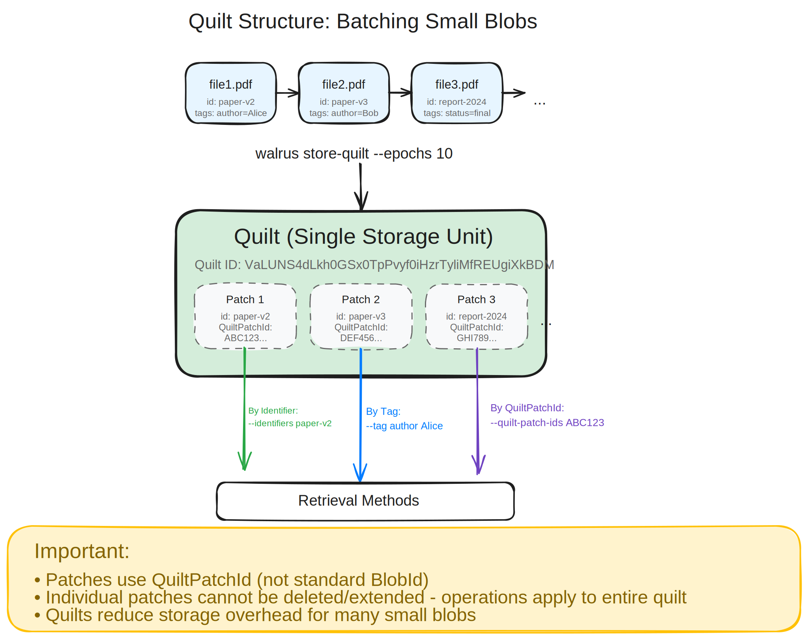
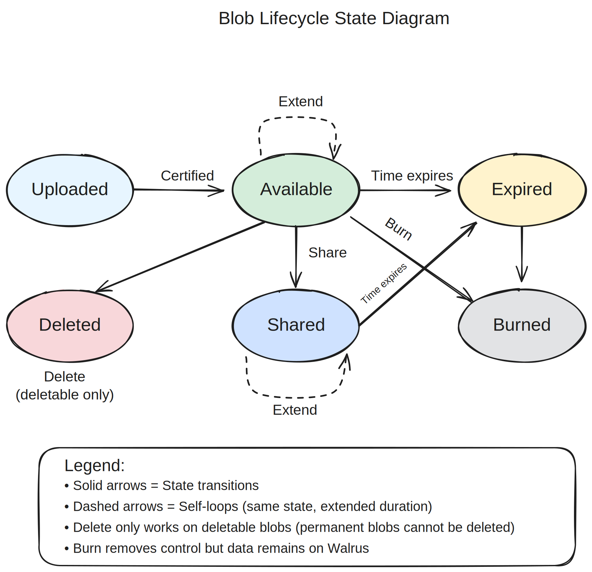

# Upload Workflow

This section covers how to upload (store) data on Walrus using the CLI. The `walrus store` command is the primary way to store blobs on the Walrus network.

## Basic Upload Command

The basic syntax for storing a blob is:

```sh
walrus store <FILE> --epochs <EPOCHS>
```

For example, to store a file called `document.pdf` for 10 epochs:

```sh
walrus store document.pdf --epochs 10
```

You can store multiple files at once:

```sh
walrus store file1.txt file2.txt file3.txt --epochs 10
```

Or use glob patterns:

```sh
walrus store *.png --epochs 10
```

## Storage Duration Options

You must specify how long the blob should be stored. There are three ways to do this:

### 1. Using `--epochs`

Specify the number of epochs (each epoch is 2 weeks on Mainnet):

```sh
walrus store file.txt --epochs 10  # Store for 10 epochs (20 weeks)
walrus store file.txt --epochs max # Store for maximum duration (53 epochs)
```

**Important**: The end epoch is calculated as `current_epoch + specified_epochs`. A blob expires at the beginning of its end epoch.

### 2. Using `--earliest-expiry-time`

Specify a target expiry date:

```sh
walrus store file.txt --earliest-expiry-time "2024-12-31T23:59:59Z"
walrus store file.txt --earliest-expiry-time "2024-12-31 23:59:59"
```

The blob will be stored until at least this date (rounded up to the nearest epoch boundary).

### 3. Using `--end-epoch`

Specify an exact end epoch number:

```sh
walrus store file.txt --end-epoch 100
```

## Blob Types: Deletable vs Permanent

When storing a blob, you can choose whether it's deletable or permanent:

### Deletable Blobs (Default)

Deletable blobs can be deleted before their expiry by the owner:

```sh
walrus store file.txt --epochs 10 --deletable
```

**Note**: Starting with CLI version 1.33, blobs are deletable by default. You don't need to specify `--deletable` unless you want to be explicit.

### Permanent Blobs

Permanent blobs cannot be deleted before expiry, even by the uploader:

```sh
walrus store file.txt --epochs 10 --permanent
```

Permanent blobs are useful when you want to guarantee availability for the full duration.

## Understanding Upload Behavior

The `walrus store` command performs several automatic optimizations:

1. **Deduplication**: If the blob is already stored as a permanent blob for sufficient epochs, it won't store it again (unless you use `--force`).

2. **Storage resource reuse**: If your wallet has an unused storage resource of suitable size and duration, it will be reused instead of purchasing a new one.

3. **Certificate collection**: If the blob is already certified but as deletable or for insufficient epochs, the command skips uploading data and just collects the availability certificate.

For more details on how blobs are encoded and stored, see the [encoding documentation](https://docs.wal.app/docs/design/encoding). The encoding implementation uses Reed-Solomon erasure coding with primary and secondary encodings (see the [encoding configuration](https://github.com/MystenLabs/walrus/blob/main/crates/walrus-core/src/encoding/config.rs) for technical details). For information about storage costs and optimization strategies, see the [costs guide](https://docs.wal.app/docs/dev-guide/costs).

### Force Re-upload

To force storing a blob even if it already exists:

```sh
walrus store file.txt --epochs 10 --force
```

This creates a new blob object on Sui belonging to your wallet address.

### Dry Run

Test what would happen without performing any on-chain actions:

```sh
walrus store file.txt --epochs 10 --dry-run
```

This shows the encoded size and costs without actually storing the blob. Useful for cost estimation.

### Ignore Resources

If your wallet has many storage resources, checking them can slow down the store operation. Skip resource checking:

```sh
walrus store file.txt --epochs 10 --ignore-resources
```

This bypasses checking owned resources and only checks blob status on-chain, which can speed up operations significantly.

### Upload Mode Presets

Control network concurrency and bytes-in-flight with upload mode presets:

```sh
# Conservative mode (lower concurrency, slower but more reliable)
walrus store file.txt --epochs 10 --upload-mode conservative

# Balanced mode (default)
walrus store file.txt --epochs 10 --upload-mode balanced

# Aggressive mode (higher concurrency, faster but more resource-intensive)
walrus store file.txt --epochs 10 --upload-mode aggressive
```

The default is `balanced`, which works well for most cases.

## Upload Output

When you successfully store a blob, the CLI will display:

- **Blob ID**: A unique identifier for the blob content (base64 URL-safe encoding)
- **Blob Object ID**: The Sui object ID for this specific blob instance
- **End epoch**: When the blob will expire
- **Transaction details**: Sui transaction ID and other metadata

Example output:

```text
Stored blob:
  Blob ID: 057MX9PAaUIQLliItM_khR_cp5jPHzJWf-CuJr1z1ik
  Blob Object ID: 0x1234567890abcdef...
  End epoch: 15
  Transaction: 0xabcdef1234567890...
```

Save the Blob ID if you want to retrieve the blob later!

## Upload Relay (Optional)

For clients with limited bandwidth, you can use an upload relay:

```sh
walrus store file.txt --epochs 10 --upload-relay https://relay.example.com
```

The upload relay handles encoding and uploading the blob data, while you still manage the on-chain operations. The relay may charge a tip, which the CLI will display and ask you to confirm.

To skip the tip confirmation prompt:

```sh
walrus store file.txt --epochs 10 --upload-relay https://relay.example.com --skip-tip-confirmation
```

For detailed information about upload relays, including how they work and how to operate one, see the [upload relay guide](https://docs.wal.app/docs/operator-guide/upload-relay).

## Common Upload Scenarios

### Store a Single File

```sh
walrus store my-document.pdf --epochs 20
```

### Store Multiple Files

```sh
walrus store image1.jpg image2.jpg image3.jpg --epochs 10
```

### Store All Files in a Directory

```sh
walrus store /path/to/directory/* --epochs 10
```

### Store with Maximum Duration

```sh
walrus store important-file.txt --epochs max
```

### Store as Permanent Blob

```sh
walrus store archive.zip --epochs 30 --permanent
```

### Store as Shared Blob

Create a shared blob that can be funded and extended by anyone:

```sh
walrus store archive.zip --epochs 30 --share
```

You can also share and fund in one step using the `share` command after storing:

```sh
walrus share --blob-obj-id <BLOB_OBJ_ID> --amount 1000000000
```

Shared blobs must be permanent (cannot be deletable).

## Troubleshooting Uploads

If an upload fails, check:

1. **Sufficient tokens**: Ensure you have enough SUI (for gas) and WAL (for storage costs)
2. **File size**: Maximum blob size is ~13.6 GiB on Mainnet
3. **Network connectivity**: Verify you can reach Sui RPC nodes and Walrus aggregators
4. **Configuration**: Ensure your `client_config.yaml` is up to date

Use debug logging for more details:

```sh
RUST_LOG=walrus=debug walrus store file.txt --epochs 10
```

For more information on storage costs and how to optimize them, see the [costs guide](https://docs.wal.app/docs/dev-guide/costs). For additional CLI usage details, see the [client CLI documentation](https://docs.wal.app/docs/usage/client-cli#storing-blobs).

## Storing Blobs as Quilts

**Note**: The quilt feature is only available in Walrus version v1.29 or higher.

Quilts allow you to efficiently batch-store multiple small blobs into a single storage unit, significantly reducing overhead and cost. For efficiently storing large numbers of small blobs, Walrus provides the Quilt feature.

> ℹ️ **Visual Diagram:** The quilt structure diagram illustrates how small blobs are batched into quilts.

📖 **Edit diagram:** Import [`cli-quilt-structure.excalidraw.json`](../assets/cli-quilt-structure.excalidraw.json) into [Excalidraw.com](https://excalidraw.com)



*[Excalidraw source file](../assets/cli-quilt-structure.excalidraw.json) - Import into [Excalidraw.com](https://excalidraw.com) to view or edit*

The diagram shows:
- **Input**: Multiple small blobs with identifiers and tags
- **Batching**: All blobs combined into a single quilt storage unit
- **Retrieval**: Three methods to retrieve individual patches (by identifier, tag, or QuiltPatchId)
- **Key differences**: QuiltPatchId vs standard BlobId, and operational limitations

### Using `store-quilt` with Paths

Store all files from one or more directories recursively:

```sh
walrus store-quilt --epochs 10 --paths /path/to/directory1 /path/to/directory2
```

The filename of each file will be used as its unique identifier within the quilt. Regular expressions are supported, same as the regular `store` command.

**Important**: All identifiers must be unique within a quilt, or the operation will fail.

### Using `store-quilt` with JSON Blobs

For more control, specify blobs as JSON objects with custom identifiers and tags:

```sh
walrus store-quilt --epochs 10 \
  --blobs '{"path":"/path/to/file1.pdf","identifier":"paper-v2","tags":{"author":"Alice","status":"final"}}' \
          '{"path":"/path/to/file2.pdf","identifier":"paper-v3","tags":{"author":"Bob","status":"draft"}}'
```

If `identifier` is not specified, the file's name is used. Tags are optional key-value pairs that can be used to filter blobs when reading from the quilt.

**Note**: You cannot use both `--paths` and `--blobs` in the same command.

### Quilt Storage Options

All the same storage options apply to quilts:
- `--epochs`, `--earliest-expiry-time`, or `--end-epoch` for duration
- `--permanent` or `--deletable` for blob type
- `--force` to force re-upload
- `--dry-run` to test without storing
- `--upload-relay` for relay-assisted uploads
- `--upload-mode` for performance tuning

**Warning**: Blobs within a quilt are retrieved by a `QuiltPatchId`, not their standard `BlobId`. Standard blob operations like `delete`, `extend`, or `share` cannot target individual blobs inside a quilt; they must be applied to the entire quilt.

For more information about quilts, see the [Quilt documentation](https://docs.wal.app/docs/usage/quilt).

## Managing Blob Lifecycle



*[Excalidraw source file](../assets/cli-blob-lifecycle.excalidraw.json) - Import into [Excalidraw.com](https://excalidraw.com) to view or edit*

The diagram shows:
- **States**: Uploaded → Available → Expired, plus Shared, Deleted, and Burned states
- **Transitions**: Extend (self-loop), Share, Delete (deletable only), Burn, and time-based expiration
- **Operations**: What operations are available in each state

### Extending Blob Lifetime

Extend the lifetime of a blob before it expires:

```sh
walrus extend --blob-obj-id <BLOB_OBJ_ID> --epochs-extended 10
```

For shared blobs, add the `--shared` flag:

```sh
walrus extend --blob-obj-id <BLOB_OBJ_ID> --shared --epochs-extended 10
```

**Note**: You need the blob's object ID (not the blob ID) to extend it. Use `walrus list-blobs` to find the object ID.

### Sharing Blobs

Convert an owned blob to a shared blob that can be funded and extended by anyone:

```sh
walrus share --blob-obj-id <BLOB_OBJ_ID>
```

Share and fund in one step:

```sh
walrus share --blob-obj-id <BLOB_OBJ_ID> --amount 1000000000
```

The amount is specified in FROST (smallest unit of WAL).

### Funding Shared Blobs

Fund an existing shared blob:

```sh
walrus fund-shared-blob --shared-blob-obj-id <SHARED_BLOB_OBJ_ID> --amount 1000000000
```

Anyone can fund shared blobs to extend their lifetime.

### Deleting Blobs

Delete a deletable blob before its expiry:

```sh
# Delete by blob ID (deletes all owned blob objects with this blob ID)
walrus delete --blob-id <BLOB_ID>

# Delete by file (computes blob ID from file)
walrus delete --file <FILE_PATH>

# Delete by object ID (deletes only the specific blob object)
walrus delete --object-id <OBJECT_ID>

# Skip confirmation prompt
walrus delete --blob-id <BLOB_ID> --yes

# Skip status check after deletion (faster)
walrus delete --blob-id <BLOB_ID> --no-status-check
```

**Note**: Only deletable blobs can be deleted. Permanent blobs cannot be deleted before expiry.

### Burning Blob Objects

Burn blob objects on Sui to reclaim storage costs (does not delete the blob from Walrus):

```sh
# Burn specific blob objects
walrus burn-blobs --object-ids <OBJ_ID1> <OBJ_ID2>

# Burn all blob objects owned by your wallet
walrus burn-blobs --all

# Burn all expired blob objects
walrus burn-blobs --all-expired

# Skip confirmation
walrus burn-blobs --all-expired --yes
```

**Warning**: Burning blob objects removes your ability to extend, delete, or modify attributes for those blobs. The blob data remains on Walrus, but you lose control over the blob objects.

## Key Takeaways

- **Blob IDs are deterministic**: Same content always produces the same blob ID, enabling deduplication
- **Storage duration** must be specified using `--epochs`, `--earliest-expiry-time`, or `--end-epoch`
- **Deletable blobs** (default since v1.33) can be removed early; **permanent blobs** guarantee availability
- **Quilts** efficiently batch multiple small blobs, reducing overhead and cost significantly
- **Lifecycle operations** include extend, share, delete, and burn - each with specific use cases
- Use `--dry-run` to estimate costs before committing to storage

## Next Steps

After successfully uploading data, learn how to retrieve it in [Download Workflow](./04-download-workflow.md).

