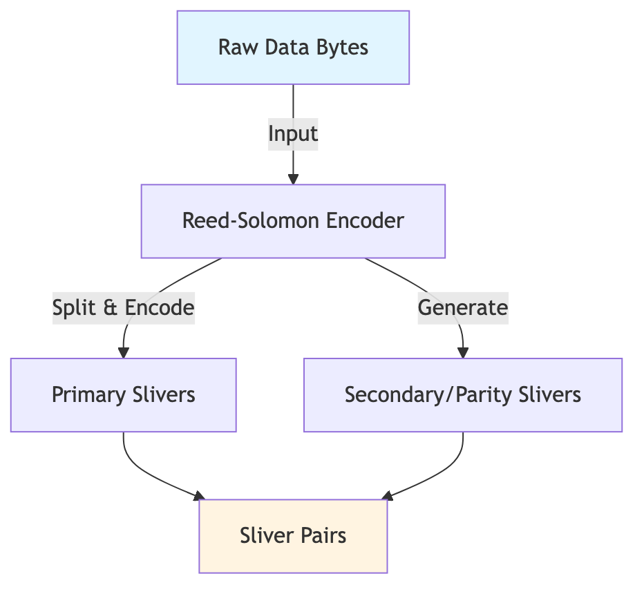
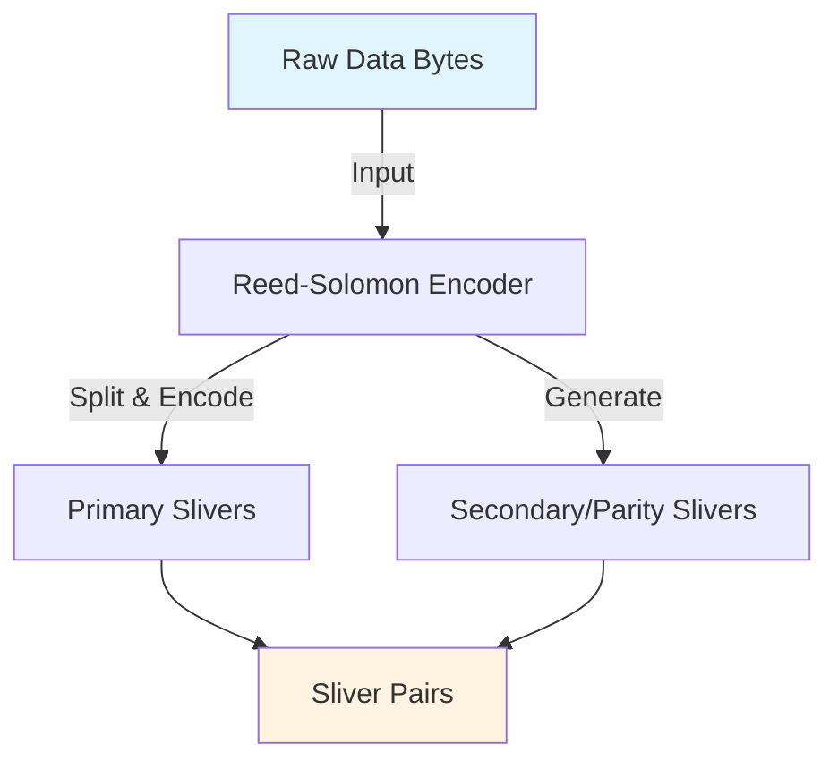
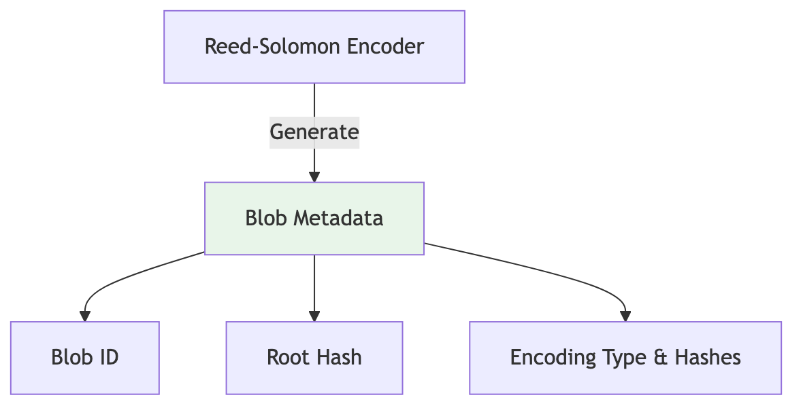
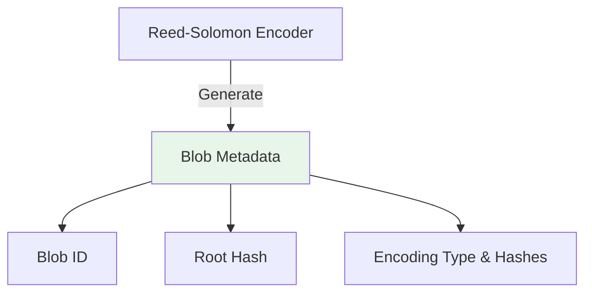
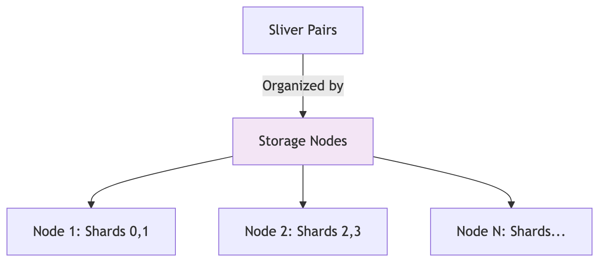
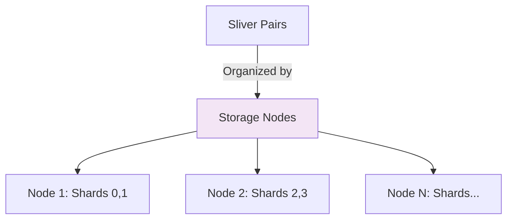

# 1. How the SDK Handles Chunk Creation

The Walrus SDK uses erasure coding to split data into chunks (called "slivers") that are distributed across multiple storage nodes. This process ensures data durability and availability even if some nodes fail.

## Encoding Process

When you upload data using the SDK, it goes through an encoding process that creates the chunks:

#### Step 1: Generate Slivers



<details>
<summary>Mermaid source (click to expand)</summary>



</details>

#### Step 2: Generate Blob Metadata



<details>
<summary>Mermaid source (click to expand)</summary>



</details>

#### Step 3: Organize by Storage Nodes



<details>
<summary>Mermaid source (click to expand)</summary>



</details>

### 1. Blob Encoding

When you are **not** using an upload relay (the client is writing directly to storage nodes), the SDK uses WebAssembly bindings to encode your data with Reed-Solomon (RS2). In this direct path the SDK:

- Takes your raw data bytes
- Splits them into primary slivers
- Generates secondary (parity) slivers for redundancy
- Creates metadata including hashes and encoding information

```typescript
// Direct-to-node path: writeBlob() calls encodeBlob() internally.
const { blobId, blobObject } = await client.walrus.writeBlob({
  blob: data,
  deletable: true,
  epochs: 3,
  signer: keypair,
});
```

> Note: when an upload relay is configured, `writeBlob()` only computes metadata locally and the relay performs the chunking. The rest of this section focuses on the no-relay path so you can see how chunk creation works under the hood.

### 2. Metadata Generation

During direct encoding, the SDK produces:

- **Blob ID**: Unique identifier for the encoded blob
- **Root hash**: Merkle root derived from the primary/secondary sliver hashes (returned alongside the metadata object, not inside it)
- **Metadata**: Encoding type plus per-sliver-pair hashes (primary + secondary) and the original byte length
- **Sliver pairs**: Serialized primary/secondary slivers grouped per shard

The metadata object that travels with the blob is the `BlobMetadataWithId` BCS struct defined in
[`packages/walrus/src/utils/bcs.ts`](https://github.com/MystenLabs/ts-sdks/blob/main/packages/walrus/src/utils/bcs.ts).
It is returned—as shown in
[`packages/walrus/src/wasm.ts`](https://github.com/MystenLabs/ts-sdks/blob/main/packages/walrus/src/wasm.ts)—by the
`encodeBlob()` binding that wraps `BlobEncoder::encode_with_metadata`:

```typescript
{
  blobId: string;
  metadata: {
    V1: {
      encoding_type: 'RS2';
      unencoded_length: number;
      hashes: Array<{
        primary_hash: { Digest: Uint8Array } | { Empty: null };
        secondary_hash: { Digest: Uint8Array } | { Empty: null };
      }>;
    };
  };
}
```

### 3. Sliver Distribution

After encoding, slivers are organized by storage node. Each node receives:

- A set of slivers based on its shard indices
- The blob metadata
- Information needed to verify the slivers

The SDK distributes slivers across nodes based on the committee structure, ensuring that:
- Each shard has data stored on multiple nodes
- The system can tolerate node failures
- Quorum requirements are met for certification

> Implementation reference: `ts-sdks/packages/walrus/src/client.ts` groups slivers per committee
> member inside `encodeBlob()` and later calls `writeEncodedBlobToNodes()` (which writes metadata
> and slivers to each node) when no relay is configured.

## Quilt Encoding

For multiple files, the SDK supports "Quilt" encoding, which batches multiple files into a single blob
before chunking. Use this when you want one blob ID (and certificate) to represent many logical files.

```typescript
const files = [
  WalrusFile.from({
    contents: new TextEncoder().encode('File 1 content'),
    identifier: 'file1',
    tags: { category: 'documents' },
  }),
  WalrusFile.from({
    contents: new TextEncoder().encode('File 2 content'),
    identifier: 'file2',
  }),
];

const flow = client.walrus.writeFilesFlow({ files });
await flow.encode();
```
_(Source: `WalrusFile.from` in
[`packages/walrus/src/files/file.ts`](https://github.com/MystenLabs/ts-sdks/blob/main/packages/walrus/src/files/file.ts)
and `writeFilesFlow()` in
[`packages/walrus/src/client.ts`](https://github.com/MystenLabs/ts-sdks/blob/main/packages/walrus/src/client.ts#L2209-L2404).)_

The Quilt encoding:
- Combines multiple files into a single encoded blob
- Maintains an index of file locations within the blob
- Preserves file identifiers and tags
- Allows efficient retrieval of individual files

### Quilt vs. non-quilt encoding

| Aspect | Standard `encodeBlob`<br />[`client.ts`](https://github.com/MystenLabs/ts-sdks/blob/main/packages/walrus/src/client.ts#L1684-L1727) | Quilt (`encodeQuilt` / `writeFilesFlow`)<br />[`client.ts`](https://github.com/MystenLabs/ts-sdks/blob/main/packages/walrus/src/client.ts#L2209-L2319), [`utils/quilts.ts`](https://github.com/MystenLabs/ts-sdks/blob/main/packages/walrus/src/utils/quilts.ts) |
| --- | --- | --- |
| Input | Single `Uint8Array` blob | Array of `WalrusFile` objects (contents + identifier + tags) |
| Pre-chunk step | None | Builds a quilt payload + index (`encodeQuilt`) |
| Metadata | `BlobMetadataWithId` from WASM binding | Same metadata format (encoding, hashes, length) |
| Additional artifacts | None | Quilt index describing each file's range and tags |
| Chunking | RS2 slivers produced once per blob | Quilt payload chunked via `encodeBlob` or relay |
| Retrieval | Read blob/quilt and interpret manually | `QuiltReader` / `writeFilesFlow` helpers |

In other words, quilts add a batching/indexing layer **before** the same RS2 chunk-creation pipeline.
The actual sliver generation and metadata are identical once the quilt payload is assembled.

## Implementation Details

The encoding is performed by WebAssembly bindings (`wasm.ts`):

```ts
export interface EncodedBlob {
  sliverPairs: SliverPair[];
  blobId: string;
  metadata: typeof BlobMetadataWithId.$inferInput;
  rootHash: Uint8Array;
}

export async function getWasmBindings(url?: string) {
  await init({ module_or_path: url });

  function encodeBlob(
    nShards: number,
    bytes: Uint8Array,
    encodingType: EncodingType = 'RS2',
  ): EncodedBlob {
    const encoder = new BlobEncoder(nShards);

    if (encodingType !== 'RS2') {
      throw new Error(`Unsupported encoding type: ${encodingType}`);
    }

    const [sliverPairs, metadata, rootHash] = encoder.encode_with_metadata(bytes);

    return {
      sliverPairs,
      blobId: blobIdFromBytes(new Uint8Array(metadata.blob_id)),
      metadata: metadata.metadata,
      rootHash: new Uint8Array(rootHash.Digest),
    };
  }
```

The number of shards (and thus the number of slivers) is determined by the current committee configuration, which the SDK fetches from the system state.

## Key Takeaways

- The SDK automatically handles chunk creation using erasure coding
- Chunks are distributed across multiple storage nodes for redundancy
- Metadata includes all information needed to verify and reconstruct the blob
- Quilt encoding allows efficient batching of multiple files
- The encoding process is transparent to the developer using the high-level API

## Next Lecture

Continue with [How the SDK Interacts with Publishers and Aggregators](./02-publisher-aggregator-interaction.md)
to follow the chunks from the client to the publisher/aggregator layer, covering node selection,
confirmation handling, and transaction flow.
