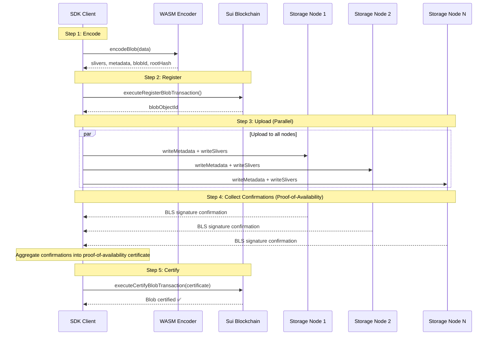
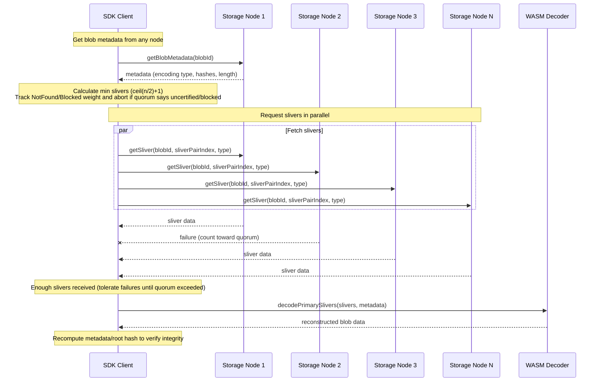

# 2. How the SDK Interacts with Publishers and Aggregators

The Walrus SDK interacts with the storage network through storage nodes, which act as both publishers (for writes) and aggregators (for reads). Understanding this interaction is crucial for building reliable applications.

## Storage Node Communication

### Direct Node Interaction

When uploading without a relay, the SDK directly communicates with storage nodes:

1. **Node Selection**: The SDK queries the system state to get the current committee of storage nodes
2. **Shard Distribution**: Each node is responsible for specific shards based on the committee structure
3. **Parallel Uploads**: The SDK uploads slivers to multiple nodes in parallel

```ts
    if (!this.#uploadRelayConfig) {
      const encoded = await this.encodeBlob(blob);
      const blobId = encoded.blobId;
      const { sliversByNode, metadata, rootHash } = encoded;

      const suiBlobObject = await this.executeRegisterBlobTransaction({
        signer,
        size: blob.length,
        epochs,
        blobId,
        rootHash,
        deletable,
        owner: owner ?? signer.toSuiAddress(),
        attributes,
      });

      const blobObjectId = suiBlobObject.blob.id.id;

      const confirmations = await this.writeEncodedBlobToNodes({
        blobId,
        metadata,
        sliversByNode,
        deletable,
        objectId: blobObjectId,
        signal,
      });

      await this.executeCertifyBlobTransaction({
        signer,
        blobId,
        blobObjectId,
        confirmations,
        deletable,
      });
```

### Upload Flow Steps

1. **Encode**: Create slivers and metadata from the blob
2. **Register**: Create an on-chain blob object via a Sui transaction
3. **Upload**: Send slivers and metadata to storage nodes
4. **Collect Confirmations / Proof of Availability**: Gather storage confirmations from nodes. Each
   BLS signature proves that the node is actively storing its shard, and the SDK aggregates these
   signatures into a proof-of-availability certificate.
5. **Certify**: Submit a certification transaction with the confirmations (or aggregated certificate)



## Storage Node API

The SDK uses the `StorageNodeClient` (via helpers on `WalrusClient`) to communicate with nodes. The
relevant methods are:

- **`writeMetadataToNode()`** – sends blob metadata to a specific node so it can verify and persist
  hashes ([`packages/walrus/src/client.ts`](https://github.com/MystenLabs/ts-sdks/blob/main/packages/walrus/src/client.ts)).
- **`writeSliversToNode()`** – streams the primary/secondary slivers for that node's shard set
  ([`client.ts`](https://github.com/MystenLabs/ts-sdks/blob/main/packages/walrus/src/client.ts)).
- **`getStorageConfirmationFromNode()`** – fetches the node's BLS confirmation once metadata and
  slivers are stored ([`client.ts`](https://github.com/MystenLabs/ts-sdks/blob/main/packages/walrus/src/client.ts)).
- **`getSliver()`** / **`getSlivers()`** – downloads slivers for reconstruction, implemented on top of
  `StorageNodeClient`
  ([`packages/walrus/src/storage-node/client.ts`](https://github.com/MystenLabs/ts-sdks/blob/main/packages/walrus/src/storage-node/client.ts)).

### Confirmation Handling

Storage nodes provide confirmations that prove they've stored the data:

- Each node signs a protocol message with its BLS key
- The SDK collects confirmations from multiple nodes
- A quorum of confirmations is required for certification
- Confirmations are aggregated into a certificate for on-chain certification

```ts
const confirmations = await Promise.all(
  sliversByNode.map((slivers, nodeIndex) => {
    return this.writeEncodedBlobToNode({
      blobId,
      nodeIndex,
      metadata,
      slivers,
      signal: signal ? AbortSignal.any([controller.signal, signal]) : controller.signal,
      ...options,
    }).catch(() => {
      failures += committee.nodes[nodeIndex].shardIndices.length;

      if (isAboveValidity(failures, systemState.committee.n_shards)) {
        const error = new NotEnoughBlobConfirmationsError(
          `Too many failures while writing blob ${blobId} to nodes`,
        );
        controller.abort(error);
        throw error;
      }

      return null;
    });
  }),
);
```

## Failure Handling

The SDK handles node failures gracefully:

- Uploads to nodes happen in parallel
- Some node failures are tolerated (up to the validity threshold)
- If too many nodes fail, the upload fails with `NotEnoughBlobConfirmationsError`
- The SDK aborts remaining operations when failure threshold is exceeded

```ts
  async writeEncodedBlobToNodes({
    blobId,
    metadata,
    sliversByNode,
    signal,
    ...options
  }: WriteEncodedBlobToNodesOptions) {
    const systemState = await this.systemState();
    const committee = await this.#getActiveCommittee();

    const controller = new AbortController();
    let failures = 0;

    const confirmations = await Promise.all(
      sliversByNode.map((slivers, nodeIndex) => {
        return this.writeEncodedBlobToNode({
          blobId,
          nodeIndex,
          metadata,
          slivers,
          signal: signal ? AbortSignal.any([controller.signal, signal]) : controller.signal,
          ...options,
        }).catch(() => {
          failures += committee.nodes[nodeIndex].shardIndices.length;

          if (isAboveValidity(failures, systemState.committee.n_shards)) {
            const error = new NotEnoughBlobConfirmationsError(
              `Too many failures while writing blob ${blobId} to nodes`,
            );
            controller.abort(error);
            throw error;
          }

          return null;
        });
      }),
    );

    return confirmations;
  }
```

## Reading from Nodes

When reading blobs, the SDK:

1. **Queries Multiple Nodes**: Requests slivers from multiple nodes in parallel
2. **Tolerates Failures**: Can reconstruct the blob even if some nodes fail
3. **Verifies Data**: Uses the root hash and metadata to verify integrity
4. **Decodes**: Reconstructs the original blob from slivers

> Threshold math: `getSlivers()` calculates `minSymbols = Math.ceil(numShards / 2) + 1`, which is the
> minimum number of unique sliver pairs required to decode RS2 blobs. Separately, it tracks
> `isQuorum()` for `NotFound`/`LegallyUnavailable` responses—if those errors exceed quorum weight, the
> client aborts early because the blob is either uncertified or legally blocked.



```ts
  async getSlivers({ blobId, signal }: GetSliversOptions) {
    // Look up the read committee (nodes + shard mapping) and current blob metadata.
    const committee = await this.#getReadCommittee({ blobId, signal });
    const { metadata } = await this.getBlobMetadata({ blobId, signal });
    const numShards = committee.nodes.reduce(
      (sum, node) => sum + node.shardIndices.length,
      0,
    );

    // Build the list of sliver pair indices and compute the RS2 quorum threshold.
    const sliverPairIndices = Array.from({ length: numShards }, (_, i) => i);
    const minSymbols = Math.ceil(numShards / 2) + 1;

    // Chunk work across nodes to keep requests balanced.
    const chunkedSliverPairIndices = chunkArray(sliverPairIndices, committee.nodes.length);

    // Track retrieved slivers as well as failure counts for quorum logic.
    const slivers: GetSliverResponse[] = [];
    const failedNodes = new Set<string>();
    let totalErrorCount = 0;
    let numNotFoundWeight = 0;
    let numBlockedWeight = 0;

    const controller = new AbortController();

    return new Promise<GetSliverResponse[]>((resolve, reject) => {
      chunkedSliverPairIndices[0].forEach(async (_, colIndex) => {
        for (let rowIndex = 0; rowIndex < chunkedSliverPairIndices.length; rowIndex += 1) {
          const sliverPairIndex = chunkedSliverPairIndices[rowIndex][colIndex];
          if (sliverPairIndex === undefined) {
            continue;
          }

          const node = committee.nodes[rowIndex];
          const url = node.networkUrl;

          if (failedNodes.has(url)) {
            continue;
          }

          try {
            const sliver = await this.#storageNodeClient.getSliver({
              blobId,
              sliverPairIndex,
              nodeUrl: url,
              signal: signal ? AbortSignal.any([controller.signal, signal]) : controller.signal,
            });

            slivers.push(sliver);

            // Stop once we have enough symbols to decode.
            if (slivers.length >= minSymbols) {
              controller.abort();
              resolve(slivers);
              return;
            }
          } catch (error) {
            if (error instanceof NotFoundError) {
              numNotFoundWeight += 1;
            } else if (error instanceof LegallyUnavailableError) {
              numBlockedWeight += 1;
            } else if (error instanceof UserAbortError) {
              reject(error);
              return;
            }

            if (isQuorum(numBlockedWeight + numNotFoundWeight, numShards)) {
              const abortError =
                numNotFoundWeight > numBlockedWeight
                  ? new BlobNotCertifiedError(`The specified blob ${blobId} is not certified.`)
                  : new BlobBlockedError(`The specified blob ${blobId} is blocked.`);

              controller.abort(abortError);
              reject(abortError);
              return;
            }

            failedNodes.add(url);
            totalErrorCount += 1;

            const remainingTasks = sliverPairIndices.length - (slivers.length + totalErrorCount);
            const tooManyFailures = slivers.length + remainingTasks < minSymbols;

            if (tooManyFailures) {
              const abortError = new NotEnoughSliversReceivedError(
                `Unable to retrieve enough slivers to decode blob ${blobId}.`,
              );
              controller.abort(abortError);
              reject(abortError);
            }
          }
        }
      });
    });
  }
```
_(Source:
[`packages/walrus/src/client.ts#getSlivers`](https://github.com/MystenLabs/ts-sdks/blob/main/packages/walrus/src/client.ts#L495-L589))_

### Storage Node Error Types

During reads, the SDK surfaces specific `StorageNodeClient` errors (see
[`packages/walrus/src/storage-node/error.ts`](https://github.com/MystenLabs/ts-sdks/blob/main/packages/walrus/src/storage-node/error.ts)):

- **`NotFoundError`** – the node does not have the blob/sliver (often means the blob is not yet
  certified or has expired).
- **`LegallyUnavailableError`** – the node refuses to serve the blob due to compliance/blocking.
- **`UserAbortError`** – the caller’s `AbortSignal` cancelled the request; the SDK stops retrying and
  bubbles the cancellation immediately.

Understanding these codes helps determine whether to retry, surface a “blocked” message, or abort the
operation.

## Key Takeaways

- The SDK communicates directly with storage nodes when not using a relay
- Uploads and reads happen in parallel across multiple nodes
- The system tolerates some node failures through erasure coding
- Confirmations from nodes are required for blob certification
- The SDK automatically handles node selection and shard distribution

## Next Lecture

Continue with [What the Relay Does for Batching and Reliability](./03-relay-batching-reliability.md) to
see how the upload relay automates batching, retries, and certificate generation on your behalf.

