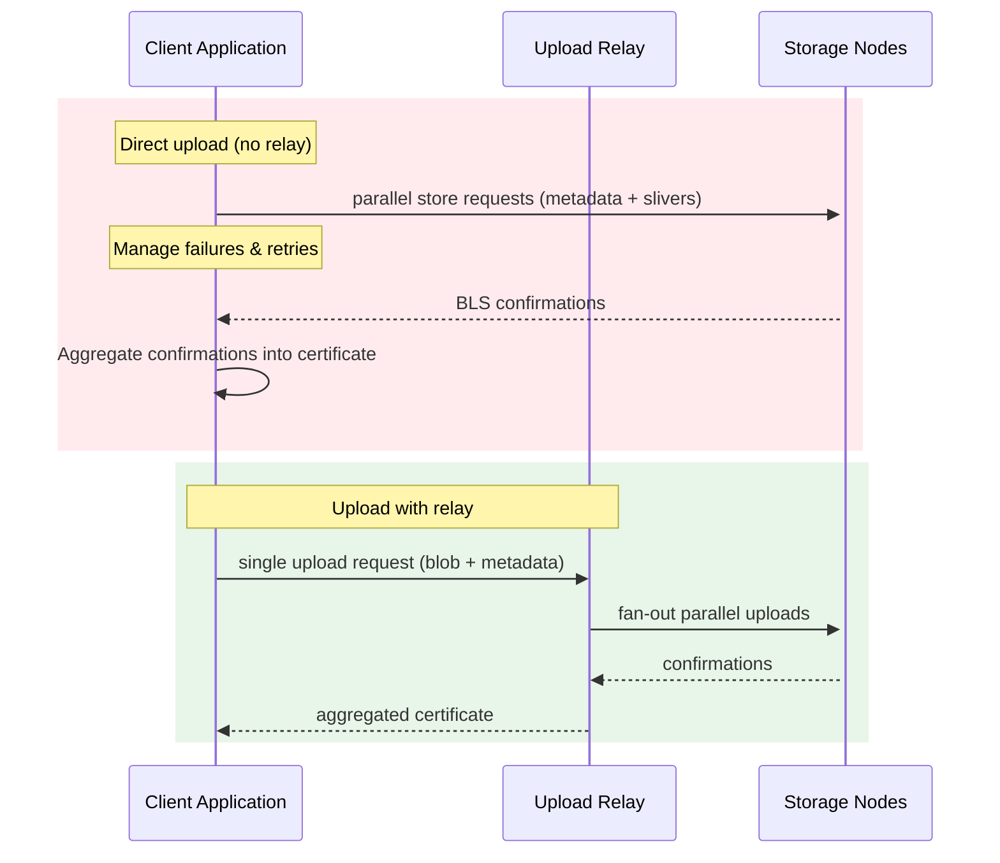

# 3. What the Relay Does for Batching and Reliability

The upload relay is a server-side service that simplifies the upload process by handling the complexity of writing to multiple storage nodes. It provides batching capabilities and improved reliability for client applications.

## Relay Architecture

The upload relay acts as an intermediary between your application and the storage nodes:



Instead of your application making many requests to different storage nodes, you make a single request to the relay, which handles the rest.

## Batching Benefits

### Single Request Instead of Many

Without a relay, uploading a blob requires:
- One request per storage node (potentially 10+ requests)
- Managing parallel uploads
- Handling partial failures
- Collecting confirmations from multiple nodes

With a relay, you make:
- **One request** to the relay
- The relay handles all node communications
- The relay returns a single certificate

```ts
        } else {
            // When a relay is configured, we only compute metadata locally and stream the blob to the relay.
            const metadata = await this.computeBlobMetadata({
                bytes: blob,
            });
            const blobId = metadata.blobId;

            // Register the blob on-chain (same as direct uploads) but include the relay tip payment.
            const transaction = new Transaction();

            transaction.add(
                this.sendUploadRelayTip({
                    size: blob.length,
                    blobDigest: metadata.blobDigest,
                    nonce: metadata.nonce,
                }),
            );

            const registerResult = await this.executeRegisterBlobTransaction({
                signer,
                transaction,
                size: blob.length,
                epochs,
                blobId: metadata.blobId,
                rootHash: metadata.rootHash,
                deletable,
                owner: owner ?? signer.toSuiAddress(),
                attributes,
            });

            await this.#suiClient.core.waitForTransaction({
                digest: registerResult.digest,
            });

            // Send a single request to the upload relay; it fans out to nodes and returns a certificate.
            const result = await this.writeBlobToUploadRelay({
                blobId,
                blob,
                nonce: metadata.nonce,
                txDigest: registerResult.digest,
                signal,
                deletable,
                blobObjectId: registerResult.blob.id.id,
                encodingType: metadata.metadata.encodingType as EncodingType,
            });

            const certificate = result.certificate;
            const blobObjectId = registerResult.blob.id.id;

            // Use the relay-provided certificate to finalize on-chain certification.
            await this.executeCertifyBlobTransaction({
                signer,
                blobId,
                blobObjectId,
                certificate,
                deletable,
            });

            return {
                blobId,
                blobObject: await this.#objectLoader.load(blobObjectId, Blob),
            };
        }
```
_(Source:
[`packages/walrus/src/client.ts#L1930-L1987`](https://github.com/MystenLabs/ts-sdks/blob/main/packages/walrus/src/client.ts#L1930-L1987))_

## Reliability Features

### Automatic Retry Logic

The relay implements server-side retry logic:

- **Network Failures**: Automatically retries failed node connections
- **Timeout Handling**: Manages timeouts for slow nodes
- **Quorum Management**: Ensures enough nodes have stored the data
- **Error Recovery**: Handles transient errors without client intervention

These behaviors come directly from the relay controller (`send_blob_data_and_get_certificate()` in
`crates/walrus-upload-relay/src/controller.rs`) and the underlying SDK uploader
(`writeEncodedBlobToNodes()` plus `get_certificate_standalone()` in
`ts-sdks/packages/walrus/src/client.ts`), which handle per-node retries, quorum tracking, and retry
scheduling on the relay’s behalf.

When the relay receives a blob, it reuses the same uploader that the SDK client uses for direct
uploads—`send_blob_data_and_get_certificate()`—so the server inherits all quorum tracking and retry
behavior:

```rs
        let confirmation_certificate: ConfirmationCertificate = self
            .client
            .send_blob_data_and_get_certificate(
                &metadata,
                Arc::new(sliver_pairs),
                &blob_persistence,
                None,
                TailHandling::Blocking,
                None,
                None,
            )
            .await?;
```
_(Source:
[`crates/walrus-upload-relay/src/controller.rs#L205-L225`](https://github.com/MystenLabs/walrus/blob/main/crates/walrus-upload-relay/src/controller.rs#L205-L225))_

Within that helper, the SDK concurrently writes to each node, counts failures by shard weight, and
keeps retrying until quorum is satisfied (or aborts with `NotEnoughBlobConfirmationsError` if it
cannot reach quorum):

```ts
        const confirmations = await Promise.all(
            sliversByNode.map((slivers, nodeIndex) => {
                return this.writeEncodedBlobToNode({
                    blobId,
                    nodeIndex,
                    metadata,
                    slivers,
                    signal: signal ? AbortSignal.any([controller.signal, signal]) : controller.signal,
                    ...options,
                }).catch(() => {
                    failures += committee.nodes[nodeIndex].shardIndices.length;

                    if (isAboveValidity(failures, systemState.committee.n_shards)) {
                        const error = new NotEnoughBlobConfirmationsError(
                            `Too many failures while writing blob ${blobId} to nodes`,
                        );
                        controller.abort(error);
                        throw error;
                    }

                    return null;
                });
            }),
        );
```
_(Source:
[`packages/walrus/src/client.ts#L1778-L1816`](https://github.com/MystenLabs/ts-sdks/blob/main/packages/walrus/src/client.ts#L1778-L1816))_

```ts
        self.get_certificate_standalone(
            metadata.blob_id(),
            committees.write_committee().epoch,
            blob_persistence_type,
        )
        .await
    }
```
_(Source:
[`packages/walrus/src/client.ts#L1801-L1807`](https://github.com/MystenLabs/ts-sdks/blob/main/packages/walrus/src/client.ts#L1801-L1807))_

### Certificate Generation

The relay collects confirmations from storage nodes and generates a certificate:

```ts
    async writeBlob({
        blobId,
        nonce,
        txDigest,
        blob,
        deletable,
        blobObjectId,
        requiresTip,
        encodingType,
        ...options
    }: WriteBlobToUploadRelayOptions): Promise<{
        blobId: string;
        certificate: ProtocolMessageCertificate;
    }> {
        const query = new URLSearchParams({
            blob_id: blobId,
        });

        if (requiresTip) {
            query.set('nonce', urlSafeBase64(nonce));
            query.set('tx_id', txDigest);
        }

        if (deletable) {
            query.set('deletable_blob_object', blobObjectId);
        }

        if (encodingType) {
            query.set('encoding_type', encodingType);
        }

        const response = await this.#request({
            method: 'POST',
            path: `/v1/blob-upload-relay?${query.toString()}`,
            body: blob as Uint8Array<ArrayBuffer>,
            ...options,
        });

        const data: {
            blob_id: number[];
            confirmation_certificate: {
                signers: number[];
                serialized_message: number[];
                signature: string;
            };
        } = await response.json();

        return {
            blobId,
            certificate: {
                signers: data.confirmation_certificate.signers,
                serializedMessage: new Uint8Array(
                    data.confirmation_certificate.serialized_message,
                ),
                signature: fromUrlSafeBase64(data.confirmation_certificate.signature),
            },
        };
    }
```

The certificate includes:
- **Signers**: Indices of nodes that confirmed storage
- **Serialized Message**: The protocol message that was signed
- **Signature**: Aggregated BLS signature from the confirming nodes

This certificate can be used directly in the certification transaction, eliminating the need to collect individual confirmations.

## Network Optimization

### Reduced Client Load

- **Fewer Connections**: One connection instead of many
- **Lower Bandwidth**: Relay can optimize data transfer
- **Better Error Handling**: Server-side expertise in handling network issues

### Server-Side Benefits

- **Persistent Connections**: Relay maintains connections to storage nodes
- **Connection Pooling**: Reuses connections for efficiency
- **Geographic Optimization**: Can route requests to nearby nodes
- **Load Balancing**: Distributes load across multiple relay instances

## Tip Mechanism

Upload relays may require a tip to cover their operational costs:

```ts
    async tipConfig(): Promise<UploadRelayTipConfig | null> {
        const response = await this.#request({
            method: 'GET',
            path: '/v1/tip-config',
        });

        const data: {
            tip_config: {
                tip_type: 'const' | 'linear';
                tip_value?: number;
                base_tip?: number;
                per_byte_tip?: number;
            } | null;
        } = await response.json();

        if (!data.tip_config) {
            return null;
        }

        const { tip_type, tip_value, base_tip, per_byte_tip } = data.tip_config;

        if (tip_type === 'const') {
            return {
                type: 'const',
                value: tip_value!,
            };
        }

        return {
            type: 'linear',
            base: base_tip!,
            perByte: per_byte_tip!,
        };
    }
```

The SDK can automatically:
- Query the tip configuration
- Calculate the required tip based on blob size
- Include the tip in the registration transaction

## Key Takeaways

- The relay simplifies uploads by handling multi-node communication
- A single request replaces many node requests
- Server-side retry logic improves reliability
- Certificate generation eliminates the need to collect confirmations
- Tips may be required to cover relay operational costs
- The relay optimizes network usage and connection management

## Next Lecture

In the following chapters we will see concrete scenarios and decision criteria for when to choose the relay path or direct uploads.

Continue with [When to Use Relay](./04-when-to-use-relay.md).

