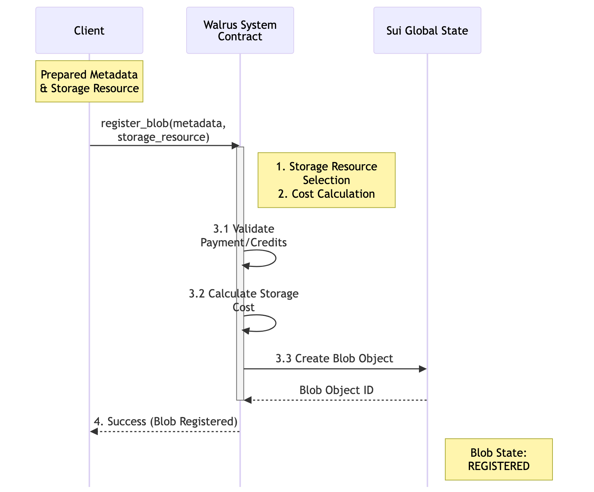
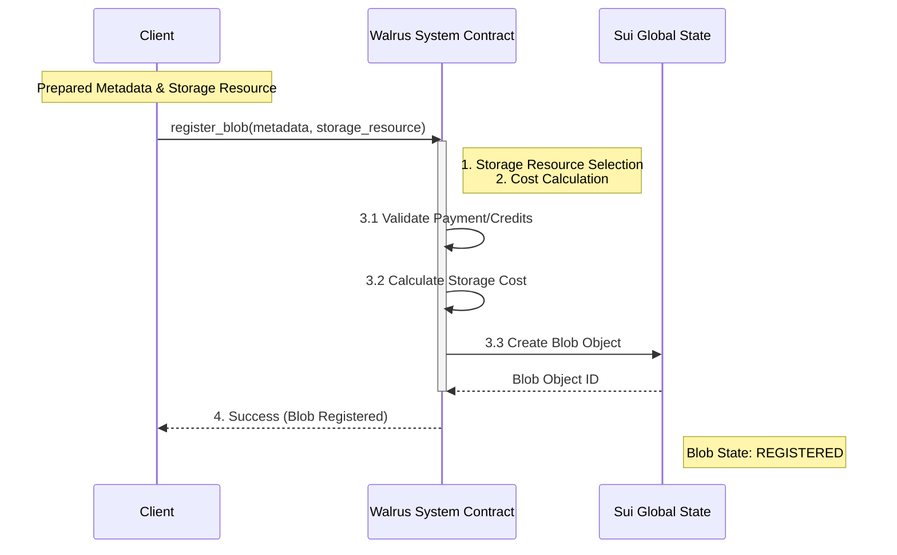

# 2. Submission (Registration)

Once the blob is encoded locally into slivers, the next step is to **register** the blob on the Sui network. This step is crucial for reserving storage space and initiating the lifecycle of the blob on-chain.

## Registration Overview

Registration is an on-chain transaction that:

1.  **Reserves Storage**: Allocates space in the storage nodes' accounting systems.
2.  **Pays WAL**: Transfers the required amount of WAL tokens to the system to pay for storage for the specified duration (epochs).
    -   *Note*: These tokens are held by the system and distributed to storage nodes as rewards in future epochs.
3.  **Creates Blob Object**: Creates a `Blob` object on Sui with the status `Registered`.

### Visualizing Registration

Mermaid source (click to expand)

## Detailed Submission Process

The registration process involves two key on-chain actions (often batched into one transaction):

1.  **Reserve Space (Purchase Storage)**:
    -   The client pays **WAL tokens** to purchase storage space for a specific size and duration (epochs).
    -   **Output**: A `StorageResource` object (or an updated shared resource) that acts as "proof of purchase."

2.  **Register Blob**:
    -   The client uses the `StorageResource` to register the new blob's metadata on-chain.
    -   The `StorageResource` is consumed (or its capacity reduced) to back the new blob.

3.  **Transaction Construction (PTB)**:
    -   The Walrus SDK builds a Programmable Transaction Block (PTB) that:
        -   Selects or merges WAL coins.
        -   Calls `reserve_space` to buy the storage resource.
        -   Calls `register_blob` using that resource and the blob metadata.

4.  **Execution & Effect**:
    -   The transaction is signed and sent to Sui.
    -   Upon success, a new **`Blob` object** is created on-chain.
    -   The status of this object is `Registered`. It is *not yet* certified or available for download.

## The `register_blob` Transaction

The Walrus SDK constructs a Move call to the `register_blob` function in the Walrus system smart contract.

### SDK Implementation

In `ts-sdks/packages/walrus/src/client.ts`, the `registerBlob` method handles this interaction.

> **📖 Source Reference**: [`WalrusClient.registerBlob()` (line ~899)](https://github.com/MystenLabs/ts-sdks/blob/main/packages/walrus/src/client.ts#L899) — This method constructs a Sui transaction that:
> - Calculates the storage cost based on size and epochs
> - Creates or uses an existing storage resource via `createStorage()`
> - Converts the blob ID to an integer and parses the root hash
> - Adds the `registerBlob` Move call to the transaction with the appropriate WAL payment

### Transaction Arguments

The `register_blob` Move function requires:
-   **Storage Resource**: The object proving you have reserved enough space.
-   **Blob ID**: The ID generated during the encoding phase.
-   **Root Hash**: To verify integrity.
-   **Size**: Unencoded size of the file.
-   **Encoding Type**: e.g., Red Stuff (RS).
-   **Persistence**: Whether the blob is deletable (boolean).
    *(Note: The storage duration is determined by the Storage Resource, not passed here explicitly.)*

## Log Tracing

### TypeScript SDK
The TypeScript SDK does not emit debug logs by default. To trace this step:

-   **Application Logs**: Add your own logging before calling `client.registerBlob` or `executeRegisterBlobTransaction`.
-   **Network Activity**: Monitor for a Sui transaction execution.
-   **Success**: The promise resolves with the created `Blob` object.

### Rust SDK / CLI
If using the Rust SDK or CLI (source in `crates/walrus-sui`), look for:
-   `starting to register blobs` — registration begins
-   `registering blobs` — processing registration
-   `finished registering blobs` — registration complete (with duration)

At this stage, the blob exists on Sui as a `Blob` object, but the actual data (slivers) has not yet been sent to the storage nodes. The blob is in a "Registered" state, waiting for proof of storage.

> 💡 **Docker Tip:** Use `make grep-logs` after running `make trace-lifecycle` to find these patterns automatically.

## Key Takeaways

- **Administrative Transaction**: Registration is a Sui transaction that establishes the blob's existence on-chain but does not transfer data.
- **Resource Reservation**: Storage space is reserved and paid for (transferring WAL to system) during this step.
- **State Initialization**: A `Blob` object is created with a `Registered` status, signaling the network to expect data.
- **Metadata Commitment**: The blob's metadata (ID, root hash, size) is committed to the blockchain, preventing future modification.

