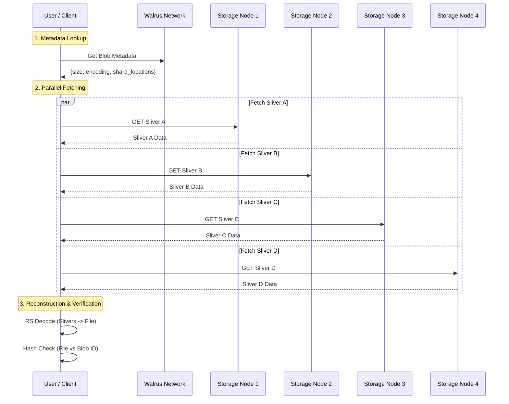

# 6. Retrieval Flow

Retrieving a blob involves reversing the upload process: fetching enough slivers to reconstruct the original data using Erasure Coding.

## The Read Process

1.  **Check Status**: The client first checks the blob's status on Sui or via storage nodes to ensure it is valid and certified.
2.  **Fetch Slivers**: The client requests slivers from a subset of storage nodes. It only needs `k` (source symbols) amount of data to reconstruct, but may request more to ensure low latency.
3.  **Reconstruction**: The client decodes the slivers back into the original file.

> **Note**: The value of `k` (minimum slivers needed) is network-specific, computed as $k_{primary} = n - 2f$ where $n$ is the shard count and $f = \lfloor(n-1)/3\rfloor$. For example, on a 1000-shard network, $k = 334$ primary slivers are needed for reconstruction.

### Visualizing Retrieval

Mermaid source (click to expand)

## Detailed Retrieval Process

The read path is designed for speed and resilience.

1.  **Metadata Lookup**:
    -   The client queries a node or the Sui blockchain to get the blob's metadata (size, encoding parameters).
    -   This determines `k` (how many symbols are needed).

2.  **Parallel Fetching**:
    -   The client identifies which nodes hold the slivers.
    -   It sends asynchronous GET requests to multiple nodes simultaneously.
    -   **Optimization**: It often requests *more* than the minimum `k` slivers (e.g., `k + epsilon`) to avoid tail latency. The first `k` valid responses are used.

3.  **Incremental Decoding (Optional)**:
    -   If the file is large, the client might fetch and decode it in streams rather than waiting for the whole file.

4.  **Reconstruction (RS Decoding)**:
    -   The received slivers are fed into the **Reed-Solomon Decoder**.
    -   The decoder mathematically reconstructs the missing parts of the matrix to reproduce the original source symbols.

5.  **Integrity Verification**:
    -   The reconstructed content is hashed.
    -   The hash is compared against the **Blob ID**.
    -   If they match, the file is valid. If not, the client may retry with different slivers or report corruption (though the RS coding makes corruption extremely unlikely if the ID matches).

### SDK Implementation

The `readBlob` function in `ts-sdks/packages/walrus/src/client.ts` handles this.

> **📖 Source Reference**: [`WalrusClient.readBlob()` (line ~327)](https://github.com/MystenLabs/ts-sdks/blob/main/packages/walrus/src/client.ts#L327) — This method performs the full retrieval flow:
> 1. **Metadata Lookup**: Calls `getBlobMetadata()` to retrieve the blob's encoding parameters
> 2. **Fetch Slivers**: Calls `getSlivers()` to fetch the required slivers from storage nodes in parallel
> 3. **Reconstruction**: Uses WASM bindings `decodePrimarySlivers()` to perform Reed-Solomon decoding
> 4. **Integrity Check**: Recomputes the blob metadata using `computeMetadata()` and verifies the blob ID matches; throws `InconsistentBlobError` if verification fails

## Aggregator

In many cases, an **Aggregator** service is used to handle retrieval for light clients (like browsers). The aggregator acts as a proxy, performing the fetch and reconstruction, and streaming the raw file back to the user.

## Log Tracing

### TypeScript SDK
The TypeScript SDK does not emit debug logs by default. To trace this step:

-   **Application Logs**: Add your own logging before calling `client.readBlob`.
-   **Network Activity**: Monitor for parallel GET requests to storage nodes.
-   **Success**: The promise resolves with the file bytes (`Uint8Array`).

### Rust SDK / CLI
If using the Rust SDK or CLI with debug logging enabled, look for:
-   `starting to read blob` — retrieval begins
-   `starting to retrieve slivers` — fetching slivers from nodes
-   `retrieving sliver failed` (debug level, if errors occur)

> 💡 **Note:** The Docker setup in `../docker/` is focused on upload tracing. For retrieval, use `walrus read <blob_id>` with `RUST_LOG=debug` enabled.

## Integrity Check

During retrieval, the client verifies:
1.  **Sliver Integrity**: Each sliver matches its hash in the metadata.
2.  **Blob Integrity**: The reconstructed blob matches the Blob ID (hash).

This ensures that the retrieved data is authentic and uncorrupted.

## Key Takeaways

- **Efficiency**: Retrieval only requires a subset (`k`) of slivers to reconstruct the full file.
- **Parallel Fetching**: Clients query multiple nodes simultaneously to minimize latency and handle slow nodes.
- **Client-Side Reconstruction**: The heavy lifting of decoding happens on the client (or aggregator), not the storage nodes.
- **Integrity Verified**: Every retrieval is cryptographically verified against the Blob ID to prevent corruption.

