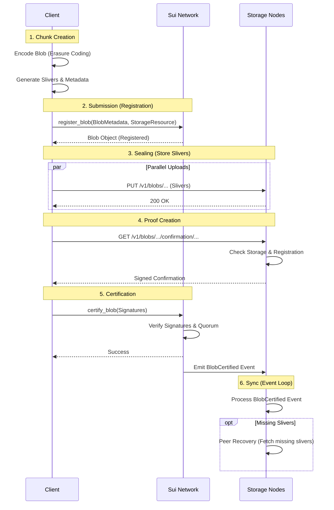

# 7. Full Lifecycle Diagram

This diagram visualizes the complete flow of a blob upload transaction in Walrus, from the client's local machine to the final certification on the Sui network.

## Execution Flow Summary

1.  **Chunk Creation**: The client prepares the data locally by encoding it into redundancy shards (slivers) and computing the Merkle root.
2.  **Registration**: The client submits a transaction to Sui to reserve storage space (paying WAL tokens). A `Blob` object is created in the `Registered` state.
3.  **Sealing**: The client pushes the slivers to the designated storage nodes via parallel HTTP requests. Nodes validate and store the data.
4.  **Proof Creation**: The client asks the nodes to sign a confirmation. Nodes check their DB and local chain state before signing.
5.  **Certification**: The client submits the collected signatures to Sui. The smart contract validates the quorum, updates the `Blob` status to `Certified`, and emits an event.
6.  **Event Loop**: Storage nodes observe the certification event. Nodes that missed the data during the upload phase will now automatically fetch it from their peers to ensure system-wide consistency.

## Key Takeaways

- **Multi-Stage Process**: The lifecycle moves from local encoding -> on-chain registration -> off-chain storage -> on-chain certification.
- **State Transitions**: The `Blob` object state (`Registered` -> `Certified`) tracks the progress of the upload.
- **Role Separation**: Clients drive the process, Sui handles coordination/payment, and Storage Nodes handle data persistence.
- **Self-Healing**: The certification event triggers automatic peer recovery for any nodes that missed the initial upload.

