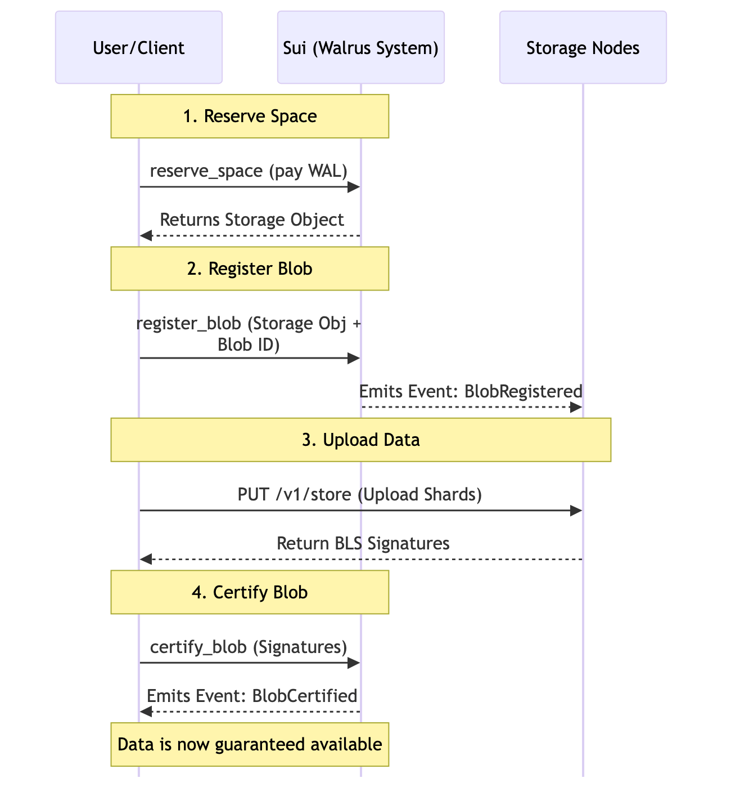
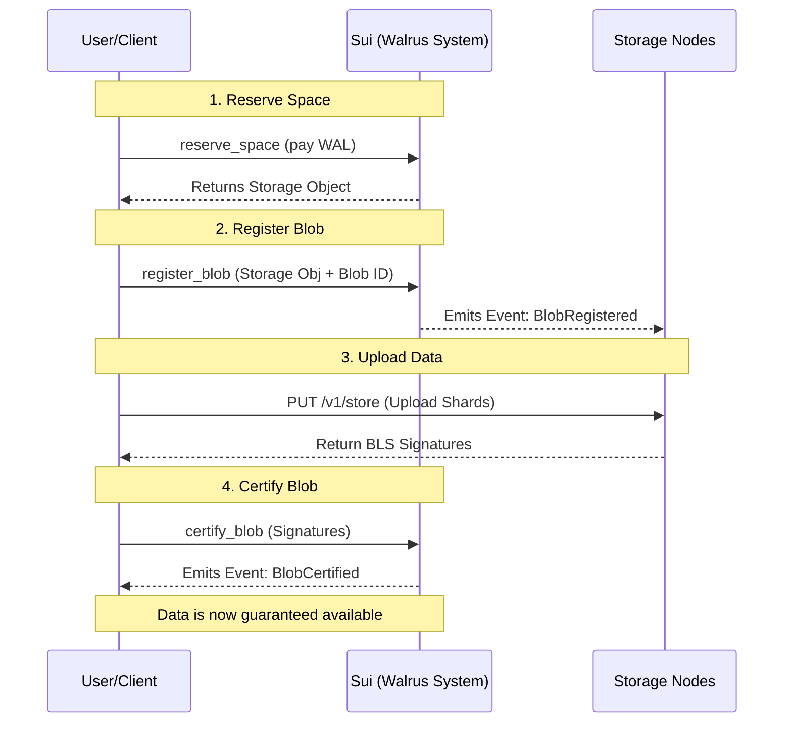

# Upload Transactions

Uploading data to Walrus is not a single atomic transaction but a multi-step process involving both on-chain Sui transactions and off-chain data transfer to Storage Nodes.

## The Upload Lifecycle

A standard upload involves three main on-chain interactions and one off-chain phase:



<details>
<summary>Mermaid source (click to expand)</summary>



</details>

1.  **Reserve Space**
2.  **Register Blob**
3.  **Upload Data**
4.  **Certify Blob**

### 1. Reserve Space
Before a blob can be registered, you must secure storage capacity on the network. This is done by acquiring a `Storage` resource.
*   **Action**: Buy storage from the system or use an existing `Storage` object.
*   **Cost**: Paid in **WAL**.
*   **Outcome**: A `Storage` object representing space for a specific size and duration (start epoch to end epoch).

### 2. Register Blob
Once you have a `Storage` resource, you register the blob you intend to store.
*   **Function**: `walrus::system::register_blob`
*   **Inputs**:
    *   `Storage` object.
    *   `blob_id`: The unique ID of the blob (derived from content).
    *   `root_hash`: Merkle root of the encoded blob.
    *   `size`: Unencoded size.
*   **Outcome**: A `Blob` object is created in a "registered" state. The system emits a `BlobRegistered` event, signaling Storage Nodes to accept shards for this Blob ID.

### 3. Upload Data
The client encodes the file into shards and uploads them to the Storage Nodes.
*   **Action**: HTTP PUT requests to Storage Nodes.
*   **Validation**: Storage Nodes verify the data against the `BlobRegistered` event parameters.

### 4. Certify Blob
After a quorum of Storage Nodes have received and stored the shards, they sign a promise of availability. The client collects these signatures to certify the blob on-chain.
*   **Function**: `walrus::system::certify_blob`
*   **Inputs**:
    *   `Blob` object (mutable reference).
    *   `signature`: Aggregated BLS signature from Storage Nodes.
    *   `signers_bitmap`: Bitmap indicating which nodes signed.
*   **Outcome**: The `Blob` object transitions to a "certified" state. A `BlobCertified` event is emitted. The data is now guaranteed to be available until the `Storage` resource expires.

## Optimization
Clients (like the Walrus CLI/SDK) often bundle `reserve_space` and `register_blob` into a single Programmable Transaction Block (PTB) to reduce latency and gas costs.

## Code Example

### Walrus SDK (TypeScript)

The `writeBlob` method handles the entire flow (reservation, registration, upload, certification) for you.

See [`upload.ts`](../src/examples/upload.ts) for the full example.

### Walrus CLI

```bash
# Store a file for 5 epochs
walrus store ./my-file.txt --epochs 5

# Output will show the Blob ID and the Sui Object ID
```

## Key Takeaways

- Upload is a four-step flow: reserve → register → off-chain upload → certify.
- Data bytes stay off-chain with storage nodes; on-chain holds commitments, events, and costs.
- Registration tells nodes to expect shards; certification with quorum signatures guarantees availability until `end_epoch`.
- Storage size is based on encoded size; under-sizing will fail certification.
- Bundle `reserve_space` + `register_blob` in one PTB to cut latency and gas.

## Next Steps

Proceed to [Extension Transactions](./02-extension.md) to learn how to keep blobs alive past their initial expiry.