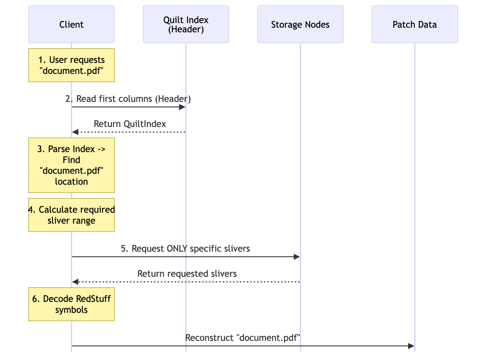
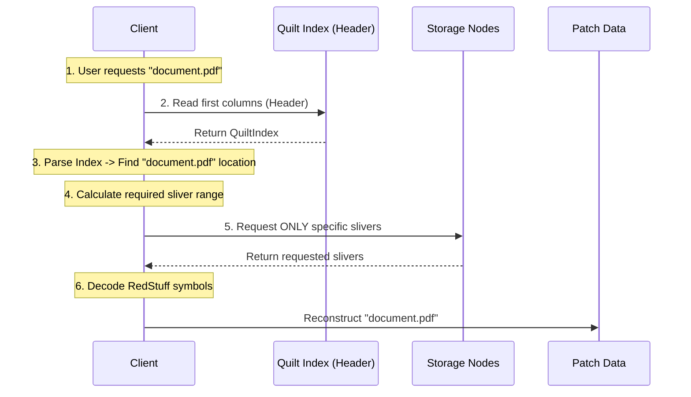

# How Data Is Linked

This section explains the technical structure of quilts and how blobs are organized and identified within them.

## Quilt Architecture Overview

A quilt is a specialized blob that contains multiple smaller blobs (called "patches") along with metadata for each patch. The key insight is that quilts are structured so that individual patches can be retrieved without downloading the entire quilt.


## QuiltV1 Structure

For QuiltV1 (the current implementation), data is organized as a 2D matrix:

### Matrix Organization

- **Rows**: Represent erasure-coded symbols (from RedStuff encoding)
- **Columns**: Called "secondary slivers" in Walrus terminology
- **Blobs**: Each blob occupies a consecutive range of columns

### Header Information

The first column contains critical metadata:

1. **Version byte** (1 byte): Identifies the quilt version (currently 0x01 for QuiltV1)
2. **Index size** (variable): Length of the QuiltIndex structure
3. **QuiltIndex**: Serialized metadata for all patches

### QuiltIndex Contents

The QuiltIndex stores metadata for the entire quilt:

```rust
// Simplified from walrus-core/src/encoding/quilt_encoding.rs
pub struct QuiltIndexV1 {
    // Location and size information for each blob
    blob_layout: Vec<BlobLayoutInfo>,
    // Metadata for each blob (identifiers, tags)
    metadata: Vec<QuiltPatchMetadata>,
}
```

**Reference**: See [`crates/walrus-core/src/encoding/quilt_encoding.rs:910-936`](https://github.com/MystenLabs/walrus/blob/main/crates/walrus-core/src/encoding/quilt_encoding.rs#L910-L936) for the complete implementation.

## BlobId vs QuiltPatchId

Understanding the difference between these two IDs is crucial:

### BlobId (Regular Blobs)

`BlobId` is the fundamental identifier for content in Walrus. It is a hash derived from the blob's metadata (Merkle root, encoding type, and unencoded length).

```rust
#[derive(Clone, Copy, PartialEq, Eq, PartialOrd, Ord, Serialize, Deserialize, Hash)]
#[repr(transparent)]
pub struct BlobId(pub [u8; Self::LENGTH]);

impl BlobId {
    pub const LENGTH: usize = 32;

    // Derived from Merkle root, encoding type, and unencoded length
    pub fn from_metadata(merkle_root: Node, encoding: EncodingType, unencoded_length: u64) -> Self {
        Self::new_with_hash_function::<Blake2b256>(merkle_root, encoding, unencoded_length)
    }
}
```

**Reference**: [`crates/walrus-core/src/lib.rs:110-147`](https://github.com/MystenLabs/walrus/blob/main/crates/walrus-core/src/lib.rs#L110-L147)

Key characteristics:
- **32 bytes**: Fixed size.
- **Derived**: Computed from content metadata (Merkle root + encoding params).
- **Base64**: Often represented as URL-safe Base64 string.

### QuiltPatchId (Blobs in Quilts)

`QuiltPatchId` is a composite identifier that points to a specific patch *inside* a quilt.

```rust
// From crates/walrus-core/src/lib.rs:205-210
#[derive(Clone, PartialEq, Eq, PartialOrd, Ord, Serialize, Deserialize, Hash)]
pub struct QuiltPatchId {
    pub quilt_id: BlobId,           // The quilt's BlobId (32 bytes)
    pub patch_id_bytes: Vec<u8>,    // Variable length patch identifier
}
```

Key differences:
1. **Composite**: Contains a `BlobId` *plus* extra bytes.
2. **Variable Length**: `patch_id_bytes` can vary in size.
3. **Location-dependent**: Identifies "where in the quilt" the data lives, whereas `BlobId` identifies "what the data is".

**Reference**: [`crates/walrus-core/src/lib.rs:209-275`](https://github.com/MystenLabs/walrus/blob/main/crates/walrus-core/src/lib.rs#L199-L297)

## Visual Comparison


**Key Insight**: The same file content has different QuiltPatchIds in different quilts!

## Metadata System

Quilts introduce "**Walrus-native**" metadata stored directly within the quilt structure (see [Quilt Usage Guide](https://docs.wal.app/docs/usage/quilt)).

### Identifiers

Each patch can have a unique identifier (like a filename):

- **Purpose**: Human-readable name for retrieval
- **Uniqueness**: Must be unique within a quilt
- **Format**: Alphanumeric start, no trailing whitespace
- **Size limit**: Up to 64 KB
- **Use case**: File names, document IDs, asset names

**Example identifiers**:
- `"user-profile-picture.jpg"`
- `"chapter-01.html"`
- `"asset-texture-0042"`

### Tags

Key-value pairs for organizing and filtering:

- **Purpose**: Queryable metadata for selective retrieval
- **Format**: String keys and values
- **Size limit**: Total of all tags < 64 KB
- **Use case**: Categories, properties, filters

**Example tags**:
```json
{
  "author": "Alice",
  "status": "final-review",
  "category": "documentation",
  "version": "2.1"
}
```

### Metadata Storage

Unlike Sui on-chain metadata:

| Feature | Sui On-Chain Metadata | Walrus-Native Metadata |
|---------|----------------------|------------------------|
| Location | Sui blockchain | Within the quilt |
| Cost | Sui gas fees | Included in Walrus storage |
| Mutability | Mutable | Immutable |
| Query support | Via Sui queries | Via quilt APIs |
| Size limits | Sui object limits | 64 KB per identifier, 64 KB total tags |

**Advantage**: Lower cost and simplified management since metadata is part of the blob data.

## Sliver Alignment

One of quilt's key performance features is sliver alignment:

### What It Means

- **Patch boundaries align with Walrus internal slivers**
- Slivers are the units that storage nodes manage
- Each patch occupies complete slivers (no partial slivers)

### Implementation Detail

The `QuiltColumnRangeReader` trait implements this efficient retrieval logic:

```rust
// From crates/walrus-core/src/encoding/quilt_encoding.rs
impl QuiltColumnRangeReader for QuiltDecoderV1<'_> {
    fn range_read_from_columns(
        &self,
        start_col: usize,
        mut bytes_to_skip: usize,
        mut bytes_to_return: usize,
    ) -> Result<Vec<u8>, QuiltError> {
        // Only request/check the specific columns needed for this range
        let end_col = start_col + (bytes_to_skip + bytes_to_return).div_ceil(column_size);
        self.check_missing_slivers(start_col, end_col)?;

        // ... reads only from the identified slivers ...
    }
}
```

**Reference**: [`crates/walrus-core/src/encoding/quilt_encoding.rs:1675-1723`](https://github.com/MystenLabs/walrus/blob/main/crates/walrus-core/src/encoding/quilt_encoding.rs#L1668-L1717)

### Why It Matters

**Efficient Individual Retrieval**: When you request a specific patch, storage nodes only need to return the slivers for that patch, not adjacent patches or the entire quilt.


**Result**: Retrieval latency comparable to (or even better than) regular blobs, despite being part of a larger quilt.

## Data Flow: Reading a Patch

Here's what happens when you retrieve a patch by identifier:



<details>
<summary>Mermaid source (click to expand)</summary>



</details>

**Code reference**: [`crates/walrus-sdk/src/client/quilt_client.rs:655-679`](https://github.com/MystenLabs/walrus/blob/main/crates/walrus-sdk/src/client/quilt_client.rs#L650-L672) shows the implementation of `get_blobs_from_quilt_by_internal_ids_impl`.

## Limitations and Constraints

### QuiltV1 Limits

- **Maximum patches**: 666 blobs per quilt
    - **Reason**: Derived from the standard committee size of 1000 shards. The secondary encoding provides 667 columns ($1000 - f$, where $f=333$). Since one column is reserved for the header/index, 666 columns remain available for data placement.
- **Identifier size**: ~64 KB (65,535 bytes) maximum per identifier
    - **Reason**: The length of the identifier is stored as a 2-byte integer (`u16`).
- **Total tag size**: ~64 KB (65,535 bytes) maximum for all tags combined
    - **Reason**: The total length of the tags buffer is also stored as a 2-byte integer (`u16`).
- **Operations**: Quilt-level only (no individual patch operations)
    - **Reason**: Quilts are immutable blobs. To "add" or "remove" a patch, you must create a completely new quilt blob containing the desired set of patches.

### Why These Limits?

1. **666 patches**: Balances efficiency with sliver organization
2. **Metadata size**: Ensures the QuiltIndex fits in reasonable space
3. **Quilt-level operations**: Simplifies the Sui smart contract and consistency model

## Integrity and Verification

Quilts maintain the same integrity guarantees as regular blobs:

- **Erasure coding**: RedStuff encoding for reliability
- **Merkle proofs**: Cryptographic verification of data
- **Certified epochs**: Sui consensus on blob status
- **Sliver verification**: Each sliver is independently verifiable

The QuiltIndex itself is part of the erasure-coded data, so it benefits from the same protections.

## Comparison with Regular Blobs

| Aspect | Regular Blob | Quilt |
|--------|--------------|-------|
| **Storage unit** | Single file | Multiple files (up to 666) |
| **ID type** | BlobId | QuiltPatchId |
| **ID derivation** | From content | From quilt + position |
| **Metadata** | On Sui (optional) | Walrus-native (required) |
| **Retrieval** | Full blob | Full or individual patches |
| **Operations** | Individual | Quilt-level only |
| **Cost** | Fixed overhead | Shared overhead |

## TypeScript SDK Types

The TypeScript SDK provides types for working with quilts:

```typescript
// From ts-sdks/packages/walrus/src/types.ts
export type WalrusFile = {
  contents: Uint8Array;
  identifier?: string;
  tags?: Record<string, string>;
};

export class QuiltPatchId {
  quiltId: BlobId;
  patchIdBytes: Uint8Array;
}
```

**Reference**: Check [`ts-sdks/packages/walrus/src/types.ts`](https://github.com/MystenLabs/ts-sdks/blob/main/packages/walrus/src/types.ts) for complete type definitions.

## Key Takeaways

- Quilts organize multiple blobs with a header index and individual patches
- **QuiltPatchId** depends on the quilt composition, unlike content-based BlobIds
- **Identifiers** and **tags** provide Walrus-native metadata for organization within the quilt
- **Sliver alignment** ensures efficient individual patch retrieval by fetching only necessary slivers
- Quilts maintain the same integrity guarantees (RedStuff, Merkle proofs) as regular blobs

## Next Steps

Now that you understand how quilts are structured, proceed to [Creation Process](./03-creation-process.md) to learn how to create quilts using the CLI and SDK.

