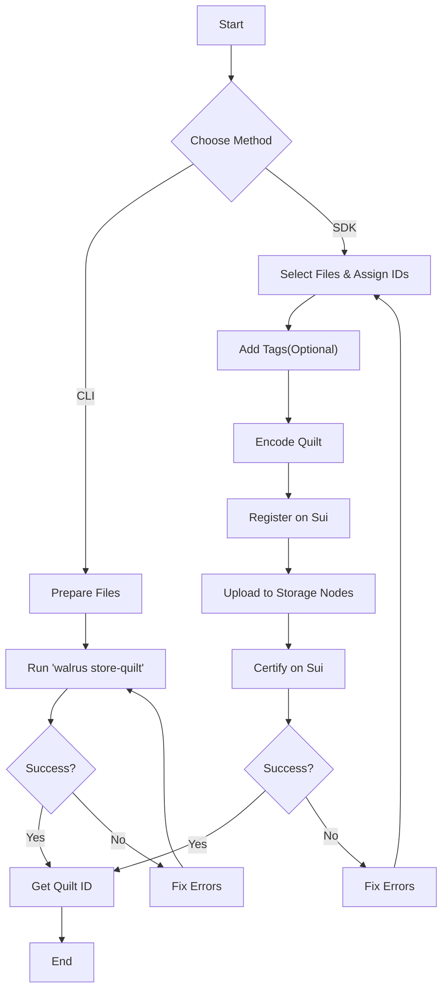

# Creation Process

This section explains how to create quilts using both the CLI and SDK, with detailed examples and best practices.

## Overview

Creating a quilt involves:

1. **Selecting files** to include in the quilt
2. **Assigning identifiers** (required, unique within the quilt)
3. **Adding tags** (optional, for filtering and organization)
4. **Encoding** the files into a quilt structure
5. **Registering** the quilt on Sui
6. **Uploading** the encoded data to storage nodes
7. **Certifying** the upload with Sui

The process is similar to storing regular blobs, but with batching and metadata support.



## Method 1: CLI with `store-quilt`

The `store-quilt` command provides two ways to specify files: using `--paths` or `--blobs`.

> **Note**: You can find all CLI examples in this section in the [`hands-on-source-code/03-creation-process/cli/`](../hands-on-source-code/03-creation-process/cli/) directory.

### Using `--paths` (Simple File Collection)

The `--paths` option recursively includes files from specified directories:

```sh
walrus --context testnet store-quilt --epochs 10 --paths /path/to/directory1 /path/to/directory2
```

**How it works**:

- Recursively scans all specified paths
- Uses the **filename** as the identifier for each file
- Does **not** support custom identifiers or tags
- Duplicate filenames will cause an error

**Example: Store an NFT collection**

```sh
# Directory structure:
# nft-collection/
#   ├── image001.png
#   ├── image002.png
#   ├── image003.png
#   └── metadata/
#       ├── meta001.json
#       └── meta002.json

walrus --context testnet store-quilt --epochs 20 --paths ./nft-collection/
```

This creates a quilt with identifiers:

- `image001.png`
- `image002.png`
- `image003.png`
- `meta001.json`
- `meta002.json`

**Source Reference**: [`crates/walrus-service/src/client/cli/args.rs:236-250`](https://github.com/MystenLabs/walrus/tree/main/crates/walrus-service/src/client/cli/args.rs#L236-L250)

### Using `--blobs` (Advanced with Metadata)

The `--blobs` option allows full control over identifiers and tags:

```sh
walrus --context testnet store-quilt --epochs 10 \
  --blobs '{"path":"/path/to/file1.pdf","identifier":"paper-v2","tags":{"author":"Alice","status":"final"}}' \
          '{"path":"/path/to/file2.pdf","identifier":"paper-v3","tags":{"author":"Bob","status":"draft"}}'
```

**JSON Schema**:
```json
{
  "path": "string (required)",
  "identifier": "string (optional, defaults to filename)",
  "tags": {
    "key1": "value1",
    "key2": "value2"
  }
}
```

**Example: Store documentation with metadata**

```sh
walrus --context testnet store-quilt --epochs 30 \
  --blobs '{"path":"./docs/intro.html","identifier":"intro","tags":{"chapter":"1","lang":"en","version":"1.0"}}' \
          '{"path":"./docs/getting-started.html","identifier":"getting-started","tags":{"chapter":"2","lang":"en","version":"1.0"}}' \
          '{"path":"./docs/api-reference.html","identifier":"api-ref","tags":{"chapter":"3","lang":"en","version":"1.0"}}'
```

**Important Constraints**:

- `--paths` and `--blobs` are **mutually exclusive** (cannot use both)
- All identifiers must be **unique** within the quilt
- Identifiers must start with alphanumeric characters
- Maximum identifier size: 64 KB
- Maximum total tags size: 64 KB

**Source Reference**: [`crates/walrus-service/src/client/cli/args.rs:251-263`](https://github.com/MystenLabs/walrus/blob/main/crates/walrus-service/src/client/cli/args.rs#L234-L266)

### Storage Duration Options

Like regular `store` commands, you can specify duration using:

```sh
# Store for a specific number of epochs
walrus --context testnet store-quilt --epochs 50 --paths ./files/

# Store until a specific epoch
walrus --context testnet store-quilt --end-epoch 1500 --paths ./files/

# Store until a specific timestamp
walrus --context testnet store-quilt --earliest-expiry-time "2025-12-31T23:59:59Z" --paths ./files/

# Store for the maximum allowed duration
walrus --context testnet store-quilt --epochs max --paths ./files/
```

### Blob Type Options

```sh
# Deletable blob (default)
walrus --context testnet store-quilt --epochs 10 --paths ./files/

# Permanent blob (cannot be deleted before expiry)
walrus --context testnet store-quilt --epochs 10 --permanent --paths ./files/
```

**Note**: If you want to create a shared quilt, you'll need to use the `share` command after storing, since shared blobs must be permanent.

### Complete CLI Example

```sh
# Create a quilt with custom metadata
walrus --context testnet store-quilt --epochs 25 \
  --blobs '{"path":"./assets/logo.png","identifier":"logo","tags":{"type":"image","format":"png","size":"small"}}' \
          '{"path":"./assets/banner.jpg","identifier":"banner","tags":{"type":"image","format":"jpg","size":"large"}}' \
          '{"path":"./config/app.json","identifier":"config","tags":{"type":"config","format":"json"}}'

# Expected output:
# Success: Deletable blob stored successfully.
# Path: path(s) ignored for quilt store result
# Blob ID: zkGU4bnBjDpgbSHqFckYtoW7GJlIKteP_HJBTkPj1sk
# Sui object ID: 0xd95cbf452860b6f1c599fac7c8b91e0da9bf25b0618bfae9321ac2f5befde116
# Unencoded size: 435 KiB
# Encoded size (including replicated metadata): 63.0 MiB
# Cost (excluding gas): 0.0017 WAL (storage was purchased, and a new blob object was registered) 
# Expiry epoch (exclusive): 318
# Encoding type: RedStuff/Reed-Solomon
# 
# -------------------------------------------------------------------------------------
#  Index  QuiltPatchId                                        Sliver Range  Identifier 
# -------------------------------------------------------------------------------------
#  0      zkGU4bnBjDpgbSHqFckYtoW7GJlIKteP_HJBTkPj1skBAQACAA  [1, 2)        banner 
#  1      zkGU4bnBjDpgbSHqFckYtoW7GJlIKteP_HJBTkPj1skBAgADAA  [2, 3)        config 
#  2      zkGU4bnBjDpgbSHqFckYtoW7GJlIKteP_HJBTkPj1skBAwAEAA  [3, 4)        logo 
# -------------------------------------------------------------------------------------
```

**Source Reference**: See the implementation in [`crates/walrus-service/src/client/cli/runner.rs:982-1095`](https://github.com/MystenLabs/walrus/blob/main/crates/walrus-service/src/client/cli/runner.rs#L1035-L1331)

## Method 2: TypeScript SDK

The TypeScript SDK provides two approaches: a simple one-step method and a detailed multi-step flow.

### Simple Method: `writeFiles()`

The `writeFiles()` method handles all steps automatically:

See [`03-create-simple.ts`](../hands-on-source-code/03-creation-process/ts/03-create-simple.ts) for the complete example.


**Source Reference**: [`ts-sdks/packages/walrus/examples/quilt/write-blob.ts`](https://github.com/MystenLabs/ts-sdks/tree/main/packages/walrus/examples/quilt/write-blob.ts)

### Advanced Method: `writeFilesFlow()`

For more control over the registration, upload, and certification steps:

See [`03-create-flow.ts`](../hands-on-source-code/03-creation-process/ts/03-create-flow.ts) for the complete example.


**Why use the flow method?**

- **Visibility**: See each step of the process
- **Error handling**: Handle errors at each stage
- **Progress tracking**: Monitor upload progress
- **Debugging**: Easier to identify where issues occur

**Source Reference**: [`ts-sdks/packages/walrus/examples/quilt/write-flow.ts`](https://github.com/MystenLabs/ts-sdks/blob/main/packages/walrus/examples/quilt/write-flow.ts)

### Creating WalrusFile Objects

There are multiple ways to create `WalrusFile` objects:

See [`03-create-walrus-file.ts`](../hands-on-source-code/03-creation-process/ts/03-create-walrus-file.ts) for examples.

## Best Practices for Quilt Creation

### 1. Choose Meaningful Identifiers

**Good identifiers**:

- ✅ `user-profile-picture.jpg`
- ✅ `chapter-01-introduction`
- ✅ `config-production-v2`

**Poor identifiers**:

- ❌ `temp123` (not descriptive)
- ❌ `file` (not unique enough)
- ❌ ` leading-space` (invalid format)

### 2. Use Tags for Filtering

Design your tag schema for how you'll query:

```json
{
  "category": "documentation",
  "language": "en",
  "version": "2.0",
  "status": "published"
}
```

This allows queries like:
- All documentation: `category=documentation`
- English docs: `language=en`
- Published v2 docs: `version=2.0` AND `status=published`

### 3. Batch Sizes

Optimal quilt size depends on your use case:

**Small quilts (10-50 blobs)**:

- ✅ Easier to manage
- ✅ Faster to create
- ❌ Less cost savings per blob

**Large quilts (200-666 blobs)**:

- ✅ Maximum cost savings
- ✅ Best for large collections
- ❌ All-or-nothing lifecycle

**Recommendation**: Aim for 100-300 blobs per quilt for a good balance.

### 4. Identifier Uniqueness

Always ensure identifiers are unique:

See [`03-unique-ids.ts`](../hands-on-source-code/03-creation-process/ts/03-unique-ids.ts) for the implementation.

### 5. Error Handling

Always handle potential errors:

See [`03-error-handling.ts`](../hands-on-source-code/03-creation-process/ts/03-error-handling.ts) for the example pattern.

## Dry Run for Cost Estimation

Before creating large quilts, estimate costs:

```sh
walrus --context testnet store-quilt --dry-run --epochs 50 --paths ./large-collection/
```

**Output**:

```text
Success: Store dry-run succeeded.
Path: n/a
Blob ID: 057XMxnkX7a5D7acJ_XJIMYAfneZrqU2VqqzDFZCYmc
Encoding type: RedStuff/Reed-Solomon
Unencoded size: 435 KiB
Encoded size (including replicated metadata): 63.0 MiB
Cost to store as new blob (excluding gas): 0.0033 WAL

---------------------------------------------------------------------------------------
 Index  QuiltPatchId                                        Sliver Range  Identifier 
---------------------------------------------------------------------------------------
 0      057XMxnkX7a5D7acJ_XJIMYAfneZrqU2VqqzDFZCYmcBAQACAA  [1, 2)        file-001.txt 
 1      057XMxnkX7a5D7acJ_XJIMYAfneZrqU2VqqzDFZCYmcBAgADAA  [2, 3)        file-002.txt 
 2      057XMxnkX7a5D7acJ_XJIMYAfneZrqU2VqqzDFZCYmcBAwAEAA  [3, 4)        file-003.txt 
---------------------------------------------------------------------------------------
```

## Common Creation Errors

### Error: Duplicate Identifier

```text
Error: Duplicate identifier 'config.json' in quilt
```

**Cause**: Two or more files have the same identifier.

**Fix**: Ensure all identifiers are unique, or use paths that don't have filename collisions.

### Error: Identifier Invalid Format

```text
Error: Identifier ' myfile' contains leading whitespace
```

**Cause**: Identifier has leading/trailing whitespace or starts with non-alphanumeric character.

**Fix**: Use valid identifiers starting with alphanumeric characters.

### Error: Metadata Too Large

```text
Error: Total tags size exceeds 64 KB limit
```

**Cause**: Combined size of all tags in the quilt exceeds 64 KB.

**Fix**: Reduce tag data or split into multiple quilts.

### Error: Too Many Blobs

```text
Error: QuiltV1 supports maximum 666 blobs, attempted 700
```

**Cause**: Trying to include more blobs than the version supports.

**Fix**: Split into multiple quilts.

## Verification After Creation

Always verify your quilt was created successfully:

```sh
# Check blob status
walrus --context testnet blob-status --blob-id <BLOB_ID>

# List all patches
walrus --context testnet list-patches-in-quilt <BLOB_ID>

# Read a specific patch to verify
walrus --context testnet read-quilt --quilt-id <BLOB_ID> --identifiers <IDENTIFIER> --out ./verify/
```

## Key Takeaways

- **Identifiers are mandatory** and must be unique within a quilt to enable retrieval
- **Tags** enable powerful filtering and organization capabilities for bulk operations
- Quilts can be created using **CLI** (via `--paths` or `--blobs`) or the **SDK**
- **Dry-runs** are essential for estimating costs before committing to storage
- Using meaningful identifiers simplifies future retrieval and management

## Next Steps

Now that you know how to create quilts, proceed to [Retrieval Process](./04-retrieval-process.md) to learn how to read blobs from quilts.


