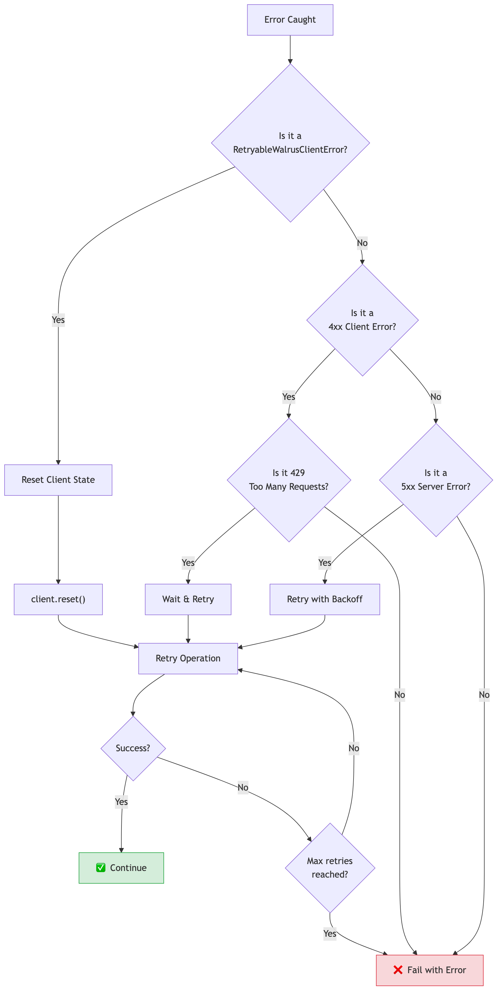
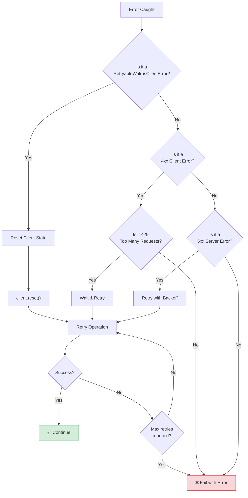

# Publisher Unavailability

Publishers are responsible for accepting blobs, splitting them into slivers, and distributing them to storage nodes. "Publisher unavailability" can manifest as connection timeouts, HTTP 5xx errors, or specific Walrus protocol errors.

## Error Handling Decision Flow

When an error occurs, use this decision tree to determine how to handle it:



<details>
<summary>Mermaid source (click to expand)</summary>



</details>

## Types of Unavailability

1.  **Network Unreachable**: The publisher endpoint is down or unreachable.
2.  **Overloaded**: The publisher is rejecting requests due to high load (HTTP 429 or 503).
3.  **Epoch Mismatch**: The publisher or the storage nodes are in a different epoch than the client expects.

## Handling Epoch Changes

Walrus operates in epochs. When the committee changes (at epoch boundaries), clients might hold outdated information about which nodes are responsible for storage.

### `RetryableWalrusClientError`

In the TypeScript SDK, errors related to epoch changes or temporary node issues extend `RetryableWalrusClientError`. The SDK provides several specific error types:

| Error Class | Description |
|-------------|-------------|
| `BehindCurrentEpochError` | Client is behind the current epoch |
| `BlobNotCertifiedError` | Blob not yet certified or doesn't exist |
| `NoBlobMetadataReceivedError` | Couldn't get metadata from any node |
| `NotEnoughSliversReceivedError` | Couldn't retrieve enough slivers |
| `NotEnoughBlobConfirmationsError` | Couldn't write to enough nodes |

> **Source**: All error classes defined in [`@mysten/walrus/src/error.ts`](https://github.com/MystenLabs/ts-sdks/blob/main/packages/walrus/src/error.ts)

```typescript
import { 
    RetryableWalrusClientError, 
    BehindCurrentEpochError 
} from '@mysten/walrus';

try {
    await client.writeBlob({ blob: data, epochs: 3, signer: keypair });
} catch (error) {
    if (error instanceof RetryableWalrusClientError) {
        console.log("Recoverable error detected. Resetting client state...");
        // Reset forces the client to fetch the latest system state/committee
        client.reset();
        // Retry the operation
        await client.writeBlob({ blob: data, epochs: 3, signer: keypair });
    } else {
        // Non-retryable error - don't retry
        throw error;
    }
}
```

> **Note**: The `reset()` method is called directly on the `WalrusClient` instance. If you're using the SuiClient extension pattern (`suiClient.$extend(walrus({...}))`), use `client.walrus.reset()` instead.

> **Note**: High-level methods like `readBlob` already handle retries automatically. Manual retry logic is primarily needed when building custom flows with lower-level methods.

## Network Timeouts

Uploads can be large. If a publisher connection drops:

1.  **Resume**: Walrus doesn't strictly support "resume" of a single HTTP PUT request in the simplest case, but your application logic should handle restarting the upload.
2.  **Timeout Configuration**: Ensure your HTTP client timeouts are appropriate for the blob size.

## Best Practices

*   **Multiple Publishers**: Do not rely on a single publisher URL. Maintain a list of available publishers.
*   **Jitter**: When retrying after a failure, add random jitter to your delay to avoid thundering herd problems on the publisher.

## Key Takeaways

- **Epoch changes cause transient errors**: Use `RetryableWalrusClientError` to detect and handle epoch boundary issues.
- **Reset client state on epoch errors**: Call `client.reset()` (or `client.walrus.reset()` with the SuiClient extension) to force the SDK to fetch fresh committee information.
- **High-level methods auto-retry**: Methods like `readBlob` handle retries internally; manual logic is mainly for custom flows.
- **Don't rely on a single publisher**: Maintain fallback URLs to avoid single points of failure.
- **Add jitter to retries**: Random delays prevent thundering herd problems when multiple clients retry simultaneously.
