# Expired Storage

Walrus storage is purchased for a specific duration (epochs). Once this duration passes, storage nodes are free to delete the data to free up space. Accessing expired data results in errors.

## Blob Lifecycle

```mermaid
flowchart LR
    subgraph Creation["Creation Phase"]
        A[Upload Blob] --> B[Register on Sui]
        B --> C[Store Slivers]
        C --> D[Certify Blob]
    end
    
    subgraph Active["Active Storage"]
        D --> E[📦 Blob Available]
        E -->|"Check status"| F{Epochs<br/>remaining?}
        F -->|"Yes"| E
        F -->|"Low"| G[⚠️ Extend Storage]
        G -->|"extendBlob()"| E
    end
    
    subgraph Expiration["Expiration"]
        F -->|"No epochs left"| H[⏰ Storage Expired]
        H --> I[Nodes delete data]
        I --> J[❌ NotCurrentlyRegistered]
    end
    
    style E fill:#d4edda,stroke:#28a745
    style G fill:#fff3cd,stroke:#ffc107
    style J fill:#f8d7da,stroke:#dc3545
```



> **Important**: Once storage expires and slivers are deleted by storage nodes, the data **cannot be recovered from Walrus** unless you have the original file to re-upload (or another copy exists). Always extend storage before expiration.

## SDK Errors for Expired Blobs

When you try to read an expired blob, the SDK throws `BlobNotCertifiedError`:

```typescript
import { BlobNotCertifiedError } from '@mysten/walrus';

try {
    const data = await client.readBlob({ blobId });
} catch (error) {
    if (error instanceof BlobNotCertifiedError) {
        console.error('Blob does not exist or has expired');
        // Check status to see if it's expired vs never existed
        const status = await client.getVerifiedBlobStatus({ blobId });
        console.log('Blob status:', status);
    }
}
```

### Why it happens
*   **Storage expired**: The purchased epochs have elapsed and slivers were deleted.
*   **Blob never existed**: The blob ID is invalid or the upload never completed.

## Handling Expiration

### 1. Check Expiration Date
Before critical operations, check the blob's storage end epoch using the SDK.

```typescript
import { WalrusClient } from '@mysten/walrus';

// Get verified blob status from storage nodes
const status = await client.getVerifiedBlobStatus({ blobId });

if (status.type === 'nonexistent') {
    throw new Error("Blob does not exist or has expired");
}

// Note: Only 'permanent' type blobs have endEpoch.
// 'deletable' blobs don't have a fixed end epoch in the status response.
if (status.type === 'permanent') {
    const currentEpoch = (await client.stakingState()).epoch;
    if (status.endEpoch <= currentEpoch) {
        throw new Error("Blob storage has expired");
    }
    console.log(`Blob valid until epoch ${status.endEpoch}`);
}

if (status.type === 'deletable') {
    // For deletable blobs, check if they're still certified
    if (status.initialCertifiedEpoch === null) {
        throw new Error("Blob is not certified");
    }
    console.log(`Deletable blob certified at epoch ${status.initialCertifiedEpoch}`);
}
```

### 2. Extend Storage (Renewal)
To prevent expiration, you must renew the storage *before* it expires. Use `executeExtendBlobTransaction` to add more epochs:

```typescript
// Extend blob storage by 5 additional epochs
const { digest } = await client.executeExtendBlobTransaction({ 
    blobObjectId: 'YOUR_BLOB_OBJECT_ID',
    epochs: 5,  // Add 5 more epochs
    signer: keypair,
});

// Or extend to a specific end epoch
const { digest: digest2 } = await client.executeExtendBlobTransaction({ 
    blobObjectId: 'YOUR_BLOB_OBJECT_ID',
    endEpoch: 150,  // Extend until epoch 150
    signer: keypair,
});
```

> **Note**: Extending storage costs WAL tokens. The cost is proportional to the blob size and number of epochs added.

### 3. Graceful Failure
If a user tries to access an expired blob:
*   **User Message**: Display a clear message: "This file has expired and is no longer available."
*   **Cleanup**: Remove references to this blob ID from your application database.

## Epoch Mismatches
Sometimes a "valid" blob might appear invalid if the client thinks the current epoch is $N$ but the server is on $N+1$.
*   **Solution**: The SDK handles this by refreshing committee information. If you are manually managing state, ensure you track the current epoch from the Sui chain.

## Key Takeaways

- **Storage has a finite lifetime**: Walrus storage is purchased for specific epochs; expired data can be deleted by nodes.
- **Check expiration proactively**: Use `getVerifiedBlobStatus()` to check `endEpoch` (for permanent blobs) before critical operations.
- **Extend storage before expiration**: Use `executeExtendBlobTransaction()` to add epochs; you cannot recover data after it expires.
- **Renewal costs WAL tokens**: The cost scales with blob size and number of epochs added.
- **Communicate expiration to users**: Display clear messages when data has expired and clean up stale references.
