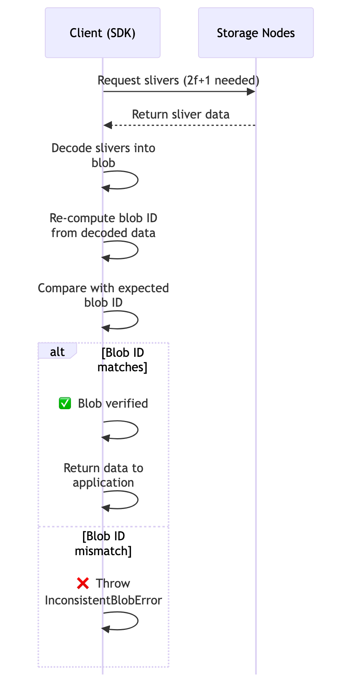
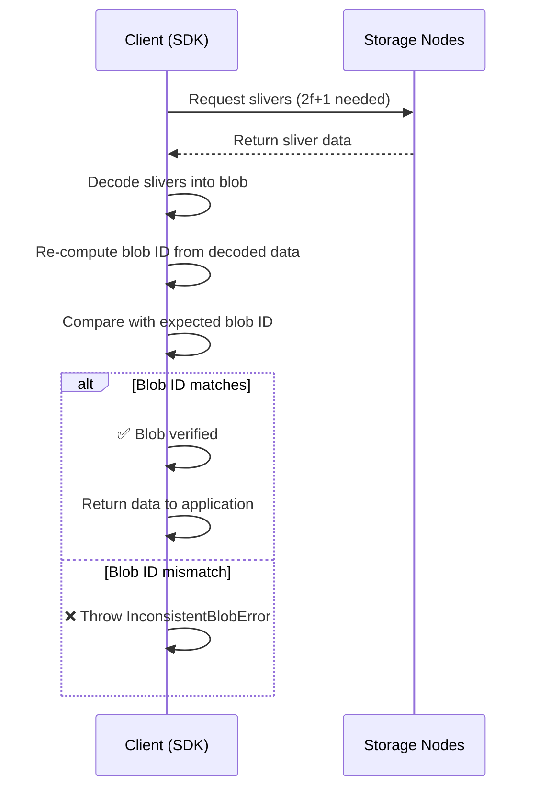
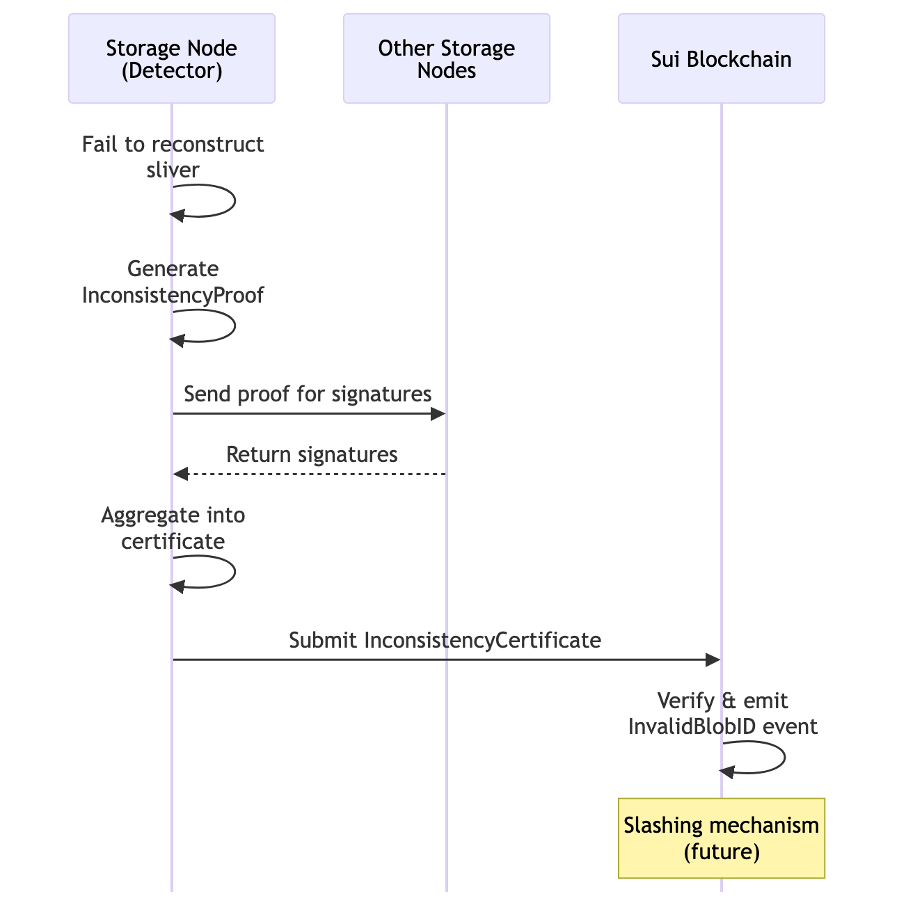
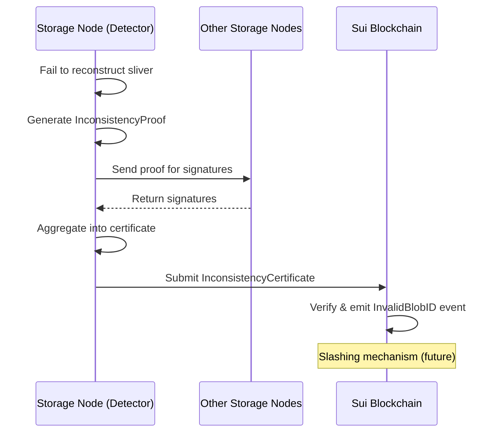

# Proof Mismatch Handling

Walrus ensures data integrity using cryptographic proofs. A "proof mismatch" or "inconsistency" means the data returned by a storage node does not match the certified metadata (e.g., the hash doesn't match).

## Client Verification Flow

The TypeScript SDK verifies blob integrity at the **whole-blob level**, not per-sliver:



<details>
<summary>Mermaid source (click to expand)</summary>



</details>

> **Note**: The SDK does NOT verify individual slivers against Merkle proofs. It relies on the content-addressable property: if the decoded blob produces the expected blob ID, the data is correct.

## Storage Node Inconsistency Detection

When **storage nodes** (not clients) detect encoding inconsistencies during sliver recovery, they can report it on-chain:



<details>
<summary>Mermaid source (click to expand)</summary>



</details>

> **Note**: Clients do NOT submit inconsistency proofs. They simply verify slivers and try other nodes on failure. Storage nodes handle fraud detection and reporting.
>
> **Implementation Status**: The inconsistency proof verification, certificate aggregation, and `InvalidBlobID` event emission are fully implemented. Actual stake slashing is designed but not yet active in the current protocol version.

## Client-Side Error: `InconsistentBlobError`

When the SDK detects that decoded data doesn't match the expected blob ID, it throws an `InconsistentBlobError`. This indicates the blob was encoded incorrectly or data corruption occurred.

```typescript
import { InconsistentBlobError } from '@mysten/walrus';

try {
    const data = await client.readBlob({ blobId });
} catch (error) {
    if (error instanceof InconsistentBlobError) {
        console.error('Blob integrity check failed - data may be corrupted');
        // Do NOT use any partial data
    }
}
```

> **Source**: [`InconsistentBlobError`](https://github.com/MystenLabs/ts-sdks/blob/main/packages/walrus/src/error.ts) in `@mysten/walrus/src/error.ts`

## What the SDK Does Automatically

1.  **Fetches slivers** from multiple storage nodes (needs 2f+1 for reconstruction)
2.  **Decodes** slivers into the original blob
3.  **Verifies integrity** by re-computing the blob ID and comparing with expected
4.  **Retries** other nodes if some fail or return bad data
5.  **Throws `InconsistentBlobError`** if verification fails after all attempts

## What You Should Do

*   **Log It**: If you catch an `InconsistentBlobError`, log it with high severity. It indicates data corruption or incorrect encoding.
*   **Don't Use the Data**: Never display or process data that failed verification.
*   **Trust the SDK**: The verification happens automatically—you don't need to implement it yourself.

## Key Takeaways

- **Blob integrity is verified automatically**: The SDK ensures decoded data matches the expected blob ID.
- **Inconsistencies are rare but serious**: An `InconsistentBlobError` should be logged and investigated.
- **SDK handles verification transparently**: You won't see this error unless something is genuinely wrong.
- **Never use unverified data**: If verification fails, the operation fails—this is intentional and correct behavior.
