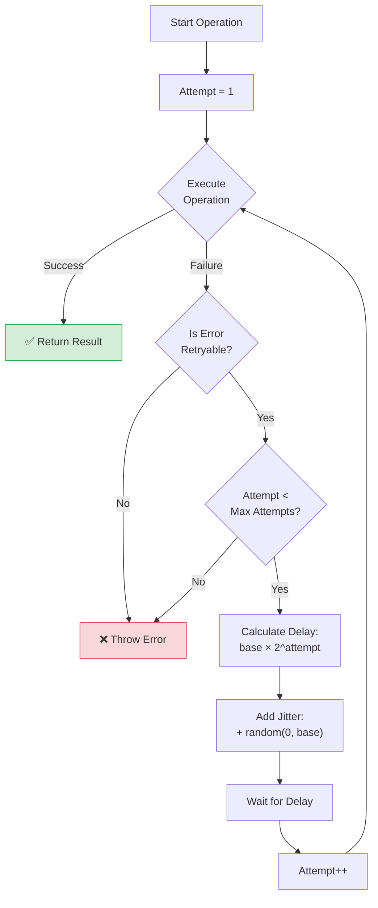

# Patterns for Robust Retry

Network requests fail. In a decentralized network, transient failures are expected. Robust retry logic is essential for a smooth user experience.

## The Exponential Backoff

Simply retrying immediately in a loop is a bad practice ("busy waiting"). It can overwhelm the server and worsen the problem.

**Exponential Backoff** means increasing the wait time between retries exponentially (e.g., 1s, 2s, 4s, 8s).

### Algorithm Flowchart



### Algorithm Steps
1.  Attempt operation.
2.  If fail:
    *   Wait `base_delay * (2 ^ attempt)`.
    *   Add `jitter` (randomness) to avoid synchronized retries from multiple clients.
    *   Retry.
3.  Stop after `max_attempts` or `max_delay`.

## Walrus SDK Retry Behavior

The TypeScript SDK uses a `retry` utility internally to handle transient failures. High-level methods like `readBlob` and `writeBlob` already implement retry logic with exponential backoff.

> **Note**: The internal `retry()` utility is not publicly exported. For custom retry logic, implement your own wrapper as shown below.

The internal retry utility (for reference) accepts these options:
- `count`: Maximum number of attempts (default: 3)
- `delay`: Base delay between retries in milliseconds
- `jitter`: Random jitter added to delay in milliseconds  
- `condition`: Function to determine if an error should trigger a retry

> **Source**: [`retry()`](https://github.com/MystenLabs/ts-sdks/blob/main/packages/walrus/src/utils/retry.ts) in `@mysten/walrus/src/utils/retry.ts`

## Custom Retry Wrapper

For more control, you can implement your own retry logic:

```typescript
async function retryWithBackoff<T>(
    fn: () => Promise<T>,
    maxAttempts: number = 5,
    baseDelay: number = 100
): Promise<T> {
    let attempt = 0;
    while (attempt < maxAttempts) {
        try {
            return await fn();
        } catch (error) {
            attempt++;
            if (attempt >= maxAttempts) throw error;
            
            // Exponential backoff: 2^attempt * baseDelay + random jitter
            const delay = Math.pow(2, attempt) * baseDelay + Math.random() * baseDelay;
            await new Promise(r => setTimeout(r, delay));
        }
    }
    throw new Error("Unreachable");
}
```

## Idempotency

Retries are only safe if the operation is **idempotent** (can be repeated without changing the result beyond the initial application).
*   **Reads**: Always idempotent. Safe to retry.
*   **Writes (Uploads)**: In Walrus, uploading the same blob twice results in the same Blob ID. If the blob already exists, the second upload might just confirm existence or update metadata. Generally safe, but check cost implications (gas fees on Sui).

## Specific Error Handling

*   **Network Errors (5xx, Timeout)**: Retry with backoff.
*   **Client Errors (4xx)**: generally do NOT retry (unless 429 Too Many Requests).
*   **Walrus Specific**:
    *   `RetryableWalrusClientError`: ALWAYS retry (it often means you need to fetch new committee info).

> **Source**: [`RetryableWalrusClientError`](https://github.com/MystenLabs/ts-sdks/blob/main/packages/walrus/src/error.ts) and subclasses in `@mysten/walrus/src/error.ts`

## Key Takeaways

- **Never retry immediately in a loop**: Busy waiting overwhelms servers and worsens outages.
- **Use exponential backoff**: Increase wait time exponentially (e.g., 100ms, 200ms, 400ms, 800ms).
- **Add jitter**: Random delays prevent synchronized retries from multiple clients.
- **High-level SDK methods auto-retry**: Methods like `readBlob` and `writeBlob` handle retries internally; implement custom wrappers for lower-level operations.
- **Walrus writes are idempotent**: Re-uploading the same blob produces the same Blob ID, making retries safe.
- **Don't retry 4xx errors**: Client errors (except 429) indicate bad input, not transient failures.
