# Patterns for Safe Fallback

When retries fail, your application needs a fallback plan to remain usable.

## 1. Redundancy (The "Happy Path" Fallback)
Walrus is built on redundancy. You don't need *all* nodes to respond.
*   **Read**: Needs $2f+1$ shards (usually a fraction of total nodes).
*   **Write**: Needs robust quorum.

If Node A is slow/down, the client automatically "falls back" to using Node B's data. This is transparent to your application logic but critical to understand.

## 2. Publisher/Aggregator Fallback
If you are running your own aggregator or using a public one, it becomes a single point of failure for *access* (not storage).

**Pattern: Multi-Provider Client**
Maintain a list of aggregator URLs. If one fails, switch to the next.

```typescript
import { getFullnodeUrl, SuiClient } from '@mysten/sui/client';
import { WalrusClient } from '@mysten/walrus';

const AGGREGATOR_URLS = [
    "https://aggregator-primary.example.walrus.space",
    "https://aggregator-backup.example.walrus.space"
];

async function writeWithFallback(data: Uint8Array, signer: Keypair) {
    const suiClient = new SuiClient({ url: getFullnodeUrl('testnet') });
    
    for (const aggregatorUrl of AGGREGATOR_URLS) {
        try {
            const client = new WalrusClient({
                network: 'testnet',
                suiClient,
                aggregatorUrl,
            });
            return await client.writeBlob({ 
                blob: data, 
                epochs: 3, 
                signer 
            });
        } catch (e) {
            console.warn(`Failed with ${aggregatorUrl}, trying next...`);
        }
    }
    throw new Error("All aggregators failed");
}
```

## 3. Graceful Degradation (UI)

If an image or asset fails to load from Walrus:
*   **Placeholder**: Show a generic placeholder image.
*   **Cache**: Serve a stale version from local cache if available.
*   **Retry Button**: Allow the user to manually trigger a retry (sometimes network conditions change).

## 4. Local Buffer (For Uploads)
If the user is uploading a file and the network cuts out:
1.  Store the file in `indexedDB` or LocalStorage (if small).
2.  Register a background sync task (Service Worker).
3.  Retry the upload when connectivity returns.

## 5. Circuit Breaker Pattern

> **Note**: The Circuit Breaker pattern is a general distributed systems resilience pattern, popularized by Michael Nygard in *Release It!* (2007). It's not Walrus-specific but is a useful technique for building robust applications.

When an aggregator or service is consistently failing, continuing to send requests wastes resources and slows down your application. A **Circuit Breaker** prevents this by "tripping" after repeated failures.

### State Diagram

```mermaid
stateDiagram-v2
    [*] --> Closed
    
    Closed --> Closed: Success
    Closed --> Open: failures >= threshold
    
    Open --> HalfOpen: timeout elapsed
    
    HalfOpen --> Closed: test succeeds
    HalfOpen --> Open: test fails
    
    state Closed {
        [*] --> Normal
        Normal: ✅ Requests pass through
        Normal: Count failures
    }
    
    state Open {
        [*] --> Tripped
        Tripped: ❌ Requests fail immediately
        Tripped: Wait for reset timeout
    }
    
    state HalfOpen {
        [*] --> Testing
        Testing: 🔄 Allow one test request
        Testing: Evaluate result
    }
```



### States
- **Closed**: Normal operation, requests flow through.
- **Open**: Service is considered down, requests fail immediately without attempting.
- **Half-Open**: After a timeout, allow one test request to check if service recovered.

```typescript
class CircuitBreaker {
    private failures = 0;
    private lastFailure: number = 0;
    private state: 'closed' | 'open' | 'half-open' = 'closed';
    
    constructor(
        private threshold: number = 5,      // Failures before opening
        private resetTimeout: number = 30000 // Time before trying again (ms)
    ) {}
    
    async call<T>(fn: () => Promise<T>): Promise<T> {
        if (this.state === 'open') {
            // Check if we should try again
            if (Date.now() - this.lastFailure > this.resetTimeout) {
                this.state = 'half-open';
            } else {
                throw new Error('Circuit breaker is open');
            }
        }
        
        try {
            const result = await fn();
            this.onSuccess();
            return result;
        } catch (error) {
            this.onFailure();
            throw error;
        }
    }
    
    private onSuccess() {
        this.failures = 0;
        this.state = 'closed';
    }
    
    private onFailure() {
        this.failures++;
        this.lastFailure = Date.now();
        if (this.failures >= this.threshold) {
            this.state = 'open';
        }
    }
}

// Usage with aggregator fallback
const circuitBreakers = new Map<string, CircuitBreaker>();

async function storeWithCircuitBreaker(data: Uint8Array) {
    for (const url of AGGREGATORS) {
        let breaker = circuitBreakers.get(url);
        if (!breaker) {
            breaker = new CircuitBreaker(3, 60000);
            circuitBreakers.set(url, breaker);
        }
        
        try {
            return await breaker.call(async () => {
                const client = new WalrusClient({ /* config for url */ });
                return client.writeBlob({ blob: data, epochs: 3, signer: keypair });
            });
        } catch (e) {
            // Circuit open or request failed, try next
            continue;
        }
    }
    throw new Error("All aggregators unavailable");
}
```

This pattern prevents "piling on" to a failing service and allows faster failover to healthy alternatives.

## Key Takeaways

- **Walrus has built-in redundancy**: The SDK automatically falls back to other nodes when some are unavailable.
- **Aggregators are access points, not storage**: If your aggregator fails, storage nodes still have the data.
- **Use multiple aggregator URLs**: Maintain a fallback list to avoid single points of failure.
- **Implement graceful UI degradation**: Show placeholders, serve cached content, or offer manual retry buttons.
- **Buffer uploads locally**: Store pending uploads in IndexedDB and retry when connectivity returns.
- **Use circuit breakers for failing services**: Prevent wasted requests by "tripping" after repeated failures and testing recovery periodically.
