# Parallel Chunking

Processing large files efficiently often requires breaking them down into smaller, manageable pieces. In Walrus, this concept is applied through **chunking**, which is critical for optimizing both encoding performance and upload reliability.

## Why Chunking Matters

When you upload a file to Walrus, it undergoes **Erasure Encoding**. This process transforms the raw data into "slivers" that are distributed across storage nodes. For very large files, encoding the entire file as a single blob can be inefficient because:

1. **Memory Usage**: The entire blob (and its encoded symbols) might need to fit in memory during encoding.
2. **Single Thread Bottleneck**: Encoding is CPU-intensive. A single large blob might be encoded by a single thread, underutilizing modern multi-core CPUs.
3. **Failure Impact**: If a 10GB upload fails at 99%, retrying the whole upload is costly in time and resources.

```mermaid
flowchart LR
    subgraph Problem["Single Large Blob"]
        A[10GB File] --> B[Single Encode Thread]
        B --> C[All-or-Nothing Upload]
        C --> D["❌ 99% Fail = Full Retry"]
    end
    
    style D fill:#f8d7da,stroke:#dc3545
```



## How Parallel Chunking Works

By splitting a large dataset into multiple smaller blobs (chunks), you enable **Parallel Processing**:

1. **Concurrent Encoding**: Multiple chunks can be encoded simultaneously on different CPU cores.
2. **Pipeline Efficiency**: While one chunk is being uploaded to the network, the next chunk can be encoded.
3. **Granular Retries**: If one chunk fails to upload, you only need to retry that specific chunk, not the entire dataset.

```mermaid
flowchart LR
    subgraph Solution["Chunked Upload"]
        A[10GB File] --> B1[Chunk 1: 100MB]
        A --> B2[Chunk 2: 100MB]
        A --> B3[Chunk 3: 100MB]
        A --> B4[...]
        
        B1 --> C1["✅ Upload"]
        B2 --> C2["✅ Upload"]
        B3 --> C3["❌ Fail → Retry only this"]
        B4 --> C4["✅ Upload"]
    end
    
    style C1 fill:#d4edda,stroke:#28a745
    style C2 fill:#d4edda,stroke:#28a745
    style C3 fill:#fff3cd,stroke:#ffc107
    style C4 fill:#d4edda,stroke:#28a745
```



## Implementation Strategy

When using the Walrus SDK or CLI, consider these best practices:

### Optimal Chunk Size

There isn't a single "perfect" size, but chunks in the range of **10MB to 100MB** often provide a good balance between overhead and parallelism:

| Chunk Size | Pros | Cons |
|:-----------|:-----|:-----|
| < 1MB | Maximum parallelism | High transaction overhead, metadata costs dominate |
| 10-100MB | Good balance | Recommended range |
| > 1GB | Minimal overhead | Limited parallelism, memory pressure, costly retries |

> ⚠️ **Note:** This is general guidance based on the Walrus cost model where small blobs (< 10MB) have proportionally higher metadata overhead. Optimal sizes depend on your specific use case and network conditions.

### Manifest Files

If you split a logical file into multiple Walrus blobs, you need a way to reassemble them. A "manifest" or "index" blob can store the list of blob IDs in order.

> ⚠️ **Note:** This is a **conceptual pattern**, not a built-in Walrus SDK feature. The SDK provides `writeBlob()` for individual blobs but doesn't have built-in large file chunking. You would implement this pattern yourself in your application.

```typescript
// Example manifest structure (application-level concept, not SDK API)
interface FileManifest {
    originalFileName: string;
    totalSize: number;
    chunks: {
        index: number;
        blobId: string;
        size: number;
    }[];
}
```

This pattern is common in distributed storage systems (similar to IPFS DAG structures or AWS S3 multipart uploads).

### Example: Chunked Upload Pattern

The following is a **conceptual example** showing how you could implement chunking in your application:

```typescript
// Conceptual example - implement in your application
async function uploadLargeFile(
    client: WalrusClient,
    data: Uint8Array,
    signer: Signer,
    chunkSize = 50 * 1024 * 1024  // 50MB chunks
) {
    const chunks: Uint8Array[] = [];
    
    // Split into chunks
    for (let i = 0; i < data.length; i += chunkSize) {
        chunks.push(data.slice(i, i + chunkSize));
    }
    
    // Upload chunks in parallel using the SDK's writeBlob()
    const blobIds = await Promise.all(
        chunks.map((chunk, index) => 
            client.writeBlob({ blob: chunk, signer, epochs: 5 })
                .then(result => ({
                    index,
                    blobId: result.blobId,
                    size: chunk.length
                }))
        )
    );
    
    // Create and upload manifest
    const manifest: FileManifest = {
        originalFileName: "large-file.dat",
        totalSize: data.length,
        chunks: blobIds.sort((a, b) => a.index - b.index)
    };
    
    const manifestResult = await client.writeBlob({
        blob: new TextEncoder().encode(JSON.stringify(manifest)),
        signer,
        epochs: 5
    });
    
    return manifestResult.blobId; // Return manifest ID as the "file ID"
}
```

> 💡 **SDK Reference:** The `writeBlob()` method is documented in the [TypeScript SDK](https://docs.wal.app/usage/sdks.html). See [`ts-sdks/packages/walrus/src/client.ts`](https://github.com/MystenLabs/ts-sdks/blob/main/packages/walrus/src/client.ts) for implementation details.

## Quilts vs. Chunking: Different Use Cases

> 💡 **Important Distinction:** **Quilts** and **chunking** solve different problems:
>
> | Feature | Quilts | Chunking |
> |:--------|:-------|:---------|
> | **Purpose** | Batch many **small files** together | Split one **large file** into pieces |
> | **File Size** | Best for files < 1MB | Best for files > 100MB |
> | **Use Case** | NFT collections, static assets | Video files, large datasets |
> | **ID Type** | QuiltPatchId (composition-derived) | Regular BlobId (content-derived) |
> | **Operations** | All-or-nothing on quilt | Independent per chunk |
>
> **Quilts are NOT for chunking large files.** They are optimized for batching many small files to reduce per-blob overhead costs.

## Key Takeaways

- **Parallelism**: Chunking enables multiple CPU cores to encode simultaneously, improving throughput 2-4x
- **Pipeline efficiency**: Encode chunk N+1 while uploading chunk N for optimal resource utilization
- **Granular retries**: Only retry failed chunks, not the entire file, saving time and bandwidth
- **Optimal sizing**: 10MB-100MB chunks balance overhead vs. parallelism; smaller adds transaction cost, larger limits parallelism
- **Manifest pattern**: Store chunk order in a separate manifest blob to enable reassembly
- **Important distinction**: Quilts batch many small files (< 1MB); chunking splits large files (> 100MB)

## Next Steps

Now that you understand chunking strategies, proceed to [Parallel Uploads](./02-parallel-uploads.md) to learn how to upload those chunks efficiently using concurrent connections.
