# Avoiding Unnecessary Storage Extensions

In Walrus, you pay for storage based on size and **duration** (measured in epochs). Managing this duration efficiently is a key cost optimization strategy.

## How Storage Payment Works

When you upload a blob, you specify an `epochs` parameter. This reserves storage space for that duration.


<details>
<summary>Mermaid source (click to expand)</summary>


</details>

- **Cost Formula**: $Cost \approx EncodedSize \times Duration \times BaseRate + UploadFee$
- **Extension**: You can extend the lifetime of a blob later by paying for additional epochs.

> **Note:** The encoded size is approximately 5x the original blob size due to erasure coding overhead.

## The Cost of Extension

Extending a blob is a transaction on the Sui blockchain. It incurs:

1. **Gas Fees**: The Sui transaction fee (paid in SUI).
2. **Storage Fees**: The cost of the additional epochs (paid in WAL).

```mermaid
flowchart TD
    subgraph Comparison["Cost Comparison"]
        A["1 Year Upfront<br/>1 Tx = 1 Gas Fee"] 
        B["Monthly Extensions<br/>12 Tx = 12 Gas Fees"]
    end
    
    A --> C["✅ More Efficient"]
    B --> D["❌ Extra Overhead"]
    
    style C fill:#d4edda,stroke:#28a745
    style D fill:#f8d7da,stroke:#dc3545
```

> 📚 **Reference:** See [`extend_blob`](https://github.com/MystenLabs/walrus/blob/main/contracts/walrus/sources/system.move#L183-L189) in the Move contracts. The function requires a `Coin<WAL>` payment that is processed via [`process_storage_payments`](https://github.com/MystenLabs/walrus/blob/main/contracts/walrus/sources/system/system_state_inner.move#L424-L440).


<details>
<summary>Mermaid source (click to expand)</summary>



</details>

## Optimization Strategies

### 1. Estimate Correctly Upfront

The cheapest transaction is the one you don't have to make. If you know a blob needs to persist for 1 year, buy 1 year of storage upfront rather than buying 1 month and extending 11 times.

| Strategy | Transactions | Gas Fees | Better? |
|:---------|:------------:|:--------:|:-------:|
| 1 year upfront | 1 | 1x | ✅ Yes |
| Monthly extensions | 12 | 12x | ❌ No |

**Best Practice:** Overestimate slightly. The cost of unused epochs is often less than the cumulative gas fees of multiple extensions.

### 2. Don't Extend "Zombie" Data

Before running a bulk extension script (e.g., "extend everything expiring soon"), verify if the data is still accessed.

```typescript
// ❌ Bad: Blindly extend everything
async function extendAllExpiring(blobIds: string[]) {
    for (const blobId of blobIds) {
        await client.extendBlob({ blobId, epochs: 5 }); // Wasteful!
    }
}

// ✅ Good: Check if blob is still needed
async function extendActiveBlobs(blobIds: string[], accessLog: Map<string, Date>) {
    const thirtyDaysAgo = new Date(Date.now() - 30 * 24 * 60 * 60 * 1000);
    
    for (const blobId of blobIds) {
        const lastAccess = accessLog.get(blobId);
        if (lastAccess && lastAccess > thirtyDaysAgo) {
            await client.extendBlob({ blobId, epochs: 5 });
        } else {
            console.log(`Skipping zombie blob: ${blobId}`);
        }
    }
}
```

**Signs of Zombie Data:**
- User deleted a file in your app, but blob ID mapping still exists
- Data from abandoned user accounts
- Temporary files that were never cleaned up

### 3. Let Temporary Data Expire

Walrus supports a "deletable" mode, but the most efficient deletion is simply **expiration**. 

| Method | Action Required | Cost |
|:-------|:----------------|:-----|
| Deletable blob | Call `deleteBlob()` | Gas fee |
| Expiration | Do nothing | Free |

**Best Practice:** For temporary file sharing, set the duration to the minimum required (e.g., 1 epoch) and let the network garbage collect automatically. Don't build auto-extend mechanisms unless users explicitly request them.

### 4. Batch Operations with PTBs

You can batch multiple operations into a single Sui Programmable Transaction Block (PTB) to share gas costs:

```typescript
import { Transaction } from '@mysten/sui/transactions';

async function batchExtend(blobIds: string[], epochs: number) {
    const tx = new Transaction();
    
    for (const blobId of blobIds) {
        // Add extension call to PTB
        tx.moveCall({
            target: `${WALRUS_PACKAGE}::system::extend_blob`,
            arguments: [
                tx.object(blobId),
                tx.pure.u32(epochs),
                // ... payment arguments
            ],
        });
    }
    
    // Execute all extensions in one transaction
    await client.signAndExecuteTransaction({ transaction: tx });
}
```

> 💡 **Tip:** PTBs have a limit of 1024 commands. For large batches, split into multiple transactions.

## Key Takeaways

- **Upfront estimation**: 1 transaction for 1 year beats 12 monthly extensions (saves 11 gas fees)
- **Zombie data avoidance**: Check access logs before bulk-extending; don't pay for data nobody uses
- **Expiration over deletion**: Letting data expire is free; explicit deletion costs gas
- **PTB batching**: Combine multiple extensions into a single Programmable Transaction Block to share gas
- **Slight overestimation**: Unused epochs often cost less than cumulative gas fees from multiple extensions

## Next Steps

Now that you understand storage cost optimization, proceed to [Local Caching](./05-local-caching.md) to learn how to reduce retrieval latency with caching strategies.
