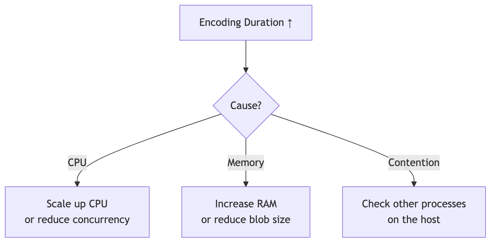
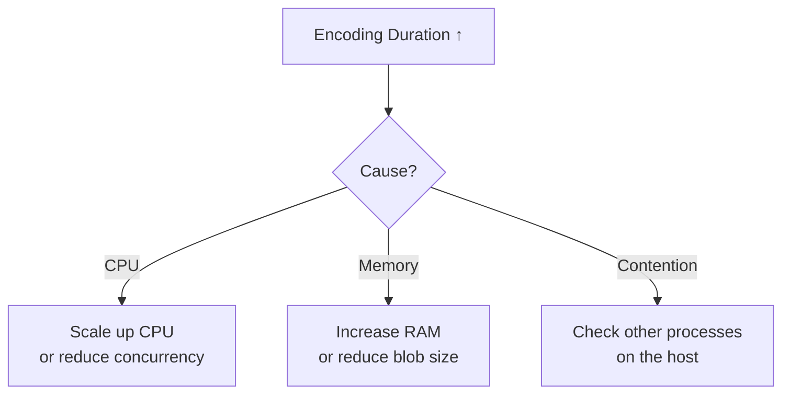
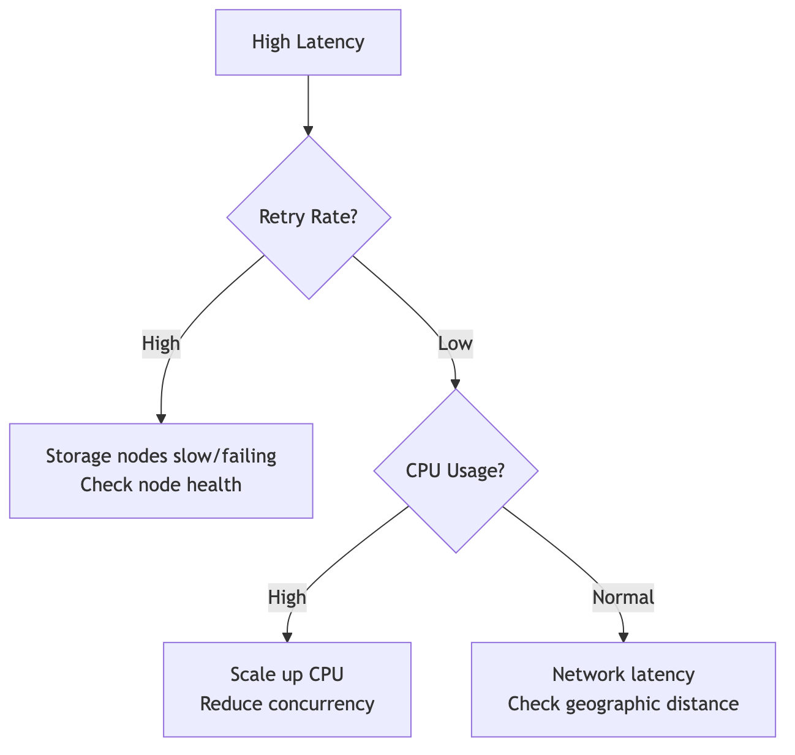
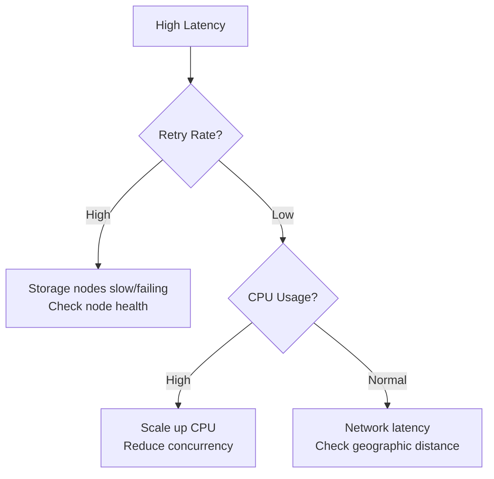

# Metrics that Matter in Production

To optimize performance, you must first measure it. When running Walrus components (Publisher/Aggregator) in production, you should monitor specific metrics to identify bottlenecks.

## Fetch Metrics with a Simple CLI

Walrus services expose a plaintext `/metrics` endpoint. You can inspect it with basic Linux tools (no Prometheus/Grafana required):

```bash
# Set once and reuse
METRICS_URL=${METRICS_URL:-http://127.0.0.1:27182/metrics}

# Peek at latency histogram buckets for blob reads
curl -s "$METRICS_URL" | grep '^http_server_request_duration_seconds_bucket' | grep 'http_route="/v1/blobs/{blob_id}"'

# See cumulative response bytes served for reads
curl -s "$METRICS_URL" | grep '^http_server_response_body_size_bytes_sum' | grep 'http_route="/v1/blobs/{blob_id}"'

# See cumulative request bytes received for uploads
curl -s "$METRICS_URL" | grep '^http_server_request_body_size_bytes_sum' | grep 'http_route="/v1/blobs"'

# Count 2xx vs non-2xx responses
curl -s "$METRICS_URL" | grep '^http_server_request_duration_seconds_count' | grep 'http_response_status_code='
```

> Tip: To eyeball rates without external tooling, capture a snapshot, wait (e.g., 60s), capture again, and compute the delta.

## Key Metrics Categories

### 1. Throughput & Latency

| Metric | Description | What to Watch |
|:-------|:------------|:--------------|
| **End-to-End Latency** | Time from request start to response | High latency = network issues or slow nodes |
| **Time to First Byte (TTFB)** | Time until aggregator starts sending data | Critical for perceived performance |
| **Requests per Second** | Upload/download throughput | Capacity planning |

### 2. Encoding / Decoding Performance

| Metric | Description | What to Watch |
|:-------|:------------|:--------------|
| **Encoding Duration** | Time spent calculating erasure codes | Spike = CPU bottleneck |
| **Decoding Duration** | Time spent reconstructing blobs | Affected by sliver availability |
| **Sliver Distribution** | Slivers sent successfully vs. failed | Failed slivers increase retry time |

**Performance Correlation:**


<details>
<summary>Mermaid source (click to expand)</summary>



</details>

### 3. Reliability Metrics

| Metric | Description | What to Watch |
|:-------|:------------|:--------------|
| **Storage Node Availability** | % of nodes responding successfully | < 67% = degraded performance |
| **Retry Rate** | Retries per request | High rate kills latency |
| **Error Rate** | Failed requests / total requests | Target < 1% |

**Why Retry Rate Matters:**
```
Request without retries: 100ms
Request with 2 retries:  100ms + 200ms (backoff) + 400ms (backoff) = 700ms
```

High retry rates drastically increase perceived latency even if eventual success rate is high.

### 4. Resource Usage

| Metric | Description | What to Watch |
|:-------|:------------|:--------------|
| **Memory Usage** | Heap/RSS of publisher/aggregator | Watch for OOM kills |
| **Network I/O** | Bytes in/out per second | Bandwidth saturation |
| **File Descriptors** | Open connections | Exhaustion causes failures |
| **CPU Usage** | Encoding is CPU-intensive | Sustained > 80% = bottleneck |

## Quick CLI Checks (no external tools)

| What you want | Command (run twice and diff for rates) |
|:--------------|:---------------------------------------|
| Check success/error counts by status | `curl -s "$METRICS_URL" \| grep '^http_server_request_duration_seconds_count' \| grep 'http_response_status_code='` |
| Approximate read throughput (bytes served) | `curl -s "$METRICS_URL" \| grep '^http_server_response_body_size_bytes_sum' \| grep 'http_route="/v1/blobs/{blob_id}"'` |
| Approximate upload throughput (bytes received) | `curl -s "$METRICS_URL" \| grep '^http_server_request_body_size_bytes_sum' \| grep 'http_route="/v1/blobs"'` |
| Spot latency distribution buckets for reads | `curl -s "$METRICS_URL" \| grep '^http_server_request_duration_seconds_bucket' \| grep 'http_route="/v1/blobs/{blob_id}"'` |
| See active connections (if exposed by your setup) | `curl -s "$METRICS_URL" \| grep active_connections` |

> Quick rate math: capture a value (e.g., `response_body_size_bytes_sum`), wait 60s, capture again, then compute `(new - old) / 60` for bytes/sec.

## Debugging Common Issues

### High Latency, Normal Success Rate


<details>
<summary>Mermaid source (click to expand)</summary>



</details>

### Decreasing Throughput Over Time
1. **Check memory usage** - Memory leak causing GC pressure?
2. **Check connection count** - Connection pool exhausted?
3. **Check disk I/O** - Cache disk full?

## Key Takeaways

- **Four metric categories**: Latency/throughput, encoding performance, reliability metrics, and resource usage
- **Retry rate impact**: High retry rates kill latency even with good eventual success rate
- **Cumulative metrics**: `http_server_*_sum` and `_count` grow over time—take two samples to compute rates without extra tooling
- **Bucketed latency**: `http_server_request_duration_seconds_bucket` lets you spot slow responses by route
- **Metric correlation**: Latency spike + CPU spike typically indicates encoding bottleneck

## Next Steps

Now that you understand monitoring, proceed to the [Hands-On Lab](./07-hands-on.md) to measure performance improvements yourself by comparing sequential vs. parallel uploads.
