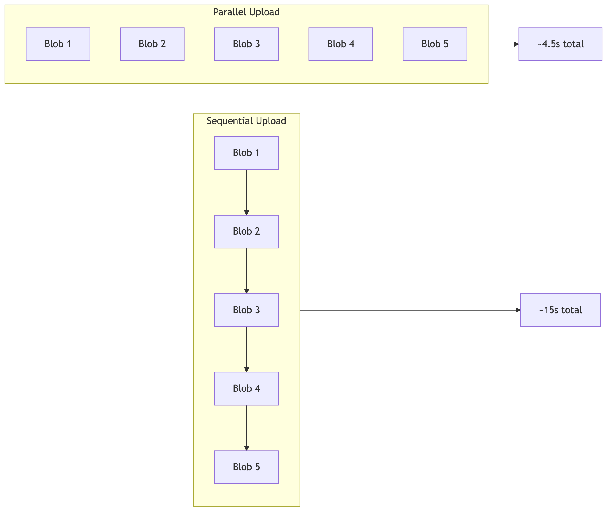
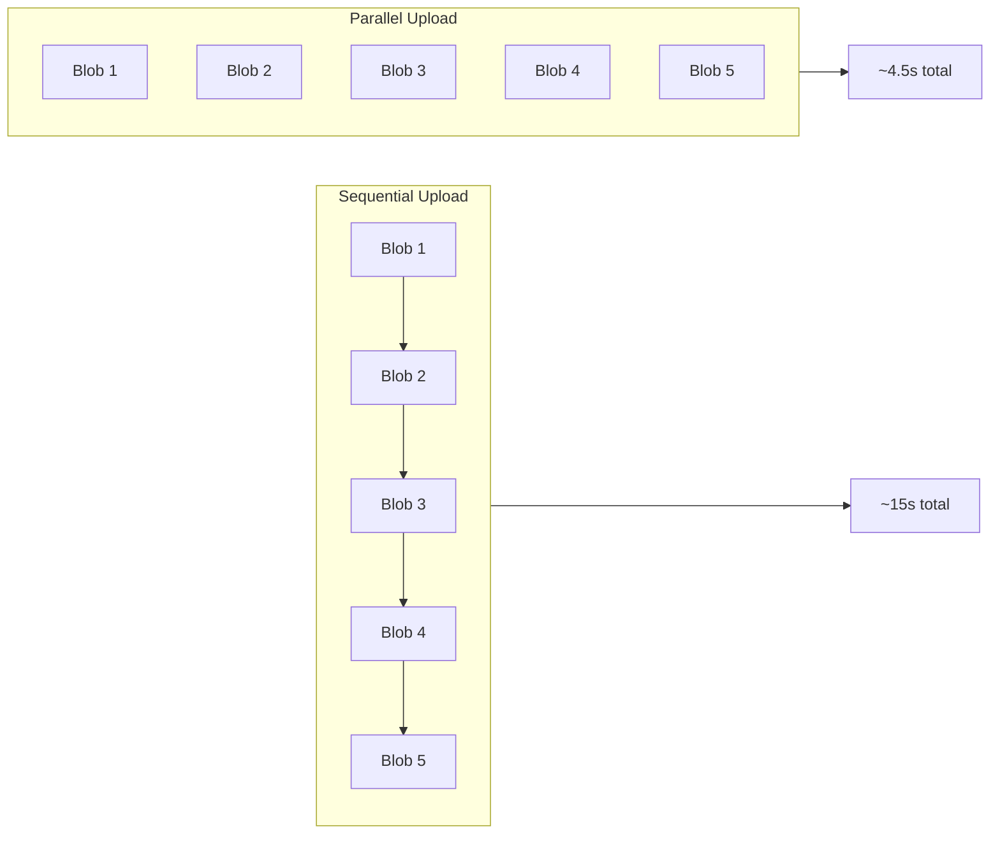

# Hands-on Lab: Tune Upload Parameters

In this lab, you will empirically measure the impact of parallel processing on Walrus upload performance. You will run a script that uploads data sequentially and then in parallel, calculating the throughput improvement.

## Learning Objectives

By completing this lab, you will:

- Measure the difference between sequential and parallel uploads
- Calculate throughput in MB/s
- Understand the relationship between latency and throughput
- Identify bottlenecks in upload performance
- Experience the two levels of parallelism: inter-blob (your code) and intra-blob (SDK handles)

## Prerequisites

- ✅ Node.js 18+ installed
- ✅ A terminal with internet access (to reach Sui Testnet and Walrus nodes)
- ✅ A funded Testnet wallet with SUI tokens (script can request from faucet)

## Local Setup

1. Navigate to the hands-on directory:

```bash
cd "13-Performance-optimization/hands-on-source-code"
```

2. Install dependencies:

```bash
npm install
```

3. Set your wallet passphrase (use `.env` or export):

```bash
echo "PASSPHRASE='your testnet passphrase'" > .env
# or
export PASSPHRASE='your testnet passphrase'
```

## The Experiment

The script `ts/throughput-tuner.ts` performs:

1. **Generate**: Creates a fixed set of random data blobs (128KB each) used for both scenarios
2. **Sequential Upload**: Uploads blobs one by one
3. **Parallel Upload**: Uploads all blobs concurrently
4. **Report**: Calculates and compares throughput (MB/s)



<details>
<summary>Mermaid source (click to expand)</summary>



</details>

## Run the Script

```bash
npm start  # defaults: 5 blobs, 128KB each, concurrency=1, wallets=1
```

The script will display configuration at startup:
```
📊 Running with: CONCURRENCY=1, NUM_WALLETS=1
```

**Available npm scripts:**
```bash
npm start          # Default: concurrency=1, wallets=1
npm run start:c2   # concurrency=2, wallets=2
npm run start:c3   # concurrency=3, wallets=3
npm run start:c5   # concurrency=5, wallets=5
npm run start:w2   # concurrency=1, wallets=2
npm run start:w3c2 # concurrency=2, wallets=3
npm run start:w4c5 # concurrency=5, wallets=4
```

Or set environment variables directly:
```bash
CONCURRENCY=2 NUM_WALLETS=2 npm start
```

> **Note:** The script will automatically request testnet SUI tokens from the faucet if needed. This might take a few seconds.

## Expected Output

You should see output similar to this (times vary significantly by network):

```text
📊 Running with: CONCURRENCY=1, NUM_WALLETS=1
=== Walrus Performance Tuning Lab ===
Comparing sequential vs concurrent upload patterns

Loaded 1 wallet(s) from .generated_wallets.env
Using a single wallet (expect some coin contention at higher concurrency)
Generating 5 blobs of 128 KB each...

--- Scenario A: Sequential Uploads ---
Uploading one blob at a time, waiting for each to complete...

Uploading blob 1/5... Done.
Uploading blob 2/5... Done.
Uploading blob 3/5... Done.
Uploading blob 4/5... Done.
Uploading blob 5/5... Done.

Sequential Results:
  Successful uploads: 5/5
  Total Time: 107.22s
  Throughput: 0.01 MB/s

--- Scenario B: Concurrent Uploads ---
Configuration: concurrency=1, wallets=1
Wallet addresses:
  [1] 0x0ab71dd58899ba2d5668ceb6467ac3992069a557371f4987cd5389266b7c9fb5

Using concurrency limit of 1 with retry logic...
(Single wallet causes coin contention - production uses sub-wallets)

[Concurrent] Blob 1 Done.
[Concurrent] Blob 2 Done.
...

=== Performance Comparison ===
Sequential:  0.01 MB/s (5 blobs in 107.2s)
Concurrent:  0.01 MB/s (5 blobs in 121.7s)

⚠️ No improvement (likely due to coin contention or network conditions)
   In production, use Publisher with multiple sub-wallets for true parallelism.

--- Key Insights ---
• Two parallelism levels: inter-blob (your code) + intra-blob (SDK distributes to ~1000 shards)
• Single wallet = coin contention in parallel transactions
• Production systems use sub-wallets (--n-clients 8+ in Publisher)
• HTTP 429 = rate limiting; back off and retry
• Retry logic essential for handling transient failures
• Concurrency limits prevent overwhelming the network
```

**With multiple wallets (`npm run start:c5`):**

```text
📊 Running with: CONCURRENCY=5, NUM_WALLETS=5
--- Scenario B: Concurrent Uploads ---
Configuration: concurrency=5, wallets=5
Wallet addresses:
  [1] 0x0ab71dd58899ba2d5668ceb6467ac3992069a557371f4987cd5389266b7c9fb5
  [2] 0xa69f16ac6cca2f361f5c94bdf881aa201a091455a2a23d5833820eff52d5366f
  [3] 0xec36aaef1a47ce6ad3501dd227aa2195a8f48414c4fa480d016c90e54f06d6a3
  [4] 0x57bc27c0fe537a20474aa12a18e8a88c60b88a2b85a0c5450f3c6ca41845f515
  [5] 0x2b187c70fb067798168207181519a4a27d476b490a197b0288add11a5f9f79e5

Uploading all blobs concurrently with retry logic...
(Using 5 wallets in round-robin to reduce coin contention)

✅ Performance Improvement: 183.9%
```

> **Note:** Results vary significantly (30-400% improvement) based on network conditions, Testnet load, and geographic location. The key insight is the *relative* improvement, not absolute numbers.

## Analysis Questions

Work through these questions to understand your results:

### 1. Latency vs Throughput

**Question:** Why is parallel throughput higher even though individual blob uploads take the same time?

<details>
<summary>Answer</summary>

Individual blob latency (time per blob) remains similar, but by **overlapping** uploads, we increase the total data transferred per unit time (throughput). While blob 1 is waiting for network response, blobs 2-5 are also in flight.
</details>

### 2. Why Not 5x Improvement?

**Question:** If we upload 5 blobs in parallel, why isn't the improvement exactly 5x?

<details>
<summary>Answer</summary>

Several factors prevent linear scaling:
- **Network bandwidth limit**: Your uplink speed is shared across all uploads
- **Publisher capacity**: Limited sub-wallets for concurrent registrations (default: 8)
- **Rate limiting**: Storage nodes may throttle excessive requests (watch for HTTP 429)
- **CPU overhead**: Encoding multiple blobs competes for CPU (erasure coding is CPU-intensive)
- **Intra-blob parallelism**: Each blob already distributes slivers to ~1000 shards concurrently
</details>

### 3. Bottleneck Shift

**Question:** What becomes the bottleneck when switching from sequential to parallel?

<details>
<summary>Answer</summary>

In sequential mode, the bottleneck is "waiting for HTTP response." In parallel mode, the bottleneck shifts to:
- Network bandwidth (uplink saturation)
- Publisher processing capacity
- Rate limits on storage nodes
</details>

## Challenge Exercises

### Challenge 1: Scale Up

Modify `ts/throughput-tuner.ts` to increase `TOTAL_BLOBS` to 20. What happens to the throughput?

### Challenge 2: Try Different Configurations

Use the pre-configured npm scripts to compare different concurrency/wallet combinations:

```bash
npm run start:c2   # concurrency=2, wallets=2
npm run start:c3   # concurrency=3, wallets=3
npm run start:c5   # concurrency=5, wallets=5 (best performance!)
```

### Challenge 3: Find Optimal Concurrency

Run experiments with different concurrency limits and plot throughput vs. concurrency. Where is the sweet spot?

```bash
npm start          # concurrency=1, wallets=1 (baseline)
npm run start:c2   # concurrency=2, wallets=2
npm run start:c3   # concurrency=3, wallets=3
npm run start:c5   # concurrency=5, wallets=5
npm run start:w4c5 # concurrency=5, wallets=4 (watch for failures!)
```

### Challenge 4: Observe Rate Limiting

Try high concurrency with fewer wallets to observe rate limiting and failures:

```bash
npm run start:w4c5  # 5 concurrent uploads but only 4 wallets
```

Watch for "Too many failures" errors - this demonstrates why matching wallets to concurrency matters!

## Troubleshooting

| Issue | Solution |
|:------|:---------|
| "PASSPHRASE not set" | Set `.env` or export: `echo "PASSPHRASE='...'" > .env` or `export PASSPHRASE='...'` |
| Faucet rate limited | Wait 1-2 minutes, or use existing balance |
| Insufficient WAL | Script auto-exchanges SUI for WAL |
| Results vary wildly | Network conditions vary; run multiple times and average |
| HTTP 429 errors | Rate limited; reduce concurrency or wait before retrying |
| Timeouts on large blobs | Increase timeout settings; check network stability |
| Lower than expected throughput | Check if CPU is bottleneck (encoding is intensive) |

## Key Takeaways

- **Throughput improvement**: Parallel uploads typically achieve 2-4x throughput improvement over sequential
- **Latency unchanged**: Individual blob upload time stays similar; parallelism overlaps operations, not speeds them up
- **Bottleneck shift**: Sequential bottleneck is "waiting for response"; parallel bottleneck becomes bandwidth/CPU/rate limits
- **Two parallelism levels**: Your code controls inter-blob parallelism; SDK handles intra-blob sliver distribution
- **Concurrency limits**: More parallelism isn't always better; watch for HTTP 429 and CPU saturation
- **Empirical measurement**: Always benchmark with your specific data and network conditions; don't guess

## What's Next?

Congratulations on completing the Performance Optimization module! You've learned:

1. ✅ Parallel chunking strategies
2. ✅ Concurrent upload patterns
3. ✅ Publisher selection
4. ✅ Storage cost optimization
5. ✅ Caching strategies
6. ✅ Production metrics
7. ✅ Hands-on performance measurement

**Suggested next modules:**
- **Failure Handling & Robustness** - Build resilient applications
- **Quilts** (Module 11) - Optimize small file storage
- **Storage Costs** - Deep dive into cost optimization
