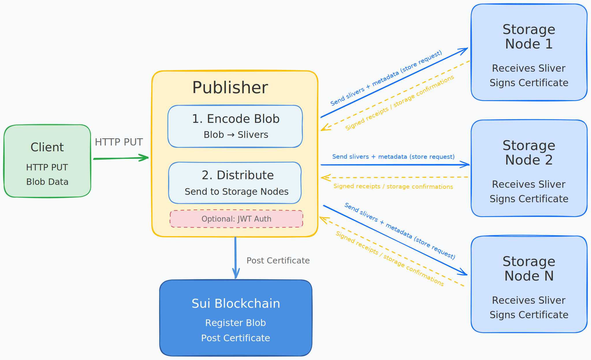
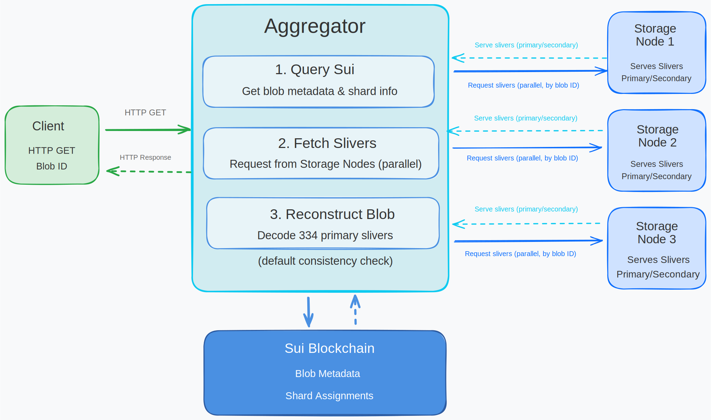

# System Components

This section covers the core and optional components of the Walrus architecture. The core component is Storage Nodes, which form the decentralized storage infrastructure. Optional infrastructure components include Publishers and Aggregators, which provide convenient HTTP interfaces for storing and retrieving blobs.

For information about how blobs are encoded into slivers, see the dedicated [Chunk Creation and Encoding](./02-chunk-creation.md) section.

For the architectural overview and security assumptions, see the [Architecture documentation](https://github.com/MystenLabs/walrus/blob/main/docs/design/architecture.md). For a developer perspective on components, see the [Developer Guide Components](https://github.com/MystenLabs/walrus/blob/main/docs/dev-guide/components.md).

## Storage Nodes

**Storage Nodes** are the core infrastructure of Walrus - they actually store the encoded blob data.


*[Excalidraw source file](../assets/storage-node-diagram.excalidraw.json) - Import into [Excalidraw.com](https://excalidraw.com) to view or edit*

The diagram illustrates:
- Storage node connected to Sui blockchain for shard assignment
- Multiple shards managed by the node (Shard 1, Shard 2, Shard N)
- Slivers stored within each shard
- Certificate signing process
- Serving slivers to clients/aggregators

### What Storage Nodes Do

Storage Nodes:

1. **Manage shards** - Each storage node manages one or more shards within a storage epoch
2. **Store slivers** - Each blob is erasure-encoded into many slivers, and each shard stores the slivers assigned to it
3. **Serve slivers** - When requested, storage nodes serve their stored slivers to clients or aggregators
4. **Sign certificates** - Storage nodes sign certificates confirming they have received and stored the slivers
5. **Listen to blockchain** - Storage nodes monitor Sui blockchain events to coordinate operations

### Key Characteristics

- **Shard assignment**: Sui smart contracts control which shards are assigned to which storage nodes
- **Storage epochs**: Shard assignments change every storage epoch (2 weeks on Mainnet)
- **Byzantine tolerance**: Walrus assumes more than 2/3 of shards are managed by correct storage nodes
- **Decentralized**: Storage nodes form the decentralized storage infrastructure

### Storage Node Operations

Storage nodes:
- Participate in governance through Sui smart contracts
- Handle commission and governance operations
- Perform backup and restore operations
- Monitor their assigned shards and serve data requests

#### Storing Slivers

When a storage node receives a sliver, it validates and stores it. See the implementation:
[`store_sliver_unchecked` function](https://github.com/MystenLabs/walrus/blob/main/crates/walrus-service/src/node.rs) (search for `store_sliver_unchecked`)

The storage process:
1. Determines which shard should store this sliver
2. Verifies the node owns that shard in the current epoch
3. Checks if the sliver is already stored (idempotent)
4. Verifies the sliver hash matches the metadata
5. Stores the sliver in the shard's database

## Publisher Role

**Publishers** are optional infrastructure components that help end users store blobs using web2 technologies (like HTTP), reducing bandwidth requirements and providing custom logic.



*[Excalidraw source file](../assets/publisher-diagram.excalidraw.json) - Import into [Excalidraw.com](https://excalidraw.com) to view or edit*

The diagram illustrates the upload flow:
- Client sending blob via HTTP PUT to Publisher
- Publisher encoding blob into slivers
- Publisher distributing slivers to multiple Storage Nodes (parallel)
- Publisher collecting signatures from Storage Nodes
- Publisher posting certificate to Sui blockchain
- Optional: JWT authentication flow

### What Publishers Do

Publishers act as intermediaries that:

1. **Receive blobs** over traditional web protocols (HTTP PUT requests)
2. **Encode blobs** into slivers using Walrus's erasure coding scheme
3. **Distribute slivers** to storage nodes across the network
4. **Collect signatures** from storage nodes confirming receipt
5. **Aggregate signatures** into a certificate
6. **Perform on-chain actions** including registering the blob on Sui and posting the certificate

### Key Characteristics

- **Optional**: Users can directly interact with Sui and storage nodes to store blobs without a publisher
- **Untrusted**: Publishers are not considered trusted components - users can verify their work
- **Verifiable**: End users can verify that a publisher performed correctly by:
  - Checking that a point of availability event exists on-chain
  - Performing a read to verify the blob is retrievable
  - Re-encoding the blob and comparing the blob ID to the certificate

### Publisher Implementation

Publishers expose an HTTP API that accepts blob uploads. They use the Walrus client SDK to:
- Encode blobs into sliver pairs
- Distribute slivers to storage nodes
- Handle on-chain transactions for blob registration
- Manage gas costs and wallet operations

#### HTTP Endpoint Implementation

The publisher HTTP endpoint receives PUT requests with blob data. See the implementation:
[`put_blob` function](https://github.com/MystenLabs/walrus/blob/main/crates/walrus-service/src/client/daemon/routes.rs) (search for `put_blob`)

The endpoint:
1. Validates authentication (if JWT is configured)
2. Parses query parameters (encoding type, epochs, persistence)
3. Calls `client.write_blob()` which handles encoding, distribution, and on-chain registration
4. Returns the blob store result with blob ID

```admonish info title="Publisher Authentication"
Publishers can be configured to require authentication (JWT tokens) for uploads,
allowing fine-grained control over storage parameters like maximum blob size and
storage duration.
```

📖 **Setup guide:** [Authenticated Publisher guide](https://github.com/MystenLabs/walrus/blob/main/docs/operator-guide/auth-publisher.md)

## Aggregator Role

**Aggregators** are optional infrastructure components that reconstruct blobs from slivers and make them available to users over traditional web2 technologies (HTTP).



*[Excalidraw source file](../assets/aggregator-diagram.excalidraw.json) - Import into [Excalidraw.com](https://excalidraw.com) to view or edit*

The diagram illustrates the retrieval flow:
- Client requesting blob via HTTP GET from Aggregator
- Aggregator querying Sui blockchain for blob metadata
- Aggregator fetching slivers from multiple Storage Nodes (parallel requests)
- Aggregator reconstructing blob from 334 primary slivers
- Aggregator performing consistency check
- Aggregator serving reconstructed blob to client
- Optional: Caching layer

### What Aggregators Do

Aggregators:

1. **Receive read requests** for blobs via HTTP GET requests
2. **Query Sui blockchain** to find blob metadata and determine which storage nodes hold the slivers
3. **Fetch slivers** from multiple storage nodes (need 334 primary slivers to reconstruct)
4. **Reconstruct the blob** by decoding the slivers using erasure decoding
5. **Verify consistency** by checking sliver hashes against metadata
6. **Serve the blob** to the requesting client over HTTP

### Key Characteristics

- **Optional**: End users can reconstruct blobs directly or run a local aggregator
- **No on-chain actions**: Aggregators don't perform any blockchain transactions, only reads
- **Verifiable**: Clients can always verify that reads from aggregators are correct
- **Cacheable**: Aggregators can cache reconstructed blobs to reduce latency and load on storage nodes

### Aggregator Implementation

Aggregators use the Walrus read client to:
- Query blob status from Sui
- Fetch metadata and slivers from storage nodes
- Perform consistency checks
- Reconstruct and serve blobs

#### HTTP Endpoint Implementation

The aggregator HTTP endpoint receives GET requests with blob IDs. See the implementation:
[`get_blob` function](https://github.com/MystenLabs/walrus/blob/main/crates/walrus-service/src/client/daemon/routes.rs) (search for `async fn get_blob`)

The endpoint:
1. Extracts the blob ID from the URL path
2. Parses consistency check options (default or strict)
3. Calls `client.read_blob()` which handles fetching slivers, reconstruction, and verification
4. Returns the reconstructed blob data with appropriate headers

```admonish tip title="Aggregators as CDNs"
Aggregators can act as CDNs, splitting the cost of blob reconstruction over many requests, providing better connectivity, and reducing latency for end users.
```

📖 **Operator guide:** [Aggregator Operator Guide](https://github.com/MystenLabs/walrus/blob/main/docs/operator-guide/aggregator.md)

## Component Interactions

These components work together to provide decentralized storage:

- **Clients** interact with **Publishers** (for writes) or **Aggregators** (for reads) via HTTP
- **Publishers** encode blobs and distribute slivers to **Storage Nodes**
- **Storage Nodes** store slivers and sign certificates
- **Aggregators** fetch slivers from **Storage Nodes** and reconstruct blobs
- All components interact with **Sui blockchain** for coordination and metadata

In the next section, we'll see how these components work together in the complete [data flow](./03-data-flow.md).

## Key Takeaways

- **Storage Nodes** are the core infrastructure - they actually store the encoded blob data in shards
- **Shard Assignment** is controlled by Sui smart contracts and changes every storage epoch (2 weeks on Mainnet)
- **Publishers** are optional - they encode blobs, distribute slivers, and handle on-chain transactions via HTTP API
- **Publishers are untrusted** - users can verify their work by checking on-chain events and re-encoding blobs
- **Aggregators** are optional - they reconstruct blobs from slivers and serve them via HTTP GET requests
- **Aggregators don't perform on-chain actions** - they only read from Sui and fetch from storage nodes
- **Byzantine tolerance** - Walrus assumes more than 2/3 of shards are managed by correct storage nodes

## Next Steps

Now that you understand the system components, proceed to [Chunk Creation and Encoding](./02-chunk-creation.md) to learn how blobs are transformed into distributed slivers.
