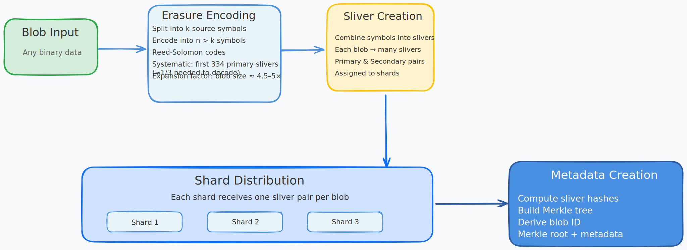

# Chunk Creation and Encoding

Understanding how blobs are encoded is crucial to understanding Walrus's data flow. This section covers the core encoding mechanism that transforms raw blob data into distributed slivers.

## Encoding Process

*[Excalidraw source file](../assets/chunk-creation-diagram.excalidraw.json) - Import into [Excalidraw.com](https://excalidraw.com) to view or edit*

The diagram illustrates the complete encoding flow:
- **Blob Input**: Original binary data
- **Erasure Encoding**: Split into k symbols, encode into n > k symbols using Reed-Solomon
- **Sliver Creation**: Combine symbols into sliver pairs (primary/secondary)
- **Shard Distribution**: Assign slivers to different shards
- **Metadata Creation**: Compute hashes, build Merkle tree, derive blob ID

When a blob is stored in Walrus:

1. **Blob Input**: The original blob data (can be any binary data)

2. **Erasure Encoding**: The blob is encoded using Walrus's bespoke erasure code (RedStuff):
   - The blob is split into `k` source symbols
   - These symbols are encoded into `n > k` symbols using Reed-Solomon codes
   - The encoding is **systematic**, meaning some storage nodes hold part of the original blob
   - Only 1/3 of symbols are needed to reconstruct the blob

3. **Sliver Creation**: 
   - Multiple symbols are combined into a **sliver**
   - Each blob produces many slivers
   - Slivers are assigned to different shards

4. **Shard Distribution**:
   - Each shard receives one sliver per blob
   - Storage nodes manage shards and store all slivers assigned to their shards

5. **Metadata Creation**:
   - Sliver hashes are computed
   - A Merkle tree is constructed from sliver hashes
   - The blob ID is derived from the Merkle root and other metadata

## Encoding Properties

- **Expansion factor**: Blob size expands by approximately 4.5-5x (independent of number of shards/nodes)
- **Deterministic**: Encoding is deterministic - same blob always produces same slivers and blob ID
- **Systematic**: First 334 primary slivers contain the (padded) unencoded data
- **Verifiable**: Sliver hashes allow verification of data authenticity

## Encoding Implementation

The encoding process is implemented in the `BlobEncoder`. See the core encoding function:
[`encode_with_metadata`](https://github.com/MystenLabs/walrus/blob/main/crates/walrus-core/src/encoding/blob_encoding.rs#L165-L185)

The encoding process:
1. Creates an expanded matrix from the blob data
2. Computes metadata (including blob ID) from the matrix
3. Writes secondary slivers from the matrix
4. Writes primary slivers from the matrix
5. Returns sliver pairs and verified metadata

The client SDK wraps this encoding. See the client wrapper:
[`encode_pairs_and_metadata`](https://github.com/MystenLabs/walrus/blob/main/crates/walrus-sdk/src/client.rs)

## Consistency Checks

Walrus provides multiple consistency check mechanisms:

- **Default check**: Verifies first 334 primary slivers match metadata
- **Strict check**: Re-encodes the blob and verifies the blob ID matches
- **Storage node checks**: Storage nodes can detect encoding inconsistencies and mark blobs as invalid

## Related Sections

- **[System Components](./components.md)** - Learn about Storage Nodes that store the encoded slivers
- **[Data Flow](./data-flow.md)** - See how encoding fits into the complete upload and retrieval flows
- **[Hands-On Walkthrough](./hands-on.md)** - Practice encoding and storing blobs

## Key Concepts

### Slivers

A **sliver** is a collection of symbols that belong to a specific shard. Each blob produces many sliver pairs (primary and secondary), and each shard stores one sliver pair per blob.

### Blob ID

The **blob ID** is a cryptographic identifier derived from:
- The Merkle root of all sliver hashes
- Blob metadata (size, encoding type, etc.)

The blob ID uniquely identifies the blob and allows verification of data authenticity.

### Systematic Encoding

Walrus uses **systematic encoding**, which means:
- Some storage nodes hold part of the original unencoded blob
- The first 334 primary slivers contain the (padded) original data
- This enables fast random-access reads without full reconstruction

### Erasure Coding

Walrus uses Reed-Solomon erasure coding with the following properties:
- Original blob is split into `k` source symbols
- Encoded into `n > k` total symbols
- Only 1/3 of symbols needed for reconstruction
- Provides redundancy and fault tolerance

## Key Points

- **Erasure Encoding** uses Reed-Solomon codes to split blobs into symbols and create redundancy
- **Expansion Factor** - Blob size expands by approximately 4.5-5x during encoding (independent of shard count)
- **Systematic Encoding** - First 334 primary slivers contain the (padded) unencoded data, enabling fast reads
- **Slivers** are collections of symbols assigned to specific shards - each blob produces many sliver pairs
- **Blob ID** is cryptographically derived from Merkle root of sliver hashes and blob metadata
- **Deterministic** - Same blob always produces same slivers and blob ID
- **Reconstruction** requires only 1/3 of symbols (334 primary slivers) to recover the original blob
- **Verifiable** - Sliver hashes allow verification of data authenticity at any point
