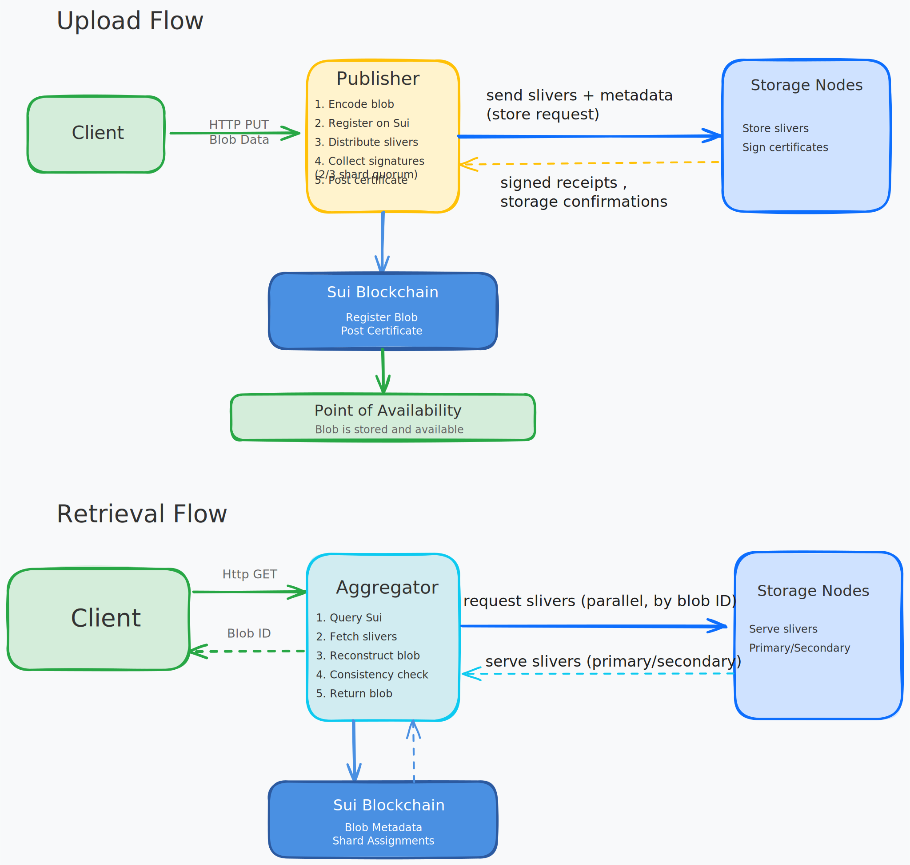

# Walrus Architecture Developer Curriculum

Welcome to the Walrus Architecture Developer Curriculum! This curriculum is designed to help developers understand the core components and data flows of the Walrus decentralized storage system.

*[Excalidraw source file](../assets/data-flow-diagram.excalidraw.json) - Import into [Excalidraw.com](https://excalidraw.com) to view or edit*

## Learning Objectives

By the end of this curriculum, you will be able to:

1. **Understand each system component** - Know the role and responsibilities of Publishers, Aggregators, and Storage Nodes
2. **Understand end-to-end data flow** - Trace how data moves from client upload to permanent storage and back through retrieval

## Curriculum Flow

Follow this recommended learning path:

1. **[System Components](./components.md)** - Start here to understand the building blocks of Walrus
   - Core component: Storage Nodes
   - Optional components: Publishers and Aggregators

2. **[Chunk Creation and Encoding](./chunk-creation.md)** - Learn how data is transformed
   - Encoding process and erasure coding
   - Sliver creation and blob ID computation

3. **[Data Flow](./data-flow.md)** - See how everything works together
   - Upload flow: Client → Publisher → Storage Nodes → Point of Availability
   - Retrieval flow: Client → Aggregator → Storage Nodes → Client

4. **[Hands-On Walkthrough](./hands-on.md)** - Practice what you've learned
   - Upload a blob and trace its journey
   - Retrieve a blob and see reconstruction in action

## Next Steps

Start with [System Components](./components.md) to understand the building blocks of Walrus, then learn about [Chunk Creation and Encoding](./chunk-creation.md) to understand how data is transformed, and finally proceed to [Data Flow](./data-flow.md) to see how everything works together.

## Key Points

- **Walrus Architecture** consists of core components (Storage Nodes) and optional infrastructure (Publishers, Aggregators)
- **Storage Nodes** form the decentralized storage infrastructure, managing shards and storing encoded slivers
- **Publishers** provide HTTP interfaces for blob uploads, handling encoding and distribution
- **Aggregators** reconstruct blobs from slivers and serve them via HTTP
- **Data Flow** involves encoding blobs into slivers, distributing to storage nodes, and reconstructing on retrieval
- **Erasure Coding** enables redundancy - only 1/3 of slivers needed for reconstruction
