# System Guarantees vs. Client Responsibilities

🟡 **Intermediate**

Understanding what Walrus **guarantees** versus what **you must verify** is critical for building secure applications. This section draws clear lines between system guarantees and client responsibilities.

## Trust Model

**Walrus operates on a "trust but verify" model:**

- **Trust**: The system's cryptographic guarantees and Byzantine fault tolerance
- **Verify**: Publishers and Aggregators are untrusted - clients should verify their work

---

## What The System Guarantees

These guarantees hold under the system's security assumptions (> 2/3 of storage nodes are honest).

### 1. Data Integrity

**Guarantee:** If you can retrieve a blob with a specific blob ID, the data is exactly what was originally uploaded with that blob ID.

**How it works:**
- Blob ID is cryptographically derived from sliver hashes (Merkle root)
- Any tampering changes the hash
- Consistency checks validate sliver hashes against metadata

**What this means:**
- You cannot retrieve corrupt data with a valid blob ID
- If blob ID matches, data is authentic
- Cryptographic proof of data integrity

**Client responsibility:**
- Verify the blob ID matches what you expect
- Use strict consistency checks for critical data

### 2. Byzantine Fault Tolerance

**Guarantee:** The system works correctly even if up to 1/3 of storage nodes are Byzantine (malicious, crashed, or faulty).

**How it works:**
- Erasure coding allows reconstruction from 1/3 of slivers (334 primary slivers)
- Certificate requires 2/3 quorum of signatures
- Clients only need 334/1000+ slivers to reconstruct
- System can tolerate 1/3 Byzantine nodes

**What this means:**
- Blob remains retrievable even with substantial node failures
- System handles malicious nodes automatically
- No single node or small group can compromise data

**Client responsibility:**
- None - system handles this automatically
- Trust that > 2/3 of nodes are honest (governed by Sui staking)

### 3. Availability (Point of Availability)

**Guarantee:** Once a blob reaches its "point of availability" (certificate posted on Sui), it is retrievable.

**How it works:**
- Publisher collects 2/3 signatures from storage nodes
- Certificate is posted on Sui blockchain
- Event emitted indicating blob is available
- Blob can now be reconstructed

**What this means:**
- After point of availability, you can always retrieve the blob
- Even if original client/publisher goes offline
- Blob is stored redundantly across the network

**Client responsibility:**
- Verify point of availability event exists on-chain
- Don't assume blob is available before certificate is posted

**Verification:**
```bash
# Check for blob object on Sui
sui client object <blob-object-id>

# Look for certified status and certificate information
```

### 4. Deterministic Encoding

**Guarantee:** Encoding the same blob always produces the same blob ID.

**How it works:**
- Encoding algorithm is deterministic
- Same input → same slivers → same hashes → same Merkle root → same blob ID
- Padding is deterministic

**What this means:**
- You can verify a publisher encoded correctly by re-encoding
- Two publishers encoding the same blob will get the same blob ID
- Blob ID serves as content-addressed identifier

**Client responsibility:**
- Re-encode blob to verify publisher's work
- Compare blob IDs to ensure correctness

**Verification:**
```bash
# Upload a file
BLOB_ID_1=$(walrus store file.txt | grep "blob ID" | awk '{print $3}')

# Upload the same file again
BLOB_ID_2=$(walrus store file.txt | grep "blob ID" | awk '{print $3}')

# Should be identical
[ "$BLOB_ID_1" = "$BLOB_ID_2" ] && echo "Deterministic encoding verified"
```

### 5. Storage Duration

**Guarantee:** Blobs are stored for the duration specified at upload time (in storage epochs).

**How it works:**
- Storage epochs are time periods (e.g., 2 weeks on mainnet)
- You pay for N epochs of storage
- Storage nodes must retain data for those epochs
- After epochs expire, blob may be deleted

**What this means:**
- You control how long data is stored
- Can extend storage epochs before expiration
- After expiration, no guarantee of availability

**Client responsibility:**
- Track storage epochs and extend before expiration
- Don't assume blobs last forever (unless marked permanent)

**Verification:**
```bash
# Check storage epochs
sui client object <blob-object-id> | grep -i epoch
```

### 6. Consistency Checks

**Guarantee:** Consistency checks (default or strict) will detect any data corruption or tampering.

**How it works:**
- **Default check**: Verifies first 334 primary sliver hashes match metadata
- **Strict check**: Re-encodes entire blob and verifies blob ID
- Hashes are cryptographically secure
- Merkle tree structure allows efficient verification

**What this means:**
- You can trust consistency check results
- If check passes, data is authentic
- If check fails, data is corrupt/tampered

**Client responsibility:**
- Choose appropriate consistency level (default vs. strict)
- For critical data, use strict consistency checks

---

## What The System Does NOT Guarantee

These are not guaranteed by the system - client must handle or verify independently.

### 1. Publisher/Aggregator Availability

**Not guaranteed:** Publishers and Aggregators will always be online and reachable.

**Why:** They're optional infrastructure, not core system components.

**Client responsibility:**
- Implement retry logic for network failures
- Use multiple publishers/aggregators (failover)
- Or use CLI directly to interact with storage nodes

### 2. Privacy

**Not guaranteed:** Blob data is private or confidential.

**Why:** Walrus is **public by default**. Anyone with the blob ID can retrieve the blob.

**Client responsibility:**
- Encrypt sensitive data client-side before uploading
- Manage encryption keys securely
- Don't rely on blob ID secrecy for security

**Critical example:**
```bash
# BAD: Uploading unencrypted sensitive data
walrus store sensitive-financial-data.csv

# GOOD: Encrypt first, then upload
openssl enc -aes-256-cbc -salt -in sensitive-data.csv -out encrypted.bin
walrus store encrypted.bin
# Only those with decryption key can read the data
```

### 3. Blob ID Secrecy

**Not guaranteed:** Keeping blob IDs secret provides security.

**Why:** Blob IDs may be discoverable (e.g., listed in blockchain events, guessed if predictable).

**Client responsibility:**
- Encrypt data if confidentiality is needed
- Don't rely on obscurity of blob ID
- Assume blob IDs can be enumerated or discovered

### 4. Publisher Encoded Correctly (Without Verification)

**Not guaranteed:** Publisher encoded your blob correctly without you checking.

**Why:** Publishers are untrusted infrastructure.

**Client responsibility:**
- Verify blob ID matches expectation
- Re-encode and compare blob IDs for critical data
- Check on-chain for point of availability event

### 5. Immediate Availability After Upload

**Not guaranteed:** Blob is available immediately after upload request returns.

**Why:** Certificate must be collected and posted to Sui first.

**Client responsibility:**
- Wait for point of availability event
- Check blob status on Sui before assuming it's available
- Handle case where upload succeeds but client doesn't see confirmation

### 6. Free Storage

**Not guaranteed:** Storage is free or costs won't change.

**Why:** Storage requires WAL tokens and gas (SUI).

**Client responsibility:**
- Budget for storage costs (WAL tokens per epoch)
- Budget for gas costs (SUI for transactions)
- Monitor costs and wallet balances

### 7. Unlimited Blob Size

**Not guaranteed:** You can store blobs of any size.

**Why:** System has maximum blob size limits (currently 13.3 GiB).

**Client responsibility:**
- Check blob size limits: `walrus info`
- Split large blobs into chunks if needed
- Implement chunking logic in your application

---

## Verification Checklist

What you should verify for critical operations:

### After Upload

- [ ] Blob object exists on Sui
```bash
sui client object <blob-object-id>
```

- [ ] Point of availability event emitted
```bash
# Check events on Sui for your transaction
```

- [ ] Blob is retrievable
```bash
walrus read <blob-id> > retrieved.txt
```

- [ ] Blob ID matches (re-encode verification)
```bash
ORIGINAL_ID=<blob-id>
RETRIEVED_ID=$(walrus store retrieved.txt | grep "blob ID" | awk '{print $3}')
[ "$ORIGINAL_ID" = "$RETRIEVED_ID" ] && echo "Verified"
```

### Before Trusting Retrieved Data

- [ ] Blob ID matches expectation
```
# Compare retrieved blob ID with what you expected
```

- [ ] Consistency check passed (default or strict)
```bash
# Use strict check for critical data
curl "http://aggregator.example.com/<blob-id>?consistency=strict"
```

- [ ] For encrypted data, decryption succeeds
```bash
# If data was encrypted, successful decryption indicates integrity
openssl enc -d -aes-256-cbc -in retrieved.bin -out decrypted.txt
```

---

## Trust Boundaries

Understanding where trust boundaries exist:

```mermaid
graph TB
    subgraph trusted["🔒 TRUSTED (Cryptographically Guaranteed)"]
        direction TB
        T1["✓ Sui Blockchain<br/>(consensus, smart contracts)"]
        T2["✓ Blob IDs<br/>(Merkle root, content-addressed)"]
        T3["✓ Consistency Checks<br/>(hash verification)"]
        T4["✓ Erasure Coding<br/>(mathematical guarantees)"]
        T5["✓ Byzantine Tolerance<br/>(> 2/3 honest assumption)"]
    end

    subgraph untrusted["⚠️ UNTRUSTED (Must Verify)"]
        direction TB
        U1["? Publishers<br/>(encode & distribute correctly?)"]
        U2["? Aggregators<br/>(reconstruct correctly?)"]
        U3["? Storage Nodes<br/>(individually untrusted, but<br/>collectively trusted)"]
        U4["? Network<br/>(reliable delivery?)"]
    end

    subgraph client["👤 CLIENT RESPONSIBILITY"]
        direction TB
        C1["☑ Verify blob IDs"]
        C2["☑ Implement retry logic"]
        C3["☑ Encrypt sensitive data"]
        C4["☑ Manage wallets and gas"]
        C5["☑ Handle errors gracefully"]
        C6["☑ Check on-chain state"]
    end

    style trusted fill:#d4edda,stroke:#28a745,stroke-width:3px,color:#000
    style untrusted fill:#fff3cd,stroke:#ffc107,stroke-width:3px,color:#000
    style client fill:#cce5ff,stroke:#007bff,stroke-width:3px,color:#000
```



---

## Security Best Practices

### For All Applications

1. **Always verify blob IDs** for uploaded/retrieved data
2. **Use strict consistency checks** for critical data
3. **Encrypt sensitive data** client-side before upload
4. **Check on-chain state** after operations (especially after timeouts)
5. **Implement retry logic** for transient failures

### For High-Security Applications

1. **Use direct CLI/SDK** instead of untrusted publishers
2. **Run your own aggregator** to control reconstruction
3. **Always use strict consistency checks** (performance cost acceptable)
4. **Log all operations** for audit trail
5. **Monitor on-chain events** for your blobs
6. **Implement end-to-end encryption** with secure key management

### For Performance-Sensitive Applications

1. **Use default consistency checks** (faster than strict)
2. **Trust reputable publishers/aggregators** (with periodic verification)
3. **Cache blob IDs** to avoid re-verification
4. **Use aggregator caching** for frequently accessed blobs
5. **Verify periodically** rather than every operation

---

## Comparison Table

| Aspect | System Guarantees | Client Must Verify/Handle |
|--------|-------------------|---------------------------|
| **Data Integrity** | ✅ Cryptographic guarantee via blob ID | Verify blob ID matches expectation |
| **Byzantine Tolerance** | ✅ Works with 1/3 Byzantine nodes | Trust > 2/3 honest assumption |
| **Availability** | ✅ After point of availability | Check point of availability event |
| **Encoding Correctness** | ✅ Deterministic algorithm | Re-encode to verify publisher |
| **Publisher Honesty** | ❌ Not guaranteed | Verify work via blob ID |
| **Aggregator Honesty** | ❌ Not guaranteed | Verify via consistency checks |
| **Privacy** | ❌ Public by default | Encrypt data client-side |
| **Network Reliability** | ❌ Not guaranteed | Implement retries |
| **Immediate Availability** | ❌ After certificate posted | Wait for confirmation |
| **Storage Costs** | ❌ Requires WAL + SUI | Budget and monitor costs |
| **Blob Size** | ❌ Limited to 13.3 GiB | Split large blobs into chunks |

---

## Key Points

### System Guarantees
- **Data integrity**: Blob ID cryptographically guarantees authenticity
- **Byzantine fault tolerance**: Works with up to 1/3 malicious nodes
- **Availability**: Guaranteed after point of availability (certificate posted)
- **Deterministic encoding**: Same blob → same blob ID always
- **Storage duration**: Guaranteed for paid epochs
- **Consistency checks**: Detect any corruption or tampering

### Not Guaranteed (Client Must Handle)
- **Publisher/Aggregator availability**: Implement retries
- **Privacy**: Encrypt sensitive data client-side
- **Publisher honesty**: Verify by re-encoding
- **Immediate availability**: Check on-chain before assuming available
- **Free storage**: Requires WAL tokens and gas
- **Unlimited size**: Max 13.3 GiB, split if needed

### Client Responsibilities
- **Verify blob IDs**: For all critical operations
- **Implement retries**: For network/transient failures
- **Encrypt data**: If confidentiality needed
- **Check on-chain**: After uploads and on timeouts
- **Choose consistency level**: Default vs. strict based on needs
- **Manage wallet**: Budget for costs, monitor balance

## Next Steps

Now that you understand system guarantees and client responsibilities, proceed to [Control Boundaries](./04-control-boundaries.md) to learn what the CLI vs. SDKs control.
