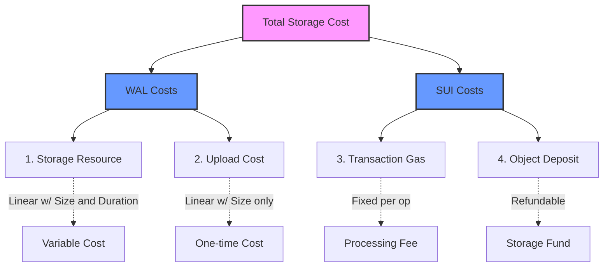
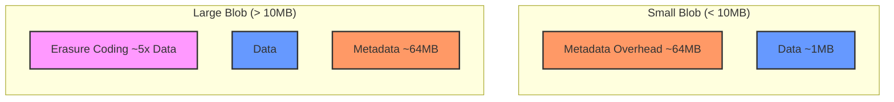

# Cost Model

This section explains the fundamental cost structure of storing data on Walrus. Understanding these costs is essential for accurate cost estimation and optimization.

## The Four Sources of Cost



Storing blobs on Walrus involves four distinct sources of cost:

### 1. Storage Resources

A storage resource is required to store a blob, with an appropriate capacity
and epoch duration. Storage resources can be:

- **Acquired from the system contract**: Purchased with WAL tokens when free
  space is available (see [`reserve_space`](https://github.com/MystenLabs/walrus/blob/main/contracts/walrus/sources/system/system_state_inner.move#L190-L205) and [`process_storage_payments`](https://github.com/MystenLabs/walrus/blob/main/contracts/walrus/sources/system/system_state_inner.move#L424-L441) in the system contract)
- **Received from other parties**: Transferred or traded
- **Split from larger resources**: A larger resource can be split into smaller
  ones

The cost of acquiring a storage resource depends on:
- The encoded size of the blob (see [Encoded Size](#encoded-size))
- The number of epochs (storage duration)
- Current market prices

### 2. Upload Costs

Upon blob registration, WAL is charged to cover the costs of data upload.
This ensures that deleting blobs and reusing the same storage resource for
storing a new blob is sustainable for the system.

Upload costs are calculated in [`register_blob`](https://github.com/MystenLabs/walrus/blob/main/contracts/walrus/sources/system/system_state_inner.move#L311-L340) and are:
- Linear with the encoded size of the blob
- Independent of storage duration (charged once at upload time)
- Required even when reusing existing storage resources

### 3. Sui Transaction Costs

Storing a blob involves up to three on-chain actions on Sui:

1. **Acquire storage resource** (if needed) - `reserve_space`
1. **Register the blob** - `register_blob` (may be combined with step 1)
1. **Certify the blob** - `certify_blob`

These transactions incur SUI gas costs to cover computation. Transaction costs
are:
- Relatively independent of blob size (fixed overhead per transaction)
- Can be optimized by batching multiple operations in a single Programmable
  Transaction Block (PTB)
- Higher for `reserve_space` when acquiring resources for longer durations

### 4. On-Chain Object Costs

Walrus blobs are represented as Sui objects on-chain. Creating these objects:
- Sets aside SUI into the Sui storage fund
- Most of it is refunded when objects are deleted (burned) after they're no longer needed
- Objects are needed to manage blob lifecycle (extend, delete, add attributes)

**Important**: Burning the blob object on Sui does not delete the blob on
Walrus. It only reclaims the SUI storage fund deposit.

## Encoded Size

The size used for cost calculations is the **encoded size** of the blob, not the original unencoded size.

### What is Encoded Size?

The encoded size includes:

- **Erasure-coded blob size**: Approximately 5x the original blob size (due to
  erasure coding for redundancy)
- **Fixed metadata**: Approximately 61-64MB per blob (depends on number of shards)

### Calculating Encoded Size

You can calculate encoded size manually using the formulas below. This is useful for understanding cost drivers and estimating costs before storing blobs.

**Implementation Location:** [`crates/walrus-core/src/encoding/config.rs`](https://github.com/MystenLabs/walrus/blob/main/crates/walrus-core/src/encoding/config.rs)

#### Main Formula

```text
Encoded Size = (Number of Shards × Metadata Size per Shard) + Slivers Size
```

**Implementation:** [`encoded_blob_length_for_n_shards`](https://github.com/MystenLabs/walrus/blob/main/crates/walrus-core/src/encoding/config.rs#L285-L299)

---

#### Component Breakdown

The main formula has two components: **Metadata** and **Slivers**. Each component is calculated as follows:

##### 1. Metadata Size

**Total Metadata:**
```text
Total Metadata = Number of Shards × Metadata Size per Shard
```

**Metadata Size per Shard:**
```text
Metadata Size per Shard = (Number of Shards × 64 bytes) + 32 bytes
```

**Breakdown:**
- Hash digests: `Number of Shards × 32 bytes × 2` (primary + secondary hashes per shard)
- Blob ID: `32 bytes` (stored once per shard)

**Implementation:** [`metadata_length_for_n_shards`](https://github.com/MystenLabs/walrus/blob/main/crates/walrus-core/src/encoding/config.rs#L250-L260)

**Note:** `DIGEST_LEN = 32` bytes, `BlobId::LENGTH = 32` bytes

---

##### 2. Slivers Size

**Total Slivers:**
```text
Slivers Size = Number of Shards × Single Shard Slivers Size
```

**Single Shard Slivers Size:**
```text
Single Shard Slivers Size = (Primary Symbols + Secondary Symbols) × Symbol Size
```

**Implementation:** [`encoded_slivers_length_for_n_shards`](https://github.com/MystenLabs/walrus/blob/main/crates/walrus-core/src/encoding/config.rs#L301-L325)

---

#### Sub-Components for Slivers Calculation

To calculate slivers size, you need these sub-components:

##### Symbol Size

**Formula:**
```text
Symbol Size = ceil(Unencoded Size / Total Source Symbols) rounded up to alignment (2 bytes for RS2)
```

**Implementation:** [`utils::compute_symbol_size`](https://github.com/MystenLabs/walrus/blob/main/crates/walrus-core/src/encoding/config.rs)


**Note:** For RS2 encoding, symbol size must be a multiple of 2 bytes. If the calculated size is odd, it's rounded up to the next even number.

---

##### Total Source Symbols

**Formula:**
```text
Total Source Symbols = Primary Symbols × Secondary Symbols
```

**Implementation:** [`source_symbols_per_blob_for_n_shards`](https://github.com/MystenLabs/walrus/blob/main/crates/walrus-core/src/encoding/config.rs#L277-L283)

```rust
fn source_symbols_per_blob_for_n_shards(n_shards: NonZeroU16) -> NonZeroU32 {
    let (source_symbols_primary, source_symbols_secondary) = source_symbols_for_n_shards(n_shards);
    NonZeroU32::from(source_symbols_primary)
        .checked_mul(source_symbols_secondary.into())
        .expect("product of two u16 always fits into a u32")
}
```

**Primary/Secondary Symbols:** Calculated by [`source_symbols_for_n_shards`](https://github.com/MystenLabs/walrus/blob/main/crates/walrus-core/src/encoding/config.rs) based on Byzantine fault tolerance requirements.

---

#### Quick Reference: Calculation Order

1. Calculate **Primary/Secondary Symbols** from number of shards
2. Calculate **Total Source Symbols** = Primary × Secondary
3. Calculate **Symbol Size** = ceil(Unencoded Size / Total Source Symbols), aligned to 2 bytes
4. Calculate **Single Shard Slivers Size** = (Primary + Secondary) × Symbol Size
5. Calculate **Slivers Size** = Number of Shards × Single Shard Slivers Size
6. Calculate **Metadata Size per Shard** = (Number of Shards × 64) + 32
7. Calculate **Total Metadata** = Number of Shards × Metadata Size per Shard
8. Calculate **Encoded Size** = Total Metadata + Slivers Size

---

#### Test Cases

The implementation includes comprehensive test cases in [`config.rs`](https://github.com/MystenLabs/walrus/blob/main/crates/walrus-core/src/encoding/config.rs#L327-L420):

- [`test_encoded_size_reed_solomon`](https://github.com/MystenLabs/walrus/blob/main/crates/walrus-core/src/encoding/config.rs#L360-L380) - Tests encoded size calculations
- [`test_source_symbols_for_n_shards`](https://github.com/MystenLabs/walrus/blob/main/crates/walrus-core/src/encoding/config.rs#L382-L400) - Tests source symbol calculations
- [`test_sliver_size_for_blob`](https://github.com/MystenLabs/walrus/blob/main/crates/walrus-core/src/encoding/config.rs#L327-L358) - Tests sliver size calculations

#### Simplified Approximation

For quick estimates, you can use these approximations:

- **Small blobs (< 10MB)**: Encoded size ≈ **64MB** (dominated by metadata)
  - Note: This approximation is most accurate for very small blobs (< 1MB). For blobs closer to 10MB, the actual encoded size may be higher (e.g., ~84MB for 5MB, ~107MB for 10MB).
- **Large blobs (> 10MB)**: Encoded size ≈ **5 × Unencoded Size** (dominated by erasure coding)
  - Note: This approximation improves with blob size. For 100MB+ blobs, it's very accurate (~5.1x). For smaller large blobs (10-20MB), the ratio may be higher (~10x for 10MB).

#### Example Calculations

##### Example 1: Small Blob (1MB)

Given:

- Unencoded size: 1,048,576 bytes (1 MB)
- Number of shards: 1000 (typical for Mainnet)
- Encoding type: Reed-Solomon (RS2)

Step 1: Calculate primary and secondary source symbols

```text
For 1000 shards:
- max_byzantine = (1000 - 1) / 3 = 333
- Primary symbols = 1000 - 2 × 333 = 334
- Secondary symbols = 1000 - 333 = 667
- Total source symbols = 334 × 667 = 222,778
```

Step 2: Calculate metadata size

```text
Metadata per shard = (1000 × 64) + 32 = 64,032 bytes
Total metadata = 1000 × 64,032 = 64,032,000 bytes ≈ 61.07 MB
```

Step 3: Calculate slivers size

```text
Symbol size = ceil(1,048,576 / 222,778) = 5 bytes → 6 bytes (aligned to 2)
Single shard slivers = (334 + 667) × 6 = 6,006 bytes
Total slivers = 1000 × 6,006 = 6,006,000 bytes ≈ 5.73 MB
```

Step 4: Calculate total encoded size

```text
Encoded Size = 64,032,000 + 6,006,000 = 70,038,000 bytes ≈ 66.8 MB
```

##### Example 2: Large Blob (100MB)

Given:

- Unencoded size: 104,857,600 bytes (100 MB)
- Number of shards: 1000
- Primary symbols: 334, Secondary symbols: 667 (same as Example 1)

Using the simplified approximation:

```text
Encoded Size ≈ 5 × 100 MB = 500 MB
```

For more precise calculation:

```text
Symbol size = ceil(104,857,600 / 222,778) = 471 bytes → 472 bytes (aligned to 2)
Single shard slivers = (334 + 667) × 472 = 472,472 bytes
Total slivers = 1000 × 472,472 = 472,472,000 bytes ≈ 450.58 MB
Metadata: ~61.07 MB (same as Example 1)
Total: ~511.65 MB ≈ 512 MB
```

##### Example 3: Using Storage Units

Once you have the encoded size, calculate storage units. Storage units are used for billing and represent 1 MiB (1,048,576 bytes) each. The calculation always rounds **up** to the nearest whole unit.

**Formula:**
```text
Storage Units = ceil(Encoded Size in bytes / 1,048,576)
```

**For Example 1:**

The encoded size from Example 1 is 70,038,000 bytes (≈ 66.8 MB).

```text
Storage Units = ceil(70,038,000 / 1,048,576)
              = ceil(66.8)
              = 67 units
```

**Explanation:** Even though the blob is only 66.8 MB, it requires 67 storage units because you pay for complete units. The 0.8 MB fraction requires a full additional unit.

**For Example 2:**

The encoded size from Example 2 is 536,504,000 bytes (≈ 511.65 MB).

```text
Total encoded size = 64,032,000 + 472,472,000 = 536,504,000 bytes ≈ 511.65 MB
Storage Units = ceil(536,504,000 / 1,048,576)
              = ceil(511.65)
              = 512 units
```

**Explanation:**
- The actual encoded size is **511.65 MB** (not exactly 512 MB)
- However, storage units are calculated by dividing bytes by 1,048,576 and rounding **up**
- Since 511.65 MB is greater than 511 full units, it rounds up to **512 storage units**
- The heading "512 MB" refers to the rounded storage units (512 units × 1 MB each), not the exact encoded size

**Key Point:** Storage units always round up, so a blob that's 511.65 MB still requires 512 storage units for billing purposes.

#### Getting System Parameters

To perform accurate calculations, you need:

1. **Number of shards**: Check with `walrus info` command
1. **Encoding configuration**: Typically RS2 (Reed-Solomon) on Mainnet
1. **Current prices**: Use `walrus info` to get `storage_price_per_unit` and
   `write_price_per_unit`

For precise calculations, use the `--dry-run` flag:

```sh
walrus store <FILENAME> --epochs 1 --dry-run
```

This will show you the exact encoded size without storing the blob.

### Cost Implications



- **Small blobs (< 10MB)**: Costs are dominated by the fixed metadata overhead (~61-64MB depending on shard count)
- **Large blobs (> 10MB)**: Costs are dominated by the erasure-coded blob size (approximately 5x original size for large blobs)

For small blobs, grouping multiple files together can help amortize metadata costs across multiple blobs in a batch.

## Cost Calculation Formula

The total cost can be broken down as:

```text
Total Cost = Storage Resource Cost + Upload Cost + Transaction Costs + Object Costs
```

Where:

- **Storage Resource Cost** =
  `storage_units × price_per_unit × epochs` (see `process_storage_payments` in [`system_state_inner.move`](https://github.com/MystenLabs/walrus/blob/main/contracts/walrus/sources/system/system_state_inner.move#L424-L441))
- **Upload Cost** = `storage_units × write_price_per_unit` (see `register_blob` in [`system_state_inner.move`](https://github.com/MystenLabs/walrus/blob/main/contracts/walrus/sources/system/system_state_inner.move#L311-L340))
- **Transaction Costs** = SUI gas fees (relatively fixed per transaction)
- **Object Costs** = SUI storage fund deposit (mostly refundable)

### Storage Units

Storage units are calculated from encoded size:

```text
storage_units = ceil(encoded_size / 1_MiB)
```

Each storage unit is 1 MiB (1,048,576 bytes). Prices are defined in [`EpochParams`](https://github.com/MystenLabs/walrus/blob/main/contracts/walrus/sources/system/epoch_parameters.move#L6-L14).

## Measuring Costs

### Using CLI Commands

The most accurate way to measure costs is to perform a test store and observe the actual costs:

```sh
# Check current prices
walrus info
```

This displays:
- Price per encoded storage unit per epoch
- Write price per encoded storage unit
- Maximum blob size

### Dry Run Estimation

Estimate costs without submitting transactions:

```sh
# See the encoded size that will be used for cost calculations
walrus store <FILENAME> --epochs 1 --dry-run
```

The `--dry-run` flag shows the encoded size without submitting any transactions.

### Observing Actual Costs

To see actual costs for a real store:

```sh
# Store a blob (results in 2 transactions)
walrus store <FILENAME> --epochs 1
```

Then check the transaction details in a Sui explorer:

- First transaction: `reserve_space` + `register_blob` (affects both SUI and
  WAL balances)
- Second transaction: `certify_blob` (affects only SUI balance)

To observe storage rebate, burn the blob object:

```sh
walrus burn-blobs --object-ids <BLOB_OBJECT_ID>
```

## Cost Characteristics

### WAL Costs

- **Storage resources**: Linear with encoded size and epochs
- **Upload costs**: Linear with encoded size (independent of epochs)

### SUI Costs

- **Transaction gas**: Relatively fixed per transaction (slight increase with epochs for `reserve_space`)
- **Object storage**: Fixed per object (mostly refundable when burned)

### Rule of Thumb

- SUI costs of `register_blob` and `certify_blob` are independent of blob size
  or epoch lifetime
- WAL costs of `register_blob` are linear in the encoded size
- `reserve_space` has SUI costs that grow with epochs, and WAL costs linear
  with both encoded size and epochs

## Key Takeaways

- **Four cost sources**: Storage resources (WAL, scales with size × epochs), upload costs (WAL, one-time), transaction gas (SUI, fixed per op), object deposits (SUI, refundable)
- **Encoded size drives costs**: Costs are based on encoded size (~64MB metadata + ~5x erasure coding), not original file size
- **Small blobs are expensive per MB**: The ~64MB fixed metadata overhead dominates costs for files < 10MB
- **Storage units round up**: `storage_units = ceil(encoded_size / 1_MiB)` - a 66.8MB encoded blob requires 67 storage units
- **Use dry-run for estimates**: `walrus store --dry-run` shows exact encoded size without storing

## Next Steps

Now that you understand the cost model, learn about how [Storage Duration](./02-storage-duration.md) affects costs and optimization strategies.
