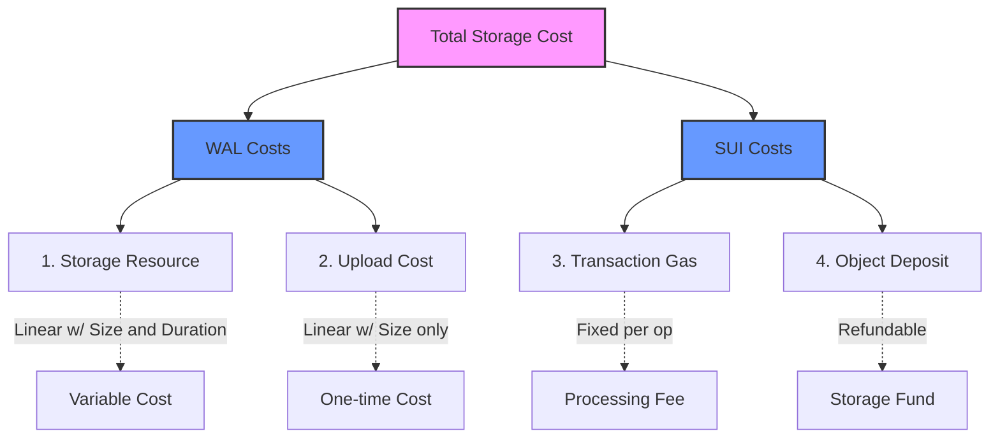
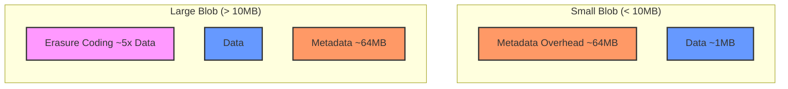

# Cost Model

This section explains the fundamental cost structure of storing data on Walrus. Understanding these costs is essential for accurate cost estimation and optimization.

## The Four Sources of Cost



Storing blobs on Walrus involves four distinct sources of cost:

### 1. Storage Resources

A storage resource is required to store a blob, with an appropriate capacity
and epoch duration. Storage resources can be:

- **Acquired from the system contract**: Purchased with WAL tokens when free
  space is available (see [`reserve_space`](https://github.com/MystenLabs/walrus/blob/main/contracts/walrus/sources/system/system_state_inner.move#L191-L205) and [`process_storage_payments`](https://github.com/MystenLabs/walrus/blob/main/contracts/walrus/sources/system/system_state_inner.move#L424-L441) in the system contract)
- **Received from other parties**: Transferred or traded
- **Split from larger resources**: A larger resource can be split into smaller
  ones

The cost of acquiring a storage resource depends on:

- The encoded size of the blob (see [Encoded Size](#encoded-size))
- The number of epochs (storage duration)
- Current market prices

### 2. Upload Costs

Upon blob registration, WAL is charged to cover the costs of data upload.
This ensures that deleting blobs and reusing the same storage resource for
storing a new blob is sustainable for the system.

Upload costs are calculated in [`register_blob`](https://github.com/MystenLabs/walrus/blob/main/contracts/walrus/sources/system/system_state_inner.move#L311-L340) and are:

- Linear with the encoded size of the blob
- Independent of storage duration (charged once at upload time)
- Required even when reusing existing storage resources

### 3. Sui Transaction Costs

Storing a blob involves up to three on-chain actions on Sui:

1. **Acquire storage resource** (if needed) - `reserve_space`
1. **Register the blob** - `register_blob` (may be combined with step 1)
1. **Certify the blob** - `certify_blob`

These transactions incur SUI gas costs to cover computation. Transaction costs
are:
- Relatively independent of blob size (fixed overhead per transaction)
- Can be optimized by batching multiple operations in a single Programmable
  Transaction Block (PTB)
- Higher for `reserve_space` when acquiring resources for longer durations

### 4. On-Chain Object Costs

Walrus blobs are represented as Sui objects on-chain. Creating these objects:
- Sets aside SUI into the Sui storage fund
- Most of it is refunded when objects are deleted (burned) after they're no longer needed
- Objects are needed to manage blob lifecycle (extend, delete, add attributes)

**Important**: Burning the blob object on Sui does not delete the blob on
Walrus. It only reclaims the SUI storage fund deposit.

## Encoded Size

The size used for cost calculations is the **encoded size** of the blob, not the original unencoded size.

### What is Encoded Size?

The encoded size includes:

- **Erasure-coded blob size**: Approximately 5x the original blob size (due to
  erasure coding for redundancy)
- **Fixed metadata**: Approximately 64MB per blob (in the worst case)

### Calculating Encoded Size

You can calculate encoded size manually using the following formula. This is useful
for understanding cost drivers and estimating costs before storing blobs. The exact implementation can be found in [`crates/walrus-core/src/encoding/config.rs`](https://github.com/MystenLabs/walrus/blob/main/crates/walrus-core/src/encoding/config.rs).

#### Formula

```text
Encoded Size = (Number of Shards × Metadata Size per Shard) + Slivers Size
```

[reference](https://github.com/MystenLabs/walrus/blob/main/crates/walrus-core/src/encoding/config.rs#L783-L799)

Where:

**Total Metadata Size**:

```text
Total Metadata = Number of Shards × Metadata Size per Shard
```

[Reference](https://github.com/MystenLabs/walrus/blob/main/crates/walrus-core/src/encoding/config.rs#L727-L740)

Where **Metadata Size per Shard**:

```text
Metadata Size per Shard = (Number of Shards × 64 bytes) + 32 bytes
```

This includes:

- Hash digests: `Number of Shards × 32 bytes × 2` (primary + secondary hashes
  per shard)
- Blob ID: `32 bytes` (stored once per shard)

**Slivers Size**:

```text
Slivers Size = Number of Shards × Single Shard Slivers Size
```

**Single Shard Slivers Size**:

```text
Single Shard Slivers Size = (Primary Symbols + Secondary Symbols) × Symbol Size
```

**Symbol Size**:

```text
Symbol Size = ceil(Unencoded Size / Total Source Symbols) rounded up to alignment
```

#### Simplified Approximation

For quick estimates, you can use these approximations:

- **Small blobs (< 10MB)**: Encoded size ≈ **64MB** (dominated by metadata)
- **Large blobs (> 10MB)**: Encoded size ≈ **5 × Unencoded Size** (dominated by erasure coding)

#### Example Calculations

##### Example 1: Small Blob (1MB)

Given:

- Unencoded size: 1,048,576 bytes (1 MB)
- Number of shards: 1000 (typical for Mainnet)
- Encoding type: Reed-Solomon (RS2)

Step 1: Calculate metadata size

```text
Metadata per shard = (1000 × 64) + 32 = 64,032 bytes
Total metadata = 1000 × 64,032 = 64,032,000 bytes ≈ 64 MB
```

Step 2: Calculate slivers size

```text
For 1000 shards, typical symbol configuration:
- Primary symbols: ~32
- Secondary symbols: ~32
- Total source symbols: 32 × 32 = 1024

Symbol size = ceil(1,048,576 / 1024) = 1024 bytes (aligned)
Single shard slivers = (32 + 32) × 1024 = 65,536 bytes
Total slivers = 1000 × 65,536 = 65,536,000 bytes ≈ 65.5 MB
```

Step 3: Calculate total encoded size

```text
Encoded Size = 64,032,000 + 65,536,000 = 129,568,000 bytes ≈ 129.6 MB
```

##### Example 2: Large Blob (100MB)

Given:

- Unencoded size: 104,857,600 bytes (100 MB)
- Number of shards: 1000

Using the simplified approximation:

```text
Encoded Size ≈ 5 × 100 MB = 500 MB
```

For more precise calculation:

```text
Metadata: ~64 MB (same as Example 1)
Slivers: ~500 MB (5× expansion due to erasure coding)
Total: ~564 MB
```

##### Example 3: Using Storage Units

Once you have the encoded size, calculate storage units:

```text
Storage Units = ceil(Encoded Size / 1,048,576)
```

For Example 1 (129.6 MB):

```text
Storage Units = ceil(129,568,000 / 1,048,576) = ceil(123.6) = 124 units
```

For Example 2 (564 MB):

```text
Storage Units = ceil(564,000,000 / 1,048,576) = ceil(537.7) = 538 units
```

#### Getting System Parameters

To perform accurate calculations, you need:

1. **Number of shards**: Check with `walrus info` command
1. **Encoding configuration**: Typically RS2 (Reed-Solomon) on Mainnet
1. **Current prices**: Use `walrus info` to get `storage_price_per_unit` and
   `write_price_per_unit`

For precise calculations, use the `--dry-run` flag:

```sh
walrus store <FILENAME> --epochs 1 --dry-run
```

This will show you the exact encoded size without storing the blob.

### Cost Implications



- **Small blobs (< 10MB)**: Costs are dominated by the fixed metadata overhead (~64MB)
- **Large blobs (> 10MB)**: Costs are dominated by the erasure-coded blob size (5x original size)

This is why [Quilt storage](https://github.com/MystenLabs/walrus/blob/main/docs/book/usage/quilt.md) is recommended for small blobs
- it amortizes metadata costs across multiple blobs in a batch.

## Cost Calculation Formula

The total cost can be broken down as:

```text
Total Cost = Storage Resource Cost + Upload Cost + Transaction Costs + Object Costs
```

Where:

- **Storage Resource Cost** =
  `storage_units × price_per_unit × epochs` (see `process_storage_payments` in [`system_state_inner.move`](https://github.com/MystenLabs/walrus/blob/main/contracts/walrus/sources/system/system_state_inner.move))
- **Upload Cost** = `storage_units × write_price_per_unit` (see `register_blob` in [`system_state_inner.move`](https://github.com/MystenLabs/walrus/blob/main/contracts/walrus/sources/system/system_state_inner.move))
- **Transaction Costs** = SUI gas fees (relatively fixed per transaction)
- **Object Costs** = SUI storage fund deposit (mostly refundable)

### Storage Units

Storage units are calculated from encoded size:

```text
storage_units = ceil(encoded_size / 1_MiB)
```

Each storage unit is 1 MiB (1,048,576 bytes). Prices are defined in [`EpochParams`](https://github.com/MystenLabs/walrus/blob/main/contracts/walrus/sources/system/epoch_parameters.move).

## Measuring Costs

### Using CLI Commands

The most accurate way to measure costs is to perform a test store and observe the actual costs:

```sh
# Check current prices
walrus info
```

This displays:
- Price per encoded storage unit per epoch
- Write price per encoded storage unit
- Maximum blob size

### Dry Run Estimation

Estimate costs without submitting transactions:

```sh
# See the encoded size that will be used for cost calculations
walrus store <FILENAME> --epochs 1 --dry-run
```

The `--dry-run` flag shows the encoded size without submitting any transactions.

### Observing Actual Costs

To see actual costs for a real store:

```sh
# Store a blob (results in 2 transactions)
walrus store <FILENAME> --epochs 1
```

Then check the transaction details in a Sui explorer:

- First transaction: `reserve_space` + `register_blob` (affects both SUI and
  WAL balances)
- Second transaction: `certify_blob` (affects only SUI balance)

To observe storage rebate, burn the blob object:

```sh
walrus burn-blobs --object-ids <BLOB_OBJECT_ID>
```

## Cost Characteristics

### WAL Costs

- **Storage resources**: Linear with encoded size and epochs
- **Upload costs**: Linear with encoded size (independent of epochs)

### SUI Costs

- **Transaction gas**: Relatively fixed per transaction (slight increase with epochs for `reserve_space`)
- **Object storage**: Fixed per object (mostly refundable when burned)

### Rule of Thumb

- SUI costs of `register_blob` and `certify_blob` are independent of blob size
  or epoch lifetime
- WAL costs of `register_blob` are linear in the encoded size
- `reserve_space` has SUI costs that grow with epochs, and WAL costs linear
  with both encoded size and epochs

## Next Steps

Now that you understand the cost model, learn about how [Storage
Duration](./storage-duration.md) affects costs and optimization strategies.

