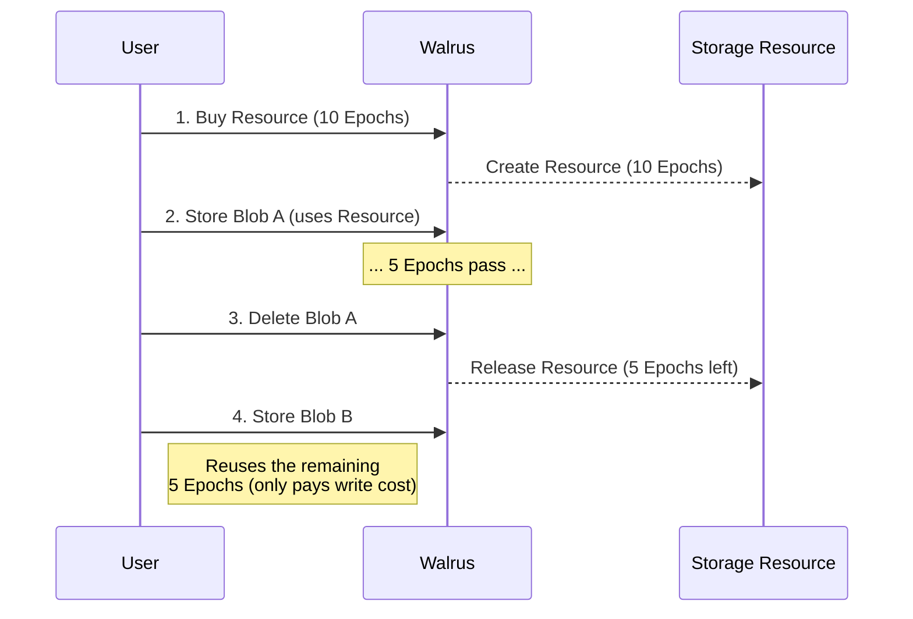

# Short Storage versus Extended Storage

This section explains how storage duration affects costs and when to use short-term versus extended storage strategies.

## Understanding Storage Duration

Storage duration in Walrus is measured in **epochs**. On Mainnet, each epoch is approximately two weeks. The duration you choose directly impacts:

- Storage resource costs (linear with epochs)
- Whether you can reuse storage resources
- Overall cost optimization strategies

## Short-Term Storage

Short-term storage refers to storing blobs for relatively few epochs (typically 1-5 epochs, or 2-10 weeks).

### Characteristics

- **Lower upfront cost**: Pay for fewer epochs
- **More frequent renewals**: Need to extend or re-upload if you need longer storage
- **Better for temporary data**: Documents, temporary files, cache data
- **Easier to optimize**: Can delete and reuse storage resources more frequently

### When to Use Short-Term Storage

- **Temporary data**: Files that are only needed for a limited time
- **Testing and development**: Experimental data that may be discarded
- **Uncertain duration**: When you're not sure how long data will be needed
- **Cost-sensitive applications**: When minimizing upfront costs is important

### Cost Considerations

- Lower initial storage resource cost
- May incur additional transaction costs if you need to extend later
- Can delete deletable blobs early to reclaim storage resources

### Example Use Cases

- **Web application cache**: Store cached data for a few weeks
- **Temporary uploads**: User-uploaded files that are processed and then deleted
- **Development builds**: Build artifacts that are replaced frequently
- **Event data**: Logs or metrics that are only needed temporarily

## Extended Storage

Extended storage refers to storing blobs for many epochs (typically 10+ epochs, or 20+ weeks).

### Characteristics

- **Higher upfront cost**: Pay for many epochs upfront
- **Fewer renewals**: Less frequent need to extend storage
- **Better for permanent data**: Archives, long-term records, important documents
- **Cost efficiency**: Can be more cost-effective per epoch for very long durations

### When to Use Extended Storage

- **Permanent archives**: Data that needs to be stored indefinitely
- **Compliance requirements**: Legal or regulatory data with retention requirements
- **Important records**: Critical data that must be preserved
- **Predictable needs**: When you know data will be needed for a long time

### Cost Considerations

- Higher initial storage resource cost
- Lower per-epoch cost when buying in bulk
- Fewer transaction costs (less frequent renewals)
- May want to burn blob objects early to reclaim SUI (if you don't need lifecycle management)

### Example Use Cases

- **Legal documents**: Contracts, compliance records
- **Medical records**: Patient data with retention requirements
- **Historical archives**: Long-term data preservation
- **Backup systems**: Disaster recovery data

## Cost Comparison

### Short-Term Storage Example

Storing a 10MB blob for 1 epoch:
- Storage resource: `storage_units × price_per_unit × 1 epoch`
- Upload cost: `storage_units × write_price_per_unit`
- Transaction costs: 2 transactions (reserve + register, certify)
- Object costs: SUI storage fund deposit

### Extended Storage Example

Storing the same 10MB blob for 20 epochs:
- Storage resource: `storage_units × price_per_unit × 20 epochs` (20x the short-term cost)
- Upload cost: `storage_units × write_price_per_unit` (same as short-term)
- Transaction costs: 2 transactions (same as short-term)
- Object costs: SUI storage fund deposit (same as short-term)

**Key insight**: Upload costs, transaction costs, and object costs are the same regardless of duration. Only storage resource costs scale with epochs.

## Storage Resource Reuse



One important optimization is **reusing storage resources** by deleting deletable blobs before they expire. This is enabled by [`delete_blob`](https://github.com/MystenLabs/walrus/blob/main/contracts/walrus/sources/system/system_state_inner.move#L365-L368) which returns the underlying [`Storage`](https://github.com/MystenLabs/walrus/blob/main/contracts/walrus/sources/system/storage_resource.move) resource.

### How It Works: Step-by-Step Explanation

#### Step 1: Understanding Storage Resources

When you store a blob, Walrus uses a **Storage Resource** object (of type [`Storage`](https://github.com/MystenLabs/walrus/blob/main/contracts/walrus/sources/system/storage_resource.move#L17-L23)) that contains:
- **storage_size**: The size of the blob
- *start_epoch**: The number of epochs purchased (e.g., 10 epochs)
- **end_epoch**: When this Storage will be expired.

This Storage Resource is a Sui object that you own and can transfer or reuse.

#### Step 2: Storing a Deletable Blob

First you call `register_blob`:

**Step 2a: The Wrapper Function** (`register_blob` in [`system.move`](https://github.com/MystenLabs/walrus/blob/682587efb05f915476d88b458eac8db1d0a24b33/contracts/walrus/sources/system.move#L129-L155))

```move
/// Registers a new blob in the system.
/// `size` is the size of the unencoded blob. The reserved space in `storage` must be at
/// least the size of the encoded blob.
public fun register_blob(
    self: &mut System,
    storage: Storage,
    blob_id: u256,
    root_hash: u256,
    size: u64,
    encoding_type: u8,
    deletable: bool,
    write_payment: &mut Coin<WAL>,
    ctx: &mut TxContext,
): Blob {
    self
        .inner_mut()
        .register_blob(
            storage,
            blob_id,
            root_hash,
            size,
            encoding_type,
            deletable,
            write_payment,
            ctx,
        )
}
```

This wrapper function delegates to `SystemStateInnerV1.register_blob()`.

**Step 2b: The Actual Implementation** (`register_blob` in [`system_state_inner.move`](https://github.com/MystenLabs/walrus/blob/682587efb05f915476d88b458eac8db1d0a24b33/contracts/walrus/sources/system/system_state_inner.move#L311-L340))

The actual implementation in `SystemStateInnerV1`:

```move
public(package) fun register_blob(
    self: &mut SystemStateInnerV1,
    storage: Storage,
    blob_id: u256,
    root_hash: u256,
    size: u64,
    encoding_type: u8,
    deletable: bool,
    write_payment_coin: &mut Coin<WAL>,
    ctx: &mut TxContext,
): Blob {
    let blob = blob::new(
        storage,
        blob_id,
        root_hash,
        size,
        encoding_type,
        deletable,
        self.epoch(),
        self.n_shards(),
        ctx,
    );
    let write_price = self.write_price(blob.encoded_size(self.n_shards()));
    let payment = write_payment_coin.balance_mut().split(write_price);
    let accounts = self.future_accounting.ring_lookup_mut(0).rewards_balance().join(payment);
    blob
}
```

**What this code does:**

1. **Creates the blob**: Calls `blob::new()` which takes the `Storage` resource, effectively transferring ownership to the new blob object.
2. **Calculates write price**: Determines the cost to write the blob based on its encoded size.
3. **Charges payment**: Splits the required amount from the provided `write_payment_coin`.
4. **Deposits rewards**: Adds the payment to the system's future accounting (rewards).

**Key Point**: The `Storage` resource is transferred to the blob object via `blob::new()`. You still pay the **write price** (upload cost) even when reusing a reclaimed Storage Resource, but you do **not** pay for storage capacity again.

#### Step 3: Deleting a Deletable Blob Early

When you call [`delete_blob`](https://github.com/MystenLabs/walrus/blob/main/contracts/walrus/sources/system/system_state_inner.move#L365-L368):

**Step 3a: The Wrapper Function** (`delete_blob` in `SystemStateInnerV1`)

```move
public(package) fun delete_blob(self: &SystemStateInnerV1, blob: Blob): Storage {
    blob.delete(self.epoch())
}
```

This wrapper function:
1. Gets the current epoch from the system state (`self.epoch()`)
2. Calls `blob.delete()` with the current epoch
3. Returns the `Storage` resource that `blob.delete()` returns

**Step 3b: The Actual Implementation** (`blob.delete()` in [`blob.move`](https://github.com/MystenLabs/walrus/blob/682587efb05f915476d88b458eac8db1d0a24b33/contracts/walrus/sources/system/blob.move#L236-L252))

```move
/// Deletes a deletable blob and returns the contained storage.
///
/// Emits a `BlobDeleted` event for the given epoch.
/// Aborts if the Blob is not deletable or already expired.
/// Also removes any metadata associated with the blob.
public(package) fun delete(mut self: Blob, epoch: u32): Storage {
    // 1. Remove any metadata associated with the blob
    dynamic_field::remove_if_exists<_, Metadata>(&mut self.id, METADATA_DF);
    
    // 2. Destructure the blob to extract its components
    let Blob {
        id,
        storage,
        deletable,
        blob_id,
        certified_epoch,
        ..,
    } = self;
    
    // 3. Verify the blob is deletable (aborts if not)
    assert!(deletable, EBlobNotDeletable);
    
    // 4. Verify the storage hasn't expired (aborts if expired)
    assert!(storage.end_epoch() > epoch, EResourceBounds);
    
    // 5. Get the object ID for the event
    let object_id = id.to_inner();
    
    // 6. Delete the blob object's UID
    id.delete();
    
    // 7. Emit the BlobDeleted event
    emit_blob_deleted(epoch, blob_id, storage.end_epoch(), object_id, certified_epoch.is_some());
    
    // 8. Return the Storage resource (with remaining epochs intact)
    storage
}
```

**What this code actually does:**

1. **Removes metadata**: Cleans up any metadata dynamic fields associated with the blob
2. **Destructures the blob**: Extracts the `storage` field (and other fields) from the blob struct
3. **Validates deletability**: Aborts if the blob is not deletable (permanent blobs cannot be deleted)
4. **Validates expiration**: Aborts if the storage has already expired (`storage.end_epoch() > epoch`)
5. **Deletes the blob object**: Removes the blob's UID (the Sui object is destroyed)
6. **Emits event**: Records the deletion event for tracking
7. **Returns Storage resource**: Returns the `storage` field, which contains:
   - The capacity (size)
   - The start epoch
   - **The end epoch** (which determines remaining epochs)

**Key Insight:** The Storage resource returned still has its original `end_epoch` value. The remaining epochs are calculated as `end_epoch - current_epoch`. The Storage resource itself doesn't need to be modified because:
- It already contains the `end_epoch` (when storage expires)
- The remaining epochs = `end_epoch - current_epoch`
- When you reuse it, the system checks if `current_epoch < end_epoch`

**Example:** If you stored a blob with storage ending at epoch 100, and you delete it at epoch 95, the returned Storage resource still has `end_epoch = 100`. The remaining 5 epochs (100 - 95) are implicit in the difference between the end epoch and when you use it.

#### Step 4: Reusing the Storage Resource

Now you have a Storage Resource with remaining epochs (e.g., 5 epochs left). You can reuse it:

**Option A: Store a new blob** (using [`register_blob`](https://github.com/MystenLabs/walrus/blob/682587efb05f915476d88b458eac8db1d0a24b33/contracts/walrus/sources/system.move#L129-L155) and [`system_state_inner.move`](https://github.com/MystenLabs/walrus/blob/682587efb05f915476d88b458eac8db1d0a24b33/contracts/walrus/sources/system/system_state_inner.move#L311-L340))

You can reuse your reclaimed Storage Resource by calling `register_blob()` again with the same Storage Resource:

```move
// From system.move (wrapper)
public fun register_blob(
    self: &mut System,
    storage: Storage,  // Your reclaimed Storage resource
    blob_id: u256,
    root_hash: u256,
    size: u64,
    encoding_type: u8,
    deletable: bool,
    write_payment: &mut Coin<WAL>,
    ctx: &mut TxContext,
): Blob {
    // Delegates to system_state_inner.register_blob()
    // which transfers the Storage resource to the new blob
}
```

**Important:**
- The Storage Resource must match the encoded size of the new blob
- You still pay the write cost (upload cost) for the new blob
- But you don't need to buy a new Storage Resource - you reuse the one you reclaimed!
- The Storage Resource's `end_epoch` determines how long the new blob will be stored

**Option B: Extend an existing blob** (Advanced)

You can also use a reclaimed Storage Resource to extend another blob, but this is more complex because the storage periods must be **contiguous**.

1. **The Challenge**: `extend_with_resource` requires the new storage to start exactly when the current blob's storage ends (`fuse_periods` checks for adjacency).
2. **The Solution**: If your reclaimed storage starts in the past (e.g., epoch 10) but you want to extend a blob that ends now (e.g., epoch 15), you must first use `walrus::storage_resource::split_by_epoch` to slice the storage resource.
   - Split [10, 20) at epoch 15 → returns [15, 20) and modifies original to [10, 15)
   - Use the [15, 20) piece to extend your blob
   - Destroy or discard the [10, 15) piece

This allows you to "top up" an existing blob with the remainder of a deleted blob's life.

### Why This Works

1. **Deletable vs Permanent**: Only deletable blobs can be deleted early. Permanent blobs cannot be deleted, so their Storage Resources cannot be reclaimed.

2. **Storage Resource Ownership**: The Storage Resource is a Sui object that you own. When stored with a blob, it's transferred but not destroyed. Deleting the blob returns it to you.

3. **Epoch Tracking**: The Storage Resource tracks remaining epochs. When you delete early, you get back the unused epochs.

4. **Size Matching**: Storage Resources must match in size (encoded size) to be reused. A resource for a 100MB blob can only be reused for another 100MB blob.

### Complete Example Flow

1. **Store a blob for 10 epochs as deletable**
   - Buy Storage Resource: 10 epochs, 100MB capacity
   - Store blob → Storage Resource transferred to blob

2. **Use the blob for 5 epochs**
   - 5 epochs pass
   - Blob still has 5 epochs remaining

3. **Delete the blob early** (reclaiming the storage resource)
   - Call `delete_blob()` → Returns Storage Resource with 5 epochs remaining
   - You now own the Storage Resource again

4. **Reuse the remaining 5 epochs** for a new blob
   - Call `register_blob()` with the reclaimed Storage Resource
   - No need to buy a new Storage Resource!
   - The new blob uses the remaining 5 epochs

### Benefits

- Only pay for the epochs you actually use
- Can optimize storage duration dynamically
- Reduces overall costs for temporary data

### Limitations

- Only works with deletable blobs (not permanent blobs)
- Requires active management (deleting blobs when done)
- Storage resources must match in size and have remaining epochs

## Choosing the Right Duration

### Decision Framework

Ask yourself:

1. **How long do I need this data?**
   - Known duration → Use that exact duration
   - Unknown duration → Start with shorter duration, extend as needed

2. **Is this data temporary or permanent?**
   - Temporary → Short-term storage (few epochs)
   - Permanent → Extended storage (many epochs)

3. **Can I delete this data early?**
   - Yes → Use deletable blobs with longer duration, delete when done
   - No → Use exact duration needed

4. **What's my budget constraint?**
   - Limited budget → Short-term storage, extend as needed
   - Budget available → Extended storage for cost efficiency

### Hybrid Approach

You can combine strategies:

- **Start short, extend later**: Store for a few epochs initially, extend if needed
- **Buy long, delete early**: Store for many epochs as deletable, delete when done to reuse
- **Mix strategies**: Use short-term for temporary data, extended for permanent data

## Cost Optimization Tips

### For Short-Term Storage

- Use deletable blobs so you can reclaim storage resources
- Delete blobs as soon as they're no longer needed
- Batch multiple short-term stores to reduce transaction costs
- Consider grouping small blobs together to amortize metadata costs

### For Extended Storage

- Buy storage resources in larger sizes to reduce per-unit costs
- Consider burning blob objects early if you don't need lifecycle management
- Plan ahead to avoid frequent extensions
- Use permanent blobs if you need guaranteed availability

## Next Steps

Now that you understand storage duration, learn about [Budget Planning](./budget-planning.md) for real projects and how to estimate costs for your specific use cases.
