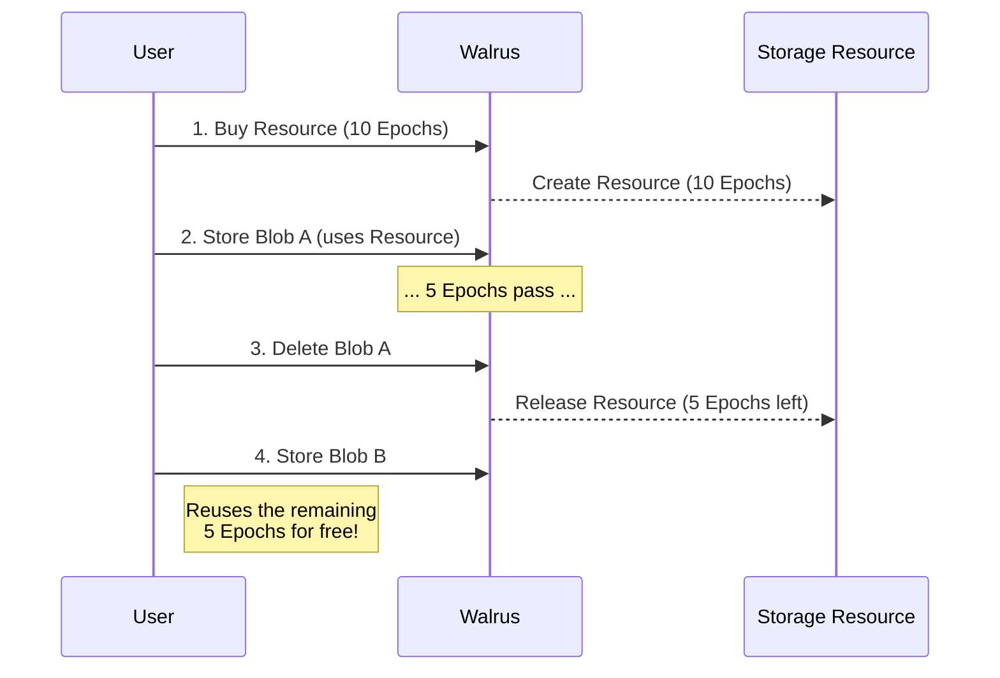

# Short Storage versus Extended Storage

This section explains how storage duration affects costs and when to use short-term versus extended storage strategies.

## Understanding Storage Duration

Storage duration in Walrus is measured in **epochs**. On Mainnet, each epoch is approximately two weeks. The duration you choose directly impacts:

- Storage resource costs (linear with epochs)
- Whether you can reuse storage resources
- Overall cost optimization strategies

## Short-Term Storage

Short-term storage refers to storing blobs for relatively few epochs (typically 1-5 epochs, or 2-10 weeks).

### Characteristics

- **Lower upfront cost**: Pay for fewer epochs
- **More frequent renewals**: Need to extend or re-upload if you need longer storage
- **Better for temporary data**: Documents, temporary files, cache data
- **Easier to optimize**: Can delete and reuse storage resources more frequently

### When to Use Short-Term Storage

- **Temporary data**: Files that are only needed for a limited time
- **Testing and development**: Experimental data that may be discarded
- **Uncertain duration**: When you're not sure how long data will be needed
- **Cost-sensitive applications**: When minimizing upfront costs is important

### Cost Considerations

- Lower initial storage resource cost
- May incur additional transaction costs if you need to extend later
- Can delete deletable blobs early to reclaim storage resources

### Example Use Cases

- **Temporary uploads**: User-uploaded files that are processed and then deleted
- **Development builds**: Build artifacts that are replaced frequently
- **Event data**: Logs or metrics that are only needed temporarily

## Extended Storage

Extended storage refers to storing blobs for many epochs (typically 10+ epochs, or 20+ weeks).

### Characteristics

- **Higher upfront cost**: Pay for many epochs upfront
- **Fewer renewals**: Less frequent need to extend storage
- **Better for permanent data**: Archives, long-term records, important documents
- **Cost efficiency**: Can be more cost-effective per epoch for very long durations

### When to Use Extended Storage

- **Permanent archives**: Data that needs to be stored indefinitely
- **Compliance requirements**: Legal or regulatory data with retention requirements
- **Important records**: Critical data that must be preserved
- **Predictable needs**: When you know data will be needed for a long time

### Cost Considerations

- Higher initial storage resource cost
- Lower per-epoch cost when buying in bulk
- Fewer transaction costs (less frequent renewals)
- May want to burn blob objects early to reclaim SUI (if you don't need lifecycle management)

### Example Use Cases

- **Legal documents**: Contracts, compliance records
- **Medical records**: Patient data with retention requirements
- **Historical archives**: Long-term data preservation
- **Backup systems**: Disaster recovery data

## Cost Comparison

### Short-Term Storage Example

Storing a 10MB blob for 1 epoch:

- Storage resource: `storage_units × price_per_unit × 1 epoch`
- Upload cost: `storage_units × write_price_per_unit`
- Transaction costs: 2 transactions (reserve + register, certify)
- Object costs: SUI storage fund deposit

### Extended Storage Example

Storing the same 10MB blob for 20 epochs:

- Storage resource: `storage_units × price_per_unit × 20 epochs` (20x the short-term cost)
- Upload cost: `storage_units × write_price_per_unit` (same as short-term)
- Transaction costs: 2 transactions (same as short-term)
- Object costs: SUI storage fund deposit (same as short-term)

**Key insight**: Upload costs, transaction costs, and object costs are the same regardless of duration. Only storage resource costs scale with epochs.

## Storage Resource Reuse

One important optimization is **reusing storage resources** by deleting deletable blobs before they expire. This is enabled by [`delete_blob`](https://github.com/MystenLabs/walrus/blob/main/contracts/walrus/sources/system/system_state_inner.move) which returns the underlying [`Storage`](https://github.com/MystenLabs/walrus/blob/main/contracts/walrus/sources/system/storage_resource.move) resource.

### How It Works

1. Store a blob for 10 epochs as deletable
2. Use the blob for 5 epochs
3. Delete the blob early (reclaiming the storage resource)
4. Reuse the remaining 5 epochs of storage for a new blob (using [`extend_blob_with_resource`](https://github.com/MystenLabs/walrus/blob/main/contracts/walrus/sources/system/system_state_inner.move))

### Benefits

- Only pay for the epochs you actually use
- Can optimize storage duration dynamically
- Reduces overall costs for temporary data

### Limitations

- Only works with deletable blobs (not permanent blobs)
- Requires active management (deleting blobs when done)
- Storage resources must match in size and have remaining epochs

## Choosing the Right Duration

### Decision Framework

Ask yourself:

1. **How long do I need this data?**
   - Known duration → Use that exact duration
   - Unknown duration → Start with shorter duration, extend as needed

2. **Is this data temporary or permanent?**
   - Temporary → Short-term storage (few epochs)
   - Permanent → Extended storage (many epochs)

3. **Can I delete this data early?**
   - Yes → Use deletable blobs with longer duration, delete when done
   - No → Use exact duration needed

4. **What's my budget constraint?**
   - Limited budget → Short-term storage, extend as needed
   - Budget available → Extended storage for cost efficiency

### Hybrid Approach

You can combine strategies:

- **Start short, extend later**: Store for a few epochs initially, extend if needed
- **Buy long, delete early**: Store for many epochs as deletable, delete when done to reuse
- **Mix strategies**: Use short-term for temporary data, extended for permanent data

## Cost Optimization Tips

### For Short-Term Storage

- Use deletable blobs so you can reclaim storage resources
- Delete blobs as soon as they're no longer needed
- Batch multiple short-term stores to reduce transaction costs
- Consider Quilt storage for small blobs

### For Extended Storage

- Buy storage resources in larger sizes to reduce per-unit costs
- Consider burning blob objects early if you don't need lifecycle management
- Plan ahead to avoid frequent extensions
- Use permanent blobs if you need guaranteed availability

## Next Steps

Now that you understand storage duration, learn about [Budget Planning](./budget-planning.md) for real projects and how to estimate costs for your specific use cases.
