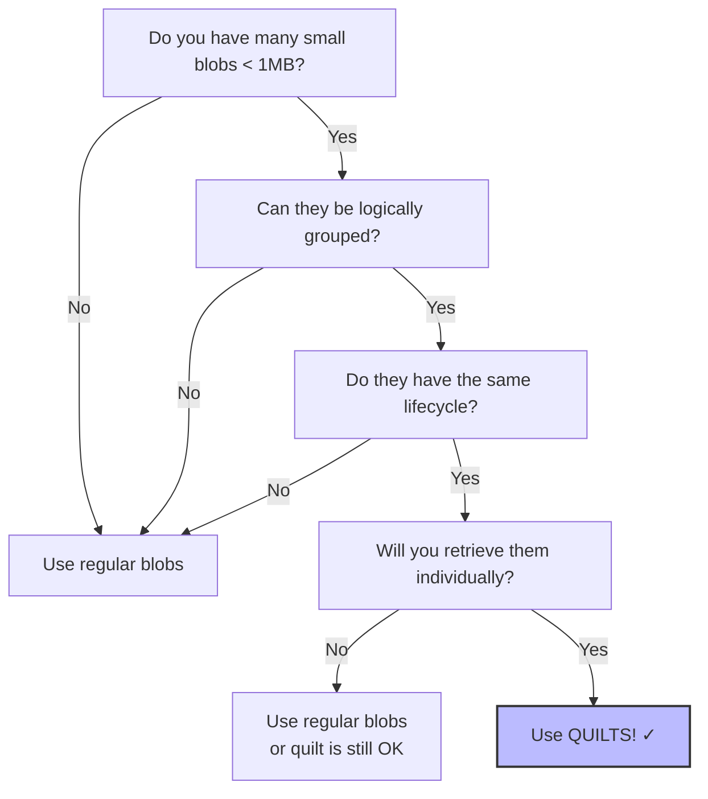

# What Quilts Solve

This section explains the problems that quilts address and when you should use them.

## The Problem: Small Blob Storage Inefficiency

Storing small blobs (typically less than 10MB) in Walrus using the standard blob storage method involves significant overhead relative to the actual data size. This inefficiency stems from two main sources:

### 1. Internal System Overhead

Every blob stored in Walrus has fixed overhead costs:

- **Metadata storage**: Each blob requires metadata on-chain (Sui objects)
- **Erasure coding overhead**: RedStuff encoding adds redundancy for reliability
- **Internal structures**: Slivers, shards, and indexing structures have minimum sizes
- **Merkle proof structures**: Cryptographic proofs for data integrity

For large blobs, this overhead is negligible. For small blobs, it dominates the cost.

**Example**: A 10KB blob might require 2.088 WAL for storage per epoch, while a 1MB blob requires only 2.208 WAL - not proportionally higher despite being 100x larger.

### 2. Sui Gas Fee Overhead

Each blob storage operation involves multiple Sui transactions:

- **Registration transaction**: Creates the blob object on Sui
- **Certification transaction**: Finalizes blob storage
- **Object storage**: Each blob is a Sui object with associated storage fees

When storing many small files individually, these gas fees add up significantly.

**Real-world impact**: In test runs, storing 600 files individually cost **238x more** in Sui gas fees compared to storing them as a single quilt.*

\* *Note: This comparison is based on storing 600 files as a single quilt versus storing them as individual blobs in batches of 25 on the Walrus Testnet. Reference: [Quilt Usage Guide](../../usage/quilt.md#lower-cost).*

## Cost Comparison

The following table demonstrates the dramatic cost savings quilts provide when storing 600 small blobs for 1 epoch:

| Blob Size | Regular Storage Cost | Quilt Storage Cost | Savings Factor |
|----------:|---------------------:|-------------------:|---------------:|
|      10KB |            6.615 WAL |          0.016 WAL |           413x |
|      50KB |            6.615 WAL |          0.037 WAL |           179x |
|     100KB |            6.615 WAL |          0.062 WAL |           107x |
|     200KB |            6.615 WAL |          0.113 WAL |            59x |
|     500KB |            6.825 WAL |          0.267 WAL |            26x |
|       1MB |            7.035 WAL |          0.535 WAL |            13x |

```admonish info
These costs are illustrative and from Testnet. Actual costs vary based on network parameters, but the relative savings remain substantial.

```
You can verify these costs on your current network using the [verification script](./hands-on-source-code/verify_costs.sh).

## Key Insight

**The smaller your blobs and the more you have, the greater the savings.**

## What Quilts Provide

Quilts solve these problems by:

1. **Batching Multiple Blobs**: Combine up to 666 blobs into a single storage unit
   - *Note*: This limit is derived from the current network configuration ($n=1000$ shards).
   - $n=1000, f=333 \rightarrow$ 667 secondary slivers.
   - 1 sliver reserved for index $\rightarrow$ 666 available for blobs.
2. **Reducing Overhead**: Share fixed costs across all blobs in the quilt
3. **Consolidating Transactions**: One set of transactions for all blobs
4. **Maintaining Individual Access**: Retrieve specific blobs without downloading the entire quilt

## Target Use Cases

### 1. Lower Cost Storage (Primary Use Case)

Quilts are ideal when you need to store many small files that can be logically grouped together:

- **NFT collections**: Store all NFT images/metadata for a collection
- **User assets**: Group all assets belonging to a user or session
- **Document collections**: Store related documents (e.g., all chapters of a book)
- **Application data**: Store configuration files, templates, or static assets

**When it works best**:
- Files are small (< 1MB each)
- You have many files (ideally 100+ for maximum savings)
- Files are naturally grouped or related
- You can accept that individual files cannot be deleted separately

### 2. Organizing Collections

Even beyond cost savings, quilts provide organizational benefits:

- **Logical grouping**: Keep related blobs together
- **Simplified management**: One blob ID represents an entire collection
- **Atomic operations**: Extend, delete, or share the entire collection at once
- **Version control**: Each quilt composition gets a unique ID

**Example**: An image gallery application storing user photo albums where each album is a quilt.

### 3. Walrus-Native Metadata

Quilts introduce immutable, custom metadata stored directly with your data:

- **Identifiers**: Unique names for each blob (up to 64KB)
- **Tags**: Key-value pairs for filtering and lookup
- **Efficient queries**: Find blobs by identifier or tag without reading all data
- **Lower cost than on-chain metadata**: Stored within Walrus, not on Sui

**Example**: Storing a documentation site where each page has an identifier (e.g., "intro.html") and tags (e.g., "chapter=1", "language=en").

## When NOT to Use Quilts

Quilts are not the right solution when:

### 1. Large Individual Files

If your files are already large (> 10MB), the overhead savings are minimal:

- 10MB+ blobs already have low overhead ratios
- Regular blob storage is simpler
- No operational restrictions

**Rule of thumb**: If your average file size is > 1MB and you have < 50 files, quilts may not provide significant benefits.

### 2. Independent File Lifecycles

If files need different lifecycles, quilts won't work:

- ❌ Some files need to be deleted while others remain
- ❌ Files have different expiration requirements
- ❌ Individual files need to be shared separately
- ❌ Files need to be extended independently

**Why**: Quilts only support operations on the entire quilt, not individual patches.

### 3. Dynamic Collections

If your collection changes frequently:

- ❌ Adding files over time (requires creating a new quilt)
- ❌ Removing specific files (impossible with quilts)
- ❌ Updating individual files (requires reconstructing the quilt)

**Alternative**: Use regular blobs with application-level collection management.

### 4. Content-Addressable Requirements

If you need deterministic BlobIds derived from content:

- ❌ QuiltPatchIds depend on the entire quilt, not individual blob content
- ❌ The same file in different quilts has different QuiltPatchIds
- ❌ Content deduplication across quilts is not possible

**Why**: QuiltPatchId = f(quilt_composition), not f(blob_content).

## Decision Framework

Use this flowchart to decide whether to use quilts:



## Real-World Examples

### ✅ Good Use Cases

1. **NFT Image Collection**: 500 profile pictures, 100KB each, grouped by collection
2. **Static Website**: 200 HTML/CSS/JS files, organized by site, deployed together
3. **User Documents**: 150 PDFs per user, grouped by user ID, same retention policy
4. **Game Assets**: 300 texture files for a game level, retrieved by asset name
5. **Data Pipeline Outputs**: 1000 JSON result files, grouped by processing batch

### ❌ Poor Use Cases

1. **Mixed File Sizes**: 5 large videos (1GB each) + 100 small thumbnails
   - *Why*: Large files don't benefit; store separately
   
2. **User Chat Messages**: Individual messages that users can delete
   - *Why*: Individual deletion required; use regular blobs
   
3. **Changing Collection**: Photo album where users frequently add/remove photos
   - *Why*: Dynamic modifications needed; use regular blobs
   
4. **Single Large Archive**: One 50MB zip file
   - *Why*: No grouping needed; use regular blob

## Code References

The quilt feature is implemented across several components:

### Core Implementation

- **Quilt encoding logic**: [`crates/walrus-core/src/encoding/quilt_encoding.rs`](https://github.com/MystenLabs/walrus/blob/main/crates/walrus-core/src/encoding/quilt_encoding.rs)
  - [`QuiltV1` struct definition](https://github.com/MystenLabs/walrus/blob/main/crates/walrus-core/src/encoding/quilt_encoding.rs#L927-L936): Defines the data structure of a quilt including data, row size, symbol size, and index.
  - [Version and configuration handling](https://github.com/MystenLabs/walrus/blob/main/crates/walrus-core/src/encoding/quilt_encoding.rs#L823-L837): Implements versioning and configuration traits for QuiltV1.

### SDK Implementation

#### Rust SDK
- **Quilt client**: [`crates/walrus-sdk/src/client/quilt_client.rs`](https://github.com/MystenLabs/walrus/blob/main/crates/walrus-sdk/src/client/quilt_client.rs)
  - [`get_all_blobs()` method](https://github.com/MystenLabs/walrus/blob/main/crates/walrus-sdk/src/client/quilt_client.rs#L681-L698): Implementation for retrieving all blobs from a quilt.
  - [Internal ID retrieval](https://github.com/MystenLabs/walrus/blob/main/crates/walrus-sdk/src/client/quilt_client.rs#L651-L679): Internal helper for fetching blob content by ID.

#### TypeScript SDK
- **Walrus Package**: [`@mysten/walrus`](https://github.com/MystenLabs/ts-sdks/tree/main/packages/walrus)
  - [`encodeQuilt` function](https://github.com/MystenLabs/ts-sdks/blob/main/packages/walrus/src/utils/quilts.ts): Utilities for creating quilts.
  - [`QuiltReader` class](https://github.com/MystenLabs/ts-sdks/blob/main/packages/walrus/src/files/readers/quilt.ts): Class for reading and retrieving data from quilts.
- **WASM Bindings**: [`@mysten/walrus-wasm`](https://github.com/MystenLabs/ts-sdks/tree/main/packages/walrus-wasm)

### CLI Commands

- **CLI arguments**: [`crates/walrus-service/src/client/cli/args.rs`](https://github.com/MystenLabs/walrus/blob/main/crates/walrus-service/src/client/cli/args.rs)
  - [`StoreQuilt` command](https://github.com/MystenLabs/walrus/blob/main/crates/walrus-service/src/client/cli/args.rs#L233-L264): CLI command structure for creating quilts.

## Key Takeaways

- Quilts solve the cost inefficiency of storing small blobs by sharing overhead across up to 666 files
- Individual files within a quilt can be retrieved efficiently without downloading the entire batch
- Best suited for static collections of small files (< 1MB) like NFT sets or documentation sites
- Not suitable for content that requires individual deletion or frequent updates
- Cost savings can be substantial (e.g., >400x for 10KB files) compared to individual storage

## Next Steps

Now that you understand what problems quilts solve, proceed to [How Data Is Linked](./02-how-data-is-linked.md) to learn about the technical structure of quilts.


