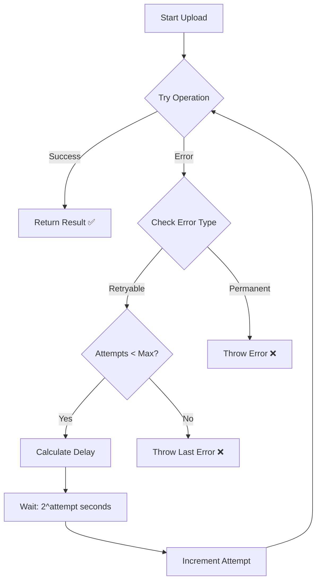

# 9. Retry Patterns

This lesson now mirrors the runnable code in
`hands-on-source-code/src/examples/retry-patterns.ts`. Every snippet below comes directly
from that verification project (or the Walrus SDK itself), so you can execute the exact code you see
here.

## Use the verification harness

### Docker workflow (this module)

```bash
cd docker
make build
PASSPHRASE="your passphrase here" make test-retry
```

### Local Node.js workflow (this module)

```bash
cd hands-on-source-code
npm install
PASSPHRASE="your passphrase here" npm run test:retry
```

The `test:retry` script uploads a small blob multiple times, exercising the basic and conditional
retry helpers so you can observe real Testnet behavior.

## Core retry helper (from the SDK)

Walrus ships with a reusable helper in `ts-sdks/packages/walrus/src/utils/retry.ts`. It is not
exported from the public bundle, so the verification repo copies the implementation verbatim:

```ts
export async function retry<T>(
  fn: () => Promise<T>,
  options: {
    condition?: (error: Error) => boolean;
    count?: number;
    delay?: number;
    jitter?: number;
  },
): Promise<T> {
  let remaining = options.count ?? 3;

  while (remaining > 0) {
    try {
      remaining -= 1;
      return await fn();
    } catch (error) {
      if (remaining <= 0 || (options.condition && !options.condition(error as Error))) {
        throw error;
      }

      if (options.delay) {
        await new Promise((resolve) =>
          setTimeout(
            resolve,
            (options.delay ?? 1000) + (options.jitter ? Math.random() * options.jitter : 0),
          ),
        );
      }
    }
  }

  throw new Error('Retry count exceeded');
}
```

## Basic upload retry

`uploadWithRetry()` wraps `client.walrus.writeBlob()` with the helper and increases the retry count:

```ts
const result = await retry(
  () =>
    client.walrus.writeBlob({
      blob,
      deletable: true,
      epochs: 3,
      signer: keypair,
    }),
  {
    count: 5,
    delay: 1000,
    jitter: 500,
  },
);
```

Run `npm run test:retry` (or the Docker command above) to see the blob ID that was uploaded with this
strategy.

## Conditional retries

Only retry errors that extend `RetryableWalrusClientError`:

```ts
return retry(
  () =>
    client.walrus.writeBlob({
      blob,
      deletable: true,
      epochs: 3,
      signer: keypair,
    }),
  {
    count: 5,
    delay: 1000,
    condition: (error) => error instanceof RetryableWalrusClientError,
  },
);
```

## Exponential backoff

Use exponential backoff when you need to give storage nodes time to recover:



```ts
const delay = Math.pow(2, attempt) * 1000;
await new Promise((resolve) => setTimeout(resolve, delay));
```

The verification script exposes `retryWithExponentialBackoff()` plus a convenience wrapper
`uploadWithExponentialBackoff()` so you can reuse the pattern directly.

## Retryable error classes

Walrus exports typed errors from `ts-sdks/packages/walrus/src/error.ts`, including:

- `NotEnoughBlobConfirmationsError` – quorum failure while writing.
- `NotEnoughSliversReceivedError` – read path cannot gather enough slivers.
- `NoBlobMetadataReceivedError` – metadata fetch failed across all nodes.
- `BlobNotCertifiedError` – blob is missing or expired.
- `InconsistentBlobError` – permanent encoding mismatch (never retry).

Import these classes from `@mysten/walrus` to distinguish retryable vs. permanent failures.

## Smart retry strategy

`uploadWithSmartRetry()` combines error classification with adaptive delays:

```ts
if (!(error instanceof RetryableWalrusClientError)) {
  throw error;
}

const delay =
  error instanceof NotEnoughBlobConfirmationsError ? 2000 * attempt : 1000 * attempt;
await new Promise((resolve) => setTimeout(resolve, delay));
```

Use this approach when you want longer waits for confirmation failures but faster retries for metadata
issues.

## Download retries

Reads benefit from the same helper:

```ts
return retry(
  () => client.walrus.readBlob({ blobId }),
  {
    count: 3,
    delay: 1000,
    condition: (error) =>
      error instanceof NotEnoughSliversReceivedError ||
      error instanceof NoBlobMetadataReceivedError,
  },
);
```

## Built-in helper inside the TS SDK

When you need custom retry logic but still want to reuse the SDK’s semantics, you can start from the
lightweight helper in `ts-sdks/packages/walrus/src/utils/retry.ts`. It isn’t exposed through the
package entry point, so the verification code in this module copies the implementation verbatim into
`hands-on-source-code/src/examples/retry-patterns.ts`:

```ts
const result = await retry(
  () =>
    client.walrus.writeBlob({
      blob,
      deletable: true,
      epochs: 3,
      signer: keypair,
    }),
  {
    count: 5,
    delay: 1_000,
    jitter: 500,
    condition: (error) => error instanceof RetryableWalrusClientError,
  },
);
```

Key points from the SDK helper:

- `count`, `delay`, and `jitter` align with the TypeScript examples above.
- `condition(error)` lets you skip retries for permanent failures.
- The same helper works for reads (`client.walrus.readBlob`) or any other async function.

Under the hood, the Walrus client also applies retries when epochs change (see
`client.ts` → `#retryOnPossibleEpochChange`), so you get automatic protection against stale committee
data even without wrapping calls yourself.

## Running the script

`npm run test:retry` executes the following block so you can inspect the logs and blob IDs:

```ts
console.log('=== Testing Basic Retry ===');
const result1 = await uploadWithRetry(data);

console.log('\n=== Testing Conditional Retry ===');
const result2 = await uploadWithConditionalRetry(data);
```

Feel free to extend the script or import its helpers into your own applications.

## Key takeaways

- The verification project for this module (`hands-on-source-code` plus the `docker/` harness)
  exercises every snippet in this document.
- Copy the SDK’s `retry` helper (or build on the version in `retry-patterns.ts`) to avoid
  reimplementing boilerplate.
- Always distinguish retryable vs. permanent failures using the exported Walrus error classes.
- Prefer exponential backoff to protect storage nodes.
- Use the same helper for downloads—focus on metadata/sliver errors and avoid retrying permanent failures.

## Next Lecture

Continue with [How to Handle Partial Failures](./10-partial-failures.md) to learn how the SDK tolerates
node outages and how to surface those edge cases in your own code.
