# 12. Hands-On Lab: Robust Upload Script

In this lab, you will write a robust upload script that uses the Upload Relay.
You will also add error handling and verify the upload end-to-end.

## Objectives

1. Write a script to upload a text file using the relay.
1. Add retry logic for `RetryableWalrusClientError`.
1. Verify the integrity of the uploaded content by downloading it immediately.

```mermaid
flowchart LR
    A[📝 Create Content] --> B[🚀 Upload with Retry]
    B -->|Success| C[📥 Download Blob]
    B -->|Error & Retryable| D[⏱️ Wait & Retry]
    D --> B
    B -->|Error & Permanent| E[❌ Fail]
    C --> F{🔍 Compare Content}
    F -->|Match| G[✅ Success]
    F -->|Mismatch| H[❌ Integrity Fail]

    style A fill:#e1f5ff
    style B fill:#fff4e1
    style C fill:#e8f5e9
    style G fill:#c8e6c9
    style H fill:#ffcdd2
    style E fill:#ffcdd2
```



## Running in Docker (Recommended for Consistent Results)

For a consistent environment across all operating systems, use the Docker setup in `docker/`:

```sh
# From this module's root directory
cd hands-on-source-code
cp .env.example .env
# Edit .env and set: PASSPHRASE="your testnet passphrase"
cd ../docker
make build
make test-hands-on

# Or run all tests
make test

# Interactive shell
make shell
```

> 💡 **Docker Benefits:**
>
> - Identical Node.js version across all systems
> - Pre-installed SDK dependencies
> - Consistent test results
> - No local environment conflicts

## Local Setup (Alternative)

If you prefer running locally without Docker, ensure you have the SDK installed:

```bash
npm install @mysten/walrus @mysten/sui
```

## Instructions

### Step 1: Create the Script (`lab-upload.ts`)

Copy the following template and fill in the TODOs.
If you're inside this module's `hands-on-source-code` project, keep the helper import as
`./utils/getFundedKeypair.js`; if you reuse this script in a different project, swap it for your own
keypair loader.

```typescript
import { getFullnodeUrl, SuiClient } from "@mysten/sui/client";
import { walrus, RetryableWalrusClientError } from "@mysten/walrus";
import { getFundedKeypair } from "../utils/getFundedKeypair.js";
// Replace the helper path with your own loader as needed.

// TODO: Initialize the client with uploadRelay config
const client = new SuiClient({
  url: getFullnodeUrl("testnet"),
  network: "testnet",
}).$extend(
  walrus({
    uploadRelay: {
      host: "https://upload-relay.testnet.walrus.space",
      sendTip: {
        max: 1_000, // optional but matches relay requirements in verification repo
      },
    },
  })
);

async function main() {
  const signer = await getFundedKeypair();
  const content = "Hands On Lab Content - " + Date.now();
  const file = new TextEncoder().encode(content);

  console.log("Starting upload...");

  let blobId: string | undefined;;
  let blobObject: any;

  // TODO: Wrap this in a capped retry loop to handle RetryableWalrusClientError
  const maxRetries = 3;
  let attempt = 0;

  while (attempt < maxRetries) {
    try {
      const result = await client.walrus.writeBlob({
        blob: file,
        deletable: true,
        epochs: 1,
        signer,
      });
      blobId = result.blobId;
      blobObject = result.blobObject;
      break;
    } catch (e) {
      attempt++;
      const error = e as Error;

      if (error instanceof RetryableWalrusClientError && attempt < maxRetries) {
        console.log(
          `Upload failed (attempt ${attempt}/${maxRetries}), retrying...`
        );
        await new Promise((resolve) => setTimeout(resolve, 1000 * attempt));
        continue;
      }

      throw e;
    }
  }

  if (!blobId) {
    throw new Error("Upload failed after retries");
  }

  console.log(`Uploaded: ${blobId}`);

  // TODO: Verification
  // 1. Read the blob back using client.walrus.readBlob
  // 2. Decode it to string
  // 3. Compare with original `content`

  const downloadedBytes = await client.walrus.readBlob({ blobId });
  const downloadedContent = new TextDecoder().decode(downloadedBytes);

  if (downloadedContent === content) {
    console.log("SUCCESS: Integrity verified!");
  } else {
    console.error(`Original length: ${content.length}, Downloaded length: ${downloadedContent.length}`);
    throw new Error('Content verification failed');
  }
}

main().catch(console.error);
```

### Step 2: Run and Test

Run your script.

**All Platforms:**

```bash
npx ts-node lab-upload.ts
```

Working inside the verification harness? You can run the maintained solution with:

**Mac/Linux:**

```bash
# Docker path (recommended: use .env, shared with Docker via volume)
cd hands-on-source-code
cp .env.example .env
# Edit .env and set: PASSPHRASE="your passphrase"
cd ../docker
docker-compose build
docker-compose run --rm sdk-relay-lab npm run test:hands-on

# Local Node path
cd ../hands-on-source-code
npm run test:hands-on
```

**Windows (PowerShell):**

```powershell
# Docker path (recommended: use .env, shared with Docker via volume)
cd hands-on-source-code
Copy-Item .env.example .env
# Edit .env and set: PASSPHRASE="your passphrase"
cd ..\docker
docker-compose build
docker-compose run --rm sdk-relay-lab npm run test:hands-on

# Local Node path
cd ..\hands-on-source-code
npm run test:hands-on
```

**Windows (Command Prompt):**

```cmd
:: Docker path (recommended: use .env, shared with Docker via volume)
cd hands-on-source-code
copy .env.example .env
REM Edit .env and set: PASSPHRASE="your passphrase"
cd ..\docker
docker-compose build
docker-compose run --rm sdk-relay-lab npm run test:hands-on

:: Local Node path
cd ..\hands-on-source-code
npm run test:hands-on
```

The canonical solution lives at
`hands-on-source-code/src/examples/hands-on-lab.ts`.
Compare your script against that file to confirm your retry loop,
tip configuration, and verification checks match the SDK guidance.

### Challenge

Modify the script to simulate a network error.
You can mock the client or throw an error manually to ensure the retry loop behaves as expected.

## Reference Material

- [Curriculum Overview](./index.md)
- [How the SDK Handles Chunk Creation](./01-chunk-creation.md)
- [How the SDK Interacts with Publishers and Aggregators](./02-publisher-aggregator-interaction.md)
- [What the Relay Does for Batching and Reliability](./03-relay-batching-reliability.md)
- [When to Use Relay](./04-when-to-use-relay.md)
- [When Not to Use Relay](./05-when-not-to-use-relay.md)
- [Basic Upload Example](./06-basic-upload-example.md)
- [Basic Download Example](./07-basic-download-example.md)
- [Integrity Checks](./08-integrity-checks.md)
- [Retry Patterns](./09-retry-patterns.md)
- [How to Handle Partial Failures](./10-partial-failures.md)
- [How to Surface Meaningful Errors to Callers](./11-error-handling.md)
