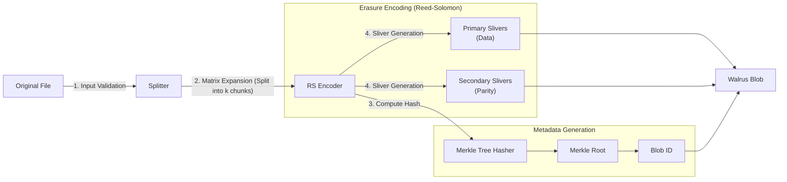

# 1. Chunk Creation & Encoding

In the Walrus protocol, files (blobs) are not stored as single contiguous files. Instead, they are processed through an **Erasure Encoding** pipeline that splits them into smaller pieces called **slivers**. This ensures redundancy and availability even if some storage nodes go offline.

## The Encoding Process

The encoding process uses **Reed-Solomon (RS)** encoding, specifically `RS(n, k)`, where:
- `k` is the number of source symbols (the original data).
- `n` is the total number of symbols generated (source + parity).

This allows the original data to be reconstructed from any `k` symbols out of the `n` total symbols.

### Reed-Solomon Parameters ($n, k$)

The parameters $n$ and $k$ are not arbitrary. They are derived from the system's **shard count** ($n$) and **Byzantine fault tolerance** settings ($f$), where $f = \lfloor(n-1)/3\rfloor$ (i.e., $f < n/3$).

-   **Primary Encoding**: $k_{primary} = n - 2f$
-   **Secondary Encoding**: $k_{secondary} = n - f$

This ensures data availability even in the presence of malicious nodes.

> **Codebase Note**: In the Rust implementation (`crates/walrus-core/src/encoding/config.rs`), these parameters are named `source_symbols_primary` and `source_symbols_secondary` respectively. The formula is computed using the `bft::max_n_faulty()` helper function.

**Example**: For a network with 1000 shards:
- $f = \lfloor(1000-1)/3\rfloor = 333$
- $k_{primary} = 1000 - 2 \times 333 = 334$ (primary source symbols needed for reconstruction)
- $k_{secondary} = 1000 - 333 = 667$ (secondary source symbols)

### Visualizing the Process



### Key Concepts

1.  **Slivers**: The fundamental unit of storage in Walrus.
    -   **Primary Slivers**: Contain the original data.
    -   **Secondary Slivers**: Contain parity data (redundancy) for error recovery.
2.  **Metadata**: Includes the blob ID, size, and the **Merkle Root** of the encoded symbols, which ensures integrity.
3.  **Blob ID**: Derived from the hash of the content, ensuring content-addressability.

## Detailed Encoding Process

The encoding pipeline executes the following steps for each blob:

1.  **Input Validation**:
    -   The client checks if the blob size exceeds the maximum allowed limit (e.g., based on the current protocol configuration).
    -   If multiple blobs are being encoded, the total size is checked.

2.  **Matrix Expansion (RS Encoding)**:
    -   The raw binary data is treated as a matrix of bytes.
    -   The `BlobEncoder` expands this matrix by adding "parity rows" based on the Reed-Solomon parameters.
    -   This step is computationally intensive and is often parallelized.

3.  **Metadata Computation**:
    -   While the matrix is being processed, the Merkle tree of the symbols is computed.
    -   The root hash of this tree becomes the core component of the **Blob ID**.
    -   This ensures that the ID is cryptographically bound to the content.

4.  **Sliver Generation**:
    -   The expanded matrix is sliced into **Primary Slivers** (original data) and **Secondary Slivers** (parity data).
    -   Each sliver is paired with its index and metadata.
    -   The output is a collection of `SliverPair` objects ready for distribution.

## Code Trace: Encoding Logic

The encoding logic resides primarily in `crates/walrus-core` and is orchestrated by the SDK.

### 1. SDK Entry Point
The process starts in `ts-sdks/packages/walrus/src/client.ts` with the `encodeBlob` method.

> **📖 Source Reference**: [`WalrusClient.encodeBlob()` (line ~1690)](https://github.com/MystenLabs/ts-sdks/blob/main/packages/walrus/src/client.ts#L1690) — This method retrieves the system state, extracts the shard count from the current committee, and calls the WASM bindings to perform the actual Reed-Solomon encoding. It returns the blob ID, metadata, root hash, and slivers organized by storage node.

### 2. Core Encoding Logic
The actual Reed-Solomon encoding happens via WASM bindings to the Rust `walrus-core` crate.

> **📖 Source Reference**: [`BlobEncoder.encode_with_metadata()`](https://github.com/MystenLabs/walrus/blob/9458057a23d89eaf9eccfa7b81bad93595d76988/crates/walrus-core/src/encoding/blob_encoding.rs#L277) — Core encoding function that transforms raw blob data into slivers with metadata.

**Pseudo Code**:
```
function encode_with_metadata(blob_data):
    // Step 1: Allocate systematic slivers based on encoding config
    primary_slivers = init_primary_slivers(n_shards)
    secondary_slivers = init_secondary_slivers(n_shards)

    // Step 2: Fill systematic slivers from the blob
    for each row in blob_rows(blob_data, n_columns):
        primary_slivers[row_index].symbols = row
    for each column in blob_columns(blob_data, n_rows):
        secondary_slivers[column_index].symbols = column

    // Step 3: Encode rows to generate non-systematic secondary slivers
    for each row in primary_slivers[0..n_rows]:
        parity_symbols = secondary_encoder.encode(row.symbols)
        write parity_symbols into secondary_slivers[n_columns..]

    // Step 4: Encode columns to generate non-systematic primary slivers
    //         and compute symbol hashes for metadata
    symbol_hashes = []
    for each column in secondary_slivers:
        encoded_symbols = primary_encoder.encode_all(column.symbols)
        update symbol_hashes with encoded_symbols
        if column is systematic:
            write recovery symbols into primary_slivers[n_rows..]

    // Step 5: Build metadata (includes blob_id) and return sliver pairs
    metadata = compute_metadata_from_symbol_hashes(symbol_hashes, unencoded_length)
    sliver_pairs = pair_primary_secondary(primary_slivers, secondary_slivers)
    return (sliver_pairs, metadata)
```

## Log Tracing

### TypeScript SDK
The TypeScript SDK does not emit debug logs by default. Monitor the `encodeBlob` function execution.

### Rust SDK / CLI
When running a Walrus client with debug logs enabled (`RUST_LOG=walrus_sdk=debug,walrus_core=debug`), look for these messages:

**In `walrus-core` (encoding layer)**:
-   `starting to encode blob with metadata` — encoding begins

**In `walrus-sdk` (client layer)**:
-   `finished blob encoding` — client has finished encoding (with duration)

These logs indicate that the local client has successfully transformed your file into the format required for the Walrus network.

> 💡 **Docker Tip:** Use `make trace-lifecycle` followed by `make grep-logs` to automatically search for these patterns. See the [docker/](../docker/) directory for setup.

## Key Takeaways

- **Client-Side Processing**: Files are encoded into slivers locally; raw data never leaves the client intact.
- **Erasure Encoding**: Reed-Solomon encoding creates redundancy (parity slivers), allowing data recovery even if nodes fail.
- **Blob ID Derivation**: The Blob ID is cryptographically derived from the content (Merkle root), ensuring content-addressability.
- **Metadata Generation**: Essential metadata, including the Merkle root and encoding parameters, is generated alongside the slivers.

