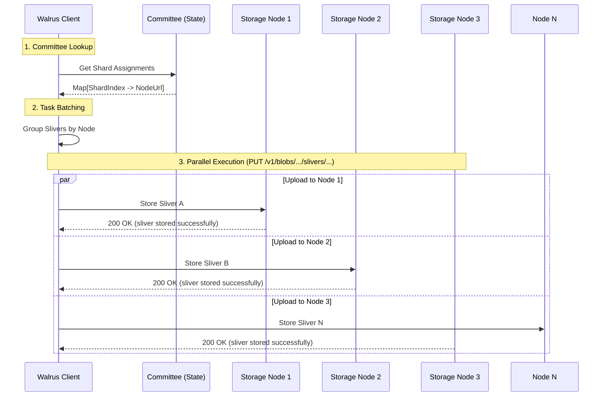

# 3. Sealing (Storing Slivers)

After successfully registering the blob on Sui, the client must distribute the encoded **slivers** to the storage nodes. This process involves sending HTTP requests to the storage nodes' public API endpoints.

## Distribution Process

The client sends specific slivers to specific storage nodes based on the **Shard Assignment**. Each storage node is responsible for a subset of the shards in the network.

1.  **Identify Nodes**: The client checks the current committee to see which node holds which shard.
2.  **Parallel Uploads**: To maximize throughput, the client uploads slivers to multiple nodes in parallel.
3.  **Store RPC**: The client calls the `store_sliver` endpoint on the storage node.

### Visualizing Sealing



## Detailed Sealing Process

The "Sealing" phase is where the actual data transfer happens.

1.  **Committee Lookup**:
    -   The client retrieves the current **Committee** information from the Sui system state.
    -   This maps each `ShardIndex` to a `NodeId`, which resolves to the node's network address (`NodeUrl`).

2.  **Task Batching (Partitioning)**:
    -   The client partitions the slivers based on their destination node.
    -   Each node receives only the slivers assigned to its shards.
    -   The client manages parallel connections to each node to upload these batches.

3.  **Parallel Execution**:
    -   The client spawns asynchronous tasks to upload to all nodes simultaneously.
    -   **TypeScript**: Uses `Promise.all` to execute `writeSliver` calls concurrently.
    -   **Rust**: Uses `FuturesUnordered` to manage concurrent uploads with rate limiting.
    -   **Robustness**: If a single node is slow or down, it doesn't immediately block other uploads (though 100% of nodes are usually targeted for durability).

4.  **`store_sliver` RPC**:
    -   The client sends an HTTP `PUT` request to `/v1/blobs/{blob_id}/slivers/{sliver_pair_index}/{sliver_type}`.
    -   **Payload**: The BCS-encoded bytes of the sliver.
    -   **Node Validation**: The receiving node:
        -   Checks if it is responsible for the shard.
        -   Verifies the sliver hash against the Blob ID (integrity check).
        -   Persists the sliver to its local database (e.g., RocksDB).

### Quilts
This process is identical for **Quilts**. A Quilt is simply a Walrus Blob that contains multiple aggregated files. The client constructs the Quilt locally, encodes it into slivers, and uploads those slivers to the same `/v1/blobs/...` endpoints.

## Code Trace: Storing Slivers

### Client Side
The logic for sending slivers is in `ts-sdks/packages/walrus/src/client.ts`.

```typescript
// ts-sdks/packages/walrus/src/client.ts

async writeSliver({ blobId, sliverPairIndex, sliverType, sliver, signal }: WriteSliverOptions) {
    const systemState = await this.systemState();
    const committee = await this.#getActiveCommittee();

    const shardIndex = toShardIndex(sliverPairIndex, blobId, systemState.committee.n_shards);
    const node = await this.#getNodeByShardIndex(committee, shardIndex);

    return this.#storageNodeClient.storeSliver(
        { blobId, sliverPairIndex, sliverType, sliver },
        { nodeUrl: node.networkUrl, signal },
    );
}
```

### Storage Node Side
The storage node receives the request and stores it. See `crates/walrus-service/src/node/server/routes.rs` (handler) and `crates/walrus-service/src/node.rs` (logic).

```rust
// crates/walrus-service/src/node/server/routes.rs

pub async fn put_sliver(...) -> ... {
    // ...
    state.service.store_sliver(blob_id, sliver_pair_index, sliver).await?;
    Ok(ApiSuccess::ok("sliver stored successfully"))
}

// crates/walrus-service/src/node.rs

pub(crate) async fn store_sliver_unchecked(...) -> Result<bool, StoreSliverError> {
    // ... checks shard assignment ...
    
    // Verifies the sliver against the metadata (integrity check)
    sliver.verify(&encoding_config, metadata.as_ref())?;
    
    // Stores the sliver in the database
    shard_storage.put_sliver(*metadata.blob_id(), sliver).await?;
    
    walrus_utils::with_label!(self.metrics.slivers_stored_total, sliver_type).inc();
    
    Ok(true)
}
```

## Log Tracing

### TypeScript SDK
The TypeScript SDK does not emit debug logs by default. Monitor the `writeSliver` promises.

### Rust SDK (Reference)
If using the Rust SDK (`crates/walrus-storage-node-client`), look for:
-   `starting to store sliver` (trace level)
-   `error storing sliver` (if something goes wrong)

### Storage Node Logs
-   Look for HTTP 200/201 responses with message: `sliver stored successfully`.
-   Metrics increments for `slivers_stored_total`.

This step ensures that the data is physically present on the network. However, the network doesn't *know* it's there yet until the proofs are submitted.

## Key Takeaways

- **Direct Data Transfer**: Slivers are uploaded directly to storage nodes via parallel HTTP `PUT` requests.
- **Shard Assignment**: Clients must respect the shard-to-node mapping defined by the current committee.
- **Node Validation**: Storage nodes actively verify sliver integrity against the Blob ID before accepting data.
- **Parallelism**: Uploads happen concurrently to maximize throughput and ensure data distribution.
