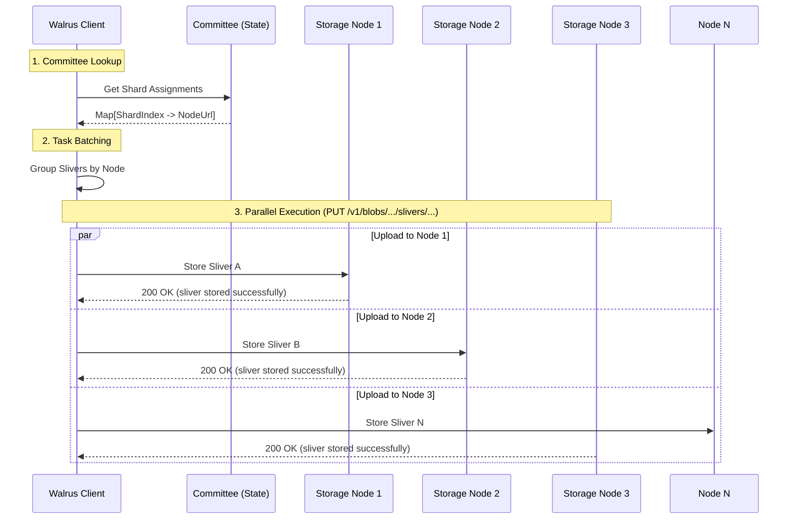

# 3. Sealing (Storing Slivers)

After successfully registering the blob on Sui, the client must distribute the encoded **slivers** to the storage nodes. This process involves sending HTTP requests to the storage nodes' public API endpoints.

## Distribution Process

The client sends specific slivers to specific storage nodes based on the **Shard Assignment**. Each storage node is responsible for a subset of the shards in the network.

1.  **Identify Nodes**: The client checks the current committee to see which node holds which shard.
2.  **Parallel Uploads**: To maximize throughput, the client uploads slivers to multiple nodes in parallel.
3.  **Store RPC**: The client calls the `store_sliver` endpoint on the storage node.

### Visualizing Sealing



## Detailed Sealing Process

The "Sealing" phase is where the actual data transfer happens.

1.  **Committee Lookup**:
    -   The client retrieves the current **Committee** information from the Sui system state.
    -   This maps each `ShardIndex` to a `NodeId`, which resolves to the node's network address (`NodeUrl`).

2.  **Task Batching (Partitioning)**:
    -   The client partitions the slivers based on their destination node.
    -   Each node receives only the slivers assigned to its shards.
    -   The client manages parallel connections to each node to upload these batches.

3.  **Parallel Execution**:
    -   The client spawns asynchronous tasks to upload to all nodes simultaneously.
    -   **TypeScript**: Uses `Promise.all` to execute `writeSliver` calls concurrently.
    -   **Rust**: Uses `FuturesUnordered` to manage concurrent uploads with rate limiting.
    -   **Robustness**: If a single node is slow or down, it doesn't immediately block other uploads (though 100% of nodes are usually targeted for durability).

4.  **`store_sliver` RPC**:
    -   The client sends an HTTP `PUT` request to `/v1/blobs/{blob_id}/slivers/{sliver_pair_index}/{sliver_type}`.
    -   **Payload**: The BCS-encoded bytes of the sliver.
    -   **Node Validation**: The receiving node:
        -   Checks if it is responsible for the shard.
        -   Verifies the sliver hash against the Blob ID (integrity check).
        -   Persists the sliver to its local database (e.g., RocksDB).

### Quilts
This process is identical for **Quilts**. A Quilt is simply a Walrus Blob that contains multiple aggregated files. The client constructs the Quilt locally, encodes it into slivers, and uploads those slivers to the same `/v1/blobs/...` endpoints.

## Code Trace: Storing Slivers

### Client Side
The logic for sending slivers is in `ts-sdks/packages/walrus/src/client.ts`.

> **📖 Source Reference**: [`WalrusClient.writeSliver()` (line ~1612)](https://github.com/MystenLabs/ts-sdks/blob/main/packages/walrus/src/client.ts#L1612) — This method:
> - Retrieves the current system state and active committee
> - Calculates the shard index from the sliver pair index using `toShardIndex()`
> - Looks up the responsible storage node by shard index
> - Delegates to the storage node client to perform the actual HTTP `PUT` request

### Storage Node Side
The storage node receives the request and stores it. See `crates/walrus-service/src/node/server/routes.rs` (handler) and `crates/walrus-service/src/node.rs` (logic).

> **📖 Source Reference**: [`put_sliver()` HTTP Handler](https://github.com/MystenLabs/walrus/blob/9458057a23d89eaf9eccfa7b81bad93595d76988/crates/walrus-service/src/node/server/routes.rs#L295) — Axum route handler that receives sliver upload requests.

**Pseudo Code**:
```
// HTTP PUT /v1/blobs/{blob_id}/slivers/{sliver_pair_index}/{sliver_type}
async function put_sliver(request):
    // Extract path parameters
    blob_id = request.path.blob_id
    sliver_pair_index = request.path.sliver_pair_index
    sliver_type = request.path.sliver_type  // "primary" or "secondary"

    // Optional upload intent (defaults to immediate)
    intent = request.query.pending ? "pending" : "immediate"

    // Decode sliver from request body (BCS encoded)
    sliver = decode_bcs(request.body, sliver_type)

    // Delegate to storage service
    stored = await service.store_sliver(blob_id, sliver_pair_index, sliver, intent)

    if stored:
        if intent == "pending":
            return HTTP_202("sliver buffered pending registration")
        return HTTP_201("sliver stored successfully")
    return HTTP_200("sliver already stored")
```

> **📖 Source Reference**: [`store_sliver_unchecked()`](https://github.com/MystenLabs/walrus/blob/9458057a23d89eaf9eccfa7b81bad93595d76988/crates/walrus-service/src/node.rs#L2920) — Core sliver storage logic with integrity verification.

**Pseudo Code**:
```
async function store_sliver_unchecked(metadata, sliver_pair_index, sliver):
    // Step 1: Resolve shard storage and verify shard assignment
    shard_storage = get_shard_for_sliver_pair(sliver_pair_index, metadata.blob_id)
    if not shard_storage.is_owned_by_node():
        return Error("Not responsible for this shard")

    // Step 2: Skip if sliver already stored
    if shard_storage.is_sliver_type_stored(metadata.blob_id, sliver.type):
        return false

    // Step 3: Verify sliver integrity against metadata
    verified_sliver = verify_sliver_against_metadata(metadata, sliver)

    // Step 4: Persist sliver to local database (RocksDB)
    await shard_storage.put_sliver(metadata.blob_id, verified_sliver)

    // Step 5: Update metrics
    metrics.slivers_stored_total.increment(verified_sliver.type)

    return true
```

## Log Tracing

### TypeScript SDK
The TypeScript SDK does not emit debug logs by default. Monitor the `writeSliver` promises.

### Rust SDK / CLI
If using the Rust SDK or CLI, look for these debug-level messages:
-   `sliver upload completed on node` — individual sliver stored on a node
-   `finished storing slivers on node` — all slivers for a node complete
-   `storing metadata and sliver pairs finished` — sealing phase complete for a blob

### Storage Node Logs
-   Look for HTTP 200/201 responses with message: `sliver stored successfully`.
-   Metrics increments for `slivers_stored_total`.

This step ensures that the data is physically present on the network. However, the network doesn't *know* it's there yet until the proofs are submitted.

> 💡 **Docker Tip:** The `make grep-logs` command searches for `sliver upload completed` and `finished storing slivers` patterns.

## Key Takeaways

- **Direct Data Transfer**: Slivers are uploaded directly to storage nodes via parallel HTTP `PUT` requests.
- **Shard Assignment**: Clients must respect the shard-to-node mapping defined by the current committee.
- **Node Validation**: Storage nodes actively verify sliver integrity against the Blob ID before accepting data.
- **Parallelism**: Uploads happen concurrently to maximize throughput and ensure data distribution.
