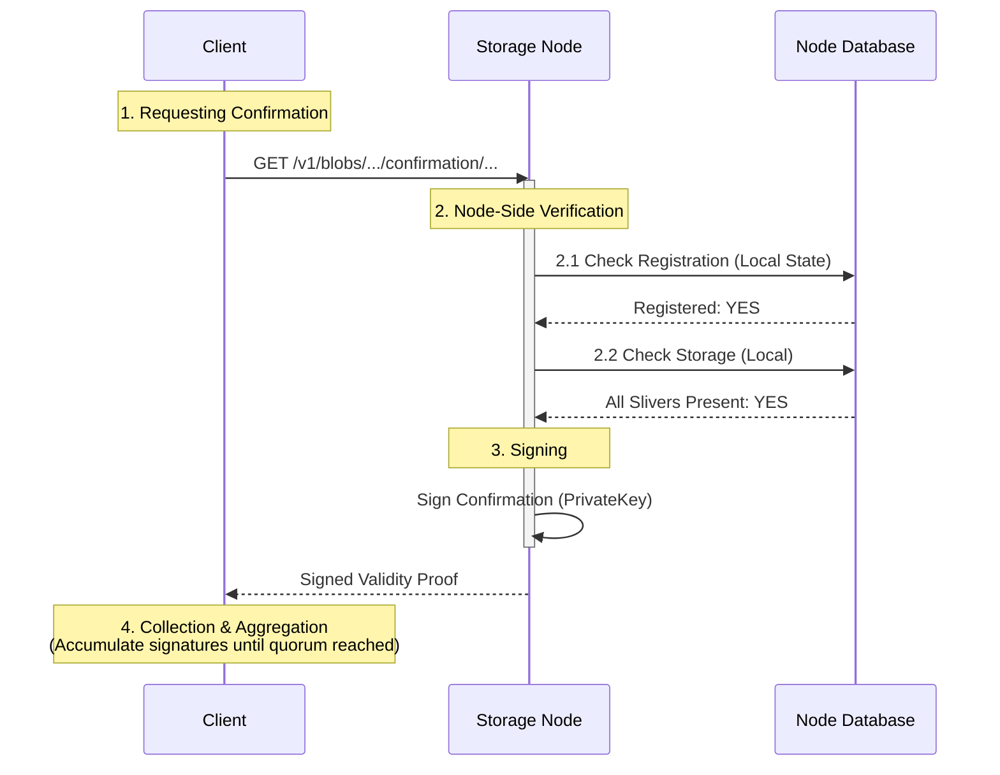

# 4. Proof Creation (Proof of Availability)

Once the slivers are stored on the nodes, the client must gather **validity proofs** (signatures) from the storage nodes. These signatures attest that the nodes have received and stored the data. Collectively, these signatures form a **Proof of Availability**.

## The Confirmation Request

The client asks each storage node to confirm that it holds the necessary shards for the blob. This is done via the `compute_storage_confirmation` RPC.

### Visualizing Proof Creation



## Detailed Proof Generation

This phase transforms "stored data" into "proven data".

1.  **Requesting Confirmation**:
    -   The client sends a `compute_storage_confirmation` request (via HTTP GET) to each node it successfully uploaded to.
    -   **Endpoint**: `/v1/blobs/{blob_id}/confirmation/permanent` (or `/deletable/{object_id}`).
    -   This is often done in the same session or immediately following the upload.

2.  **Node-Side Verification**:
    -   Upon receiving the request, the node performs two critical checks:
        1.  **Local Storage Check**: It queries its local database to ensure it has all the slivers assigned to its shards for that `BlobId`. If any are missing, it refuses to sign.
        2.  **On-Chain Registration Check**: It queries the Sui blockchain (or its local index of it) to confirm that the `BlobId` has been registered and paid for. This prevents spam/unpaid storage.

3.  **Signing**:
    -   If both checks pass, the node uses its **BLS Private Key** to sign a message.
    -   The message effectively says: "I, Node X, attest that I am storing the shards for Blob Y in Epoch Z."

4.  **Collection & Aggregation**:
    -   The client collects these signatures.
    -   It must collect enough signatures to meet the **Validity Threshold** (usually > 2/3 of the total voting power).
    -   These signatures can be aggregated into a single compact certificate.

## Code Trace: Proof Collection

### SDK Implementation (Client)

In `ts-sdks/packages/walrus/src/client.ts`, the client requests confirmations from nodes and then aggregates them.

```typescript
// ts-sdks/packages/walrus/src/client.ts

async getStorageConfirmationFromNode({
    nodeIndex,
    blobId,
    // ...
}: GetStorageConfirmationOptions) {
    const committee = await this.#getActiveCommittee();
    const node = committee.nodes[nodeIndex];

    const result = deletable
        ? await this.#storageNodeClient.getDeletableBlobConfirmation(...)
        : await this.#storageNodeClient.getPermanentBlobConfirmation(...);

    return result?.success?.data?.signed ?? null;
}

// Aggregation logic
async certificateFromConfirmations({ confirmations, ... }) {
    // ... validates signatures ...
    if (!isQuorum(filteredConfirmations.length, systemState.committee.members.length)) {
        throw new NotEnoughBlobConfirmationsError(...);
    }

    return bindings.combineSignatures(
        filteredConfirmations,
        filteredConfirmations.map(({ index }) => index),
    );
}
```

### Storage Node Logic

When a storage node receives this request, it checks its local database (embedded RocksDB):

1.  **Registration Check**: verifies the blob is registered on-chain (via synced local state).
2.  **Storage Check**: verifies it has all the required slivers for its assigned shards.
3.  **Signing**: If checks pass, it signs a confirmation message with its private key.

```rust
// crates/walrus-service/src/node.rs

async fn compute_storage_confirmation(...) {
    // 1. Check Registration (On-Chain/Local Index)
    ensure!(
        self.is_blob_registered(blob_id)?,
        ComputeStorageConfirmationError::NotCurrentlyRegistered,
    );

    // 2. Check Storage (Slivers Present)
    ensure!(
        self.is_stored_at_all_shards_at_latest_epoch(blob_id).await?,
        ComputeStorageConfirmationError::NotFullyStored,
    );
    
    // Sign the confirmation
    let signed = sign_message(confirmation, self.protocol_key_pair.clone()).await?;
    
    self.metrics.storage_confirmations_issued_total.inc();
    
    Ok(StorageConfirmation::Signed(signed))
}
```

## Aggregating Signatures

The client collects these signatures until it reaches a **quorum** (sufficient stake weight).

1.  **Stake Accumulation**: As valid signatures arrive, the client sums the voting power (shard ownership) of the signing nodes.
2.  **Threshold Check**:
    -   The system requires $2f + 1$ validity power (where total shards $n = 3f + 1$).
    -   This ensures $> 2/3$ of the network has stored the data.
3.  **Aggregation**: Once the threshold is met, the individual BLS signatures are aggregated into a single `ConfirmationCertificate`.

-   The Walrus protocol requires a supermajority of validity power to certify a blob.
-   The client aggregates these individual signatures into a single certificate or a list of signatures to submit to Sui.


## Log Tracing

### TypeScript SDK
The TypeScript SDK does not emit debug logs by default. Monitor the `certificateFromConfirmations` execution.

### Rust SDK (Reference)
If using the Rust SDK (`crates/walrus-sdk`), look for:
-   `get {n} blobs certificates` (indicating successful collection and aggregation)

### Storage Node Logs
-   Look for metrics updates on `storage_confirmations_issued_total`.

## Key Takeaways

- **Proof of Availability**: The aggregated BLS signatures form a certificate that cryptographically proves the data is available on the network.
- **Dual Verification**: Nodes verify both on-chain registration (payment) and local storage (data presence) before signing.
- **Cryptographic Assurance**: BLS signatures from nodes serve as the cryptographic proof of availability.
- **Quorum Requirement**: A sufficient weight of signatures (validity threshold) is required to proceed to certification.
