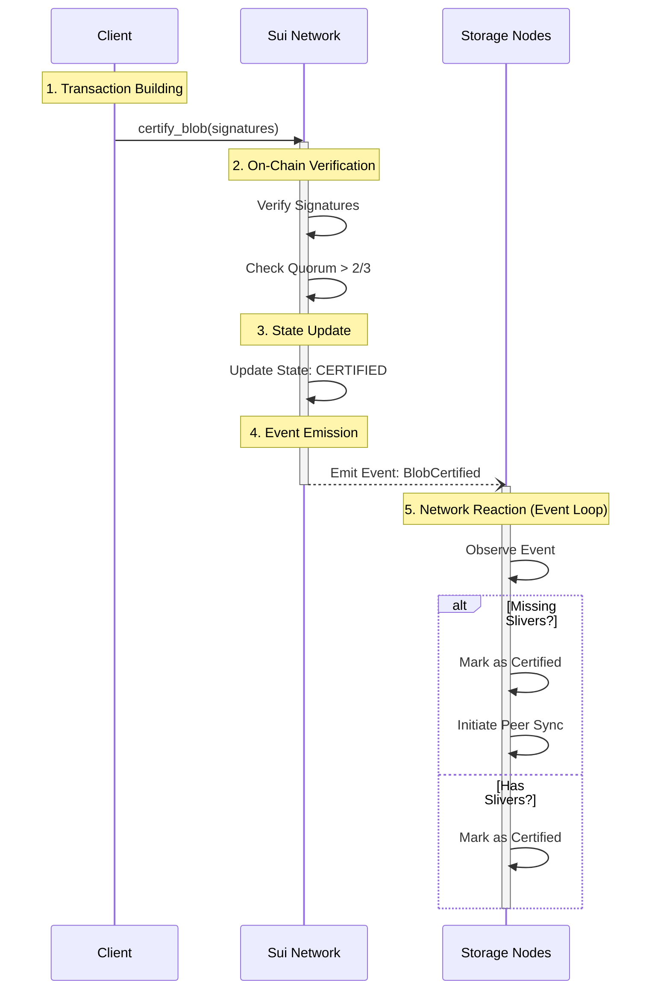

# 5. Storage Confirmation (Certification)

The final step in the upload lifecycle is **Certification**. The client submits the aggregated signatures to the Sui blockchain to prove that the blob is available and durable.

## The `certify_blob` Transaction

The client calls the `certify_blob` Move function on Sui.

1.  **Input**: The list of signatures from the storage nodes.
2.  **Validation**: The smart contract verifies the signatures against the current committee's public keys.
3.  **State Transition**: If valid, the `Blob` object's state changes from `Registered` to `Certified`.
4.  **Event Emission**: A `BlobCertified` event is emitted.

### Visualizing Certification



## Detailed Certification Process

This is the moment the file becomes "permanent" in the eyes of the network.

1.  **Transaction Building**:
    -   The client takes the aggregated signatures (or certificate) from the previous step.
    -   It constructs a new Sui transaction calling the **`certify_blob`** function in the Walrus system package.

2.  **On-Chain Verification**:
    -   The Sui validators execute the Move code (`bls_aggregate.move`).
    -   **Bitmap Analysis**: The code iterates through the `signers_bitmap` to identify which nodes signed.
    -   **Gas Optimization**: Instead of summing all signers, it sums the weights and keys of the *non-signers* and subtracts them from the total. This is cheaper because non-signers are fewer.
    -   **Threshold Check**: It verifies that `3 * voting_power >= 2 * total_shards + 1` (strictly > 2/3).
    -   **BLS Verification**: It performs a single cryptographic check of the aggregated signature against the aggregated public key.

3.  **State Update**:
    -   The `Blob` object on Sui is updated. Its status field changes from `Registered` to `Certified`.
    -   This marks the end of the upload transaction from the client's perspective. The client can now safely disconnect.

4.  **Event Emission**:
    -   Crucially, the contract emits a **`BlobCertified`** event.
    -   This event contains the Blob ID and the certification epoch.

5.  **Network Reaction (The Event Loop)**:
    -   Storage nodes constantly index events from the Sui blockchain.
    -   When they see `BlobCertified`, they update their local knowledge base.
    -   **Syncing**: If a node sees a blob is certified but realizes it *missed* the upload (e.g., it was offline during the `store_sliver` phase), it immediately initiates a **Peer Recovery** process to fetch the missing slivers from other nodes.

### SDK Implementation

In `ts-sdks/packages/walrus/src/client.ts`, the `certifyBlob` helper handles this:

```typescript
// ts-sdks/packages/walrus/src/client.ts

certifyBlob({ blobId, blobObjectId, confirmations, certificate, deletable }: CertifyBlobOptions) {
    return async (tx: Transaction) => {
        // ... combines signatures ...
        const combinedSignature = await this.certificateFromConfirmations({ ... });

        tx.add(
            certifyBlob({
                package: walrusPackageId,
                arguments: {
                    // ...
                    blob: blobObjectId,
                    signature: tx.pure.vector('u8', combinedSignature.signature),
                    signersBitmap: tx.pure.vector('u8', ...),
                    message: tx.pure.vector('u8', combinedSignature.serializedMessage),
                },
            }),
        );
    };
}
```

## System Response: Synchronization

Once the `BlobCertified` event is emitted on Sui, the storage nodes (which index Sui events) notice it.

-   **Event Processing**: Nodes process `BlobCertified`.
-   **Syncing**: Any node that missed slivers (e.g., if it was down during the upload) will now see the blob is certified and attempt to pull the missing slivers from its peers.

```rust
// crates/walrus-service/src/node/blob_event_processor.rs

async fn process_blob_certified_event(...) {
    // ...
    // If the node is missing data for this certified blob, initiate sync
    self.process_blob_certified_event(event_handle, event).await?;
    // ...
}
```

## Log Tracing

### TypeScript SDK
The TypeScript SDK does not emit debug logs by default. Monitor the `certifyBlob` transaction execution.

### Rust SDK (Reference)
If using the Rust SDK (`crates/walrus-sui` / `crates/walrus-sdk`), look for:
-   `certifying blob on Sui`
-   `certified {n} blobs on Sui`

### Sui Events
You can verify the certification by looking for the `BlobCertified` event in the transaction result or on a Sui explorer.

### Storage Node Logs
-   `process_blob_certified_event`
-   `skipping syncing blob during certified event processing` (if the node already has the data)
-   `sliver successfully synced` (if the node was missing data and recovered it)

The upload is now complete! The blob is immutable, durable, and available for retrieval.

## Key Takeaways

- **Finalization**: The `certify_blob` transaction on Sui marks the blob as permanently stored (`Certified` state).
- **On-Chain Validation**: The smart contract verifies the aggregated signatures against the committee's public keys.
- **Event-Driven Sync**: The `BlobCertified` event acts as a signal for nodes to synchronize missing data, ensuring system-wide consistency.
- **Immutability**: Once certified, the blob is immutable and guaranteed to be available for the paid duration.

