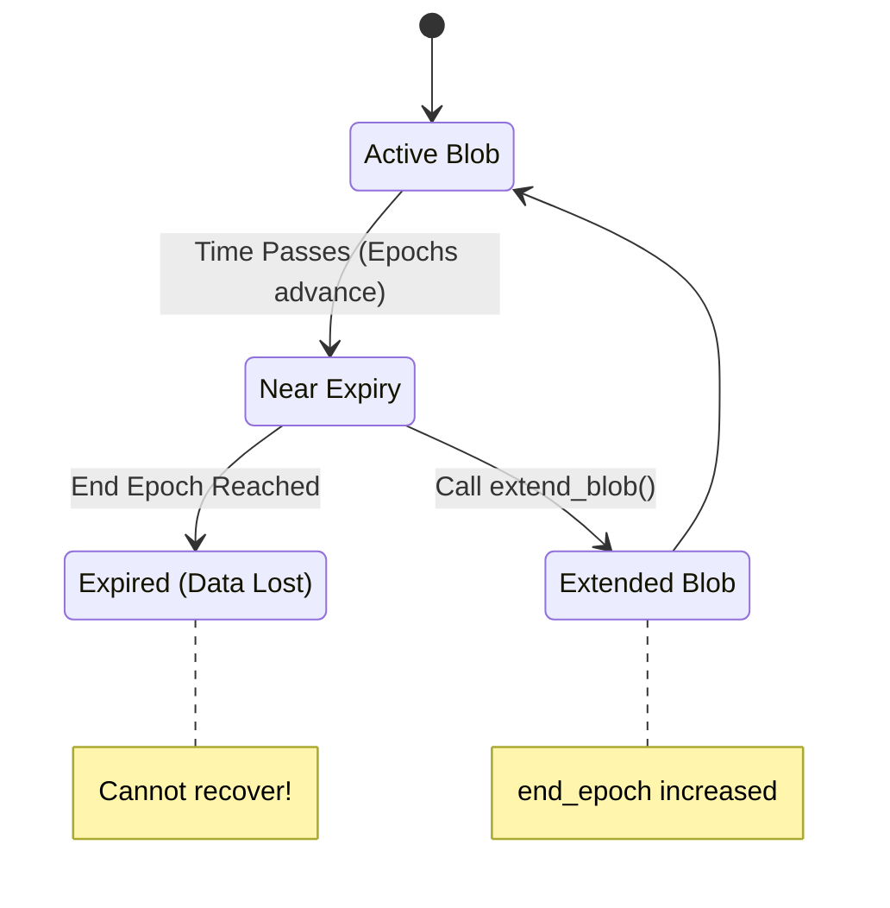

# Extension Transactions

Data in Walrus is stored for a finite period defined by the `Storage` resource associated with the blob. To keep data available beyond its initial expiration, you must perform an extension transaction.



## Methods of Extension

There are two primary ways to extend the lifetime of a blob on-chain:

### 1. Extend with Payment (`extend_blob`)
The simplest method is to pay for additional epochs directly.
*   **Function**: `walrus::system::extend_blob`
*   **Inputs**:
    *   `Blob` object.
    *   `extended_epochs`: Number of additional epochs.
    *   `payment`: Coin<WAL> to cover the cost.
*   **Use Case**: Ad-hoc extension of a single blob when you simply want to pay to keep it longer.

### 2. Extend with Resource (`extend_blob_with_resource`)
You can also extend a blob by merging it with an existing, longer-lived `Storage` resource.
*   **Function**: `walrus::system::extend_blob_with_resource`
*   **Inputs**:
    *   `Blob` object.
    *   `extension`: A `Storage` object that must be the **same size** and have a **later `end_epoch`**.
*   **Use Case**: Efficient when you have purchased bulk storage in advance or want to recycle storage from deleted blobs.

## Shared Blobs
For public data where multiple parties might want to contribute to its persistence (e.g., a public dataset or NFT metadata), Walrus offers `SharedBlob`.
*   **Concept**: A `SharedBlob` wraps a `Blob` and acts as a "tip jar".
*   **Mechanism**: Anyone can add WAL to the `SharedBlob`. The `extend` function can then be called by anyone to use those funds to purchase more time from the system.

## Important Note
Extensions **must** happen before the blob expires. Once the `end_epoch` is reached, Storage Nodes are free to garbage collect the shards, and the blob is considered lost.

## Code Example

### Walrus SDK (TypeScript)

Extending a blob requires the `blobObjectId` (the Sui object), not just the `blobId` (the content hash).

```typescript
// Create an extension transaction
const tx = await client.walrus.extendBlobTransaction({
    blobObjectId: '0x123...abc', // The Sui Object ID of the Blob
    epochs: 10,                  // Extend by 10 epochs
    // endEpoch: 100,            // OR specify target end epoch
});

// Sign and execute the transaction
const result = await client.signAndExecuteTransaction({
    transaction: tx,
    signer: keypair,
});
```

### Walrus CLI

```bash
# Extend a blob by 10 epochs using its Sui Blob Object ID
walrus extend --blob-obj-id <BLOB_OBJ_ID> --epochs 10

# For shared blobs, add the --shared flag
walrus extend --blob-obj-id <BLOB_OBJ_ID> --epochs 10 --shared
```

