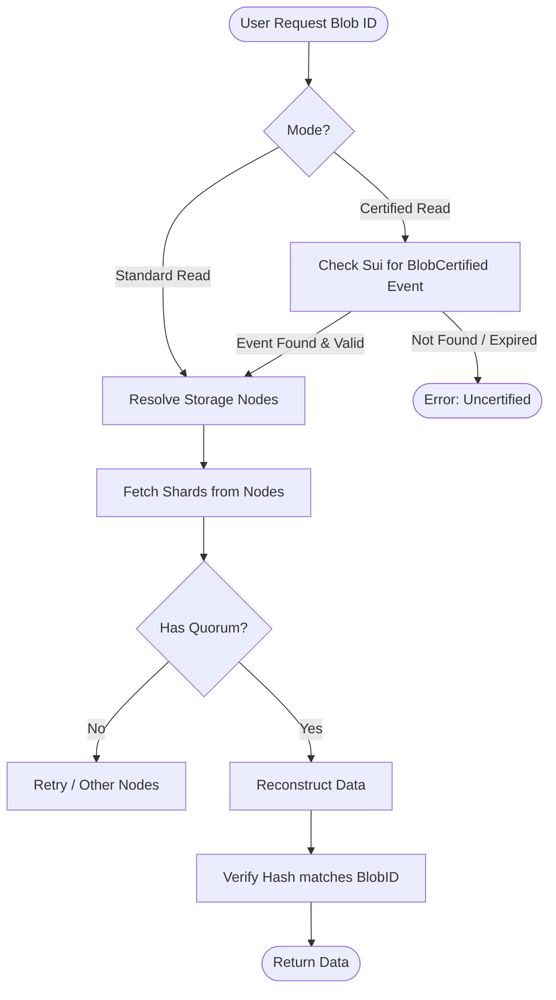

# Retrieval Operations

Unlike upload and extension, **Retrieval** is primarily an **off-chain** operation. Reading data does not require sending a transaction to the Sui blockchain, making it fast and free of gas costs.



## Standard Retrieval
The most common retrieval method involves fetching data directly from Storage Nodes.

1.  **Resolve Locations**: The client (optionally) queries the Walrus system object or checks the `BlobCertified` event to know the current committee.
2.  **Fetch Shards**: The client sends HTTP GET requests to multiple Storage Nodes to download shards.
3.  **reconstruct**: Once enough shards (quorum) are downloaded, the client locally reconstructs the original blob using erasure coding.

*   **Cost**: Free (no gas, no WAL fees for reading).
*   **Transaction Type**: None (Off-chain).

## Certified Read
For high-security contexts, you may need to verify that the data being read is the exact data that was certified on-chain.

*   **Verification**: The client verifies the `BlobCertified` event on Sui. This event contains the `blob_id` and the `end_epoch`.
*   **Validity Check**: Ensure `current_epoch < end_epoch`.
*   **Integrity**: The blob ID itself is a hash of the content, ensuring data integrity.

## "Read" Transactions?
While reading the *content* is off-chain, you might interact with the blockchain to read *metadata* or *status*:
*   **Read Blob Object**: Using a Sui SDK to fetch the `Blob` object fields (e.g., `storage.end_epoch`, `certified_epoch`).
*   **Read System State**: Fetching the current epoch and committee information.

These are "read-only" RPC calls to Sui nodes, not state-changing transactions.

## Code Example

### Walrus SDK (TypeScript)

Standard retrieval fetches the data and reconstructs it.

```typescript
async function retrieve() {
    const blobId = 'w_8...'; // Your Blob ID

    // Fetches shards, reconstructs, and verifies hash
    const blobBytes = await client.walrus.readBlob({ blobId });
    
    // Convert to text or appropriate format
    const text = new TextDecoder().decode(blobBytes);
    console.log(text);
}
```

### Walrus CLI

```bash
# Read a blob and save it to a file
walrus read <BLOB_ID> --out output-file.txt
```

