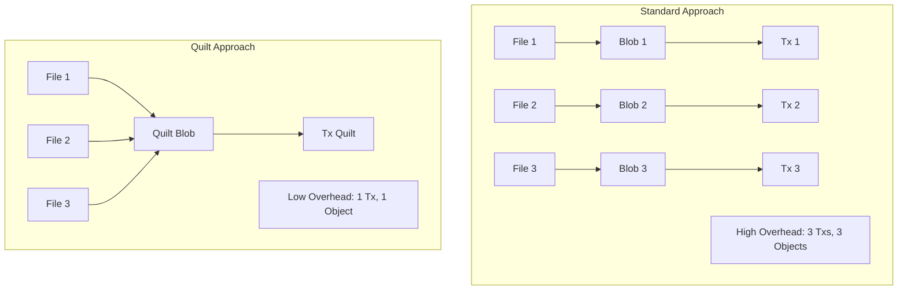

# Quilt Operations

**Quilt** is a specialized Walrus feature designed to optimize the storage of many small blobs. It batches multiple small files into a single, larger Walrus blob, reducing overhead and costs.



## Quilt Transaction Differences

From the perspective of the blockchain, a Quilt is just a standard `Blob`. However, the *application-level* operations differ significantly.

### 1. Creation (Batched Upload)
Instead of registering and certifying $N$ small blobs (requiring $2N$ or $3N$ transactions), you register **one** Quilt blob.
*   **On-Chain**: Single `reserve_space`, `register_blob`, `certify_blob` sequence.
*   **Off-Chain**: The client aggregates small files into a "Quilt", computes the Merkle root of the *combined* data, and uploads it.

### 2. Addressing
*   **BlobId**: The ID of the entire Quilt container.
*   **QuiltPatchId**: A specific ID derived for each small blob *inside* the Quilt.
    *   *Note*: If you move a file to a different Quilt, its `QuiltPatchId` changes (unlike a standard `BlobId` which is content-derived and immutable).

### 3. Lifecycle Management
A Quilt is an atomic unit on-chain.
*   **Extension**: You must extend the **entire Quilt**. You cannot extend just one file inside it.
*   **Deletion**: You can only delete the **entire Quilt** to reclaim storage. Individual files cannot be "deleted" from the chain's perspective (though you can stop indexing them).

### 4. Cost Implications
*   **Sui Storage**: One `Blob` object vs. thousands. Saves massive amounts of SUI storage deposits.
*   **Gas**: Single transaction sequence vs. thousands.
*   **Walrus Metadata**: Fixed metadata overhead is amortized over many files.

## When to use Quilt?
*   **Use for**: NFTs, game assets, log files, sensor data (IoT).
*   **Avoid for**: Large single files, or data with widely varying retention policies (e.g., one file needs to be kept for 1 year, another for 1 day).

## Code Example

### Walrus SDK (TypeScript)

Use `writeFiles` to create a Quilt from multiple files.

```typescript
import { WalrusFile } from '@mysten/walrus';

async function createQuilt() {
    // Define the files to batch
    const files = [
        WalrusFile.from({
            contents: new TextEncoder().encode('User config data'),
            identifier: 'config.json',
        }),
        WalrusFile.from({
            contents: new TextEncoder().encode('User avatar image data...'),
            identifier: 'avatar.png',
        }),
    ];

    // Upload as a single Quilt blob
    const quiltInfo = await client.walrus.writeFiles({
        files: files,
        epochs: 5,
        signer: keypair,
    });

    console.log(`Quilt Blob ID: ${quiltInfo.blobId}`);
}
```

### Walrus CLI

```bash
# Create a quilt from all files in a directory
walrus store-quilt --paths ./user-data/ --epochs 5
```

## Key Takeaways

- Quilts batch many small files into one on-chain blob, amortizing gas and storage overhead.
- QuiltPatchIds depend on the quilt composition and change if the quilt changes.
- Lifecycle actions (extend/delete/share) apply to the entire quilt; individual patches are not independent.
- Retrieval can target specific identifiers or QuiltPatchIds without downloading the whole quilt.
- Use quilts for high-volume small assets; prefer standard blobs for large or differing lifecycles.

## Next Steps

Proceed to [Guidance for Real Product Use](./05-production.md) to choose the right strategy in production scenarios.

