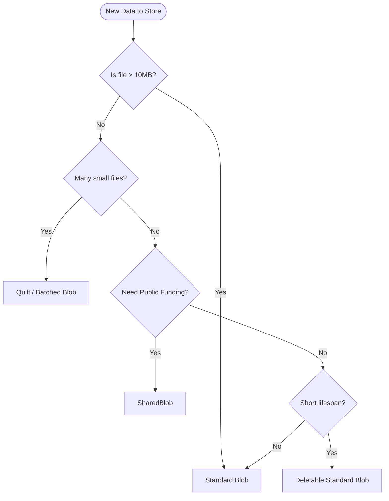

# Guidance for Real Product Use

When building production applications on Walrus, choosing the right transaction strategy is critical for cost, performance, and user experience.

## Transaction Strategy Matrix

| Scenario | Recommended Strategy | Why? |
| :--- | :--- | :--- |
| **User Profile Pictures** | **Quilt** (Batched) | High volume of small files. Group by time (e.g., "daily upload quilt") or by user cohort. |
| **Large Video Assets** | **Standard Blob** | File size justifies the metadata overhead. Independent lifecycle is important. |
| **Public Dataset** | **SharedBlob** | Allows community funding to keep the dataset alive indefinitely. |
| **Temporary Transfer** | **Short-lived Blob** | Use minimum epoch duration. Mark as `deletable` to reclaim storage immediately after transfer. |

## Cost Management
1.  **Bulk Buying**: Use `reserve_space` to buy large amounts of storage during low-demand periods (if price fluctuates) or simply to reduce the number of small `reserve_space` transactions.
2.  **Resource Recycling**: If your app deletes blobs frequently, re-use the returned `Storage` objects for new blobs instead of converting them back to WAL.
3.  **Clean Up**: Always burn expired `Blob` objects on Sui to reclaim the storage rebate (SUI tokens).

## Latency Optimization
*   **Parallelization**: Upload shards to Storage Nodes in parallel.
*   **PTBs**: Always group `reserve_space` and `register_blob` in a single Programmable Transaction Block. If possible, group operations for multiple blobs into one PTB (Sui limit is 1024 commands).

## Error Handling
*   **Upload Failures**: If `certify_blob` fails (e.g., not enough signatures), you haven't lost your `Storage` resource. You can try to re-upload to different nodes or re-try certification later.
*   **Expiry**: Monitor `end_epoch`. Build an automated "extender" service if guarantees are needed.

## Code Example: Production Configuration

When running in production, ensure you configure timeouts to handle network variance and large files.

See [`production-config.ts`](../src/examples/production-config.ts) for the full example.

## Key Takeaways

- Use the strategy matrix to choose Standard, Quilt, SharedBlob, or Deletable based on size, volume, and funding.
- Buy and recycle storage intelligently; burn expired blob objects to reclaim SUI storage rebates.
- Bundle operations in PTBs (reserve + register) and upload shards in parallel to cut latency.
- Monitor `end_epoch` and handle certification retries; storage reuse and deletable blobs can lower WAL spend.

## Next Steps

Apply the strategy in the [Hands-On: Transaction Classification](./hands-on.md) or revisit earlier sections to map patterns to your workload.

