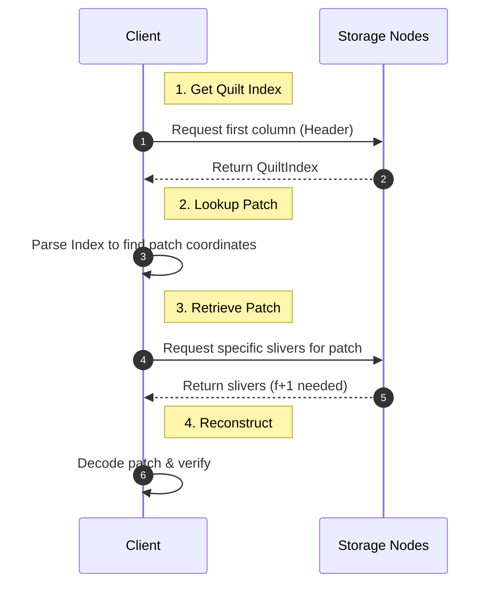

# Retrieval Process

This section explains how to retrieve individual blobs (patches) from quilts using various methods.

## Overview

One of the key advantages of quilts is that you can retrieve individual patches **without downloading the entire quilt**.



Walrus provides multiple ways to query and retrieve patches:

1. **By Identifier**: Retrieve patches by their unique identifier (e.g., filename)
2. **By Tag**: Retrieve all patches matching a tag key-value pair
3. **By QuiltPatchId**: Retrieve specific patches using their unique patch IDs
4. **All Patches**: Retrieve every patch in the quilt

Each method is optimized to download only the necessary data from storage nodes.

## Method 1: Retrieve by Identifier

The most common approach is retrieving patches by their identifier.

### CLI: `read-quilt --identifiers`

[Source Code: 01-retrieve-by-identifier.sh](../hands-on-source-code/04-retrieval-process/cli/01-retrieve-by-identifier.sh)

**How it works**:

1. Download the QuiltIndex (metadata)
2. Look up the identifiers in the index
3. Determine which slivers contain those patches
4. Download only those slivers
5. Decode and save the patches

**Source Reference**: [`crates/walrus-service/src/client/cli/runner.rs:611-657`](https://github.com/MystenLabs/walrus/blob/main/crates/walrus-service/src/client/cli/runner.rs#L611-L657)

### TypeScript SDK: `getFiles()` with Identifiers

[Source Code: 01-get-files-identifiers.ts](../hands-on-source-code/04-retrieval-process/ts/01-get-files-identifiers.ts)

### HTTP API: Get Patch by Identifier

[Source Code: 07-http-api-examples.sh](../hands-on-source-code/04-retrieval-process/cli/07-http-api-examples.sh)

**Response**:
- **Body**: The patch data (file contents)
- **Headers**: 
  - `X-Walrus-Quilt-Patch-Id`: The QuiltPatchId for this patch
  - `Content-Length`: Size of the patch
  - `Content-Type`: MIME type (if detectable)

**Source Reference**: [`crates/walrus-service/src/client/daemon/routes.rs:688-732`](https://github.com/search?q=repo%3AMystenLabs%2Fwalrus%20get_patch_by_quilt_id_and_identifier&type=code)

## Method 2: Retrieve by Tag

Retrieve all patches that have a specific tag key-value pair.

### CLI: `read-quilt --tag`

[Source Code: 02-retrieve-by-tag.sh](../hands-on-source-code/04-retrieval-process/cli/02-retrieve-by-tag.sh)

**Use cases**:
- Retrieve all images of a certain type: `--tag format png`
- Get all documents by an author: `--tag author Alice`
- Download all files in a category: `--tag category documentation`

**Source Reference**: [`crates/walrus-service/src/client/cli/runner.rs:645-652`](https://github.com/MystenLabs/walrus/blob/main/crates/walrus-service/src/client/cli/runner.rs#L645-L652)

### TypeScript SDK: Query by Tag

[Source Code: 02-query-by-tag.ts](../hands-on-source-code/04-retrieval-process/ts/02-query-by-tag.ts)

### HTTP API: Get Patches by Tag

*Note: Direct retrieval by tag is not currently supported in the HTTP API. You must list patches
first, filter them client-side, and then retrieve by ID.*

## Method 3: Retrieve by QuiltPatchId

Each patch has a unique QuiltPatchId that can be used for direct retrieval.

### Step 1: List All Patches

First, get the list of patches and their IDs:

[Source Code: 03-list-patches.sh](../hands-on-source-code/04-retrieval-process/cli/03-list-patches.sh)

**Source Reference**: [`crates/walrus-service/src/client/cli/runner.rs:669-711`](https://github.com/MystenLabs/walrus/blob/main/crates/walrus-service/src/client/cli/runner.rs#L669-L711)

### Step 2: Retrieve by Patch ID

[Source Code: 04-retrieve-by-patch-id.sh](../hands-on-source-code/04-retrieval-process/cli/04-retrieve-by-patch-id.sh)

**Source Reference**: [`crates/walrus-service/src/client/cli/runner.rs:654-656`](https://github.com/MystenLabs/walrus/blob/main/crates/walrus-service/src/client/cli/runner.rs#L654-L656)

### TypeScript SDK: Retrieve by Patch ID

[Source Code: 03-retrieve-by-patch-id.ts](../hands-on-source-code/04-retrieval-process/ts/03-retrieve-by-patch-id.ts)

**Source Reference**: [`@mysten/walrus`](https://github.com/MystenLabs/ts-sdks/tree/main/packages/walrus)

### HTTP API: Get Patch by Patch ID

[Source Code: 07-http-api-examples.sh](../hands-on-source-code/04-retrieval-process/cli/07-http-api-examples.sh)

**Source Reference**: [`crates/walrus-service/src/client/daemon/routes.rs:556-609`](https://github.com/MystenLabs/walrus/blob/main/crates/walrus-service/src/client/daemon/routes.rs#L556-L609)

## Method 4: Retrieve All Patches

Retrieve every patch in the quilt at once.

### CLI: `read-quilt` without filters

[Source Code: 05-retrieve-all.sh](../hands-on-source-code/04-retrieval-process/cli/05-retrieve-all.sh)

**When to use**:
- Downloading an entire collection
- Backup/archival purposes
- Migrating data

**Source Reference**: [`crates/walrus-service/src/client/cli/runner.rs:657`](https://github.com/MystenLabs/walrus/blob/main/crates/walrus-service/src/client/cli/runner.rs#L657)

### TypeScript SDK: Get All Patches

[Source Code: 04-get-all-patches.ts](../hands-on-source-code/04-retrieval-process/ts/04-get-all-patches.ts)

**Source Reference**: [`ts-sdks/packages/walrus/src/files/blob.ts:29-63`](https://github.com/MystenLabs/ts-sdks/blob/main/packages/walrus/src/files/blob.ts#L29-L63)

## Listing Patches Without Downloading

Sometimes you just want to see what's in a quilt without downloading data.

### CLI: `list-patches-in-quilt`

[Source Code: 03-list-patches.sh](../hands-on-source-code/04-retrieval-process/cli/03-list-patches.sh)

**Alias**: `resolve-quilt` (same command)

**Source Reference**: [`crates/walrus-service/src/client/cli/runner.rs:669-711`](https://github.com/MystenLabs/walrus/blob/main/crates/walrus-service/src/client/cli/runner.rs#L669-L711)

### HTTP API: List Patches

[Source Code: 07-http-api-examples.sh](../hands-on-source-code/04-retrieval-process/cli/07-http-api-examples.sh)

**Source Reference**: [`crates/walrus-service/src/client/daemon/routes.rs:748-808`](https://github.com/MystenLabs/walrus/blob/main/crates/walrus-service/src/client/daemon/routes.rs#L748-L808)

## Performance Characteristics

### Retrieval Latency

Thanks to sliver alignment, individual patch retrieval is **comparable to or faster than** regular blob retrieval:

| Retrieval Type | Latency | Data Downloaded |
|---------------|---------|-----------------|
| Regular blob | Baseline | Full blob |
| Single patch from quilt | ~Baseline | Only patch slivers |
| Multiple patches | ~Baseline per patch | Combined patch slivers |
| Full quilt | Higher (more data) | All slivers |

**Why it's fast**: Storage nodes return only the slivers needed for requested patches, not the entire quilt.

### Network Efficiency

```text
Example: 100-file quilt, each file 50KB

Retrieve 1 file:
  - Download: ~50KB + small index
  - Same as regular blob!

Retrieve 10 files:
  - Download: ~500KB + small index
  - Much better than full quilt (5MB)

Retrieve all 100 files:
  - Download: ~5MB (full quilt)
  - Same as downloading 100 regular blobs
```

## Common Retrieval Patterns

### Pattern 1: Selective Download by Category

[Source Code: 06-common-patterns.sh](../hands-on-source-code/04-retrieval-process/cli/06-common-patterns.sh)

### Pattern 2: Download by List of Identifiers

[Source Code: 06-common-patterns.sh](../hands-on-source-code/04-retrieval-process/cli/06-common-patterns.sh)

### Pattern 3: Incremental Download with Tracking

[Source Code: 05-patterns.ts](../hands-on-source-code/04-retrieval-process/ts/05-patterns.ts)

### Pattern 4: On-Demand Lazy Loading

[Source Code: 05-patterns.ts](../hands-on-source-code/04-retrieval-process/ts/05-patterns.ts)

## Error Handling

### Patch Not Found

```sh
walrus --context testnet read-quilt --out ./downloads/ \
  --quilt-id <QUILT_ID> \
  --identifiers nonexistent-file.txt

# Error: Patch with identifier 'nonexistent-file.txt' not found in quilt
```

**Fix**: Check available identifiers with `list-patches-in-quilt`.

### Invalid QuiltPatchId

```sh
walrus --context testnet read-quilt --out ./downloads/ \
  --quilt-patch-ids INVALID_ID

# Error: Invalid QuiltPatchId format
```

**Fix**: Ensure you're using the complete QuiltPatchId (not just BlobId).

### Quilt Not Available

```sh
walrus --context testnet read-quilt --out ./downloads/ --quilt-id <EXPIRED_QUILT_ID>

# Error: Blob not available (may be expired or not yet certified)
```

**Fix**: Check quilt status with `walrus --context testnet blob-status --blob-id <QUILT_ID>`.

## Best Practices

### 1. List Before Retrieving

Always list patches first to understand structure:

```sh
walrus --context testnet list-patches-in-quilt <QUILT_ID>
# Review the output, then retrieve specific patches
```

### 2. Use Identifiers When Possible

Identifiers are more readable and maintainable than QuiltPatchIds:

```sh
# Preferred
walrus --context testnet read-quilt --quilt-id <ID> --identifiers config.json

# Avoid (unless necessary)
walrus --context testnet read-quilt --quilt-patch-ids <LONG_PATCH_ID>
```

### 3. Use Tags for Bulk Operations

Design your tag schema for efficient bulk queries:

```sh
# Download all production configs
walrus --context testnet read-quilt --quilt-id <ID> --tag environment production
```

### 4. Cache Metadata Locally

For repeated queries, cache the patch list:

```typescript
// Cache the patch list
const patches = await listPatches(quiltId);
localStorage.setItem(`patches-${quiltId}`, JSON.stringify(patches));

// Use cached list for UI
const cachedPatches = JSON.parse(localStorage.getItem(`patches-${quiltId}`));
```

### 5. Handle Missing Patches Gracefully

```typescript
async function safeRetrieve(quiltId: string, identifier: string) {
  try {
    const quiltBlob = await client.walrus.getBlob({ blobId: quiltId });
    const files = await quiltBlob.files({
      identifiers: [identifier],
    });
    return files.length > 0 ? files[0] : null;
  } catch (error) {
    console.error(`Failed to retrieve ${identifier}:`, error);
    return null;
  }
}
```

## Key Takeaways

- **Efficient Retrieval**: Retrieve individual patches without downloading the entire quilt, saving bandwidth
- **Multiple Access Methods**: Retrieve patches by **Identifier**, **Tag**, or **QuiltPatchId**
- **Performance**: Individual patch retrieval has latency comparable to regular blobs due to sliver alignment
- **Client Flexibility**: CLI and SDKs support selective retrieval, listing, and filtering
- **Best Practice**: Prefer human-readable **Identifiers** over raw IDs for better maintainability

## Next Steps

Now that you understand retrieval, proceed to [Real Examples](./05-real-examples.md) to see complete, working code examples, or jump to [Typical Mistakes](./06-typical-mistakes.md) to learn what to avoid.
