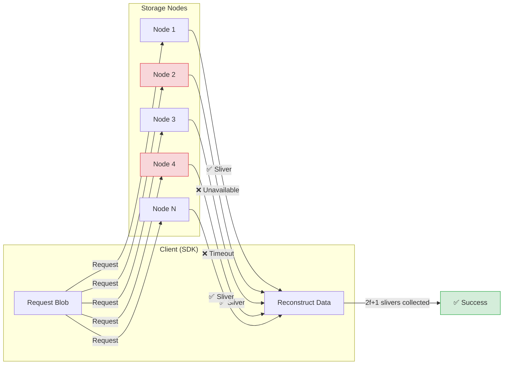

# Chunk Level Failures

In a distributed storage system like Walrus, files are split into chunks, and chunks are erasure-coded into slivers distributed across storage nodes. "Chunk level failures" refer to issues retrieving these individual pieces of data.

## How the SDK Handles Missing Slivers

The SDK automatically handles partial node failures by requesting slivers from multiple nodes and reconstructing the data when enough slivers are available:



> **Key Insight**: You only need $2f+1$ slivers to reconstruct data. Individual node failures don't cause the operation to fail.

## SDK Errors You'll Encounter

The SDK handles individual storage node failures transparently, but throws these errors when recovery isn't possible:

### `BlobNotCertifiedError`

Thrown when the blob doesn't exist or isn't certified.

```typescript
import { BlobNotCertifiedError } from '@mysten/walrus';

try {
    const data = await client.readBlob({ blobId });
} catch (error) {
    if (error instanceof BlobNotCertifiedError) {
        console.error('Blob does not exist or was never certified');
    }
}
```

*   **Cause**: The blob ID is invalid, the blob was never uploaded, or it has expired.
*   **Handling**: Verify the blob ID is correct. Check if the blob exists using `getVerifiedBlobStatus`.

### `BlobBlockedError`

Thrown when a quorum of storage nodes have blocked the content (e.g., for legal reasons).

```typescript
import { BlobBlockedError } from '@mysten/walrus';

try {
    const data = await client.readBlob({ blobId });
} catch (error) {
    if (error instanceof BlobBlockedError) {
        console.error('Content has been blocked by storage nodes');
    }
}
```

*   **Cause**: Node operators have flagged the blob ID.
*   **Handling**: This is permanent—the content cannot be retrieved from Walrus.

### `NotEnoughSliversReceivedError`

Thrown when the SDK couldn't retrieve enough slivers to reconstruct the data.

*   **Cause**: Too many storage nodes are offline, slow, or returning errors.
*   **Handling**: This is typically transient. Retry with exponential backoff, or try again later.

### `InconsistentBlobError`

Thrown when the reconstructed data doesn't match the expected blob ID.

*   **Cause**: Data corruption or incorrect encoding by the original uploader.
*   **Handling**: Do NOT use the data. Log the error for investigation.

## Debugging Individual Node Failures

The SDK handles node failures transparently, but you can enable logging to debug slow downloads or investigate issues:

```typescript
import { WalrusClient } from '@mysten/walrus';
import { getFullnodeUrl, SuiClient } from '@mysten/sui/client';

const client = new WalrusClient({
    network: 'testnet',
    suiClient: new SuiClient({ url: getFullnodeUrl('testnet') }),
    storageNodeClientOptions: {
        onError: (error) => {
            // Log individual node failures for debugging
            console.warn("Storage node error:", error.message);
        },
        timeout: 60_000,
    },
});

// Now when reading, individual node errors will be logged
const data = await client.readBlob({ blobId });
```

## Resilience Strategy

*   **Redundancy**: The primary defense is the erasure coding itself. Walrus is designed to tolerate up to $f$ malicious/faulty nodes.
*   **Health Checks**: Periodically check blob status (`getVerifiedBlobStatus`) to ensure sufficient redundancy exists, especially for long-lived data.

## Key Takeaways

- **Partial failures are normal**: Missing slivers from some nodes is expected; the SDK handles this automatically.
- **Erasure coding provides resilience**: You only need $2f+1$ slivers to reconstruct data, not all of them.
- **Know the SDK errors**: `BlobNotCertifiedError`, `BlobBlockedError`, `NotEnoughSliversReceivedError`, `InconsistentBlobError`.
- **Use `onError` for debugging**: Enable `storageNodeClientOptions.onError` to log individual node failures.
- **Blocked content is permanent**: If a quorum blocks content (`BlobBlockedError`), it cannot be retrieved.
- **Monitor blob health**: Use `getVerifiedBlobStatus` to proactively check blob availability.
