# Parallel Uploads

Once data is prepared (and potentially chunked), the next step is transferring it to the Walrus network. **Parallel Uploads** are essential for maximizing network throughput and reducing total upload time.

## Concurrency Models

There are two main layers where parallelism occurs in a Walrus upload:

### 1. Inter-Blob Parallelism (Multiple Blobs)

If you have multiple independent blobs (or chunks of a large file), you can upload them concurrently.

- **Mechanism**: Your application spawns multiple upload tasks (promises/futures).
- **Benefit**: Saturates available upstream bandwidth.
- **Limit**: Controlled by your client's concurrency settings (e.g., connection pool size) and the publisher's capacity.


### 2. Intra-Blob Parallelism (Slivers to Nodes)

Even for a single blob, Walrus uploads are inherently parallel.

- **Mechanism**: A blob is erasure-encoded into slivers distributed across $n$ shards (e.g., 1000 shards on mainnet). Each storage node manages one or more shards.
- **Benefit**: No single storage node becomes a bottleneck.
- **SDK Behavior**: The Walrus SDK's `DistributedUploader` manages this complexity. It maintains a set of pending requests to various storage nodes and processes them as `WeightedFutures`.


> **Technical Note:** The number of slivers corresponds to the shard count on the network (e.g., 1000 shards). Each blob produces one sliver pair per shard. Only $2f+1$ confirmations are needed for quorum, where $f = \lfloor(n-1)/3\rfloor$. On a 1000-shard network, this means ~334 primary slivers are sufficient for reconstruction.

## Tuning for Throughput

To maximize throughput (MB/s):

### 1. Increase Client Concurrency

If using the SDK, allow more concurrent requests to storage nodes. The SDK automatically manages parallel sliver distribution.

### 2. Publisher Sub-Wallet Configuration

The Publisher uses **sub-wallets** to handle concurrent Sui transactions. Each concurrent upload requires a separate coin object lock on Sui.

- **Default**: 8 sub-wallets = 8 concurrent blob registrations
- **Configuration**: Use `--n-clients` to increase the pool

```bash
# Start publisher with 16 sub-wallets for higher concurrency
walrus publisher \
  --bind-address "127.0.0.1:31416" \
  --sub-wallets-dir "$WALLETS_DIR" \
  --n-clients 16
```

| Sub-wallets | Concurrent Registrations | Use Case |
|:-----------:|:------------------------:|:---------|
| 1-2 | Low | Local testing |
| 8 | Medium | Default production |
| 16-32 | High | High-throughput applications |

> ⚠️ **Trade-off:** More sub-wallets require more SUI and WAL to be distributed across them. Monitor your wallet balances.

### 3. Network Bandwidth

Ensure your client machine has sufficient uplink bandwidth. If your encoding is fast but uploads are slow, bandwidth is likely the bottleneck.

## Rate Limiting Awareness

> ⚠️ **Rate Limiting:** Be mindful of storage nodes' rate limits. Excessive parallelism might trigger backoff mechanisms, actually **reducing** overall throughput.

Signs of hitting rate limits:
- HTTP 429 responses
- Increasing retry counts
- Throughput plateau despite more concurrency

**Best Practice**: Start with moderate concurrency and increase gradually while monitoring metrics.

## Batching Small Blobs

For very small blobs (< 100KB), the overhead of establishing connections and performing Sui transactions dominates. Parallelism helps, but **batching** small data into larger blobs (before uploading) is often more effective for throughput.

```mermaid
flowchart LR
    subgraph Inefficient["❌ Many Small Blobs"]
        S1[10KB] --> T1[Tx 1]
        S2[10KB] --> T2[Tx 2]
        S3[10KB] --> T3[Tx 3]
        S4[10KB] --> T4[Tx 4]
    end
    
    subgraph Efficient["✅ Batched/Quilt"]
        B1[10KB]
        B2[10KB]
        B3[10KB]
        B4[10KB]
        B1 & B2 & B3 & B4 --> Q[Quilt or Batched Blob]
        Q --> T[Single Tx]
    end
```



**When to batch:**
- Many files < 100KB each
- Files have the same lifecycle (can be stored/deleted together)
- Consider using [Quilts](../../../usage/quilt.md) for efficient small-file storage

## Example: Parallel Upload with Concurrency Limit

```typescript
import { WalrusClient } from '@mysten/walrus';

async function uploadBlobsWithLimit(
    client: WalrusClient,
    blobs: Uint8Array[],
    concurrencyLimit = 5
) {
    const results: string[] = [];
    const pending: Promise<void>[] = [];
    
    for (const blob of blobs) {
        // Start upload
        const uploadPromise = client.writeBlob({ blob })
            .then(result => {
                results.push(result.blobId);
            });
        
        pending.push(uploadPromise);
        
        // If at limit, wait for one to complete
        if (pending.length >= concurrencyLimit) {
            await Promise.race(pending);
            // Remove completed promises
            const completed = pending.filter(p => 
                p.then(() => true).catch(() => true)
            );
            pending.length = 0;
            pending.push(...completed);
        }
    }
    
    // Wait for remaining uploads
    await Promise.all(pending);
    return results;
}
```

> 💡 **Tip:** Use libraries like `p-limit` for cleaner concurrency control in production code.

## Key Takeaways

- **Two parallelism levels**: Inter-blob (multiple blobs concurrently) and intra-blob (slivers distributed to nodes)
- **Sub-wallet limitation**: Publisher concurrency is limited by sub-wallet count; configure with `--n-clients`
- **Default configuration**: 8 sub-wallets = 8 concurrent blob registrations; increase for high-throughput
- **Rate limiting awareness**: More concurrency isn't always better; watch for HTTP 429 and retry spikes
- **Batch small files**: Transaction overhead dominates for < 100KB blobs; use Quilts instead
- **SDK abstraction**: `DistributedUploader` and `WeightedFutures` handle sliver distribution complexity

## Next Steps

Now that you understand parallel uploads, proceed to [Publisher Selection Strategy](./03-publisher-selection.md) to learn how to choose the optimal upload path for your use case.
