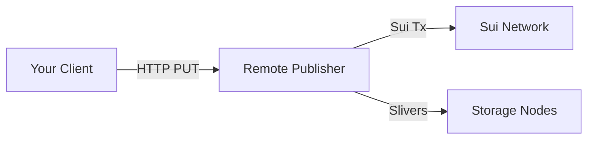
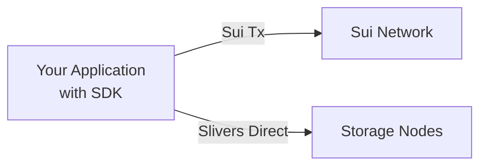
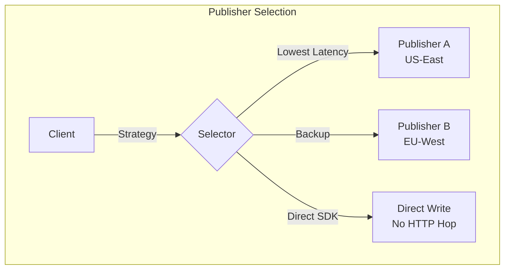

# Publisher Selection Strategy

The **Publisher** acts as your gateway to the Walrus network. It handles the complexity of payment, encoding, and sliver distribution. Choosing the right publisher strategy is crucial for latency and reliability.

## Options for Publishing

### 1. Public / Remote Publishers

The simplest way to start is using a public publisher hosted by a third party or the Walrus foundation (on testnet).



| Aspect | Details |
|:-------|:--------|
| **Pros** | No infrastructure to manage. Zero setup. |
| **Cons** | Extra network hop (latency). Shared resources. Trust the publisher with unencrypted data. |
| **Best For** | Prototyping, low-volume applications, getting started quickly. |

### 2. Private / Dedicated Publisher

Run your own publisher instance using Docker or directly via the `walrus` binary.

```bash
# Run a dedicated publisher
PUBLISHER_WALLETS_DIR=~/.config/walrus/publisher-wallets
mkdir -p "$PUBLISHER_WALLETS_DIR"
walrus publisher \
  --bind-address "0.0.0.0:31416" \
  --sub-wallets-dir "$PUBLISHER_WALLETS_DIR" \
  --n-clients 8
```

| Aspect | Details |
|:-------|:--------|
| **Pros** | Dedicated resources. Control over sub-wallet count. No shared capacity. |
| **Cons** | Maintenance overhead. Must fund and manage wallets. |
| **Best For** | Production applications with moderate to high volume. |

### 3. Direct SDK Writes (Client as Publisher)

For maximum performance, your application can use the SDK to write directly to storage nodes, bypassing any HTTP publisher endpoint entirely.



| Aspect | Details |
|:-------|:--------|
| **Pros** | Lowest latency (no HTTP hop). Direct control over Sui transactions. |
| **Cons** | Your app needs Sui private key access. Must manage gas coins. CPU-intensive encoding in your process. |
| **Best For** | High-performance backends, server-side applications with existing Sui wallet infrastructure. |

**Example: Direct SDK Write (TypeScript)**

```typescript
import { WalrusClient } from '@mysten/walrus';
import { Ed25519Keypair } from '@mysten/sui/keypairs/ed25519';

// Your application directly uses the SDK with a signer
const keypair = Ed25519Keypair.deriveKeypair(process.env.MNEMONIC!);

const client = await WalrusClient.create({
    network: 'testnet',
});

// Direct write - no HTTP publisher involved
const result = await client.writeBlob({
    blob: myData,
    signer: keypair,
    epochs: 5,
});
```

## Selection Logic

When building a high-performance application, consider a **dynamic selection strategy**:

### Latency-Based Selection

If you use remote publishers, measure response times and select the fastest:

```typescript
async function selectFastestPublisher(publishers: string[]): Promise<string> {
    const latencies = await Promise.all(
        publishers.map(async (url) => {
            const start = Date.now();
            try {
                await fetch(`${url}/v1/health`, { method: 'GET' });
                return { url, latency: Date.now() - start };
            } catch {
                return { url, latency: Infinity };
            }
        })
    );
    
    return latencies.sort((a, b) => a.latency - b.latency)[0].url;
}
```

### Load-Based Failover

If a publisher returns `429 Too Many Requests` (overloaded) or shows high latency, failover immediately:

```typescript
async function uploadWithFailover(
    blob: Uint8Array,
    publishers: string[]
): Promise<string> {
    for (const publisher of publishers) {
        try {
            const response = await fetch(`${publisher}/v1/blobs`, {
                method: 'PUT',
                body: blob,
            });
            
            // 429 = overloaded, 504 = timeout, 500 = internal error
            if (response.status === 429 || response.status >= 500) {
                console.warn(`${publisher} returned ${response.status}, trying next...`);
                continue;
            }
            
            const result = await response.json();
            return result.newlyCreated?.blobObject?.blobId || result.alreadyCertified?.blobId;
        } catch (error) {
            console.warn(`${publisher} failed:`, error);
        }
    }
    throw new Error('All publishers failed');
}
```

### Geographic Selection

Select a publisher geographically close to your application server to minimize TCP handshake and transfer time:



## Comparison Matrix

| Criteria | Remote Publisher | Private Publisher | Direct SDK |
|:---------|:-----------------|:------------------|:-----------|
| **Setup Complexity** | None | Medium | Low |
| **Latency** | Higher (+1 hop) | Medium | Lowest |
| **Throughput** | Shared | Dedicated | Limited by your CPU |
| **Key Management** | Publisher handles | You manage wallets | You manage keys |
| **Trust Model** | Trust publisher | Trust yourself | Trust yourself |
| **Cost** | May have fees | Sui gas only | Sui gas only |

## Key Takeaways

- **Three options**: Remote publishers (easiest), private publishers (dedicated), or direct SDK writes (fastest)
- **Remote trade-offs**: Zero setup but adds latency (+1 network hop) and shares resources with others
- **Private benefits**: Dedicated resources and sub-wallet control with moderate maintenance overhead
- **Direct SDK**: Lowest latency by eliminating HTTP hop, but requires key management in your application
- **Failover strategy**: Implement latency-based selection with automatic failover on 429/5xx errors
- **Geographic impact**: Publisher location significantly affects latency; choose close to your servers

## Next Steps

Now that you understand publisher selection, proceed to [Avoiding Unnecessary Storage Extensions](./04-storage-extensions.md) to learn how to optimize storage duration and reduce costs.
