# Local Caching

Walrus is a decentralized storage network, which means retrieving data involves querying multiple storage nodes over the network and reconstructing the result. While robust, this process has inherent latency compared to reading from local disk or memory.

**Local Caching** is the single most effective way to reduce retrieval latency for frequently accessed data.

## The Caching Advantage

Walrus blob IDs are **content-addressed** and **immutable**. This makes caching trivially easy because:

- If the content changes, the Blob ID changes
- A given Blob ID always returns the exact same content
- **Cache invalidation is unnecessary** - you only evict entries to save space (LRU)

```mermaid
flowchart LR
    subgraph Traditional["Traditional Caching"]
        A1[Request /file.txt] --> B1{Cache?}
        B1 -->|Hit| C1[Return Cached]
        B1 -->|Miss| D1[Fetch from Origin]
        D1 --> E1[Cache + Return]
        F1[Content Changed!] --> G1["⚠️ Must Invalidate Cache"]
    end
    
    subgraph Walrus["Walrus Caching"]
        A2[Request /blob/abc123] --> B2{Cache?}
        B2 -->|Hit| C2[Return Cached]
        B2 -->|Miss| D2[Fetch from Nodes]
        D2 --> E2[Cache + Return]
        F2[Content Changed] --> G2["New BlobId: xyz789<br/>✅ No Invalidation Needed"]
    end
    
    style G1 fill:#fff3cd,stroke:#ffc107
    style G2 fill:#d4edda,stroke:#28a745
```



## Where to Cache

### 1. Aggregator Level

The **Walrus Aggregator** (daemon) is responsible for reconstructing blobs from slivers. You can place a standard HTTP cache in front of it.

> 📚 **Reference:** See [Operating an aggregator](https://docs.wal.app/operator-guide/aggregator.html) for aggregator setup and the [HTTP API](https://docs.wal.app/usage/web-api.html) for endpoint details (`GET /v1/blobs/{blob_id}`).


**Configuration Example (Nginx):**

```nginx
# /etc/nginx/sites-available/walrus-cache
proxy_cache_path /var/cache/nginx/walrus levels=1:2 
    keys_zone=walrus:100m max_size=10g inactive=365d;

server {
    listen 80;
    server_name walrus-cache.example.com;
    
    # CAVEAT: Walrus blobs can be up to ~13.6 GiB
    client_max_body_size 0;              # Disable body size limit for responses
    
    location /v1/blobs/ {
        proxy_pass http://127.0.0.1:31415;
        proxy_cache walrus;
        proxy_cache_valid 200 365d;      # Cache successful responses for 1 year
        proxy_cache_key $uri;            # Blob ID is the perfect cache key
        
        # CAVEAT: Large blobs need longer timeouts
        proxy_read_timeout 300s;         # 5 min for large blob reconstruction
        proxy_connect_timeout 60s;
        proxy_send_timeout 300s;
        
        # CAVEAT: Disable buffering for large blobs (stream directly)
        proxy_buffering off;             # Or tune proxy_buffer_size for your use case
        
        # Add cache status header for debugging
        add_header X-Cache-Status $upstream_cache_status;
    }
}
```

> **Why this works:** Blob IDs are immutable, so a cached response for `/v1/blobs/abc123` is valid forever (until you need the space for other data).

#### ⚠️ Nginx Caveats

| Issue | Description | Solution |
|:------|:------------|:---------|
| **Large blob sizes** | Walrus blobs can be up to ~13.6 GiB | Set `client_max_body_size 0;` and ensure sufficient disk space |
| **Timeouts** | Large blobs take time to reconstruct from slivers | Increase `proxy_read_timeout` (300s+ for large files) |
| **Query parameters** | `?strict_consistency_check=true` or `?skip_consistency_check=true` change behavior | Use `proxy_cache_key $uri$is_args$args;` if you need to cache different check modes separately |
| **Memory pressure** | Default buffering loads entire response into memory | Use `proxy_buffering off;` for large blobs, or tune buffer sizes |
| **Disk space** | Caching large blobs quickly fills storage | Set appropriate `max_size` in `proxy_cache_path` and monitor usage |
| **Cache key collisions** | Different query params might need different cache entries | Consider whether your app uses consistency check params |

### 2. Application Level

Your application backend can cache the raw bytes of frequently accessed blobs in Redis or Memcached.

```typescript
import { createClient } from 'redis';

const redis = createClient();
const CACHE_TTL = 86400 * 30; // 30 days (or longer!)

async function getCachedBlob(blobId: string): Promise<Uint8Array> {
    // Check cache first (use binary Buffer, not Base64)
    const cached = await redis.get(
        redis.commandOptions({ returnBuffers: true }),
        `blob:${blobId}`
    );
    if (cached) {
        return new Uint8Array(cached);
    }
    
    // Fetch from Walrus
    const data = await walrusClient.readBlob({ blobId });
    
    // Cache for future requests (store as binary)
    await redis.setEx(
        `blob:${blobId}`,
        CACHE_TTL,
        Buffer.from(data)  // Binary, not Base64 - saves ~33% space
    );
    
    return data;
}
```

| Aspect | Details |
|:-------|:--------|
| **Pros** | Sub-millisecond access for hot data |
| **Cons** | Memory limited; not suitable for large blobs |
| **Best For** | Small, frequently accessed blobs (< 1MB) |

#### ⚠️ Application Cache Caveats

| Issue | Description | Solution |
|:------|:------------|:---------|
| **Redis max value size** | Redis limits values to **512 MB** by default | Use chunked storage or switch to disk-backed cache for larger blobs |
| **Memcached max value size** | Default limit is **1 MB** per item | Increase with `-I` flag (e.g., `-I 10m`) or use Redis instead |
| **Base64 encoding overhead** | Storing as Base64 adds **~33% size** | Use binary storage: `redis.set(key, Buffer.from(data))` instead of Base64 |
| **Memory pressure** | One 100 MB blob uses the same RAM as 100,000 tiny entries | Set `maxmemory-policy allkeys-lru` and monitor evictions |
| **Eviction storms** | A few large blobs can evict many small, frequently-accessed items | Consider separate cache instances for small vs. large blobs |
| **Network transfer** | Moving large blobs to/from cache adds latency | Co-locate cache with app server; consider local disk cache for large items |
| **Serialization CPU** | Encoding/decoding large binary data is CPU-intensive | Profile your workload; streaming may be better than caching for large blobs |

> 💡 **Recommendation:** Use application-level caching only for blobs **< 10 MB**. For larger blobs, prefer Nginx/CDN caching which handles streaming better.

### 3. CDN / Edge Caching

Since Walrus Blob IDs are immutable, they are perfect for CDN caching with aggressive cache headers.


**Setting Cache Headers:**

When serving Walrus content through your own infrastructure, configure these headers:

```typescript
// Express.js example
app.get('/content/:blobId', async (req, res) => {
    const data = await walrusClient.readBlob({ blobId: req.params.blobId });
    
    // These headers tell browsers and CDNs to cache forever
    res.set({
        'Cache-Control': 'public, max-age=31536000, immutable',
        'ETag': req.params.blobId,  // Blob ID is a perfect ETag
    });
    
    res.send(data);
});
```

> ⚠️ **Important:** Walrus aggregators do NOT automatically set these cache headers. It's your responsibility to configure caching when serving content through your own infrastructure.

| Header | Value | Meaning |
|:-------|:------|:--------|
| `Cache-Control` | `public, max-age=31536000, immutable` | Cache for 1 year, content never changes |
| `ETag` | Blob ID | Perfect content identifier |
| `Vary` | None needed | Same content for all requests |

#### ⚠️ Cache Header Caveats

| Issue | Description | Solution |
|:------|:------------|:---------|
| **Browser cache can't be "invalidated"** | Once `immutable` is set, browsers won't check for updates until `max-age` expires | This is fine for Walrus (content never changes), but ensure your URL includes the blob ID |
| **`public` exposes to shared caches** | `public` allows CDNs, proxies, and corporate firewalls to cache | Use `private` for sensitive content that should only be cached by the end user's browser |
| **Missing `Content-Type`** | Browsers may mishandle content without proper MIME type | Always set `Content-Type` based on your application's knowledge of the blob |
| **CORS on cached responses** | Cached responses may serve wrong CORS headers to different origins | Include `Vary: Origin` if serving to multiple domains, or set consistent CORS headers |
| **Compression double-jeopardy** | Compressing already-compressed content (images, video) wastes CPU | Check content type; only gzip/brotli text-based content |
| **Security headers stripped** | Some proxies/CDNs may strip or override your security headers | Verify `X-Content-Type-Options: nosniff` and other security headers reach the client |
| **URL structure coupling** | Changing URL scheme (e.g., `/content/:id` → `/blobs/:id`) orphans cached content | Plan your URL structure carefully; changes effectively "invalidate" old browser caches |

**Recommended headers for Walrus content:**

```typescript
res.set({
    'Cache-Control': 'public, max-age=31536000, immutable',
    'ETag': blobId,
    'Content-Type': contentType,           // Set based on your app's knowledge
    'X-Content-Type-Options': 'nosniff',   // Prevent MIME sniffing
    'Access-Control-Allow-Origin': '*',    // If serving cross-origin (adjust as needed)
});
```

#### ⚠️ CDN/Edge Caching Caveats

| Issue | Description | Solution |
|:------|:------------|:---------|
| **Egress costs** | CDNs charge per GB transferred; large blobs get expensive fast | Calculate cost/benefit — for low-traffic content, direct aggregator access may be cheaper |
| **Large file limits** | Some CDNs limit cacheable object size (e.g., Cloudflare Free: 512 MB) | Check your CDN tier's limits; use enterprise tiers or different CDN for large media |
| **Cold cache / first request** | First request to each edge location hits origin (slow) | Enable **origin shield** to reduce origin load; accept initial latency |
| **Per-POP caching** | Each CDN edge location maintains separate cache | Popular content is fine; rare content may have many cache misses |
| **Cache fill bandwidth** | CDN pulling large blobs from origin consumes your bandwidth | Use origin shield; consider dedicated aggregator for CDN origin |
| **Cost unpredictability** | Viral content + large blobs = surprise bills | Set CDN spend alerts; consider bandwidth caps |
| **Query parameter handling** | Some CDNs treat `?foo=1` and `?foo=2` as different cache entries | Configure CDN to ignore query params, or use `proxy_cache_key $uri;` equivalent |
| **Range requests** | Video seeking sends `Range` headers; some CDNs handle poorly | Test video playback; ensure CDN supports range request caching |

> 💡 **Cost Tip:** For Walrus content, CDN makes sense when:
> - Content is accessed **frequently** (amortizes cache fill cost)
> - Users are **geographically distributed** (edge latency benefit)
> - Content is **moderate size** (< 100 MB sweet spot)
>
> For rarely-accessed or very large content, direct aggregator access may be more economical.

## Cache Invalidation?

One of the hardest problems in computer science is easy here: **Walrus Blobs are Immutable**.

| Traditional Caching | Walrus Caching |
|:--------------------|:---------------|
| Content can change at same URL | Content can't change at same Blob ID |
| Must track TTL, ETags, Last-Modified | Only track storage space (LRU eviction) |
| Complex invalidation logic | No invalidation needed |
| Stale data possible | Never stale |

**Eviction Strategy:** Use LRU (Least Recently Used) to manage cache size. You're only removing entries to free space, never because the content is stale.

## Caching Architecture Example


## Key Takeaways

- **Immutability advantage**: Blob IDs are content-addressed; same ID always returns same content, eliminating cache invalidation
- **Aggressive caching**: Use `Cache-Control: public, max-age=31536000, immutable` for maximum cache efficiency
- **Three cache layers**: Aggregator-level (Nginx/Varnish), Application-level (Redis/Memcached), CDN/Edge
- **LRU eviction only**: Remove entries to free space, never for freshness—content never becomes stale
- **Manual header configuration**: Walrus aggregators don't set cache headers; configure them in your infrastructure
- **Perfect ETag**: Blob ID serves as an ideal ETag since it's a content-derived identifier

## Next Steps

Now that you understand caching strategies, proceed to [Metrics that Matter in Production](./06-production-metrics.md) to learn how to monitor and optimize your Walrus deployment.
